<!-- Generado con python3 scripts/build_report.py. Editar los archivos de docs/, no este README. -->

<div align="center">
<br><br>

<h3>Universidad Peruana de Ciencias Aplicadas</h3>

<strong>Facultad de Ingeniería</strong><br>
<strong>Carrera de Ingeniería de Software</strong><br>

<strong>Período 2026-20</strong><br>
<strong>1ASI0732</strong><br>
<strong>Diseño de Experimentos de Ingeniería de Software</strong><br>
<strong>NRC: 9097</strong><br>

<strong>Nombre del profesor: Julio Manuel Noriega Melendez</strong><br>

<br><strong>Informe de Trabajo Final</strong><br>

<strong>Nombre del startup: Movildev</strong><br>
<strong>Nombre del producto: SmartStay</strong><br>

</div>

<br>

## Relación de Integrantes

| Código | Apellidos y Nombres |
| :----: | :------------------ |
| u202317269 | Bonifacio Jaramillo, Samuel Jesus |
| u202321264 | Galindo Manuel, Alejandro Manuel |
| u202320684 | Ponce Perales, Alberto Alejandro |
| u202423711 | Sulca Sanchez, Piero Angel |
| u20221e617 | Verona Flores, Ítalo Sebastián |

**Setiembre, 2026**

---

<div style="page-break-after: always;"></div>

## Registro de Versiones del Informe

El objetivo de esta sección es resumir las modificaciones relevantes que se realizan al informe durante el ciclo de vida del proyecto. Esta sección inicia en una página nueva e incluye un cuadro con la siguiente estructura:

| Versión | Fecha | Autor | Descripción de los Cambios |
| :-----: | :---: | :--- | :--- |
| 1.0 | 05/09/2026 | Samuel Jesus Bonifacio Jaramillo | Inicialización de repositorios |
| 1.1 | 07/09/2026 | Samuel Jesus Bonifacio Jaramillo | Creación de Capitulos I–V, corrección de la tabla de integrantes, correcciones de redacción y actualización de contenidos. |

### Project Report Collaboration Insights

> **Pendiente:** consignar la URL pública del repositorio del informe, la explicación de las actividades por entrega y las capturas de los analíticos de colaboración y commits de GitHub. Esta sección debe ampliarse en cada entrega y ser coherente con el Registro de Versiones del Informe.

---

<div style="page-break-after: always;"></div>

## Contenido

- [Registro de Versiones del Informe](#registro-de-versiones-del-informe)
- [Student Outcome](#student-outcome)
- [Capítulo I: Introducción](#capítulo-i-introducción)
  - [1.1. Startup Profile](#11-startup-profile)
    - [1.1.1. Descripción de la Startup](#111-descripción-de-la-startup)
    - [1.1.2. Perfiles de integrantes del equipo](#112-perfiles-de-integrantes-del-equipo)
  - [1.2. Solution Profile](#12-solution-profile)
    - [1.2.1. Antecedentes y problemática](#121-antecedentes-y-problemática)
    - [1.2.2. Lean UX Process](#122-lean-ux-process)
      - [1.2.2.1. Lean UX Problem Statements](#1221-lean-ux-problem-statements)
      - [1.2.2.2. Lean UX Assumptions](#1222-lean-ux-assumptions)
      - [1.2.2.3. Lean UX Hypothesis Statements](#1223-lean-ux-hypothesis-statements)
      - [1.2.2.4. Lean UX Canvas](#1224-lean-ux-canvas)
  - [1.3. Segmentos objetivo](#13-segmentos-objetivo)
- [Capítulo II: Requirements Elicitation & Analysis](#capítulo-ii-requirements-elicitation--analysis)
  - [2.1. Competidores](#21-competidores)
    - [2.1.1. Análisis competitivo](#211-análisis-competitivo)
    - [2.1.2. Estrategias y tácticas frente a competidores](#212-estrategias-y-tácticas-frente-a-competidores)
  - [2.2. Entrevistas](#22-entrevistas)
    - [2.2.1. Diseño de entrevistas](#221-diseño-de-entrevistas)
    - [2.2.2. Registro de entrevistas](#222-registro-de-entrevistas)
    - [2.2.3. Análisis de entrevistas](#223-análisis-de-entrevistas)
  - [2.3. Needfinding](#23-needfinding)
    - [2.3.1. User Personas](#231-user-personas)
    - [2.3.2. User Task Matrix](#232-user-task-matrix)
    - [2.3.3. User Journey Mapping](#233-user-journey-mapping)
    - [2.3.4. Empathy Mapping](#234-empathy-mapping)
    - [2.3.5. As-is Scenario Mapping](#235-as-is-scenario-mapping)
  - [2.4. Ubiquitous Language](#24-ubiquitous-language)
- [Capítulo III: Requirements Specification](#capítulo-iii-requirements-specification)
  - [3.1. To-Be Scenario Mapping](#31-to-be-scenario-mapping)
  - [3.2. User Stories](#32-user-stories)
  - [3.3. Product Backlog](#33-product-backlog)
  - [3.4. Impact Mapping](#34-impact-mapping)
- [Capítulo IV: Product Design](#capítulo-iv-product-design)
  - [4.1. Style Guidelines](#41-style-guidelines)
    - [4.1.1. General Style Guidelines](#411-general-style-guidelines)
    - [4.1.2. Web Style Guidelines](#412-web-style-guidelines)
    - [4.1.3. Mobile Style Guidelines](#413-mobile-style-guidelines)
      - [4.1.3.1. iOS Mobile Style Guidelines](#4131-ios-mobile-style-guidelines)
      - [4.1.3.2. Android Mobile Style Guidelines](#4132-android-mobile-style-guidelines)
  - [4.2. Information Architecture](#42-information-architecture)
    - [4.2.1. Organization Systems](#421-organization-systems)
    - [4.2.2. Labeling Systems](#422-labeling-systems)
    - [4.2.3. SEO Tags and Meta Tags](#423-seo-tags-and-meta-tags)
    - [4.2.4. Searching Systems](#424-searching-systems)
    - [4.2.5. Navigation Systems](#425-navigation-systems)
  - [4.3. Landing Page UI Design](#43-landing-page-ui-design)
    - [4.3.1. Landing Page Wireframe](#431-landing-page-wireframe)
    - [4.3.2. Landing Page Mock-up](#432-landing-page-mock-up)
  - [4.4. Mobile Applications UX/UI Design](#44-mobile-applications-uxui-design)
    - [4.4.1. Mobile Applications Wireframes](#441-mobile-applications-wireframes)
    - [4.4.2. Mobile Applications Wireflow Diagrams](#442-mobile-applications-wireflow-diagrams)
    - [4.4.3. Mobile Applications Mock-ups](#443-mobile-applications-mock-ups)
    - [4.4.4. Mobile Applications User Flow Diagrams](#444-mobile-applications-user-flow-diagrams)
  - [4.5. Mobile Applications Prototyping](#45-mobile-applications-prototyping)
    - [4.5.1. Android Mobile Applications Prototyping](#451-android-mobile-applications-prototyping)
    - [4.5.2. iOS Mobile Applications Prototyping](#452-ios-mobile-applications-prototyping)
  - [4.6. Web Applications UX/UI Design](#46-web-applications-uxui-design)
    - [4.6.1. Web Applications Wireframes](#461-web-applications-wireframes)
    - [4.6.2. Web Applications Wireflow Diagrams](#462-web-applications-wireflow-diagrams)
    - [4.6.3. Web Applications Mock-ups](#463-web-applications-mock-ups)
    - [4.6.4. Web Applications User Flow Diagrams](#464-web-applications-user-flow-diagrams)
  - [4.7. Web Applications Prototyping](#47-web-applications-prototyping)
  - [4.8. Domain-Driven Software Architecture](#48-domain-driven-software-architecture)
    - [4.8.1. Software Architecture Context Diagram](#481-software-architecture-context-diagram)
    - [4.8.2. Software Architecture Container Diagrams](#482-software-architecture-container-diagrams)
    - [4.8.3. Software Architecture Components Diagrams](#483-software-architecture-components-diagrams)
  - [4.9. Software Object-Oriented Design](#49-software-object-oriented-design)
    - [4.9.1. Class Diagrams](#491-class-diagrams)
    - [4.9.2. Class Dictionary](#492-class-dictionary)
  - [4.10. Database Design](#410-database-design)
    - [4.10.1. Relational/Non-Relational Database Diagram](#4101-relationalnon-relational-database-diagram)
- [Capítulo V: Product Implementation](#capítulo-v-product-implementation)
  - [5.1. Software Configuration Management](#51-software-configuration-management)
    - [5.1.1. Software Development Environment Configuration](#511-software-development-environment-configuration)
    - [5.1.2. Source Code Management](#512-source-code-management)
    - [5.1.3. Source Code Style Guide & Conventions](#513-source-code-style-guide--conventions)
    - [5.1.4. Software Deployment Configuration](#514-software-deployment-configuration)
  - [5.2. Product Implementation & Deployment](#52-product-implementation--deployment)
    - [5.2.1. Sprint Backlogs](#521-sprint-backlogs)
    - [5.2.2. Implemented Landing Page Evidence](#522-implemented-landing-page-evidence)
    - [5.2.3. Implemented Frontend-Web Application Evidence](#523-implemented-frontend-web-application-evidence)
    - [5.2.4. Implemented Native-Mobile Application Evidence](#524-implemented-native-mobile-application-evidence)
    - [5.2.5. Implemented RESTful API and/or Serverless Backend Evidence](#525-implemented-restful-api-andor-serverless-backend-evidence)
    - [5.2.6. RESTful API documentation](#526-restful-api-documentation)
    - [5.2.7. Team Collaboration Insights](#527-team-collaboration-insights)
  - [5.3. Video About-the-Product](#53-video-about-the-product)
- [Avance de Conclusiones, Bibliografía y Anexos](#avance-de-conclusiones-bibliografía-y-anexos)
  - [Conclusiones](#conclusiones)
  - [Bibliografía](#bibliografía)
  - [Anexos](#anexos)

---

<div style="page-break-after: always;"></div>

## Student Outcome

> El curso contribuye al cumplimiento del Student Outcome ABET:
>
> ABET – EAC - Student Outcome 4
> Criterio: La capacidad de reconocer responsabilidades éticas y profesionales en situaciones de ingeniería y hacer juicios informados, que deben considerar el impacto de las soluciones de ingeniería en contextos globales, económicos, ambientales y sociales.
>
> En el siguiente cuadro se describe las acciones realizadas y enunciados de conclusiones por parte del grupo, que permiten sustentar el haber alcanzado el logro del ABET – EAC - Student Outcome 4.

*(Párrafo introductorio transcrito de forma idéntica al Anexo A del enunciado del Final Project Statement.)*

<table border>
  <thead>
    <tr>
      <th width="25%"><b>Criterio Específico</b></th>
      <th><b>Acciones Realizadas</b></th>
      <th><b>Conclusiones</b></th>
    </tr>
  </thead>
  <tbody>
    <tr>
      <td width="25%"><b>4.c.1</b> Reconoce responsabilidad ética y profesional en situaciones de ingeniería de software</td>
      <td>
        <b>AV1<br>
        Bonifacio Jaramillo, Samuel Jesus:</b> <br>A través de la entrevistas, Implementé un Product Backlog construido sobre las US del proyecto y las entrevistas realizadas al público objetivo. Este proceso me permitió identificar el panorama ideal de hacia dónde debemos enfocar la solución digital que estamos desarrollando.
<br>
        <b>Ponce Perales, Alberto Alejandro:</b> Al desarrollar las entrevistas para los segmentos de Staff y Clientes y participar en la redacción de los Capítulos II y III, reconocí la responsabilidad de recoger y representar con honestidad las respuestas de los entrevistados, sin manipular ni omitir información que pudiera sesgar el análisis de necesidades del proyecto.<br>
        <b>Verona Flores, Ítalo Sebastián:</b> Al desarrollar el As-Is Scenario Mapping del Capítulo II, reconocí la responsabilidad de representar fielmente las fases, acciones y emociones reales de huéspedes y personal del hotel, evitando sesgos que distorsionaran su experiencia actual y afectaran las decisiones de diseño posteriores.<br>
        <b>Sulca, Piero:</b> Al estructurar y automatizar la generación del informe (numeración de capítulos y script de build), asumí la responsabilidad profesional de mantener la trazabilidad y coherencia del entregable grupal, evitando inconsistencias que afectaran la evaluación del proyecto.<br>
        <b>Galindo Manuel, Alejandro:</b> Al construir el Impact Mapping y el To-Be Scenario Mapping del Capítulo III, reconocí la responsabilidad de traducir fielmente las necesidades identificadas en los segmentos de huéspedes y hoteles en acciones concretas del Product Backlog, sin distorsionar las prioridades reales del negocio.
      </td>
      <td>Como equipo concluimos que reconocer nuestras responsabilidades éticas y profesionales exige contrastar cada decisión de diseño e ingeniería con evidencia real recogida del público objetivo (entrevistas, as-is mapping, backlog), evitando que supuestos personales o presiones de tiempo distorsionen la representación de las necesidades de huéspedes y personal hotelero.</td>
    </tr>
    <tr>
      <td width="25%"><b>4.c.2</b> Emite juicios informados considerando el impacto de las soluciones de ingeniería de software en contextos globales, económicos, ambientales y sociales</td>
      <td>
        <b>AV1<br>
        Bonifacio Jaramillo, Samuel Jesus:</b> <br> Aprendí a recolectar el feedback y las necesidades de un público objetivo. Identificar y convertir cada necesidad en un driver/requerimiento para el software a construir.<br>
        <b>Ponce Perales, Alberto Alejandro:</b> Las entrevistas realizadas a Staff y Clientes, junto con el análisis plasmado en los Capítulos II y III, me permitieron emitir juicios informados sobre cómo la falta de digitalización impacta económica y socialmente en la operación diaria de los hoteles pequeños y en la experiencia de sus huéspedes.<br>
        <b>Verona Flores, Ítalo Sebastián:</b> Analizar el escenario As-Is me permitió emitir juicios informados sobre el impacto social y operativo que la falta de digitalización genera en el personal hotelero, identificando puntos de fricción que justifican la propuesta de solución.<br>
        <b>Sulca, Piero:</b> Organizar la información del reporte conforme al esquema exigido me permitió valorar el impacto que una documentación clara y ordenada tiene en la comprensión del proyecto por parte de evaluadores y stakeholders.<br>
        <b>Galindo Manuel, Alejandro:</b> Definir y priorizar historias del Product Backlog me permitió emitir juicios informados sobre el impacto económico y operativo que cada funcionalidad tendría en los hoteles pequeños del segmento objetivo.
      </td>
      <td>Como equipo concluimos que las soluciones de ingeniería de software que proponemos para SmartStay tienen un impacto económico directo en la rentabilidad de hoteles pequeños y medianos, y un impacto social en la calidad de vida laboral del personal hotelero y en la experiencia de los huéspedes, por lo que cada priorización del backlog debe sustentarse en evidencia recogida del público objetivo y no en suposiciones internas del equipo.</td>
    </tr>
  </tbody>
</table>

---

<div style="page-break-after: always;"></div>

# Capítulo I: Introducción

## 1.1. Startup Profile

### 1.1.1. Descripción de la Startup

La startup Movildev, con su producto SmartStay, surge con el objetivo de transformar la gestión hotelera mediante el uso de tecnologías digitales e Internet of Things (IoT). Nuestra propuesta integra en una sola solución la administración de huéspedes, control de habitaciones y servicios mediante una arquitectura de microservicios y conectividad constante.

A diferencia de soluciones tradicionales, SmartStay se enfoca en una experiencia móvil robusta, ofreciendo una aplicación nativa en Android (Kotlin) para la gestión operativa del personal y una aplicación multiplataforma en Flutter para el autoservicio y confort del huésped. A través de estas interfaces, el hotel puede optimizar recursos y, al mismo tiempo, ofrecer experiencias personalizadas y automatizadas que elevan el estándar de hospitalidad.

Entre sus principales características destacan:

- **Gestión de Acceso Digital:** Registro automático y control de acceso a habitaciones desde dispositivos móviles.
- **Control de Entorno IoT:** Monitoreo y ajuste de temperatura, iluminación y consumo energético de forma remota.
- **Servicios Personalizados:** Integración de room service y programación de limpieza con notificaciones en tiempo real.
- **Optimización Operativa:** Tableros de estado para identificación inmediata de habitaciones libres o en mantenimiento.

### 1.1.2. Perfiles de integrantes del equipo

<table border>
  <thead>
    <tr>
      <th>Foto</th>
      <th>Nombre completo</th>
      <th>Código</th>
      <th>Carrera</th>
      <th>Habilidades técnicas</th>
    </tr>
  </thead>
  <tbody>
    <tr>
      <td align="center" valign="middle">
       
      </td>
      <td>Bonifacio Jaramillo Samuel Jesus</td>
      <td>u202317269</td>
      <td>Ingeniería de Software</td>
      <td>Soy Desarrollador full stack orientado a soluciones de IA. Amplia experiencia en pipelines automatizados y experimentos con LLMs. Actualmente desarrollando workflows inteligentes.</td>
    </tr>
    <tr>
      <td></td>
      <td>Ponce Perales, Alberto Alejandro</td>
      <td>u202320684</td>
      <td>Ingeniería de Software</td>
      <td>Estudiante de la carrera de Ingeniería de Software en la UPC. Actualmente cuento con conocimientos en lenguajes de programación como C++ y manejo de Java. Considero que mis mayores virtudes son: la responsabilidad, capacidad de adaptarme, trabajar en equipo y la resiliencia.</td>
    </tr>
    <tr>
      <td align="center" valign="middle">
       
      </td>
      <td>Verona Flores, Ítalo Sebastián</td>
      <td>u20221e617</td>
      <td>Ingeniería de Software</td>
      <td> Estudiante de Ingeniería de Software en la UPC, con conocimientos en desarrollo Full Stack, programación, bases de datos y diseño de aplicaciones. Cuento con experiencia en proyectos académicos utilizando tecnologías como C#, Java, JavaScript, TypeScript, Angular, Vue.js, Flutter y Kotlin. Me interesa especialmente el desarrollo de soluciones de software, la arquitectura de sistemas y el trabajo colaborativo. </td>
    </tr>
    <tr>
      <td align="center" valign="middle">
       
      </td>
      <td>Sulca Sanchez, Piero Angel</td>
      <td>u202423711</td>
      <td>Ingeniería de Software</td>
      <td>Curso la carrera de Ingeniería de Software y tengo experiencia en desarrollo web trabajando con equipos pequeños. Me apasiona el Front End, sobre todo cuando hay espacio para el diseño creativo: interfaces 3D, animaciones, productos que se ven y se sienten distintos. En el equipo puedo aportar en levantamiento de requerimientos, diseño de interfaces, desarrollo web con React y TypeScript, diseño de bases de datos. En el equipo aporto organización y colaboración. </td>
    </tr>
    <tr>
      <td align="center" valign="middle">
       
      </td>
      <td>Galindo Manuel, Alejandro</td>
      <td>u202321264</td>
      <td>Ingeniería de Software</td>
      <td>Mi nombre es Alejandro Manuel Galindo Montero, tengo 22 años y curso la carrera de Ingeniería de Software. Me considero una persona creativa y responsable, y en mis tiempos libres me gusta aprender cosas nuevas. Cuento con conocimientos en desarrollo web y móvil, además de experiencia en desarrollo full stack con C#, Java, TypeScript y Flutter. En este proyecto apoyaré con todos los conocimientos que he adquirido en los últimos años. </td>
    </tr>
  </tbody>
</table>

---

## 1.2. Solution Profile

### 1.2.1. Antecedentes y problemática

**Who? (¿Quiénes?)** El problema afecta al Staff Operativo (limpieza, administración, mantenimiento y recepción) y a los huéspedes que buscan autonomía. El Staff Operativo depende de procesos manuales que fragmentan la comunicación interna. Los huéspedes, por su parte, enfrentan una experiencia desconectada que limita su control sobre el entorno de la habitación y la interacción con los servicios del hotel.

**What? (¿Qué?)** El problema central es la nula movilidad y falta de integración digital en la gestión hotelera integral. Esto se traduce en una dependencia de terminales fijas, control ineficiente de habitaciones por falta de datos en tiempo real (IoT), y una experiencia del huésped desconectada de los servicios del hotel.

**Where? (¿Dónde?)** Ocurre en hoteles de tamaño mediano a grande, donde la complejidad operativa y el volumen de huéspedes hacen que los procesos manuales sean ineficientes. La falta de movilidad afecta tanto a las áreas de servicio como a las habitaciones, generando cuellos de botella en la gestión diaria.

**When? (¿Cuándo?)** Ocurre de manera continua las 24 horas. La ineficiencia se agudiza en momentos críticos como los procesos de check-in/check-out, horas pico de solicitudes de servicios, y temporadas de alta ocupación donde la respuesta inmediata es vital para la satisfacción.

**Why? (¿Por qué?)** Se debe a la dependencia de sistemas tradicionales (Legacy Systems) que no permiten la interoperabilidad. Existe una carencia de una arquitectura de software moderna que integre servicios RESTful con tecnología IoT, impidiendo el monitoreo de recursos y la personalización del confort del huésped de forma remota y automatizada.

**How? (¿Cómo?)** La falta de una solución móvil integrada genera ineficiencias operativas, pérdida de productividad y una experiencia del huésped fragmentada. El personal del hotel no puede acceder a información en tiempo real ni gestionar las habitaciones de manera eficiente, mientras que los huéspedes no pueden controlar su entorno ni interactuar con los servicios del hotel desde sus dispositivos móviles.

**How Much? (¿Cuánto?)** La ineficiencia genera una pérdida estimada del 15-20% en la productividad operativa y un aumento innecesario en los costos de suministros y energía por falta de monitoreo. Además, la baja calificación en la experiencia de usuario (User Experience) se traduce en una disminución de la lealtad del cliente y una pérdida de competitividad frente a hoteles tecnológicamente avanzados.

### 1.2.2. Lean UX Process

#### 1.2.2.1. Lean UX Problem Statements

**Problem Statement: Optimización de la Gestión Operativa y Experiencia del Huésped**

El equipo de SmartStay identificó que los hoteles boutique y de pequeña escala operan con sistemas fragmentados o manuales, lo que se refleja en:

- Horarios de check-in/check-out rígidos y con colas en recepción.
- Incapacidad de controlar el entorno de la habitación (luz, temperatura, electrodomésticos) desde el celular del huésped.
- Dificultad del personal operativo para obtener visibilidad en tiempo real de habitaciones ocupadas, disponibles y en mantenimiento.
- Falta de integración entre la reserva, la llegada física del huésped y la automatización de la habitación.

Estos factores impactan directamente en la percepción de calidad del hotel, en los tiempos operativos del personal y en el costo operativo por habitación.

---

#### 1.2.2.2. Lean UX Assumptions

El equipo plantea las siguientes suposiciones iniciales para validar con los usuarios reales del sistema:

1. **El huésped prioriza el control del entorno de la habitación** (luz, temperatura, entretenimiento) sobre otras funcionalidades menores.
2. **El personal operativo necesita visibilidad en tiempo real de habitaciones remotas** antes de iniciar tareas de limpieza o mantenimiento.
3. **La identificación y control de acceso digital reduce los tiempos de espera en el check-in** y elimina colas en recepción.
4. **La integración de un módulo IoT simplifica la operación del hotel** sin requerir infraestructura adicional costosa.
5. **Un sistema basado en roles permite aislar la información del huésped del personal** sin comprometer la seguridad ni la experiencia del usuario.

Estas suposiciones serán validadas o refutadas mediante entrevistas, prototipos y experimentos de uso durante el desarrollo del proyecto.

---

#### 1.2.2.3. Lean UX Hypothesis Statements

Para cada suposición planteamos una hipótesis comprobable:

- **H1.** Si ofrecemos control de habitación vía móvil (luz, temperatura, puerta), entonces la satisfacción del huésped aumenta al menos un 20% respecto a hoteles sin esa funcionalidad.
- **H2.** Si el personal operativo usa una aplicación móvil con estado en tiempo real de habitaciones, entonces la productividad en limpieza y asignación de tareas mejora al menos un 15%.
- **H3.** Si implementamos check-in digital y control de acceso (acceso a habitación mediante app), entonces el tiempo promedio de check-in se reduce al menos un 40%.
- **H4.** Si integramos un gateway IoT de bajo costo con la solución SmartStay, entonces el hotel puede ofrecer los beneficios de automatización sin invertir en sistemas POS/PMS tradicionales de adaptación costosa.

---

#### 1.2.2.4. Lean UX Canvas

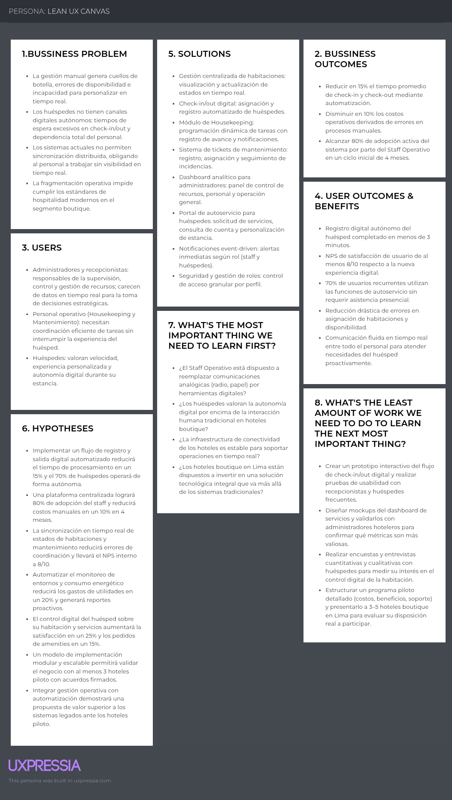

---

## 1.3. Segmentos objetivo

SmartStay apunta a dos segmentos principales:

### Segmento 1 — Staff Operativo de Hoteles

- **Quiénes:** Recepcionistas, jefes de housekeeping, personal de mantenimiento, gerentes de operación.
- **Necesidades:** Visibilidad de habitaciones, asignación rápida de tareas, control de accesos, reportes de consumo energético y estado de IoT.
- **Propuesta de valor:** Reducción de tiempos de operación y mejor coordinación del personal.

### Segmento 2 — Huéspedes de Hoteles Boutique

- **Quiénes:** Viajeros nacionales e internacionales que reservan en hoteles boutique y pequeños.
- **Necesidades:** Check-in sin colas, control de su habitación desde el celular, facilidad de comunicación con el hotel, personalización de servicios.
- **Propuesta de valor:** Experiencia moderna, sin fricción, con control total de su estancia.

---

<div style="page-break-after: always;"></div>

# Capítulo II: Requirements Elicitation & Analysis

## 2.1. Competidores

El mercado de soluciones para gestión hotelera presenta diversos actores. Sin embargo, la mayoría se centra en interfaces web, dejando un vacío en la experiencia móvil fluida e integrada con dispositivos físicos (IoT) que Smart Stay busca cubrir.

### 2.1.1. Análisis competitivo

<table border="1" cellpadding="10" cellspacing="0" style="width: 100%; border-collapse: collapse; font-family: Segoe UI, Arial, sans-serif; font-size: 13px; border: 1px solid #000;">
  <thead>
    <tr>
      <th style="text-align: left; width: 15%; border: 1px solid #000;">¿Por qué llevar a cabo este análisis?</th>
      <th colspan="4" style="text-align: left; border: 1px solid #000;">El objetivo es identificar las brechas tecnológicas en la oferta actual de gestión hotelera para diferenciar a Smart Stay mediante una experiencia móvil nativa e integración IoT dirigida a hoteles boutique en LATAM.</th>
    </tr>
    <tr style="text-align: center;">
      <th style="border: 1px solid #000;">Categoría / Aspecto</th>
      <th style="border: 1px solid #000;"><strong>Smart Stay</strong><br></th>
      <th style="border: 1px solid #000;"><strong>Oracle Hospitality</strong><br></th>
      <th style="border: 1px solid #000;"><strong>Room Raccoon</strong><br></th>
      <th style="border: 1px solid #000;"><strong>Sistemas Manuales</strong><br>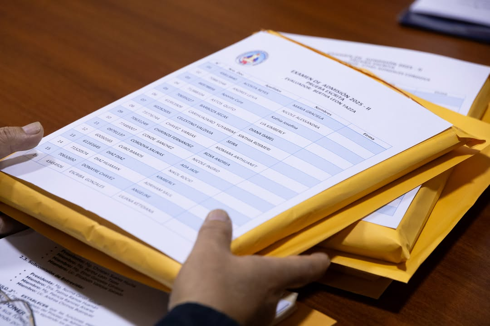</th>
    </tr>
  </thead>
  <tbody>
    <tr>
      <td colspan="5" style="font-weight: bold; border: 1px solid #000; letter-spacing: 1px;">PERFIL</td>
    </tr>
    <tr>
      <td style="border: 1px solid #000;"><strong>Overview</strong></td>
      <td style="border: 1px solid #000;">Plataforma de gestión hotelera con enfoque en hoteles boutique, integrando IoT y una experiencia móvil nativa para el huésped.</td>
      <td style="border: 1px solid #000;">Soluciones globales y robustas (PMS/OPERA) diseñadas para la gestión de grandes cadenas hoteleras internacionales.</td>
      <td style="border: 1px solid #000;">SaaS en la nube todo-en-uno (PMS, Channel Manager) intuitivo, orientado a hoteles pequeños e independientes.</td>
      <td style="border: 1px solid #000;">Sistemas tradicionales basados en herramientas físicas o digitales básicas como Excel y registros en papel.</td>
    </tr>
    <tr>
      <td style="border: 1px solid #000;"><strong>Ventaja competitiva</strong><br><small>¿Qué valor ofrece a los clientes?</small></td>
      <td style="border: 1px solid #000;">Control total del entorno de la habitación y personalización profunda desde una <strong>aplicación móvil nativa</strong>.</td>
      <td style="border: 1px solid #000;">Reconocimiento de marca global, alta confiabilidad y cumplimiento de estándares para operaciones a gran escala.</td>
      <td style="border: 1px solid #000;">Facilidad de implementación, soporte técnico valorado y una interfaz puramente web simplificada.</td>
      <td style="border: 1px solid #000;">Costo de adquisición nulo y flexibilidad operativa total al no depender de infraestructura de software especializada.</td>
    </tr>
    <tr>
      <td colspan="5" style="font-weight: bold; border: 1px solid #000; letter-spacing: 1px;">PERFIL DE MARKETING</td>
    </tr>
    <tr>
      <td style="border: 1px solid #000;"><strong>Mercado objetivo</strong></td>
      <td style="border: 1px solid #000;">Hoteles boutique y medianos en crecimiento en Latinoamérica que buscan diferenciación tecnológica.</td>
      <td style="border: 1px solid #000;">Grandes cadenas hoteleras transnacionales y resorts de lujo con procesos operativos complejos.</td>
      <td style="border: 1px solid #000;">Pequeños hoteles, hostales, Bed & Breakfasts y apartamentos turísticos de gestión independiente.</td>
      <td style="border: 1px solid #000;">Micro-hoteles o establecimientos con baja madurez tecnológica que no han iniciado su transformación digital.</td>
    </tr>
    <tr>
      <td style="border: 1px solid #000;"><strong>Estrategias de marketing</strong></td>
      <td style="border: 1px solid #000;">Posicionamiento basado en la modernización, eficiencia operativa móvil y la "Experiencia del Huésped 4.0".</td>
      <td style="border: 1px solid #000;">Ventas corporativas directas (B2B), branding global y presencia en las principales conferencias del sector.</td>
      <td style="border: 1px solid #000;">Marketing digital enfocado en SEO/SEM, resaltando la facilidad de uso y las reseñas positivas de usuarios.</td>
      <td style="border: 1px solid #000;">Inexistente; la adopción se da por costumbre o falta de conocimiento de alternativas digitales.</td>
    </tr>
    <tr>
      <td colspan="5" style="font-weight: bold; border: 1px solid #000; letter-spacing: 1px;">PERFIL DE PRODUCTO</td>
    </tr>
    <tr>
      <td style="border: 1px solid #000;"><strong>Productos & Servicios</strong></td>
      <td style="border: 1px solid #000;">PMS, Channel Manager, Motor de Reservas y <strong>aplicaciones móviles</strong> para huéspedes y personal con control IoT.</td>
      <td style="border: 1px solid #000;">Suite OPERA Cloud (PMS, Ventas, POS) con reportes avanzados e integraciones extensas.</td>
      <td style="border: 1px solid #000;">Plataforma unificada que incluye PMS, Channel Manager, sistema de pagos y gestión de limpieza (Housekeeping).</td>
      <td style="border: 1px solid #000;">Plantillas de hojas de cálculo, libros de registro físico y calendarios manuales.</td>
    </tr>
    <tr>
      <td style="border: 1px solid #000;"><strong>Precios & Costos</strong></td>
      <td style="border: 1px solid #000;">Modelo SaaS por suscripción mensual escalable + inversión inicial en hardware para los dispositivos IoT.</td>
      <td style="border: 1px solid #000;">Licenciamiento de nivel empresarial con costos elevados de implementación, soporte y mantenimiento especializado.</td>
      <td style="border: 1px solid #000;">Esquema de suscripción mensual transparente y accesible, basado principalmente en el número de habitaciones.</td>
      <td style="border: 1px solid #000;">Gratuito o limitado al costo de licencias básicas de software de oficina.</td>
    </tr>
    <tr>
      <td style="border: 1px solid #000;"><strong>Canales de distribución</strong><br><small>(Web y/o Móvil)</small></td>
      <td style="border: 1px solid #000;">Plataforma en la nube y <strong>aplicaciones móviles nativas</strong> (Android/iOS) y multiplataforma.</td>
      <td style="border: 1px solid #000;">Aplicación web basada en la nube optimizada para terminales de escritorio en estaciones de trabajo.</td>
      <td style="border: 1px solid #000;">Interfaz web accesible desde navegadores a través de cualquier dispositivo con conexión a internet.</td>
      <td style="border: 1px solid #000;">Offline; requiere presencia física para la manipulación y consulta de registros.</td>
    </tr>
    <tr style="text-align: center;">
      <td colspan="5" style="font-weight: bold; border: 1px solid #000; letter-spacing: 1px;">ANÁLISIS SWOT</td>
    </tr>
    <tr>
      <td style="border: 1px solid #000;"><strong>Fortalezas</strong></td>
      <td style="border: 1px solid #000;">Propuesta de valor única con IoT y enfoque en <strong>desarrollo móvil nativo</strong>.</td>
      <td style="border: 1px solid #000;">Líder indiscutible del mercado con un producto altamente robusto y escalable.</td>
      <td style="border: 1px solid #000;">Proceso de configuración rápido y excelente reputación en el segmento PYME.</td>
      <td style="border: 1px solid #000;">Simplicidad absoluta sin necesidad de capacitación técnica para el personal.</td>
    </tr>
    <tr>
      <td style="border: 1px solid #000;"><strong>Debilidades</strong></td>
      <td style="border: 1px solid #000;">Marca nueva en el mercado; requiere educación del cliente sobre la instalación de hardware físico.</td>
      <td style="border: 1px solid #000;">Interfaz de usuario compleja y costos de entrada prohibitivos para hoteles locales pequeños.</td>
      <td style="border: 1px solid #000;">Funcionalidades limitadas para la gestión de dispositivos físicos y hardware en tiempo real.</td>
      <td style="border: 1px solid #000;">Propenso a errores humanos críticos, nula capacidad de escala y falta de conectividad online.</td>
    </tr>
    <tr>
      <td style="border: 1px solid #000;"><strong>Oportunidades</strong></td>
      <td style="border: 1px solid #000;">Alta demanda de soluciones sin contacto (contactless) y experiencias digitales personalizadas.</td>
      <td style="border: 1px solid #000;">Migración de su extensa base de clientes antiguos hacia infraestructuras modernas en la nube.</td>
      <td style="border: 1px solid #000;">Expansión hacia mercados emergentes mediante la adición de módulos de gestión simplificados.</td>
      <td style="border: 1px solid #000;">La necesidad obligatoria de digitalización representa el punto de partida para adoptar software básico.</td>
    </tr>
    <tr>
      <td style="border: 1px solid #000;"><strong>Amenazas</strong></td>
      <td style="border: 1px solid #000;">Competidores establecidos desarrollando módulos móviles básicos para competir en el mismo nicho.</td>
      <td style="border: 1px solid #000;">Surgimiento de startups ágiles que ofrecen soluciones especializadas a una fracción del costo.</td>
      <td style="border: 1px solid #000;">Saturación del mercado de PMS básicos y guerra de precios entre proveedores SaaS.</td>
      <td style="border: 1px solid #000;">Cualquier solución de software gratuita o de bajo costo representa una amenaza existencial para este método.</td>
    </tr>
  </tbody>
</table>

### 2.1.2. Estrategias y tácticas frente a competidores

Para posicionarse de forma efectiva frente a la competencia, **Smart Stay** implementará las siguientes estrategias:

#### Estrategias

1. **Diferenciación Tecnológica**: Integrar la gestión hotelera con IoT de manera completa, algo que los competidores actuales aún no ofrecen de forma integral.
2. **Enfoque en nicho**: Dirigirnos específicamente a hoteles boutique y pequeños (20-100 habitaciones), un segmento que los grandes como Oracle o Amadeus suelen dejar de lado.
3. **Modelo de suscripción accesible**: Precios escalables según el número de habitaciones, lo que nos permite competir contra soluciones caras sin sacrificar ninguna funcionalidad.
4. **Soporte local y en español**: Ofrecer un acompañamiento cercano y personalizado que facilita la adopción, marcando una gran diferencia frente a competidores extranjeros.
5. **Valor medible**: Compromiso claro de reducir los costos operativos entre un 10-20%.

#### Tácticas

- **Programa piloto** con hoteles boutique de Lima para generar casos de éxito reales y testimonios auténticos.
- **Alianzas estratégicas** con gremios turísticos (como FEDECATUR) para acelerar la adopción en el sector.
- **Capacitación continua** para el personal hotelero, ayudando a reducir la resistencia al cambio.
- **Marketing digital enfocado en ROI**: Mostrar comparativas claras de costos y beneficios frente a los sistemas tradicionales.
- **Integraciones rápidas** con los PMS existentes para facilitar la migración y minimizar fricciones.
- **Atención postventa 24/7** como una ventaja competitiva clave frente a otras startups con soporte limitado.

## 2.2. Entrevistas

Con el objetivo de profundizar en las necesidades y expectativas de los segmentos objetivos, se realizaron entrevistas semiestructuradas a administradores de hoteles boutique y a huéspedes. Esta información cualitativa sirvió como base para identificar problemáticas actuales y orientar la definición de requisitos del sistema.

### 2.2.1. Diseño de entrevistas

### Entrevista – Segmento 1: Staff Operativo

1. ¿Cómo te llamas y qué cargo ocupas en el hotel?
2. ¿En qué distrito o ciudad se encuentra el hotel?
3. ¿Cuántas habitaciones y personal gestionan aproximadamente?
4. ¿Podrías contarme cómo es un día típico de trabajo administrando el hotel?
5. ¿Qué tan seguido deben gestionar procesos como reservas, check-in/check-out o facturación?
6. ¿Cómo suelen organizar actualmente la gestión de reservas y pagos?
7. ¿Han tenido dificultades con sobrerreservas, disponibilidad de habitaciones o errores de facturación?
8. ¿Qué dispositivos usas con mayor frecuencia para gestionar el hotel?
9. ¿Qué aplicaciones o sistemas usas actualmente en tu día a día para el manejo del hotel?
10. ¿Has tenido alguna dificultad o experiencia negativa al usarlas?
11. ¿Qué te motivaría a adoptar una nueva herramienta digital para centralizar reservas, pagos y tareas del personal?
12. Si una herramienta digital lograra optimizar tus operaciones y reducir tus costos, ¿cómo valorarías invertir en una suscripción mensual para acceder a ella?
13. ¿Cuáles son tus principales preocupaciones respecto a la gestión del hotel?

### Entrevista – Segmento 2: Huéspedes de Hoteles

1. ¿Cómo te llamas y con qué frecuencia viajas por turismo o trabajo?
2. ¿Qué tipo de hotel sueles elegir (boutique, cadena internacional, Airbnb, etc.) y por qué?
3. ¿Qué valoras más en un hotel: ubicación, precio, comodidad o servicios digitales?
4. ¿Cómo fue tu última experiencia de check-in y check-out? ¿Qué mejorarías?
5. ¿Qué tan importante es para ti poder personalizar tu habitación (temperatura, luz, limpieza, room service) desde tu celular u otro dispositivo tecnológico?
6. ¿Qué servicios digitales utilizas más durante tu estadía en un hotel (WiFi, app del hotel, WhatsApp, smart TV, llaves digitales)?
7. ¿Has tenido experiencias negativas con la gestión del hotel (esperas largas, problemas con el servicio, falta de personalización)?
8. ¿Qué opinas de un sistema que te permita hacer check-in sin pasar por recepción y controlar tu habitación desde una app?
9. ¿Estarías dispuesto a pagar un poco más por un hotel que ofrezca experiencias digitales y personalización avanzada? ¿Cuánto aproximadamente?
10. ¿Qué tanto influyen las reseñas digitales y la reputación online en tu decisión de reservar un hotel?
11. Si un hotel ofreciera un servicio totalmente digitalizado, ¿qué expectativa tendrías respecto al trato humano? ¿Lo consideras un valor agregado o no es necesario?
12. ¿Qué recomendarías para que la experiencia digital en un hotel sea cómoda y no complicada para los huéspedes?

### 2.2.2. Registro de entrevistas

### Entrevista – Segmento 1: Administradores de Hoteles Boutique y Pequeños

#### Entrevista 1

Datos del entrevistado:

**Nombre completo:** Adrian Saavedra Angulo

**Edad:** 34 años

**Ciudad:** Tarapoto

**Duración:** 8:07 minutos

**Evidencia:** 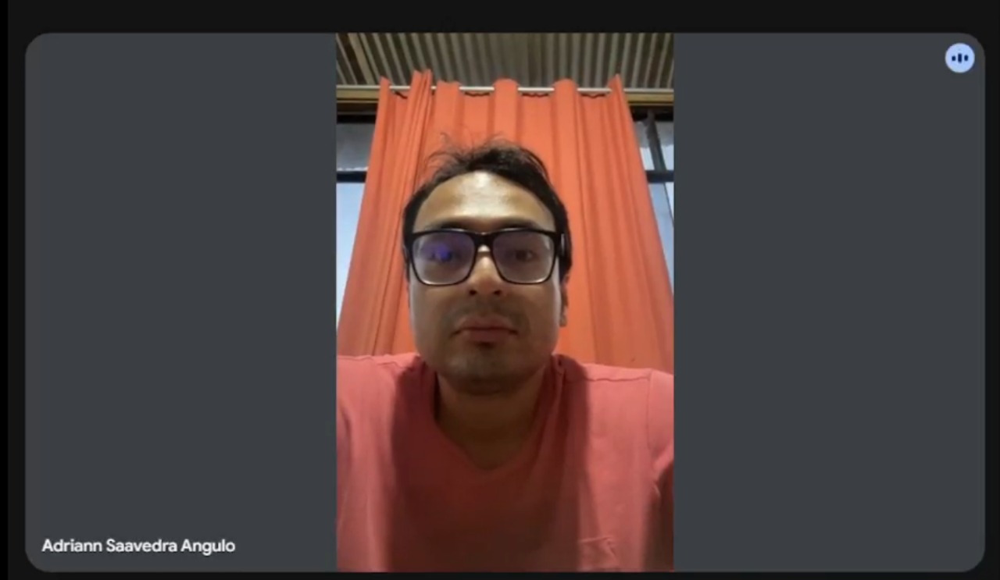

**Resumen de la entrevista**

Adrián administra un hotel de 12 habitaciones en Tarapoto con un equipo de 6 personas. Su rutina diaria incluye revisar reservas, coordinar limpieza, organizar recojos y responder a nuevas solicitudes. Los procesos de reservas y facturación son constantes por el alto movimiento del negocio.
Aunque cuentan con un sistema propio, han tenido problemas de sobreventa porque no se sincroniza con todas las plataformas, lo que obliga a actualizaciones manuales y genera errores. Adrián estaría motivado a usar una herramienta que centralice la gestión y se integre con plataformas externas, siempre que el costo de suscripción sea razonable.

**URL del video:** <https://tinyurl.com/ywcf7dpk>

---

#### Entrevista 2

Datos del entrevistado:

**Nombre completo:** Monica Hernandez Vela

**Edad:** 33 años

**Ciudad:** Tarapoto

**Duración:** 5:53 minutos

**Evidencia:** 

**URL del video:** <https://tinyurl.com/59zmmrjb>
**Resumen de la entrevista**

Mónica administra un hotel de 12 habitaciones en Tarapoto con un equipo de 4 personas. Su rutina diaria incluye organizar los desayunos, coordinar la limpieza, asignar habitaciones, atender a los turistas y revisar constantemente las reservas. Utiliza un sistema propio a través de la página web del hotel, gestionado principalmente desde laptops y computadoras, y se comunica con su personal mediante WhatsApp.
Ha tenido dificultades con el uso del sistema actual y señala que le motivaría adoptar una herramienta digital que centralice la gestión de reservas y operaciones, siempre que pueda adaptarse a las características de su hotel. Considera razonable pagar una suscripción mensual si contribuye a mejorar los servicios del establecimiento.

---

#### Entrevista 3

Datos del entrevistado:
**Nombre completo:** Alejandra Beltrán Diaz

**Edad:** 23 años

**Ciudad:** Tarapoto

**Duración:** 4:11 minutos

**Evidencia:** 

**URL del video:** <https://tinyurl.com/2p9n2kmb>

**Resumen de la entrevista**

Valeria Alejandra administra un hotel de 19 habitaciones junto a un equipo de 5 personas. Su día típico comienza organizando al personal de limpieza, revisando las reservas recibidas por WhatsApp y luego trasladándolas a un archivo Excel para llevar el control. Su principal herramienta es este archivo, aunque reconoce que no siempre guarda correctamente la información, lo que ha ocasionado problemas con reservas perdidas.
También ha tenido experiencias negativas con WhatsApp, ya que a veces resulta difícil ubicar las reservas registradas en la aplicación. Para ella, un sistema ideal de gestión debería incluir notificaciones automáticas que recuerden las reservas del día. Valeria considera que pagar una suscripción mensual sería una buena opción si la herramienta realmente simplifica las labores administrativas del hotel.

---

### Entrevista – Segmento 2: Huéspedes de Hoteles Boutique

#### Entrevista 1

Datos del entrevistado:

**Nombre completo:** Diego Michael Segura Martínez

**Edad:** 25 años

**Distrito:** Santa Anita – Lima Metropolitana

**Duración:** 5:34 minutos

**Evidencia:** 

**URL del video:** <https://tinyurl.com/me55rvnx>

**Resumen de la entrevista**

Diego suele hospedarse en hoteles cuando viaja, principalmente con su pareja y en menor medida con su familia. Prefiere hoteles cómodos, con privacidad y buena experiencia. Valora la comodidad y los servicios digitales que simplifiquen su estadía.
Su principal frustración son las esperas en recepción y la falta de personalización. Le atrae la idea de un sistema digital que permita check-in/check-out sin filas y control de la habitación desde el celular (luz, temperatura, room service).
Utiliza principalmente WiFi y Smart TV, pero estaría dispuesto a usar una app centralizada. Confía en las reseñas digitales para tomar decisiones y estaría dispuesto a pagar entre 10% y 15% más por un hotel con experiencias digitales avanzadas.
Considera que el trato humano sigue siendo un valor agregado, aunque la digitalización es clave. Recomienda que los sistemas sean fáciles de usar y que cada hotel cuente con una página clara con descripción completa y disponibilidad de habitaciones en tiempo real.

---

#### Entrevista 2

Datos del entrevistado:

**Nombre completo:** Juan Salcedo

**Edad:** 44 años

**Distrito:** San Borja – Lima Metropolitana

**Duración:** 6:11 minutos

**Nombre:** Juan Salcedo  
**Edad:** 44 años  
**Distrito:** San Borja

**Evidencia:** 

**URL del video:** <https://tinyurl.com/3mv3ytt5>

**Resumen de la entrevista**

Juan viaja por trabajo cada 1-2 meses y prefiere alojamientos cómodos, autónomos y con buena conectividad, optando principalmente por Airbnb y, en menor medida, por hoteles. Valora especialmente la ubicación céntrica, el Wi-Fi de calidad y la facilidad tecnológica. Considera que los horarios estrictos de check-in y check-out son una gran limitación, y aunque nunca ha usado una habitación totalmente “smart”, le interesa la idea, aunque cree que aún no está bien implementada en Perú. No pagaría más por funciones digitales avanzadas, ya que las asocia con un público más joven. Usa Wi-Fi como servicio indispensable, junto con laptop y smartphone, y ha tenido experiencias negativas relacionadas con demoras en la atención y falta de limpieza, además de percibir una falta de personalización en el servicio. Recomienda priorizar la mejora del Wi-Fi (fibra óptica) y mantener una atención eficiente, considerando que la digitalización debe complementar, pero no reemplazar, el buen trato humano.

---

#### Entrevista 3

Datos del entrevistado:

**Nombre completo:** Tadeo Loja Beloglio

**Edad:** 22 años

**Distrito:** Santiago de Surco – Lima Metropolitana

**Duración:** 7:21 minutos

**Evidencia:** 

**URL del video:** <https://tinyurl.com/3ztyph92>

**Resumen de la entrevista**

Tadeo viaja por turismo una vez al año y suele elegir hoteles de cadenas internacionales porque le ofrecen mayor confianza y calidad de servicio, aunque también considera opciones boutique si el precio es conveniente. Lo que más valora es el precio y la comodidad, seguido de la ubicación. Su última experiencia de check-in fue lenta, mientras que el check-out resultó rápido, por lo que cree que ambos procesos deberían digitalizarse.

No considera esencial la personalización de la habitación, pero sí cómodo poder controlar luz y temperatura desde el celular. Durante sus estadías utiliza principalmente el WiFi y la smart TV, y le gustaría contar con llaves digitales.

Entre los problemas que ha tenido destacan las largas esperas en recepción y la falta de coordinación en la limpieza. Considera muy práctico un sistema de check-in digital y control de la habitación mediante una app, y estaría dispuesto a pagar hasta un 5% más por ello siempre que mejore la experiencia.

Las reseñas digitales influyen en un 70% en su decisión de reserva. Para él, el trato humano sigue siendo un valor agregado incluso en un hotel digitalizado, y recomienda que la experiencia digital se concentre en una app única, sencilla y con asistencia rápida.

### 2.2.3. Análisis de entrevistas

En esta sección se presenta un análisis detallado por cada segmento objetivo, identificando con sustento estadístico (porcentajes) todas las características objetivas y subjetivas que representan los aspectos más comunes de cada segmento, necesarios para la construcción de los arquetipos. La información se basa en las entrevistas registradas y sus respectivos resúmenes, respaldada por fuentes académicas y de la industria.

**Segmento 1: Administradores de Hoteles Boutique y Pequeños**

**Características Demográficas**

**Perfil de Edad y Ubicación**
Los administradores entrevistados presentan una edad promedio de **30.0 años**, con un rango que va desde los 23 hasta los 34 años.

El **100%** de los entrevistados se ubican en Tarapoto, lo que indica una concentración geográfica específica en esta región turística del Perú. Este hallazgo se alinea con las tendencias nacionales, ya que según _Statista Market Forecast (2025)_, Peru ha experimentado un crecimiento significativo en el mercado hotelero, posicionándose como un actor clave en la industria hotelera latinoamericana.


**Características del Negocio**
Los hoteles administrados por este segmento tienen un tamaño promedio de **14.3 habitaciones**, con un rango que va desde 12 hasta 19 habitaciones, confirmando que se trata efectivamente de establecimientos boutique y pequeños. El equipo de trabajo promedio es de **5.0 personas**, variando entre 4 y 6 empleados, lo que refleja operaciones de escala reducida pero con estructura organizacional definida. Estas características coinciden con las tendencias identificadas por _Statista_, donde los viajeros en Perú buscan cada vez más experiencias únicas y auténticas, impulsando la demanda de hoteles boutique.


**Herramientas Tecnológicas Actuales**

**Diversidad de Sistemas**
El análisis revela una heterogeneidad en los sistemas utilizados:

- **66.7%** (2 de 3 administradores) utilizan sistemas propios desarrollados para sus hoteles.
- **33.3%** (1 de 3 administradores) depende de herramientas básicas como Excel y WhatsApp.

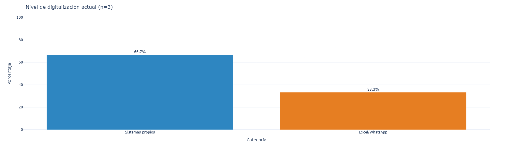

Esta distribución indica que, aunque la mayoría cuenta con algún nivel de digitalización, existe una brecha significativa en la sofisticación de las herramientas empleadas. Este panorama refleja los hallazgos de un estudio académico sobre barreras de adopción tecnológica en hoteles pequeños y medianos, donde se identificó que la falta de recursos financieros, conocimiento de TI y resistencia al cambio son las principales limitaciones.

**Problemas Identificados**

**Distribución Equitativa de Problemas**
Cada administrador enfrenta diferentes tipos de desafíos, con una distribución del **33.3%** para cada categoría:

- **Problemas de sincronización:** Adrián experimenta sobreventa debido a la falta de sincronización entre plataformas.
- **Dificultades operativas:** Mónica tiene complicaciones con el uso de su sistema actual.
- **Pérdida de información:** Alejandra sufre pérdidas de reservas por las limitaciones de sus herramientas básicas.


Estas problemáticas están documentadas en la literatura académica, donde se ha identificado que las organizaciones hoteleras pequeñas y medianas son más reluctantes a adoptar nuevas tecnologías de información que las más grandes, debido a la falta de entrenamiento, recursos financieros limitados y percepción de costos elevados.

**Actitud hacia Nueva Tecnología**

**Unanimidad en la Aceptación**
Los resultados muestran una receptividad completa hacia soluciones tecnológicas mejoradas:

- **100%** de los administradores expresan motivación para adoptar una nueva herramienta de gestión.
- **100%** están dispuestos a pagar una suscripción mensual, siempre que el costo sea razonable y justifique la mejora en la eficiencia operativa.

Esta disposición positiva contrasta con estudios previos pero se alinea con las tendencias post-pandemia. Según _Oracle Hospitality & Skift (2022)_, el **89%** de los ejecutivos hoteleros latinoamericanos afirmaron que la pandemia aceleró su adopción de tecnología hotelera, comparado con el 76% globalmente.


---

**Segmento 2: Huéspedes de Hoteles Boutique**

**Características Demográficas**

**Perfil Generacional**
Los huéspedes entrevistados tienen una edad promedio de **28.0 años**, con un rango de 21 a 44 años. El **75%** pertenece a la generación Millennial/Gen Z (menores de 26 años), lo que sugiere un segmento predominantemente joven y digitalmente nativo. Esta composición demográfica es especialmente relevante, ya que según _Hotel Tech Report (2025)_, los millennials son **57% más propensos** a ser influenciados por la tecnología hotelera.


**Patrones de Viaje y Preferencias Tecnológicas**

**Propósito y Frecuencia**
El análisis de los patrones de viaje revela:

- **75%** viaja por turismo (Diego, Tadeo, Joaquín).
- **25%** viaja por trabajo (Juan).
- **100%** mantiene una frecuencia regular de viaje (anual o cada 1-2 meses).


Las preferencias de esta generación están bien documentadas en la investigación de _Mews (2025)_, que indica que las estimaciones sugieren que los millennials representarán el **50%** de los huéspedes hoteleros en los próximos años, convirtiéndolos en críticos para los ingresos y el crecimiento de marca de los hoteles.

**Problemas Más Frecuentes y Expectativas Digitales**

**Consenso en Puntos de Dolor**
Los problemas identificados muestran patrones claros:

- **75%** experimenta esperas prolongadas en recepción como principal frustración.
- **25%** señala problemas con horarios estrictos de check-in/check-out.


Estos hallazgos se correlacionan directamente con estudios globales de la industria. Según _Oracle Hospitality & Skift (2022)_, el **65%** de los huéspedes desean que los hoteles ofrezcan tecnologías que minimicen el contacto con el personal y otros huéspedes. Además, el **43%** de los huéspedes de lujo esperan no hacer filas, según _Hotel Tech Report (2025)_.

**Actitud hacia la Digitalización**

**Alta Receptividad Tecnológica**
Los resultados demuestran una fuerte inclinación hacia soluciones digitales:

- **75%** muestra alto interés en digitalización de servicios hoteleros.
- **75%** está dispuesto a pagar un sobrecosto por experiencias digitales mejoradas.
- **100%** considera las reseñas digitales como factor influyente en sus decisiones.


- Estos datos se alinean con investigaciones globales que indican que el **74%** de los huéspedes esperan poder hacer en línea cualquier cosa que ya pueden hacer en persona o por teléfono. Además, el **48%** de los huéspedes considera las reseñas en línea como el factor principal para elegir un hotel.

**Disposición de Pago por Digitalización**

- **25%** pagaría entre 10-15% adicional.
- **50%** pagaría entre 5-10% adicional.
- **25%** no pagaría sobrecosto adicional.


La disposición a pagar por tecnología varía según la generación. Mientras que el **35%** de la Gen Z considera que la velocidad del Wi-Fi es más importante que la comodidad de la cama, los usuarios de mayor edad muestran menos disposición a pagar extra por funciones digitales avanzadas.

**Influencia de Reseñas Digitales**

- **50%** reporta alta influencia de reseñas (70% o más en su decisión).
- **100%** considera las reseñas como factor relevante en su proceso de selección.


Esta tendencia refleja datos globales donde las reseñas en línea han reemplazado el boca a boca tradicional, con los millennials consultando plataformas como TripAdvisor, Google y redes sociales antes de reservar.

## 2.3. Needfinding

### 2.3.1. User Personas

**Segmento 1 – Administradores de Hoteles Boutique y Pequeños en Lima**


**Segmento 2 – Huéspedes de Hoteles**


### 2.3.2. User Task Matrix

En esta sección se presenta el **User Task Matrix**, que concentra las tareas que los User Persona realizan para cumplir sus objetivos en la gestión hotelera y la experiencia de estadía. Las tareas descritas existen independientemente de cualquier solución de software, pero se analizan considerando el contexto de digitalización, movilidad e integración con tecnologías IoT.

Se consideran dos segmentos con sus respectivos User Persona:

- **Administradores de Hoteles Boutique y Pequeños en Lima** (User Persona: Administrador)  
- **Huéspedes de Hoteles Boutique** (User Persona: Huésped)  

---

### Matriz de Tareas

| Tarea / Task | Administradores Frecuencia | Administradores Importancia | Huéspedes Frecuencia | Huéspedes Importancia |
|-------------|--------------------------|-----------------------------|----------------------|-----------------------|
| Centralizar reservas, housekeeping y mantenimiento en un solo sistema | Alta | Alta | Media | Alta |
| Evitar sobreventa mediante sincronización en tiempo real | Media | Alta | Baja | Media |
| Gestionar check-in/check-out digital (sin contacto) | Alta | Alta | Alta | Alta |
| Monitorear ocupación, disponibilidad y estado de habitaciones en tiempo real | Alta | Alta | Media | Media |
| Generar reportes operativos y métricas (KPIs) | Media | Alta | Baja | Media |
| Gestionar pagos y facturación digital | Media | Alta | Media | Alta |
| Coordinar housekeeping y mantenimiento con notificaciones en tiempo real | Alta | Alta | Baja | Media |
| Capacitar al personal en el uso de aplicaciones móviles | Media | Media | Baja | Media |
| Controlar costos operativos y consumo energético (IoT) | Media | Alta | Baja | Media |
| Integrar canales digitales (OTAs, apps, plataformas online) | Media | Alta | Media | Alta |
| Gestionar reseñas y reputación digital | Media | Alta | Alta | Alta |
| Personalizar servicios y comunicación con el huésped | Media | Media | Media | Alta |
| Realizar reservas y pagos desde el móvil | — | — | Alta | Alta |
| Realizar check-in/check-out sin contacto | — | — | Alta | Alta |
| Controlar la habitación mediante app (luces, temperatura, servicios IoT) | — | — | Media | Alta |
| Solicitar servicios del hotel desde la app (room service, soporte) | — | — | Alta | Alta |
| Acceder a información del hotel y recomendaciones digitales | — | — | Media | Media |
| Evaluar experiencia y dejar reseñas post-estadía | — | — | Media | Alta |

---

### Análisis

#### Tareas de mayor frecuencia e importancia compartidas

- **Gestión de check-in/check-out digital:** Alta/Alta en ambos perfiles, siendo un punto crítico que impacta directamente en la experiencia del huésped y la eficiencia operativa.  
- **Gestión de reseñas y reputación digital:** Alta importancia en ambos segmentos, ya que influye en la decisión de futuros clientes y en los ingresos del hotel.  

---

#### Tareas críticas para Administradores

Las tareas más relevantes están orientadas a la **optimización operativa mediante digitalización y tiempo real**, entre ellas:

- Centralizar reservas, housekeeping y mantenimiento  
- Monitorear ocupación y estado de habitaciones en tiempo real  
- Evitar sobreventa mediante sincronización de datos  
- Integrar múltiples canales digitales  
- Gestionar pagos, facturación y reportes  

Además, destaca el:

- **Control de costos operativos y consumo energético (IoT)**  
  → Alta importancia por su impacto financiero y eficiencia del hotel  

---

#### Tareas críticas para Huéspedes

El huésped presenta un enfoque **mobile-first**, priorizando:

- Reservas y pagos desde el smartphone  
- Check-in/check-out sin contacto  
- Solicitud de servicios mediante apps  
- Experiencia personalizada dentro de la habitación  

También destacan:

- **Control del entorno mediante IoT (luces, temperatura, servicios)**  
- Acceso rápido a información y servicios digitales  

---

#### Diferencias clave

- **Administradores:** Enfocados en eficiencia operativa, coordinación interna y control de recursos.  
- **Huéspedes:** Enfocados en rapidez, autonomía, comodidad y experiencia digital personalizada.  

---

#### Coincidencias

- Ambos segmentos valoran procesos rápidos y eficientes.  
- Ambos dependen de una **correcta gestión de información en tiempo real**.  
- Existe una alineación clara hacia la **digitalización, automatización y autoservicio**.  

### 2.3.3. User Journey Mapping

El **User Journey Mapping** permite visualizar las etapas que recorren los usuarios desde el descubrimiento de la solución hasta la evaluación final de su experiencia. A través de este recurso se identifican los objetivos de los usuarios, los puntos de contacto con el servicio, sus pensamientos, percepciones y oportunidades de mejora en cada fase del proceso.

En el caso de **Smart Stay**, se elaboraron dos mapas diferenciados según los segmentos objetivos:

- **Segmento 1:** enfocado en la gestión operativa y la centralización de reservas.


- **Segmento 2:** centrado en la experiencia de estadía y la digitalización de servicios.


Estos recorridos permiten detectar fricciones, validar expectativas y proponer mejoras orientadas a optimizar tanto la gestión hotelera como la satisfacción de los huéspedes.

### 2.3.4. Empathy Mapping

El Empathy Mapping permite comprender en profundidad las emociones, pensamientos y comportamientos de los usuarios, facilitando una conexión más humana con sus necesidades reales. A través de esta herramienta, se identifican los dolores, motivaciones y expectativas de los distintos perfiles, lo que contribuye al diseño de soluciones más relevantes y personalizadas.

En el caso de Smart Stay, se elaboraron dos mapas de empatía diferenciados según los segmentos objetivos:

##### 1. Segmento Objetivo 1: STAFF OPERATIVO

##### 2. Segmento Objetivo 2: HUÉSPEDES

Estos mapas permiten visualizar cómo cada tipo de usuario piensa, siente y actúa frente al servicio, además de reconocer los puntos de dolor (pains) y las ganancias esperadas (gains). El análisis conjunto de ambos segmentos brinda una visión integral para mejorar la eficiencia operativa del hotel y elevar la satisfacción del huésped, alineando tecnología y experiencia humana.

#### 1. Segmento Objetivo 1: STAFF OPERATIVO

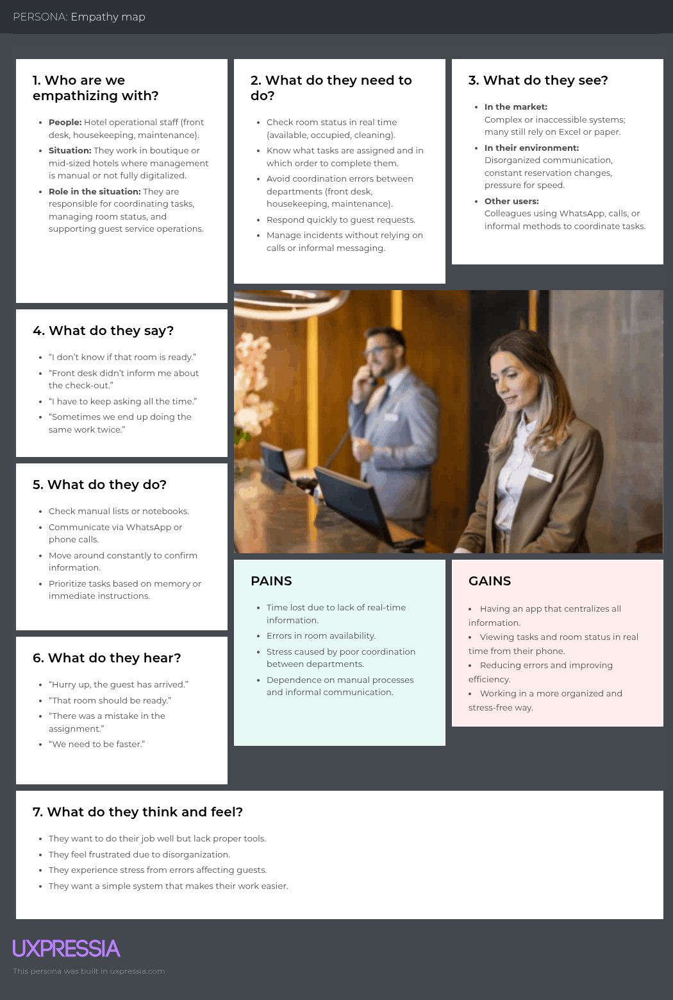

---

#### 2. Segmento Objetivo 2: HUÉSPEDES

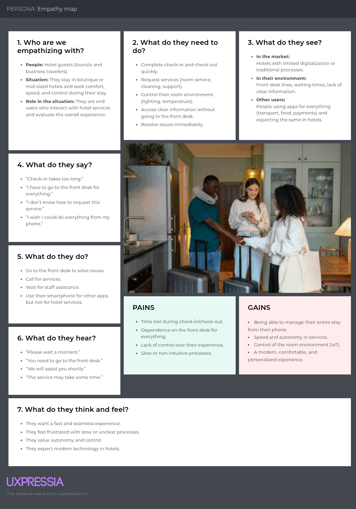

### 2.3.5. As-is Scenario Mapping

El mapeo de escenarios *As-Is* permite modelar el estado actual de los procesos operativos y vivenciales antes de la introducción de una solución tecnológica centralizada. A través de este análisis se identifican los puntos de fricción, ineficiencias y la carga cognitiva/emocional que experimentan los actores principales durante su flujo habitual, estructurado en cuatro fases clave bajo las dimensiones de acciones (*Doing*), pensamientos (*Thinking*) y sentimientos (*Feeling*).

#### Segmento objetivo 1: Administradores de Hoteles Boutique Pequeños

Este segmento representa al personal administrativo y de recepción encargado de coordinar manualmente la operación diaria, el flujo de huéspedes y la disponibilidad de habitaciones.

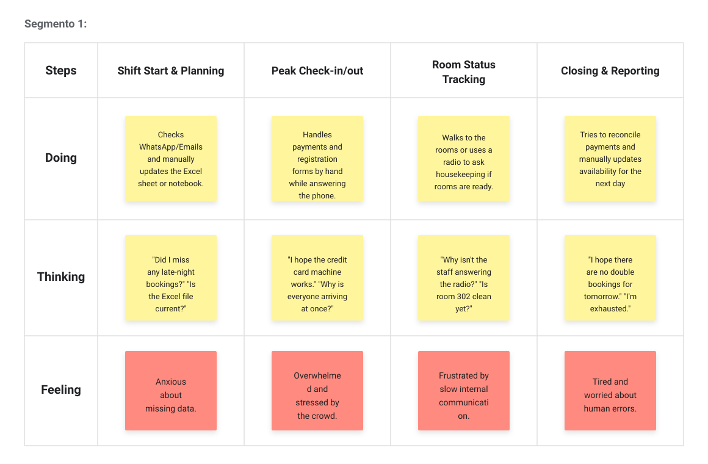

* **Fase 1: Shift Start & Planning**
  * **Doing:** Al iniciar el turno, el administrador revisa canales dispersos (WhatsApp, correos electrónicos) y transcribe manualmente las reservas hacia una hoja de cálculo en Excel o un cuaderno físico.
  * **Thinking:** Surgen constantes dudas respecto a la sincronización de la información (*"¿Habré omitido reservas hechas en la madrugada?", "¿Estará actualizado el archivo Excel?"*).
  * **Feeling:** Incertidumbre y ansiedad ante el riesgo de pérdida u omisión de datos críticos.

* **Fase 2: Peak Check-in/out**
  * **Doing:** En horas pico, procesa cobros y diligencia fichas de registro en papel de forma simultánea a la atención de llamadas telefónicas.
  * **Thinking:** Preocupación por la operatividad de los terminales de pago y la acumulación imprevista de clientes (*"Espero que funcione el POS", "¿Por qué llegan todos al mismo tiempo?"*).
  * **Feeling:** Sobrecarga mental, estrés y agobio ante la saturación de tareas simultáneas.

* **Fase 3: Room Status Tracking**
  * **Doing:** Para verificar la disponibilidad de habitaciones, el personal debe desplazarse físicamente por los pisos o consultar al equipo de limpieza vía radio comunicador.
  * **Thinking:** Frustración por los canales lentos (*"¿Por qué no responden la radio?", "¿Estará lista ya la habitación 302?"*).
  * **Feeling:** Impaciencia e incomodidad generadas por la lentitud y falta de visibilidad en la comunicación interna.

* **Fase 4: Closing & Reporting**
  * **Doing:** Al cierre de la jornada, concilia manualmente los pagos recibidos contra las reservas y actualiza la disponibilidad de inventario para el día siguiente.
  * **Thinking:** Temor a inconsistencias operativas (*"Espero que mañana no haya sobreventas/duplicidades", "Estoy agotado/a"*).
  * **Feeling:** Agotamiento físico/mental y preocupación latente por errores humanos involuntarios.

---

#### Segmento objetivo 2: Huéspedes de Hoteles

Este segmento comprende a los clientes durante su ciclo de estadía, quienes interactúan directamente con los procesos manuales del establecimiento.

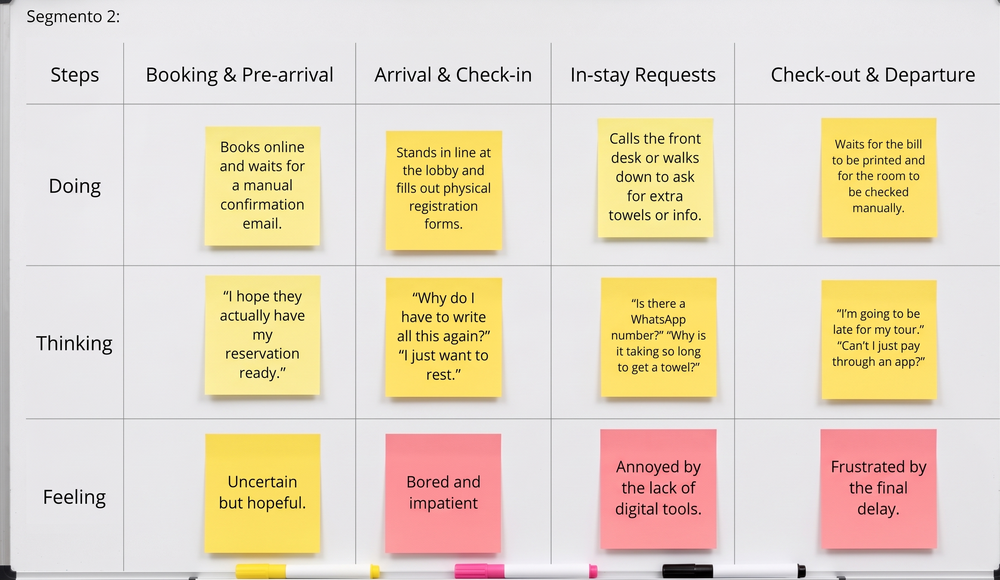

* **Fase 1: Booking & Pre-arrival**
  * **Doing:** Realiza una reserva por canales web/digitales y queda a la espera de un correo o mensaje manual que ratifique la confirmación.
  * **Thinking:** Dudas sobre la validez de la reserva (*"Ojalá realmente tengan lista mi reserva cuando llegue"*).
  * **Feeling:** Incertidumbre matizada con optimismo.

* **Fase 2: Arrival & Check-in**
  * **Doing:** Debe hacer fila en la recepción para rellenar a mano formularios y fichas de ingreso físico con información previamente enviada.
  * **Thinking:** Incomodidad por la redundancia de datos (*"¿Por qué tengo que escribir todo de nuevo?", "Solo quiero ir a descansar"*).
  * **Feeling:** Tedio, aburrimiento e impaciencia generados por la fricción administrativa.

* **Fase 3: In-stay Requests**
  * **Doing:** Para solicitar servicios o toallas/amenities adicionales, se ve obligado a llamar al anexo de recepción o bajar físicamente hasta el lobby.
  * **Thinking:** Cuestionamiento sobre la modernidad de los canales de atención (*"¿No tendrán un WhatsApp?", "¿Por qué demora tanto que traigan una toalla?"*).
  * **Feeling:** Molestia y frustración provocada por la carencia de herramientas de autoservicio digital.

* **Fase 4: Check-out & Departure**
  * **Doing:** Espera en recepción a que impriman la cuenta detallada y a que el personal verifique el estado físico de la habitación antes de autorizar su salida.
  * **Thinking:** Prisa y necesidad de agilidad (*"Llegaré tarde a mi tour", "¿No puedo pagar directamente desde una app?"*).
  * **Feeling:** Desazón y frustración por demoras de último minuto antes de partir.

## 2.4. Ubiquitous Language

| **Término en Inglés**        | **Término en Español**             | **Definición**                                                                                                                                      |
|------------------------------|------------------------------------|-----------------------------------------------------------------------------------------------------------------------------------------------------|
| Hotel Administrator          | Administrador del hotel            | Usuario encargado de la gestión operativa del hotel. Supervisa reservas, limpieza, facturación y coordinación con el personal.                      |
| Reservation Management       | Gestión de reservas                | Proceso centralizado de registro, confirmación, modificación y cancelación de reservas en tiempo real.                                              |
| Overbooking                  | Sobreventa                         | Situación en la que el hotel vende más habitaciones de las disponibles debido a la falta de sincronización en los sistemas de reserva.              |
| Housekeeping Schedule        | Programación de limpieza           | Organización de tareas de limpieza y mantenimiento de habitaciones, coordinadas desde el sistema de gestión.                                        |
| Digital Check-In / Check-Out | Registro digital de entrada/salida | Funcionalidad que permite al huésped ingresar o salir del hotel sin necesidad de hacer filas en recepción, a través de una aplicación o portal web. |
| Guest Profile                | Perfil del huésped                 | Información digital del cliente que incluye preferencias, historial de estadías y solicitudes especiales.                                           |
| Smart Room Control           | Control inteligente de habitación  | Función que permite al huésped manejar servicios como iluminación, temperatura o room service desde su dispositivo móvil.                           |
| Real-Time Notification       | Notificación en tiempo real        | Alerta automática que informa sobre nuevas reservas, cambios en disponibilidad o solicitudes de huéspedes.                                          |
| Financial Report             | Reporte financiero                 | Documento digital generado por el sistema que resume ingresos, gastos y métricas clave para evaluar la rentabilidad del hotel.                      |
| Guest Feedback               | Retroalimentación del huésped      | Opiniones y calificaciones que los huéspedes comparten sobre su estadía, utilizadas para mejorar los servicios.                                     |

---

<div style="page-break-after: always;"></div>

# Capítulo III: Requirements Specification

## 3.1. To-Be Scenario Mapping

Segmento 1: Staff Operativo de Hoteles

<div align="center">

</div>

Segmento 2: Huéspedes de Hoteles Boutique

<div align="center">

</div>

## 3.2. User Stories

<table>
  <tr>
    <th>Epic / Story ID</th>
    <th>Title</th>
    <th>Description</th>
    <th>Acceptance Criteria</th>
    <th>Related to (Epic ID)</th>
  </tr>

  <!-- EPICS -->
  <tr class="epic-row">
    <td><strong>EP-01</strong></td>
    <td><strong>Authentication and User Management</strong></td>
    <td>Epic that groups functionalities for registration, login, profile management, and role-based access control for all user types (administrators, staff, and guests).</td>
    <td></td>
    <td>-</td>
  </tr>
  <tr class="epic-row">
    <td><strong>EP-02</strong></td>
    <td><strong>Central Hotel Management</strong></td>
    <td>Epic that includes reservation management, room management, digital check-in/check-out, daily operations, and internal service coordination.</td>
    <td></td>
    <td>-</td>
  </tr>
  <tr class="epic-row">
    <td><strong>EP-03</strong></td>
    <td><strong>Digital Guest Experience</strong></td>
    <td>Epic focused on the guest experience: IoT environmental control, personalized services, digital communication, and post-stay evaluation.</td>
    <td></td>
    <td>-</td>
  </tr>
  <tr class="epic-row">
    <td><strong>EP-04</strong></td>
    <td><strong>Analytics and Reporting</strong></td>
    <td>Epic that covers management dashboards, occupancy reports, operational KPIs, satisfaction analysis, and financial metrics.</td>
    <td></td>
    <td>-</td>
  </tr>
  <tr class="epic-row">
    <td><strong>EP-05</strong></td>
    <td><strong>Integrations and External Channels</strong></td>
    <td>Epic for connections with OTAs, WhatsApp, payment systems, digital reputation platforms, and third-party webhooks.</td>
    <td></td>
    <td>-</td>
  </tr>
  <tr class="epic-row">
    <td><strong>EP-06</strong></td>
    <td><strong>Landing Page and Digital Marketing</strong></td>
    <td>Epic for the informational website with segmented content, success stories, simulators, and business contact channels.</td>
    <td></td>
    <td>-</td>
  </tr>
  <tr class="epic-row">
    <td><strong>EP-07</strong></td>
    <td><strong>RESTful API and Technical Services</strong></td>
    <td>Epic that includes endpoints, API authentication, technical documentation, monitoring, and integration with external systems.</td>
    <td></td>
    <td>-</td>
  </tr>
  <tr class="epic-row">
    <td><strong>EP-08</strong></td>
    <td><strong>Notifications and Communication</strong></td>
    <td>Epic for the push notification system, email, SMS, automated alerts, and communication between staff and guests.</td>
    <td></td>
    <td>-</td>
  </tr>

  <!-- USER STORIES -->
  <tr>
    <td>US-01</td>
    <td>User registration with validation</td>
    <td class="user-story-desc"><strong>As a</strong> new user, <strong>I want</strong> to register in Smart Stay by validating my email from the application <strong>so that</strong> I can access features according to my role.</td>
    <td class="acceptance-criteria">
      <strong>Scenario 1: Successful registration</strong><br>
      <strong>Given that</strong> I am a new user with valid data, <strong>when</strong> I complete the registration form from the application, <strong>then</strong> my account is created and I receive a verification email to confirm my address.<br>
      <strong>Scenario 2: Email already registered</strong><br>
      <strong>Given that</strong> I try to register with an existing email, <strong>when</strong> I submit the form, <strong>then</strong> the system displays the message “Email already registered” and suggests recovering my password.<br>
      <strong>Scenario 3: Incomplete data</strong><br>
      <strong>Given that</strong> I leave required fields empty, <strong>when</strong> I try to continue, <strong>then</strong> the application highlights the missing fields and does not allow me to complete the registration.<br>
      <strong>Scenario 4: Email format validation</strong><br>
      <strong>Given that</strong> I enter an email with an invalid format, <strong>when</strong> I submit the form, <strong>then</strong> the application displays a format error.<br>
      <strong>Scenario 5: Email not verified</strong><br>
      <strong>Given that</strong> I registered but have not confirmed my email, <strong>when</strong> I try to sign in, <strong>then</strong> the system asks me to confirm it and lets me resend the verification link.<br>
      <strong>Scenario 6: Password policy</strong><br>
      <strong>Given that</strong> I enter a password, <strong>when</strong> it is shorter than 15 characters (8 for staff accounts protected with two-factor authentication), longer than 128 characters, or appears in a list of common or leaked passwords, <strong>then</strong> the application rejects it and shows the requirement not met, with a live checklist of the requirements (per NIST SP 800-63B-4).
    </td>
    <td>EP-01</td>
  </tr>

  <tr>
    <td>US-02</td>
    <td>Secure login</td>
    <td class="user-story-desc"><strong>As a</strong> registered user, <strong>I want</strong> to log in securely from the application <strong>so that</strong> I can access my personalized dashboard according to my role.</td>
    <td class="acceptance-criteria">
      <strong>Scenario 1: Successful login</strong><br>
      <strong>Given that</strong> I have valid credentials, <strong>when</strong> I log in from the application, <strong>then</strong> I access the corresponding dashboard according to my role; staff accounts also complete the second authentication factor first (US-52).<br>
      <strong>Scenario 2: Incorrect credentials</strong><br>
      <strong>Given that</strong> I enter incorrect data, <strong>when</strong> I try to access, <strong>then</strong> I receive an error message without revealing whether the email or password was incorrect.<br>
      <strong>Scenario 3: Account locked</strong><br>
      <strong>Given that</strong> I fail to log in 5 consecutive times, <strong>when</strong> I try again, <strong>then</strong> the account is locked for 15 minutes and I receive an email notification.<br>
      <strong>Scenario 4: Persistent session</strong><br>
      <strong>Given that</strong> I activate the “remember me” option, <strong>when</strong> I close and reopen the application, <strong>then</strong> I remain logged in for up to 30 days of inactivity, until I sign out or change my password.
    </td>
    <td>EP-01</td>
  </tr>

  <tr>
    <td>US-03</td>
    <td>Profile and role management</td>
    <td class="user-story-desc"><strong>As an</strong> administrator, <strong>I want</strong> to manage users and assign them roles (reception, housekeeping or maintenance) from the application <strong>so that</strong> I can control access to the system’s different functionalities.</td>
    <td class="acceptance-criteria">
      <strong>Scenario 1: Create staff user</strong><br>
      <strong>Given that</strong> I am an administrator, <strong>when</strong> I create a staff user for my own hotel from the application, <strong>then</strong> I assign them a role: reception, housekeeping, or maintenance.<br>
      <strong>Scenario 2: Change role</strong><br>
      <strong>Given that</strong> there is a registered staff user, <strong>when</strong> I change their role from the application, <strong>then</strong> the change takes effect immediately on their next request.<br>
      <strong>Scenario 3: Deactivate user</strong><br>
      <strong>Given that</strong> I need to deactivate a user, <strong>when</strong> I perform the action from the application, <strong>then</strong> the user loses access but their history is preserved.<br>
      <strong>Scenario 4: Access audit</strong><br>
      <strong>Given that</strong> I want to review activity, <strong>when</strong> I access the history from the application, <strong>then</strong> I can view the date, time, user, action performed, and IP address.
    </td>
    <td>EP-01</td>
  </tr>

  <tr>
    <td>US-04</td>
    <td>Password recovery</td>
    <td class="user-story-desc"><strong>As a</strong> user, <strong>I want</strong> to recover my password from the application through my email <strong>so that</strong> I can regain access to my account.</td>
    <td class="acceptance-criteria">
      <strong>Scenario 1: Valid request</strong><br>
      <strong>Given that</strong> I request password recovery with a registered email, <strong>when</strong> I send the request, <strong>then</strong> I receive a reset link by email.<br>
      <strong>Scenario 2: Unregistered email</strong><br>
      <strong>Given that</strong> I request recovery with an unregistered email, <strong>when</strong> I send the request, <strong>then</strong> I receive a generic message without revealing whether the email exists or not.<br>
      <strong>Scenario 3: Expired link</strong><br>
      <strong>Given that</strong> the recovery link is older than 30 minutes, <strong>when</strong> I try to use it, <strong>then</strong> the system indicates that it has expired and I must request a new one.<br>
      <strong>Scenario 4: Successful change</strong><br>
      <strong>Given that</strong> I have a valid link, <strong>when</strong> I set a new password, <strong>then</strong> it is successfully updated and I receive confirmation.
    </td>
    <td>EP-01</td>
  </tr>

  <tr>
    <td>US-05</td>
    <td>Mobile administrative dashboard</td>
    <td class="user-story-desc"><strong>As an</strong> administrator, <strong>I want</strong> to access a centralized dashboard from my smartphone <strong>so that</strong> I can view key hotel information and make quick decisions.</td>
    <td class="acceptance-criteria">
      <strong>Scenario 1: Overview</strong><br>
      <strong>Given that</strong> I access the dashboard from the mobile app, <strong>when</strong> the main screen loads, <strong>then</strong> I see current occupancy, today’s check-ins/check-outs, pending tasks, and important alerts.<br>
      <strong>Scenario 2: Date filters</strong><br>
      <strong>Given that</strong> I want to review a specific period, <strong>when</strong> I select a date range from the app, <strong>then</strong> the indicators are updated correctly.<br>
      <strong>Scenario 3: Quick access</strong><br>
      <strong>Given that</strong> I am on the mobile dashboard, <strong>when</strong> I tap a metric, <strong>then</strong> I am redirected to the corresponding detailed section.<br>
      <strong>Scenario 4: Real-time updates</strong><br>
      <strong>Given that</strong> operational changes occur, <strong>when</strong> they are recorded, <strong>then</strong> the mobile dashboard updates without needing a manual refresh.
    </td>
    <td>EP-02</td>
  </tr>

  <tr>
    <td>US-06</td>
    <td>Room and status management</td>
    <td class="user-story-desc"><strong>As an</strong> administrator, <strong>I want</strong> to manage room statuses from the application <strong>so that</strong> I can keep the hotel’s daily operations up to date.</td>
    <td class="acceptance-criteria">
      <strong>Scenario 1: Change room status</strong><br>
      <strong>Given that</strong> I select a room from the application, <strong>when</strong> I change its status to available, occupied, cleaning, or maintenance, <strong>then</strong> the system updates it immediately and notifies the corresponding staff of that hotel by email (cleaning to housekeeping, maintenance to maintenance).<br>
      <strong>Scenario 2: Room map view</strong><br>
      <strong>Given that</strong> I access the room map from the application, <strong>when</strong> the view loads, <strong>then</strong> I can see all statuses with color codes and make quick changes.<br>
      <strong>Scenario 3: Change history</strong><br>
      <strong>Given that</strong> I need to review modifications, <strong>when</strong> I check the history from the application, <strong>then</strong> I see the date, time, and user responsible for each change.<br>
      <strong>Scenario 4: Automatic alerts</strong><br>
      <strong>Given that</strong> a room remains in maintenance for more than 24 hours, <strong>when</strong> that time is reached, <strong>then</strong> I receive an automatic email alert as administrator.
    </td>
    <td>EP-02</td>
  </tr>

  <tr>
    <td>US-07</td>
    <td>Centralized reservation management</td>
    <td class="user-story-desc"><strong>As an</strong> administrator, <strong>I want</strong> to manage all reservations from the application <strong>so that</strong> I can avoid overbooking and optimize hotel occupancy.</td>
    <td class="acceptance-criteria">
      <strong>Scenario 1: Calendar view</strong><br>
      <strong>Given that</strong> I enter the reservations section from the application, <strong>when</strong> I select the calendar view, <strong>then</strong> I can see all reservations organized by date with key information.<br>
      <strong>Scenario 2: Create manual reservation</strong><br>
      <strong>Given that</strong> the staff receives a reservation by phone or from a walk-in guest, <strong>when</strong> they register it from the application, <strong>then</strong> the system validates availability and creates it in “pending payment” status.<br>
      <strong>Scenario 3: Modify existing reservation</strong><br>
      <strong>Given that</strong> I need to edit a reservation, <strong>when</strong> I make changes from the application, <strong>then</strong> the system validates availability and notifies the guest.<br>
      <strong>Scenario 4: Cancellation with policies</strong><br>
      <strong>Given that</strong> a reservation is pending payment or confirmed and the check-in day has not arrived, <strong>when</strong> I process the cancellation from the application, <strong>then</strong> the room is released, the guest is notified, and a paid reservation is marked as refunded; reservations in any other status, or on or after the check-in day, cannot be cancelled.<br>
      <strong>Scenario 5: Payment registration</strong><br>
      <strong>Given that</strong> the guest paid by Yape, Plin, bank transfer, or cash or card at the front desk, <strong>when</strong> the staff registers the payment with the method and the operation number, <strong>then</strong> the reservation is confirmed and the guest receives a confirmation email (the amount is calculated by the system).<br>
      <strong>Scenario 6: Unpaid booking expiration</strong><br>
      <strong>Given that</strong> a reservation has been pending payment for more than 24 hours, <strong>when</strong> the deadline passes, <strong>then</strong> it is automatically cancelled, the room is released, and the guest is notified.
    </td>
    <td>EP-02</td>
  </tr>

  <tr>
    <td>US-08</td>
    <td>Automated digital check-in</td>
    <td class="user-story-desc"><strong>As a</strong> guest, <strong>I want</strong> to complete my check-in digitally from the application in less than 3 minutes <strong>so that</strong> my arrival experience is faster and simpler.</td>
    <td class="acceptance-criteria">
      <strong>Scenario 1: Successful guest check-in</strong><br>
      <strong>Given that</strong> I have a confirmed booking and it is the check-in day, <strong>when</strong> I complete my data and confirm from the application, <strong>then</strong> I receive a unique room access code valid until check-out and the room is marked as occupied.<br>
      <strong>Scenario 2: Document validation</strong><br>
      <strong>Given that</strong> I enter my document type (DNI, passport, or foreign resident card) and number and upload an image or PDF of it (jpg, png, or pdf up to 5 MB), <strong>when</strong> the system processes it, <strong>then</strong> it automatically validates the document number format and the file, and approves the check-in or shows me what must be corrected.<br>
      <strong>Scenario 3: Assisted check-in</strong><br>
      <strong>Given that</strong> I have difficulties, <strong>when</strong> I request help from the application, <strong>then</strong> reception receives a notification to assist me.<br>
      <strong>Scenario 4: Automatic notification</strong><br>
      <strong>Given that</strong> my check-in is completed, <strong>when</strong> it is confirmed, <strong>then</strong> housekeeping receives an email notification and the administrator sees the booking as checked in and the room as occupied.
    </td>
    <td>EP-02</td>
  </tr>

  <tr>
    <td>US-09</td>
    <td>Digital check-out and billing</td>
    <td class="user-story-desc"><strong>As a</strong> guest, <strong>I want</strong> to check out from the mobile application and automatically receive my invoice <strong>so that</strong> I can speed up my departure.</td>
    <td class="acceptance-criteria">
      <strong>Scenario 1: Successful check-out</strong><br>
      <strong>Given that</strong> I start check-out from the app, <strong>when</strong> I confirm my departure and review the charges, <strong>then</strong> the room is released and I receive the invoice by email.<br>
      <strong>Scenario 2: Additional charges</strong><br>
      <strong>Given that</strong> I have pending consumption charges, <strong>when</strong> I complete check-out, <strong>then</strong> I see the charge details and can approve the payment.<br>
      <strong>Scenario 3: Late check-out</strong><br>
      <strong>Given that</strong> I leave after the established time, <strong>when</strong> I process check-out, <strong>then</strong> the corresponding charge is applied and I am notified.<br>
      <strong>Scenario 4: Notification to housekeeping</strong><br>
      <strong>Given that</strong> I complete check-out, <strong>when</strong> it is confirmed, <strong>then</strong> housekeeping automatically receives the task to prepare the room.
    </td>
    <td>EP-02</td>
  </tr>

  <tr>
    <td>US-10</td>
    <td>Staff task assignment and tracking</td>
    <td class="user-story-desc"><strong>As an</strong> administrator, <strong>I want</strong> to assign tasks and monitor their progress from the mobile application <strong>so that</strong> I can improve operational coordination.</td>
    <td class="acceptance-criteria">
      <strong>Scenario 1: Assign housekeeping task</strong><br>
      <strong>Given that</strong> a room needs cleaning, <strong>when</strong> I assign the task from the app, <strong>then</strong> staff receive a notification with details and priority.<br>
      <strong>Scenario 2: Update progress</strong><br>
      <strong>Given that</strong> staff start a task, <strong>when</strong> they mark it as “in progress” from their mobile device, <strong>then</strong> I can see the update in real time.<br>
      <strong>Scenario 3: Complete task</strong><br>
      <strong>Given that</strong> a task has been finished, <strong>when</strong> the worker marks it as completed in the app, <strong>then</strong> I receive a notification to validate the work.<br>
      <strong>Scenario 4: Overdue tasks</strong><br>
      <strong>Given that</strong> a task is not completed on time, <strong>when</strong> the deadline passes, <strong>then</strong> the app generates an automatic alert.
    </td>
    <td>EP-02</td>
  </tr>

  <tr>
    <td>US-11</td>
    <td>IoT environmental control from the mobile app</td>
    <td class="user-story-desc"><strong>As a</strong> guest, <strong>I want</strong> to control temperature, lighting, and other room environment aspects from my smartphone <strong>so that</strong> I can personalize my room experience.</td>
    <td class="acceptance-criteria">
      <strong>Scenario 1: Temperature adjustment</strong><br>
      <strong>Given that</strong> I am in my room, <strong>when</strong> I change the temperature from the app, <strong>then</strong> the IoT system adjusts the climate in less than 30 seconds.<br>
      <strong>Scenario 2: Lighting control</strong><br>
      <strong>Given that</strong> I want to modify the lights, <strong>when</strong> I use the app controls, <strong>then</strong> I can change brightness, color, and turn specific lights on or off.<br>
      <strong>Scenario 3: Blind settings</strong><br>
      <strong>Given that</strong> I want to control natural light entry, <strong>when</strong> I adjust the blinds from the application, <strong>then</strong> they open or close according to the selected percentage.<br>
      <strong>Scenario 4: Personalized settings</strong><br>
      <strong>Given that</strong> I want quick adjustments, <strong>when</strong> I save a setting such as “rest” or “work,” <strong>then</strong> I can activate multiple preferences with a single tap.
    </td>
    <td>EP-03</td>
  </tr>

  <tr>
    <td>US-12</td>
    <td>Service requests from the app</td>
    <td class="user-story-desc"><strong>As a</strong> guest, <strong>I want</strong> to request room service, additional cleaning, and other services from the mobile application <strong>so that</strong> I can access them conveniently and quickly.</td>
    <td class="acceptance-criteria">
      <strong>Scenario 1: Request room service</strong><br>
      <strong>Given that</strong> I want to order food, <strong>when</strong> I access the menu from the app, <strong>then</strong> I can select products, customize them, and confirm the order with an estimated time.<br>
      <strong>Scenario 2: Request additional cleaning</strong><br>
      <strong>Given that</strong> I need extra cleaning, <strong>when</strong> I make the request from the app, <strong>then</strong> I can choose the preferred time and staff receive the request immediately.<br>
      <strong>Scenario 3: Track request</strong><br>
      <strong>Given that</strong> I already placed an order, <strong>when</strong> I check its status in the app, <strong>then</strong> I see the progress in real time.<br>
      <strong>Scenario 4: Special services</strong><br>
      <strong>Given that</strong> I need services such as transportation, tours, or reservations, <strong>when</strong> I request them from the app, <strong>then</strong> staff receive a notification to coordinate the service.
    </td>
    <td>EP-03</td>
  </tr>

  <tr>
    <td>US-13</td>
    <td>Digital communication between guest and staff</td>
    <td class="user-story-desc"><strong>As a</strong> guest, <strong>I want</strong> to communicate digitally with hotel staff from the mobile application <strong>so that</strong> I can resolve questions and requests quickly.</td>
    <td class="acceptance-criteria">
      <strong>Scenario 1: Real-time chat</strong><br>
      <strong>Given that</strong> I have a question, <strong>when</strong> I start a chat from the app, <strong>then</strong> I connect with available staff and receive a response in less than 5 minutes.<br>
      <strong>Scenario 2: Specific requests</strong><br>
      <strong>Given that</strong> I need something specific, <strong>when</strong> I send a detailed message, <strong>then</strong> the corresponding department receives the request.<br>
      <strong>Scenario 3: Conversation history</strong><br>
      <strong>Given that</strong> I had several interactions, <strong>when</strong> I enter the history from the app, <strong>then</strong> I can review all conversations from my stay.<br>
      <strong>Scenario 4: Automatic escalation</strong><br>
      <strong>Given that</strong> my request is not resolved within the expected time, <strong>when</strong> that limit is exceeded, <strong>then</strong> the system automatically escalates it to a supervisor.
    </td>
    <td>EP-03</td>
  </tr>

  <tr>
    <td>US-14</td>
    <td>Experience personalization based on preferences</td>
    <td class="user-story-desc"><strong>As a</strong> guest, <strong>I want</strong> the system to learn my preferences <strong>so that</strong> it can offer me personalized experiences and services from the mobile application.</td>
    <td class="acceptance-criteria">
      <strong>Scenario 1: Initial preference setup</strong><br>
      <strong>Given that</strong> it is my first stay, <strong>when</strong> I complete my preference profile in the app, <strong>then</strong> the system configures the room according to my preferences before my arrival.<br>
      <strong>Scenario 2: Automatic learning</strong><br>
      <strong>Given that</strong> I have already used the system several times, <strong>when</strong> I return, <strong>then</strong> the application suggests settings and services based on my history.<br>
      <strong>Scenario 3: Personalized recommendations</strong><br>
      <strong>Given that</strong> there is a profile with my preferences, <strong>when</strong> I am at the hotel, <strong>then</strong> I receive recommendations for restaurants, activities, and services aligned with my interests.<br>
      <strong>Scenario 4: Exclusive offers</strong><br>
      <strong>Given that</strong> I am a recurring guest, <strong>when</strong> I enter the app, <strong>then</strong> I see personalized offers and upgrades based on my history.
    </td>
    <td>EP-03</td>
  </tr>

  <tr>
    <td>US-15</td>
    <td>Post-stay evaluation and feedback</td>
    <td class="user-story-desc"><strong>As a</strong> guest, <strong>I want</strong> to evaluate my experience from the mobile application after my stay <strong>so that</strong> I can help the hotel improve its services.</td>
    <td class="acceptance-criteria">
      <strong>Scenario 1: Automatic evaluation</strong><br>
      <strong>Given that</strong> I completed my check-out, <strong>when</strong> 2 hours pass, <strong>then</strong> I receive an automatic invitation to evaluate my experience through a simple form.<br>
      <strong>Scenario 2: Detailed feedback</strong><br>
      <strong>Given that</strong> I want to provide more complete feedback, <strong>when</strong> I access the extended form, <strong>then</strong> I can rate specific aspects and leave comments.<br>
      <strong>Scenario 3: Negative feedback follow-up</strong><br>
      <strong>Given that</strong> I leave a low rating, <strong>when</strong> I submit the evaluation, <strong>then</strong> the hotel receives an immediate alert to take action.<br>
      <strong>Scenario 4: Feedback incentives</strong><br>
      <strong>Given that</strong> I complete the evaluation, <strong>when</strong> I submit it, <strong>then</strong> I receive a benefit for my next stay.
    </td>
    <td>EP-03</td>
  </tr>

  <tr>
    <td>US-16</td>
    <td>Analytics dashboard and operational KPIs</td>
    <td class="user-story-desc"><strong>As an</strong> administrator, <strong>I want</strong> to view key metrics and KPIs from the mobile application <strong>so that</strong> I can make informed decisions about hotel operations.</td>
    <td class="acceptance-criteria">
      <strong>Scenario 1: Real-time metrics</strong><br>
      <strong>Given that</strong> I enter the analytics dashboard from the app, <strong>when</strong> the view loads, <strong>then</strong> I see current occupancy, daily revenue, completed tasks, and average satisfaction.<br>
      <strong>Scenario 2: Historical comparisons</strong><br>
      <strong>Given that</strong> I want to analyze trends, <strong>when</strong> I select comparison periods from my phone, <strong>then</strong> I see comparative charts of occupancy, revenue, and operations.<br>
      <strong>Scenario 3: Metric drill-down</strong><br>
      <strong>Given that</strong> I identify an important metric, <strong>when</strong> I select it from the app, <strong>then</strong> I access its details with filters by date, room, or service.<br>
      <strong>Scenario 4: Smart alerts</strong><br>
      <strong>Given that</strong> the system detects negative trends, <strong>when</strong> they occur, <strong>then</strong> I receive automatic alerts with action suggestions.
    </td>
    <td>EP-04</td>
  </tr>

  <tr>
    <td>US-17</td>
    <td>Financial and occupancy reports</td>
    <td class="user-story-desc"><strong>As an</strong> administrator, <strong>I want</strong> to generate and consult financial and occupancy reports from the mobile application <strong>so that</strong> I can support management analysis and decision-making.</td>
    <td class="acceptance-criteria">
      <strong>Scenario 1: Automatic daily report</strong><br>
      <strong>Given that</strong> the operational day ends, <strong>when</strong> midnight arrives, <strong>then</strong> the app displays the daily report with revenue, occupancy, and incidents.<br>
      <strong>Scenario 2: Custom report</strong><br>
      <strong>Given that</strong> I need a specific analysis, <strong>when</strong> I configure dates, metrics, and filters from the app, <strong>then</strong> I generate a custom report in PDF or Excel.<br>
      <strong>Scenario 3: Forecasts</strong><br>
      <strong>Given that</strong> historical data exists, <strong>when</strong> I enter the forecasting section from the app, <strong>then</strong> I see estimated occupancy and revenue.<br>
      <strong>Scenario 4: Benchmarking</strong><br>
      <strong>Given that</strong> I have market data, <strong>when</strong> I generate a comparative report, <strong>then</strong> I see the hotel’s performance against local competitors.
    </td>
    <td>EP-04</td>
  </tr>

  <tr>
    <td>US-18</td>
    <td>Guest satisfaction analysis</td>
    <td class="user-story-desc"><strong>As an</strong> administrator, <strong>I want</strong> to analyze guest satisfaction from the mobile application <strong>so that</strong> I can identify service improvement opportunities.</td>
    <td class="acceptance-criteria">
      <strong>Scenario 1: Satisfaction dashboard</strong><br>
      <strong>Given that</strong> I enter the satisfaction section in the app, <strong>when</strong> the dashboard loads, <strong>then</strong> I see average NPS, rating distribution, and recent comments.<br>
      <strong>Scenario 2: Analysis by category</strong><br>
      <strong>Given that</strong> I want to understand specific issues, <strong>when</strong> I filter by cleanliness, service, or comfort, <strong>then</strong> I see detailed ratings by area.<br>
      <strong>Scenario 3: Time trends</strong><br>
      <strong>Given that</strong> I want to observe evolution, <strong>when</strong> I select a time-based view from the app, <strong>then</strong> I visualize changes in satisfaction over time.<br>
      <strong>Scenario 4: Corrective actions</strong><br>
      <strong>Given that</strong> I identify a recurring problem, <strong>when</strong> I mark it from the app, <strong>then</strong> an automatic task is created for the responsible department.
    </td>
    <td>EP-04</td>
  </tr>

  <tr>
    <td>US-19</td>
    <td>IoT energy consumption monitoring</td>
    <td class="user-story-desc"><strong>As an</strong> administrator, <strong>I want</strong> to monitor energy consumption from the mobile application <strong>so that</strong> I can optimize operating costs and improve hotel efficiency.</td>
    <td class="acceptance-criteria">
      <strong>Scenario 1: Real-time consumption dashboard</strong><br>
      <strong>Given that</strong> I access the monitoring from the app, <strong>when</strong> the view loads, <strong>then</strong> I observe current consumption by room, common area, and main equipment.<br>
      <strong>Scenario 2: Alerts for excessive consumption</strong><br>
      <strong>Given that</strong> a room exceeds normal consumption, <strong>when</strong> the threshold is surpassed, <strong>then</strong> I receive an immediate alert on my phone.<br>
      <strong>Scenario 3: Automatic optimization</strong><br>
      <strong>Given that</strong> a room is unoccupied, <strong>when</strong> 30 minutes pass without activity, <strong>then</strong> the system automatically adjusts lights and temperature to energy-saving mode.<br>
      <strong>Scenario 4: Savings report</strong><br>
      <strong>Given that</strong> optimizations were implemented, <strong>when</strong> I generate the monthly report from the app, <strong>then</strong> I see a comparison of consumption and achieved savings.
    </td>
    <td>EP-04</td>
  </tr>

  <tr>
    <td>US-20</td>
    <td>Integration with OTAs and booking channels</td>
    <td class="user-story-desc"><strong>As an</strong> administrator, <strong>I want</strong> to integrate the hotel inventory with Booking.com, Expedia, and other OTAs <strong>so that</strong> I can maximize occupancy and avoid overbooking, while supervising everything from a mobile interface.</td>
    <td class="acceptance-criteria">
      <strong>Scenario 1: Automatic availability synchronization</strong><br>
      <strong>Given that</strong> I change availability in Smart Stay, <strong>when</strong> it is updated, <strong>then</strong> all connected channels are synchronized in less than 5 minutes.<br>
      <strong>Scenario 2: Automatic reservation import</strong><br>
      <strong>Given that</strong> I receive a reservation from an OTA, <strong>when</strong> it is confirmed, <strong>then</strong> it is automatically imported into Smart Stay with all guest information.<br>
      <strong>Scenario 3: Centralized rate management</strong><br>
      <strong>Given that</strong> I want to change prices, <strong>when</strong> I update them in Smart Stay, <strong>then</strong> they are automatically propagated to all configured channels.<br>
      <strong>Scenario 4: Conflict resolution</strong><br>
      <strong>Given that</strong> there is a discrepancy between channels, <strong>when</strong> the system detects it, <strong>then</strong> it immediately notifies me and suggests corrective actions.
    </td>
    <td>EP-05</td>
  </tr>

  <tr>
    <td>US-21</td>
    <td>WhatsApp Business integration</td>
    <td class="user-story-desc"><strong>As an</strong> administrator, <strong>I want</strong> to use WhatsApp Business integrated with the application <strong>so that</strong> I can communicate directly with guests and manage inquiries before and after their stay.</td>
    <td class="acceptance-criteria">
      <strong>Scenario 1: Automatic welcome messages</strong><br>
      <strong>Given that</strong> a guest confirms their reservation, <strong>when</strong> it is recorded, <strong>then</strong> they receive an automatic WhatsApp message with arrival and contact information.<br>
      <strong>Scenario 2: Pre-arrival inquiries</strong><br>
      <strong>Given that</strong> a guest sends an inquiry through WhatsApp, <strong>when</strong> the message arrives, <strong>then</strong> staff receive a notification in Smart Stay and can respond from the platform.<br>
      <strong>Scenario 3: Service confirmation</strong><br>
      <strong>Given that</strong> the guest requests a service via WhatsApp, <strong>when</strong> it is processed, <strong>then</strong> they receive an automatic confirmation with details and estimated time.<br>
      <strong>Scenario 4: Post-stay follow-up</strong><br>
      <strong>Given that</strong> the guest has already checked out, <strong>when</strong> 1 day passes, <strong>then</strong> they receive a thank-you message and an invitation to evaluate their experience.
    </td>
    <td>EP-05</td>
  </tr>

  <tr>
    <td>US-22</td>
    <td>Digital reputation management</td>
    <td class="user-story-desc"><strong>As an</strong> administrator, <strong>I want</strong> to manage reviews and digital reputation from the mobile application <strong>so that</strong> I can respond quickly and maintain a good hotel image.</td>
    <td class="acceptance-criteria">
      <strong>Scenario 1: Review consolidation</strong><br>
      <strong>Given that</strong> I enter the reputation section from the app, <strong>when</strong> it loads, <strong>then</strong> I see reviews from Google, TripAdvisor, and OTAs in one place.<br>
      <strong>Scenario 2: Centralized response</strong><br>
      <strong>Given that</strong> I want to reply to a review, <strong>when</strong> I write the response from the app, <strong>then</strong> it is published on the corresponding platform.<br>
      <strong>Scenario 3: Alerts for negative reviews</strong><br>
      <strong>Given that</strong> a review of 3 stars or less is published, <strong>when</strong> the system detects it, <strong>then</strong> I receive an immediate notification.<br>
      <strong>Scenario 4: Sentiment analysis</strong><br>
      <strong>Given that</strong> several reviews are registered, <strong>when</strong> I access the analysis from the app, <strong>then</strong> I can visualize trends, frequent words, and areas for improvement.
    </td>
    <td>EP-05</td>
  </tr>

  <tr>
    <td>US-23</td>
    <td>Digital payment processing</td>
    <td class="user-story-desc"><strong>As an</strong> administrator and guest, <strong>I want</strong> to process digital payments securely from the mobile application using different payment methods <strong>so that</strong> transactions are easier.</td>
    <td class="acceptance-criteria">
      <strong>Scenario 1: Card payment during check-in</strong><br>
      <strong>Given that</strong> the guest performs digital check-in, <strong>when</strong> they enter their card information, <strong>then</strong> a secure pre-authorization is processed and the check-in is confirmed.<br>
      <strong>Scenario 2: Payment for additional services</strong><br>
      <strong>Given that</strong> the guest requests a service, <strong>when</strong> they confirm the order, <strong>then</strong> they can pay immediately from the app using a saved method.<br>
      <strong>Scenario 3: Automatic charge at check-out</strong><br>
      <strong>Given that</strong> the guest performs check-out, <strong>when</strong> they confirm the final charges, <strong>then</strong> the payment is processed and they receive their digital invoice.<br>
      <strong>Scenario 4: Failed payment handling</strong><br>
      <strong>Given that</strong> a payment fails, <strong>when</strong> the error occurs, <strong>then</strong> the guest receives an immediate notification with payment alternatives.
    </td>
    <td>EP-05</td>
  </tr>

  <tr>
    <td>US-24</td>
    <td>Segmented landing page</td>
    <td class="user-story-desc"><strong>As a</strong> visitor, <strong>I want</strong> to access a landing page segmented according to my profile from my mobile device <strong>so that</strong> I can quickly understand Smart Stay’s value.</td>
    <td class="acceptance-criteria">
      <strong>Scenario 1: Information for administrators</strong><br>
      <strong>Given that</strong> I am a hotel administrator, <strong>when</strong> I enter from my smartphone, <strong>then</strong> I see operational benefits, ROI, success stories, and access to a demo.<br>
      <strong>Scenario 2: Information for guests</strong><br>
      <strong>Given that</strong> I am a traveler, <strong>when</strong> I browse from my phone, <strong>then</strong> I see benefits related to comfort, experience, and technology.<br>
      <strong>Scenario 3: Intuitive mobile navigation</strong><br>
      <strong>Given that</strong> I access the landing page, <strong>when</strong> it loads on my phone, <strong>then</strong> I identify my profile and reach relevant information in less than 3 clicks.<br>
      <strong>Scenario 4: Clear calls to action</strong><br>
      <strong>Given that</strong> I am interested in continuing, <strong>when</strong> I review the page from mobile, <strong>then</strong> I find clear buttons to request a demo, contact sales, or access the application.
    </td>
    <td>EP-06</td>
  </tr>

  <tr>
    <td>US-25</td>
    <td>ROI simulator for hotels</td>
    <td class="user-story-desc"><strong>As an</strong> interested hotel administrator, <strong>I want</strong> to use an ROI simulator from my mobile device <strong>so that</strong> I can estimate the return on investment I would obtain with Smart Stay.</td>
    <td class="acceptance-criteria">
      <strong>Scenario 1: Basic ROI calculation</strong><br>
      <strong>Given that</strong> I enter basic data such as number of rooms and average occupancy, <strong>when</strong> I run the simulation from my phone, <strong>then</strong> I obtain estimated annual savings and payback time.<br>
      <strong>Scenario 2: Customization by hotel type</strong><br>
      <strong>Given that</strong> I select the hotel type, <strong>when</strong> I use the mobile simulator, <strong>then</strong> the calculations are adjusted to my segment.<br>
      <strong>Scenario 3: Comparison with current situation</strong><br>
      <strong>Given that</strong> I enter current operating costs, <strong>when</strong> I generate the result, <strong>then</strong> I see a clear comparison between current and projected operation.<br>
      <strong>Scenario 4: Export results</strong><br>
      <strong>Given that</strong> I finish the simulation, <strong>when</strong> I want to save the results, <strong>then</strong> I can export them as a PDF from the mobile device.
    </td>
    <td>EP-06</td>
  </tr>

  <tr>
    <td>US-26</td>
    <td>Success stories and testimonials</td>
    <td class="user-story-desc"><strong>As an</strong> interested visitor, <strong>I want</strong> to see success stories and testimonials from the mobile application or mobile site <strong>so that</strong> I can validate the effectiveness of the solution.</td>
    <td class="acceptance-criteria">
      <strong>Scenario 1: Video testimonials</strong><br>
      <strong>Given that</strong> I access the section from my phone, <strong>when</strong> I browse it, <strong>then</strong> I can watch a video testimonial about the experience of using Smart Stay.<br>
      <strong>Scenario 2: Improvement metrics</strong><br>
      <strong>Given that</strong> I review a success story, <strong>when</strong> I open its details, <strong>then</strong> I see concrete data on cost reduction, satisfaction improvement, and time savings.<br>
      <strong>Scenario 3: Filter by hotel type</strong><br>
      <strong>Given that</strong> I want references similar to my business, <strong>when</strong> I filter the cases from mobile, <strong>then</strong> I see the most relevant ones for my profile.<br>
      <strong>Scenario 4: Request more information</strong><br>
      <strong>Given that</strong> I am interested in a specific case, <strong>when</strong> I press the contact option, <strong>then</strong> I can request additional information directly from my phone.
    </td>
    <td>EP-06</td>
  </tr>

  <tr>
    <td>US-27</td>
    <td>Demo request and commercial contact</td>
    <td class="user-story-desc"><strong>As an</strong> interested visitor, <strong>I want</strong> to request a demo and contact the sales team from any device in a simple and fast way <strong>so that</strong> I can explore Smart Stay.</td>
    <td class="acceptance-criteria">
      <strong>Scenario 1: Demo form</strong><br>
      <strong>Given that</strong> I want to see a demonstration, <strong>when</strong> I complete the form on the landing page from any device, <strong>then</strong> I receive immediate confirmation.<br>
      <strong>Scenario 2: Automatic scheduling</strong><br>
      <strong>Given that</strong> I submit the request, <strong>when</strong> the registration is completed, <strong>then</strong> I can schedule an appointment in the available calendar.<br>
      <strong>Scenario 3: Accessible contact information</strong><br>
      <strong>Given that</strong> I prefer direct contact, <strong>when</strong> I review the commercial section from any device, <strong>then</strong> I find the team’s phone number, email, and WhatsApp.<br>
      <strong>Scenario 4: Automatic follow-up</strong><br>
      <strong>Given that</strong> I requested information, <strong>when</strong> 48 hours pass without the sales team contacting me, <strong>then</strong> I receive an automatic follow-up email.
    </td>
    <td>EP-06</td>
  </tr>

  <tr>
    <td>US-28</td>
    <td>Corporate information and values</td>
    <td class="user-story-desc"><strong>As a</strong> visitor, <strong>I want</strong> to know Smart Stay’s mission, vision, and values from a mobile interface <strong>so that</strong> I can understand the company’s philosophy.</td>
    <td class="acceptance-criteria">
      <strong>Scenario 1: Complete “About Us” section</strong><br>
      <strong>Given that</strong> I am looking for institutional information, <strong>when</strong> I enter the section from my smartphone, <strong>then</strong> I find the company’s mission, vision, values, and history.<br>
      <strong>Scenario 2: Team and leadership</strong><br>
      <strong>Given that</strong> I want to know the team, <strong>when</strong> I browse the app or mobile site, <strong>then</strong> I see information about founders and key leaders.<br>
      <strong>Scenario 3: Commitment to sustainability</strong><br>
      <strong>Given that</strong> environmental impact matters to me, <strong>when</strong> I review the information, <strong>then</strong> I find the company’s commitment to sustainability and energy efficiency.<br>
      <strong>Scenario 4: Certifications and recognitions</strong><br>
      <strong>Given that</strong> I want to validate the company’s quality, <strong>when</strong> I review its credentials, <strong>then</strong> I find certifications and recognitions visible from mobile.
    </td>
    <td>EP-06</td>
  </tr>

  <tr>
    <td>US-29</td>
    <td>RESTful API for room management</td>
    <td class="user-story-desc"><strong>As a</strong> developer, <strong>I want</strong> to access RESTful endpoints related to rooms from a mobile or development environment <strong>so that</strong> I can integrate Smart Stay with other systems.</td>
    <td class="acceptance-criteria">
      <strong>Scenario 1: Retrieve available rooms</strong><br>
      <strong>Given that</strong> I make a GET request to the corresponding endpoint, <strong>when</strong> the system processes it, <strong>then</strong> I receive a list of rooms with availability and prices.<br>
      <strong>Scenario 2: Update room status</strong><br>
      <strong>Given that</strong> I make a PUT request with a new status, <strong>when</strong> the system processes it, <strong>then</strong> the room is updated correctly.<br>
      <strong>Scenario 3: Create new reservation</strong><br>
      <strong>Given that</strong> I make a POST request with valid data, <strong>when</strong> the system processes it, <strong>then</strong> the reservation is created and a unique identifier is returned.<br>
      <strong>Scenario 4: Error handling</strong><br>
      <strong>Given that</strong> I send invalid data, <strong>when</strong> the system processes it, <strong>then</strong> I receive a clear and descriptive error.
    </td>
    <td>EP-07</td>
  </tr>

  <tr>
    <td>US-30</td>
    <td>API for IoT device control</td>
    <td class="user-story-desc"><strong>As a</strong> developer, <strong>I want</strong> to use endpoints from mobile applications or external systems <strong>so that</strong> I can control room IoT devices.</td>
    <td class="acceptance-criteria">
      <strong>Scenario 1: Check current device status</strong><br>
      <strong>Given that</strong> I make a request to the corresponding endpoint, <strong>when</strong> it is processed, <strong>then</strong> I obtain the current status of temperature, lights, and blinds.<br>
      <strong>Scenario 2: Control temperature</strong><br>
      <strong>Given that</strong> I send a desired temperature, <strong>when</strong> the request is valid, <strong>then</strong> the system adjusts the room climate.<br>
      <strong>Scenario 3: Control lighting</strong><br>
      <strong>Given that</strong> I send a lighting configuration, <strong>when</strong> the system processes it, <strong>then</strong> the devices are updated according to the submitted parameters.<br>
      <strong>Scenario 4: Check change history</strong><br>
      <strong>Given that</strong> I request the device logs, <strong>when</strong> the query is processed, <strong>then</strong> I receive the history of changes made.
    </td>
    <td>EP-07</td>
  </tr>

  <tr>
    <td>US-31</td>
    <td>API authentication and authorization</td>
    <td class="user-story-desc"><strong>As a</strong> developer, <strong>I want</strong> a secure authentication and authorization system <strong>so that</strong> I can access Smart Stay services from mobile applications or external integrations.</td>
    <td class="acceptance-criteria">
      <strong>Scenario 1: Obtain access token</strong><br>
      <strong>Given that</strong> I send valid credentials, <strong>when</strong> I request authentication, <strong>then</strong> I receive a token with an expiration time.<br>
      <strong>Scenario 2: Access with valid token</strong><br>
      <strong>Given that</strong> I include a valid token in the request, <strong>when</strong> I access a protected endpoint, <strong>then</strong> I receive a successful response.<br>
      <strong>Scenario 3: Expired token</strong><br>
      <strong>Given that</strong> the token has already expired, <strong>when</strong> I make a request, <strong>then</strong> I receive a 401 error with a clear message.<br>
      <strong>Scenario 4: Different access levels</strong><br>
      <strong>Given that</strong> I have limited permissions, <strong>when</strong> I attempt an unauthorized action, <strong>then</strong> I receive a 403 error.
    </td>
    <td>EP-07</td>
  </tr>

  <tr>
    <td>US-32</td>
    <td>Interactive API documentation</td>
    <td class="user-story-desc"><strong>As a</strong> developer, <strong>I want</strong> to access interactive documentation accessible from mobile or desktop devices <strong>so that</strong> I can easily integrate with Smart Stay.</td>
    <td class="acceptance-criteria">
      <strong>Scenario 1: Explore available endpoints</strong><br>
      <strong>Given that</strong> I enter the documentation, <strong>when</strong> I browse it, <strong>then</strong> I see endpoints organized by category.<br>
      <strong>Scenario 2: Test endpoints live</strong><br>
      <strong>Given that</strong> I use the test option, <strong>when</strong> I send a request, <strong>then</strong> I can see the response directly.<br>
      <strong>Scenario 3: Code examples</strong><br>
      <strong>Given that</strong> I review an endpoint, <strong>when</strong> I access its details, <strong>then</strong> I find examples in several languages.<br>
      <strong>Scenario 4: Data schemas</strong><br>
      <strong>Given that</strong> I need to understand the structure, <strong>when</strong> I review the documentation, <strong>then</strong> I see complete request and response schemas.
    </td>
    <td>EP-07</td>
  </tr>

  <tr>
    <td>US-33</td>
    <td>Webhooks for real-time events</td>
    <td class="user-story-desc"><strong>As a</strong> developer, <strong>I want</strong> to configure webhooks <strong>so that</strong> I can receive automatic notifications of important events and synchronize mobile applications or external systems.</td>
    <td class="acceptance-criteria">
      <strong>Scenario 1: Configure webhook</strong><br>
      <strong>Given that</strong> I register a URL and associated events, <strong>when</strong> I save the configuration, <strong>then</strong> the system sends notifications to that endpoint.<br>
      <strong>Scenario 2: Notification for new reservation</strong><br>
      <strong>Given that</strong> there is a webhook for reservations, <strong>when</strong> a new one is created, <strong>then</strong> the system automatically sends the information to the registered endpoint.<br>
      <strong>Scenario 3: Automatic retries</strong><br>
      <strong>Given that</strong> the endpoint does not respond, <strong>when</strong> delivery fails, <strong>then</strong> the system automatically retries several times.<br>
      <strong>Scenario 4: Security verification</strong><br>
      <strong>Given that</strong> I receive the webhook, <strong>when</strong> I verify the signature, <strong>then</strong> I can confirm that the event truly comes from Smart Stay.
    </td>
    <td>EP-07</td>
  </tr>

  <tr>
    <td>US-34</td>
    <td>Mobile push notification system</td>
    <td class="user-story-desc"><strong>As a</strong> guest, <strong>I want</strong> to receive push notifications on my smartphone about reservations, requests, and service statuses <strong>so that</strong> I can stay informed in real time.</td>
    <td class="acceptance-criteria">
      <strong>Scenario 1: Reservation confirmation</strong><br>
      <strong>Given that</strong> I make a reservation, <strong>when</strong> it is confirmed, <strong>then</strong> I receive an immediate push notification with details and next steps.<br>
      <strong>Scenario 2: Check-in reminder</strong><br>
      <strong>Given that</strong> my arrival is in 24 hours, <strong>when</strong> that moment arrives, <strong>then</strong> I receive a notification with a direct link to start digital check-in.<br>
      <strong>Scenario 3: Service updates</strong><br>
      <strong>Given that</strong> I requested room service, <strong>when</strong> its status changes, <strong>then</strong> I receive a notification with the updated progress.<br>
      <strong>Scenario 4: Preference settings</strong><br>
      <strong>Given that</strong> I want to control my notifications, <strong>when</strong> I access the settings, <strong>then</strong> I can choose which types of alerts to receive and at what times.
    </td>
    <td>EP-08</td>
  </tr>

  <tr>
    <td>US-35</td>
    <td>Automatic notifications for staff</td>
    <td class="user-story-desc"><strong>As a</strong> hotel staff member, <strong>I want</strong> to receive automatic notifications on my mobile device about assigned tasks and important operational changes <strong>so that</strong> I can respond quickly.</td>
    <td class="acceptance-criteria">
      <strong>Scenario 1: New assigned task</strong><br>
      <strong>Given that</strong> the administrator assigns me a task, <strong>when</strong> it is created, <strong>then</strong> I receive an immediate notification with details, priority, and deadline.<br>
      <strong>Scenario 2: Priority change</strong><br>
      <strong>Given that</strong> a task becomes high priority, <strong>when</strong> it is updated, <strong>then</strong> I receive a special notification that requires read confirmation.<br>
      <strong>Scenario 3: Deadline reminders</strong><br>
      <strong>Given that</strong> I have a pending task, <strong>when</strong> the deadline approaches, <strong>then</strong> I receive a reminder 2 hours before.<br>
      <strong>Scenario 4: Operational emergencies</strong><br>
      <strong>Given that</strong> an emergency occurs, <strong>when</strong> it is reported, <strong>then</strong> the corresponding staff receive an immediate alert.
    </td>
    <td>EP-08</td>
  </tr>

  <tr>
    <td>US-36</td>
    <td>Automated and personalized emails</td>
    <td class="user-story-desc"><strong>As an</strong> administrator, <strong>I want</strong> to send automated and personalized emails to guests at different stages of their experience <strong>so that</strong> I can improve communication and loyalty.</td>
    <td class="acceptance-criteria">
      <strong>Scenario 1: Pre-arrival welcome email</strong><br>
      <strong>Given that</strong> a guest confirms their reservation, <strong>when</strong> 24 hours pass, <strong>then</strong> they receive an email with hotel information, available services, and an arrival guide.<br>
      <strong>Scenario 2: Email during the stay</strong><br>
      <strong>Given that</strong> the guest has stayed 2 or more days at the hotel, <strong>when</strong> the second day arrives, <strong>then</strong> they receive an email with local recommendations and special services.<br>
      <strong>Scenario 3: Post-stay and loyalty email</strong><br>
      <strong>Given that</strong> the guest has already checked out, <strong>when</strong> one week passes, <strong>then</strong> they receive a thank-you email with a special offer for their next visit.<br>
      <strong>Scenario 4: Segmented campaigns</strong><br>
      <strong>Given that</strong> I want to run a specific campaign, <strong>when</strong> I select criteria such as VIP guests or season, <strong>then</strong> I can send personalized emails to that segment.
    </td>
    <td>EP-08</td>
  </tr>

  <tr>
    <td>US-37</td>
    <td>Smart alerts and escalation</td>
    <td class="user-story-desc"><strong>As an</strong> administrator, <strong>I want</strong> to receive smart alerts about operational problems and have them automatically escalated if they are not handled on time <strong>so that</strong> I can ensure a timely response.</td>
    <td class="acceptance-criteria">
      <strong>Scenario 1: Alert for low satisfaction</strong><br>
      <strong>Given that</strong> a guest rates 2 stars or less, <strong>when</strong> they submit the evaluation, <strong>then</strong> I receive an immediate alert to take action.<br>
      <strong>Scenario 2: Critical technical problem</strong><br>
      <strong>Given that</strong> an IoT device stops responding for more than 10 minutes, <strong>when</strong> the system detects it, <strong>then</strong> I receive an alert with information about the problem and the affected room.<br>
      <strong>Scenario 3: Automatic escalation</strong><br>
      <strong>Given that</strong> an alert is not handled within the defined time, <strong>when</strong> that limit is exceeded, <strong>then</strong> it is automatically escalated to the supervisor or manager.<br>
      <strong>Scenario 4: Revenue and occupancy alerts</strong><br>
      <strong>Given that</strong> occupancy is below expectations, <strong>when</strong> the system detects that trend, <strong>then</strong> I receive an alert with adjustment suggestions.
    </td>
    <td>EP-08</td>
  </tr>

  <tr>
    <td>US-38</td>
    <td>Unified communication dashboard</td>
    <td class="user-story-desc"><strong>As an</strong> administrator, <strong>I want</strong> to have a centralized communication dashboard accessible from the mobile application <strong>so that</strong> I can manage all guest interactions from one place.</td>
    <td class="acceptance-criteria">
      <strong>Scenario 1: Unified conversation view</strong><br>
      <strong>Given that</strong> I enter the communication dashboard, <strong>when</strong> it loads, <strong>then</strong> I see all active conversations from different channels in a single interface.<br>
      <strong>Scenario 2: Respond from the central dashboard</strong><br>
      <strong>Given that</strong> a guest sends a message via WhatsApp, <strong>when</strong> I respond from the dashboard, <strong>then</strong> the response is automatically sent through the original channel.<br>
      <strong>Scenario 3: Unified guest history</strong><br>
      <strong>Given that</strong> I select a guest, <strong>when</strong> I open their communication profile, <strong>then</strong> I see the complete interaction history regardless of the channel.<br>
      <strong>Scenario 4: Conversation assignment</strong><br>
      <strong>Given that</strong> a complex inquiry arrives, <strong>when</strong> I decide to forward it, <strong>then</strong> I can assign it to specialized staff who receive the corresponding notification.
    </td>
    <td>EP-08</td>
  </tr>

  <tr>
    <td>US-39</td>
    <td>Native mobile application for staff</td>
    <td class="user-story-desc"><strong>As a</strong> hotel staff member, <strong>I want</strong> a native mobile application <strong>so that</strong> I can manage my tasks and communications while moving around the hotel.</td>
    <td class="acceptance-criteria">
      <strong>Scenario 1: Mobile task list</strong><br>
      <strong>Given that</strong> I open the staff application, <strong>when</strong> it loads, <strong>then</strong> I see my pending tasks organized by priority.<br>
      <strong>Scenario 2: Status update</strong><br>
      <strong>Given that</strong> I finish a task, <strong>when</strong> I mark it as completed from the app, <strong>then</strong> the change is synchronized immediately with the central system.<br>
      <strong>Scenario 3: Communication with administration</strong><br>
      <strong>Given that</strong> I have a question or problem, <strong>when</strong> I use the application chat, <strong>then</strong> I can communicate with administration in real time.<br>
      <strong>Scenario 4: Incident reporting</strong><br>
      <strong>Given that</strong> I find a problem, <strong>when</strong> I report it from the app with a photo and location, <strong>then</strong> an incident ticket is automatically created.
    </td>
    <td>EP-03</td>
  </tr>

  <tr>
    <td>US-40</td>
    <td>Data backup and recovery</td>
    <td class="user-story-desc"><strong>As a</strong> technical administrator, <strong>I want</strong> the system to allow monitoring of backups and recovery from a mobile interface <strong>so that</strong> I can guarantee operational continuity.</td>
    <td class="acceptance-criteria">
      <strong>Scenario 1: Automatic daily backup</strong><br>
      <strong>Given that</strong> the operational day ends, <strong>when</strong> midnight arrives, <strong>then</strong> the system creates an automatic backup copy.<br>
      <strong>Scenario 2: Integrity verification</strong><br>
      <strong>Given that</strong> a backup is generated, <strong>when</strong> the process finishes, <strong>then</strong> the system validates the integrity of the information.<br>
      <strong>Scenario 3: Recovery in case of failure</strong><br>
      <strong>Given that</strong> a critical failure occurs, <strong>when</strong> I start the recovery process, <strong>then</strong> the system restores operation with the most recent backup.<br>
      <strong>Scenario 4: Error notification</strong><br>
      <strong>Given that</strong> the backup process fails, <strong>when</strong> the system detects the problem, <strong>then</strong> administrators receive an alert in the mobile app.
    </td>
    <td>EP-07</td>
  </tr>

  <tr>
    <td>US-41</td>
    <td>System monitoring and logs</td>
    <td class="user-story-desc"><strong>As a</strong> technical administrator, <strong>I want</strong> to monitor system performance and review logs from a mobile application <strong>so that</strong> I can detect and solve problems quickly.</td>
    <td class="acceptance-criteria">
      <strong>Scenario 1: Performance dashboard</strong><br>
      <strong>Given that</strong> I access the monitoring section from the app, <strong>when</strong> it loads, <strong>then</strong> I see metrics such as response time, CPU usage, memory usage, and errors.<br>
      <strong>Scenario 2: Performance alerts</strong><br>
      <strong>Given that</strong> response time exceeds the defined limit, <strong>when</strong> the system detects it, <strong>then</strong> I receive an automatic alert.<br>
      <strong>Scenario 3: Centralized logs</strong><br>
      <strong>Given that</strong> I need to investigate a problem, <strong>when</strong> I enter the log history from mobile, <strong>then</strong> I can filter by date, user, action, or error level.<br>
      <strong>Scenario 4: Trend analysis</strong><br>
      <strong>Given that</strong> I want to optimize performance, <strong>when</strong> I review historical metrics, <strong>then</strong> I can identify patterns and bottlenecks.
    </td>
    <td>EP-07</td>
  </tr>

  <tr>
    <td>US-42</td>
    <td>Multi-hotel configuration for chains</td>
    <td class="user-story-desc"><strong>As a</strong> hotel chain administrator, <strong>I want</strong> to manage multiple properties from a mobile application <strong>so that</strong> I can centralize operations with independent configurations.</td>
    <td class="acceptance-criteria">
      <strong>Scenario 1: Consolidated chain view</strong><br>
      <strong>Given that</strong> I manage several hotels, <strong>when</strong> I access the master dashboard from the app, <strong>then</strong> I see consolidated KPIs with details by property.<br>
      <strong>Scenario 2: Per-hotel configuration</strong><br>
      <strong>Given that</strong> each hotel has different needs, <strong>when</strong> I configure one from the app, <strong>then</strong> I can customize services, pricing, and operations without affecting the others.<br>
      <strong>Scenario 3: Shared staff</strong><br>
      <strong>Given that</strong> there are employees who work in several hotels, <strong>when</strong> I assign them from the app, <strong>then</strong> they can access only the authorized properties.<br>
      <strong>Scenario 4: Consolidated reports</strong><br>
      <strong>Given that</strong> I need a global analysis, <strong>when</strong> I generate reports from mobile, <strong>then</strong> I obtain individual metrics and comparisons between hotels.
    </td>
    <td>EP-02</td>
  </tr>

  <tr>
    <td>US-43</td>
    <td>Integration with existing PMS systems</td>
    <td class="user-story-desc"><strong>As an</strong> administrator, <strong>I want</strong> to integrate Smart Stay with my current PMS <strong>so that</strong> I can migrate progressively without interrupting operations, while being able to supervise this integration from the mobile app.</td>
    <td class="acceptance-criteria">
      <strong>Scenario 1: Bidirectional synchronization</strong><br>
      <strong>Given that</strong> I have an existing PMS, <strong>when</strong> I configure the integration, <strong>then</strong> reservations are synchronized automatically in both directions.<br>
      <strong>Scenario 2: Gradual migration of functionalities</strong><br>
      <strong>Given that</strong> I want to adopt Smart Stay progressively, <strong>when</strong> I activate specific modules, <strong>then</strong> they can coexist with my current PMS.<br>
      <strong>Scenario 3: Consistency validation</strong><br>
      <strong>Given that</strong> there is data in both systems, <strong>when</strong> it is synchronized, <strong>then</strong> I receive alerts if discrepancies are detected.<br>
      <strong>Scenario 4: Access to the previous system</strong><br>
      <strong>Given that</strong> I am in transition, <strong>when</strong> I complete the migration, <strong>then</strong> I keep read-only access to the previous PMS for a defined period of time.
    </td>
    <td>EP-05</td>
  </tr>

  <tr>
    <td>US-44</td>
    <td>Brand customization per hotel</td>
    <td class="user-story-desc"><strong>As an</strong> administrator, <strong>I want</strong> to customize the application interface and communications with my hotel’s brand <strong>so that</strong> I can maintain visual and identity consistency.</td>
    <td class="acceptance-criteria">
      <strong>Scenario 1: Customization of colors and logo</strong><br>
      <strong>Given that</strong> I want to adapt the appearance, <strong>when</strong> I upload my logo and define colors, <strong>then</strong> the entire web and mobile interface is updated with my hotel’s visual identity.<br>
      <strong>Scenario 2: Branded personalized emails</strong><br>
      <strong>Given that</strong> automatic communications are sent, <strong>when</strong> they reach the guest, <strong>then</strong> they include the hotel’s logo, colors, and personalized message.<br>
      <strong>Scenario 3: Customized landing page</strong><br>
      <strong>Given that</strong> guests access digital services, <strong>when</strong> they enter, <strong>then</strong> they see an interface completely aligned with the hotel brand.<br>
      <strong>Scenario 4: Message configuration</strong><br>
      <strong>Given that</strong> I want to adapt communication, <strong>when</strong> I configure templates, <strong>then</strong> I can adjust the tone and content of automatic messages.
    </td>
    <td>EP-03</td>
  </tr>

  <tr>
    <td>US-45</td>
    <td>Integrated loyalty program</td>
    <td class="user-story-desc"><strong>As an</strong> administrator, <strong>I want</strong> to manage a loyalty program for recurring guests from the application and system <strong>so that</strong> I can offer automatic benefits and increase retention.</td>
    <td class="acceptance-criteria">
      <strong>Scenario 1: Automatic point accumulation</strong><br>
      <strong>Given that</strong> the guest completes a stay, <strong>when</strong> they check out, <strong>then</strong> they automatically accumulate points according to their total spending and duration.<br>
      <strong>Scenario 2: Tier-based benefits</strong><br>
      <strong>Given that</strong> the guest reaches a VIP level, <strong>when</strong> they make a new reservation, <strong>then</strong> they receive automatic benefits such as an upgrade, late check-out, or amenities.<br>
      <strong>Scenario 3: Personalized offers</strong><br>
      <strong>Given that</strong> guest history exists, <strong>when</strong> a likely travel date approaches, <strong>then</strong> they receive special offers based on their preferences.<br>
      <strong>Scenario 4: Benefit redemption</strong><br>
      <strong>Given that</strong> the guest has enough points, <strong>when</strong> they want to use them from the app, <strong>then</strong> they can redeem them for services, upgrades, or free nights.
    </td>
    <td>EP-03</td>
  </tr>

  <tr>
    <td>US-46</td>
    <td>Event and conference management</td>
    <td class="user-story-desc"><strong>As an</strong> administrator, <strong>I want</strong> to manage events and conferences from the mobile application <strong>so that</strong> I can offer specific functionalities for groups and organizers.</td>
    <td class="acceptance-criteria">
      <strong>Scenario 1: Create group event</strong><br>
      <strong>Given that</strong> I receive an event request, <strong>when</strong> I register it from the app, <strong>then</strong> I can define special rates, block rooms, and assign services.<br>
      <strong>Scenario 2: Mass check-in</strong><br>
      <strong>Given that</strong> event participants arrive, <strong>when</strong> they start check-in from the app, <strong>then</strong> they can use a special code to speed up the process.<br>
      <strong>Scenario 3: Group communication</strong><br>
      <strong>Given that</strong> there is an active event, <strong>when</strong> I need to send information, <strong>then</strong> I can send mass messages only to its participants.<br>
      <strong>Scenario 4: Consolidated billing</strong><br>
      <strong>Given that</strong> the event ends, <strong>when</strong> I generate the billing from the app, <strong>then</strong> I can issue a master invoice or individual invoices according to the configuration.
    </td>
    <td>EP-02</td>
  </tr>

  <tr>
    <td>US-47</td>
    <td>Predictive IoT maintenance</td>
    <td class="user-story-desc"><strong>As an</strong> administrator, <strong>I want</strong> to receive predictive maintenance alerts and recommendations in the mobile application <strong>so that</strong> I can reduce failures and downtime.</td>
    <td class="acceptance-criteria">
      <strong>Scenario 1: Continuous monitoring</strong><br>
      <strong>Given that</strong> IoT devices are installed, <strong>when</strong> they are operating, <strong>then</strong> the system continuously monitors their performance, consumption, and usage.<br>
      <strong>Scenario 2: Predictive alerts</strong><br>
      <strong>Given that</strong> a piece of equipment shows signs of wear, <strong>when</strong> the system detects an anomaly, <strong>then</strong> I receive an alert with a preventive recommendation.<br>
      <strong>Scenario 3: Automatic scheduling</strong><br>
      <strong>Given that</strong> maintenance is required, <strong>when</strong> I accept the recommendation from the app, <strong>then</strong> the intervention is automatically scheduled.<br>
      <strong>Scenario 4: Performance history</strong><br>
      <strong>Given that</strong> I want to review equipment behavior, <strong>when</strong> I check the section from mobile, <strong>then</strong> I see the complete history and maintenance performed.
    </td>
    <td>EP-04</td>
  </tr>

  <tr>
    <td>US-48</td>
    <td>Competitor analysis and dynamic pricing</td>
    <td class="user-story-desc"><strong>As an</strong> administrator, <strong>I want</strong> to analyze competitor prices and adjust rates from the mobile application <strong>so that</strong> I can optimize revenue and occupancy.</td>
    <td class="acceptance-criteria">
      <strong>Scenario 1: Competitor price monitoring</strong><br>
      <strong>Given that</strong> I configure competitor hotels, <strong>when</strong> the system analyzes their prices, <strong>then</strong> I see daily comparisons from the app.<br>
      <strong>Scenario 2: Price suggestions</strong><br>
      <strong>Given that</strong> market conditions change, <strong>when</strong> the system detects variations, <strong>then</strong> I receive rate adjustment recommendations.<br>
      <strong>Scenario 3: Automatic rate adjustment</strong><br>
      <strong>Given that</strong> I activate dynamic pricing, <strong>when</strong> certain conditions are met, <strong>then</strong> the system updates rates within the allowed ranges.<br>
      <strong>Scenario 4: Elasticity analysis</strong><br>
      <strong>Given that</strong> price changes are recorded, <strong>when</strong> I generate the analysis from the app, <strong>then</strong> I see the impact on occupancy and revenue.
    </td>
    <td>EP-04</td>
  </tr>

  <tr>
    <td>US-49</td>
    <td>Regulatory compliance and automated auditing</td>
    <td class="user-story-desc"><strong>As an</strong> administrator, <strong>I want</strong> to consult compliance and audit reports from the mobile application <strong>so that</strong> I can facilitate regulatory reviews and ensure traceability.</td>
    <td class="acceptance-criteria">
      <strong>Scenario 1: Automatic regulatory reports</strong><br>
      <strong>Given that</strong> legal obligations exist, <strong>when</strong> the corresponding period ends, <strong>then</strong> the system automatically generates the required reports.<br>
      <strong>Scenario 2: Full traceability</strong><br>
      <strong>Given that</strong> I need an audit, <strong>when</strong> I export information from the app, <strong>then</strong> I obtain the transaction and change history with timestamps.<br>
      <strong>Scenario 3: Tax validation</strong><br>
      <strong>Given that</strong> payments are recorded, <strong>when</strong> they are processed, <strong>then</strong> the system validates that they comply with tax requirements.<br>
      <strong>Scenario 4: Organized digital archive</strong><br>
      <strong>Given that</strong> I must review documents for an audit, <strong>when</strong> I access them from the app, <strong>then</strong> I find files organized by period, type, and guest.
    </td>
    <td>EP-04</td>
  </tr>

  <tr>
    <td>US-50</td>
    <td>Integration with security systems</td>
    <td class="user-story-desc"><strong>As an</strong> administrator, <strong>I want</strong> to integrate Smart Stay with the hotel’s security systems <strong>so that</strong> I can automate access management and improve operational control.</td>
    <td class="acceptance-criteria">
      <strong>Scenario 1: Automatic generation of access code</strong><br>
      <strong>Given that</strong> the guest completes digital check-in, <strong>when</strong> it is confirmed, <strong>then</strong> the system automatically generates a unique code for their room with a defined validity period.<br>
      <strong>Scenario 2: Automatic revocation after check-out</strong><br>
      <strong>Given that</strong> the guest completes check-out, <strong>when</strong> departure is confirmed, <strong>then</strong> all their access codes are automatically revoked.<br>
      <strong>Scenario 3: Temporary access for staff</strong><br>
      <strong>Given that</strong> a staff member needs to enter a room for cleaning or maintenance, <strong>when</strong> the task is assigned, <strong>then</strong> they receive a temporary code valid only during their shift.<br>
      <strong>Scenario 4: Access logs and alerts</strong><br>
      <strong>Given that</strong> any access code is used, <strong>when</strong> entry occurs, <strong>then</strong> it is recorded in a central log and alerts are generated for after-hours access.
    </td>
    <td>EP-05</td>
  </tr>

  <tr>
    <td>US-51</td>
    <td>Room booking by the guest</td>
    <td class="user-story-desc"><strong>As a</strong> guest, <strong>I want</strong> to search for available rooms by dates and book one from the application <strong>so that</strong> I can secure my stay without calling the hotel.</td>
    <td class="acceptance-criteria">
      <strong>Scenario 1: Search available rooms</strong><br>
      <strong>Given that</strong> I select a hotel and my check-in and check-out dates, <strong>when</strong> I search, <strong>then</strong> I see only the rooms available for the whole stay with their price per night and the total for the stay.<br>
      <strong>Scenario 2: Successful booking</strong><br>
      <strong>Given that</strong> I choose an available room, <strong>when</strong> I confirm the booking, <strong>then</strong> the booking is created in “pending payment” status with a unique code, and I receive an email with the total amount, the payment instructions (Yape, Plin, or bank transfer), and a 24-hour payment deadline.<br>
      <strong>Scenario 3: Room no longer available</strong><br>
      <strong>Given that</strong> another guest booked the same room for overlapping dates, <strong>when</strong> I try to confirm, <strong>then</strong> the system rejects the booking with a clear message and suggests searching again.<br>
      <strong>Scenario 4: Invalid dates</strong><br>
      <strong>Given that</strong> I enter a check-out date that is not after the check-in date, or a check-in date in the past, <strong>when</strong> I try to search, <strong>then</strong> the application shows a validation error and does not allow me to continue.
    </td>
    <td>EP-03</td>
  </tr>
  <tr>
    <td>US-52</td>
    <td>Two-factor authentication for staff</td>
    <td class="user-story-desc"><strong>As a</strong> hotel staff member, <strong>I want</strong> to protect my account with a second authentication factor from an authenticator app <strong>so that</strong> nobody can access the hotel operations with only my password.</td>
    <td class="acceptance-criteria">
      <strong>Scenario 1: Mandatory enrollment</strong><br>
      <strong>Given that</strong> I am a staff member without two-factor authentication, <strong>when</strong> I sign in with a correct password, <strong>then</strong> I must set up an authenticator app by scanning a QR code before accessing the system.<br>
      <strong>Scenario 2: Sign in with a code</strong><br>
      <strong>Given that</strong> I have two-factor authentication enabled, <strong>when</strong> I enter a valid 6-digit code, <strong>then</strong> I access my dashboard; <strong>and when</strong> the code is invalid, <strong>then</strong> I see an error and the failed attempt counts toward the account lockout.<br>
      <strong>Scenario 3: Recovery codes</strong><br>
      <strong>Given that</strong> I lost access to my authenticator app, <strong>when</strong> I enter one of my recovery codes, <strong>then</strong> I access the system and that code can no longer be used.<br>
      <strong>Scenario 4: Reset by the administrator</strong><br>
      <strong>Given that</strong> a staff member lost both their device and their recovery codes, <strong>when</strong> the administrator resets their two-factor authentication, <strong>then</strong> the staff member must enroll again at the next sign-in and the action is recorded in the audit log.
    </td>
    <td>EP-01</td>
  </tr>
  <tr>
    <td>US-53</td>
    <td>Hotel and room setup</td>
    <td class="user-story-desc"><strong>As an</strong> administrator, <strong>I want</strong> to register my hotel and set up its room types and rooms with their prices from the application <strong>so that</strong> guests can find and book them.</td>
    <td class="acceptance-criteria">
      <strong>Scenario 1: Register my hotel</strong><br>
      <strong>Given that</strong> I am an administrator without a hotel, <strong>when</strong> I register my hotel with its name, address, city, country, type and description, <strong>then</strong> the hotel is created and assigned to me; <strong>and when</strong> I already manage a hotel, <strong>then</strong> the system rejects a second one with a clear message.<br>
      <strong>Scenario 2: Create room types</strong><br>
      <strong>Given that</strong> my hotel is registered, <strong>when</strong> I create a room type with its name and description, <strong>then</strong> it becomes available to classify my rooms.<br>
      <strong>Scenario 3: Create rooms with price</strong><br>
      <strong>Given that</strong> I have room types, <strong>when</strong> I create a room with a number that is unique in my hotel, its type and a price per night greater than zero, <strong>then</strong> the room is created with the "available" status; <strong>and when</strong> a required field is missing, the number is repeated or the price is not valid, <strong>then</strong> I see which field must be corrected and nothing is saved.<br>
      <strong>Scenario 4: Edit or delete rooms</strong><br>
      <strong>Given that</strong> a room exists, <strong>when</strong> I change its price or data, <strong>then</strong> new bookings use the new price while existing bookings keep the price they were created with; <strong>and when</strong> I try to delete a room with pending or confirmed bookings, <strong>then</strong> the system prevents it and explains why.
    </td>
    <td>EP-02</td>
  </tr>
</table>


## 3.3. Product Backlog

<table border="1" cellpadding="8" cellspacing="0">
  <thead>
    <tr>
      <th>Order</th>
      <th>User Story Id</th>
      <th>Title</th>
      <th>Description</th>
      <th>Story Points (1 / 2 / 3 / 5 / 8)</th>
    </tr>
  </thead>
  <tbody>
    <tr>
      <td>1</td>
      <td>US-01</td>
      <td>User registration with validation</td>
      <td><strong>As</strong> a new user, <strong>I want</strong> to register in Smart Stay by validating my email <strong>to</strong> access functionalities according to my role.</td>
      <td>3</td>
    </tr>
    <tr>
      <td>2</td>
      <td>US-02</td>
      <td>Secure login</td>
      <td><strong>As</strong> a registered user, <strong>I want</strong> to login securely <strong>to</strong> access my personalized dashboard according to my role.</td>
      <td>3</td>
    </tr>
    <tr>
      <td>3</td>
      <td>US-04</td>
      <td>Password recovery</td>
      <td><strong>As</strong> a user, <strong>I want</strong> to recover my password via email <strong>to</strong> regain access to my account.</td>
      <td>2</td>
    </tr>
    <tr>
      <td>4</td>
      <td>US-52</td>
      <td>Two-factor authentication for staff</td>
      <td><strong>As</strong> a hotel staff member, <strong>I want</strong> to protect my account with a second authentication factor <strong>to</strong> prevent access to hotel operations with only my password.</td>
      <td>5</td>
    </tr>
    <tr>
      <td>5</td>
      <td>US-03</td>
      <td>Profile and role management</td>
      <td><strong>As</strong> an administrator, <strong>I want</strong> to manage users and assign them roles (reception, housekeeping or maintenance) <strong>to</strong> control access to different functionalities.</td>
      <td>5</td>
    </tr>
    <tr>
      <td>6</td>
      <td>US-53</td>
      <td>Hotel and room setup</td>
      <td><strong>As</strong> an administrator, <strong>I want</strong> to register my hotel and set up its room types and rooms with prices <strong>to</strong> let guests find and book them.</td>
      <td>5</td>
    </tr>
    <tr>
      <td>7</td>
      <td>US-06</td>
      <td>Room and status management</td>
      <td><strong>As</strong> an administrator, <strong>I want</strong> to manage room statuses <strong>to</strong> keep the hotel's daily operations up to date.</td>
      <td>5</td>
    </tr>
    <tr>
      <td>8</td>
      <td>US-51</td>
      <td>Room booking by the guest</td>
      <td><strong>As</strong> a guest, <strong>I want</strong> to search for available rooms by dates and book one <strong>to</strong> secure my stay without calling the hotel.</td>
      <td>5</td>
    </tr>
    <tr>
      <td>9</td>
      <td>US-07</td>
      <td>Centralized reservation management</td>
      <td><strong>As</strong> an administrator, <strong>I want</strong> to manage all reservations <strong>to</strong> avoid overbooking and optimize hotel occupancy.</td>
      <td>8</td>
    </tr>
    <tr>
      <td>10</td>
      <td>US-24</td>
      <td>Segmented landing page</td>
      <td><strong>As</strong> a visitor, <strong>I want</strong> to find specific information according to my profile (hotel administrator or guest) <strong>to</strong> understand Smart Stay's value.</td>
      <td>5</td>
    </tr>
    <tr>
      <td>11</td>
      <td>US-26</td>
      <td>Success stories and testimonials</td>
      <td><strong>As</strong> an interested visitor, <strong>I want</strong> to see success stories and testimonials from hotels using Smart Stay <strong>to</strong> validate solution effectiveness.</td>
      <td>5</td>
    </tr>
    <tr>
      <td>12</td>
      <td>US-27</td>
      <td>Demo request and commercial contact</td>
      <td><strong>As</strong> an interested visitor, <strong>I want</strong> to request a demonstration and contact the sales team easily and quickly <strong>to</strong> explore Smart Stay solutions.</td>
      <td>3</td>
    </tr>
    <tr>
      <td>13</td>
      <td>US-28</td>
      <td>Corporate information and values</td>
      <td><strong>As</strong> a visitor, <strong>I want</strong> to know Smart Stay's mission, vision and values <strong>to</strong> understand the company's philosophy.</td>
      <td>2</td>
    </tr>
  </tbody>
</table>

## 3.4. Impact Mapping

#### Impact Mapping Segmento 1: Hotel Administrador

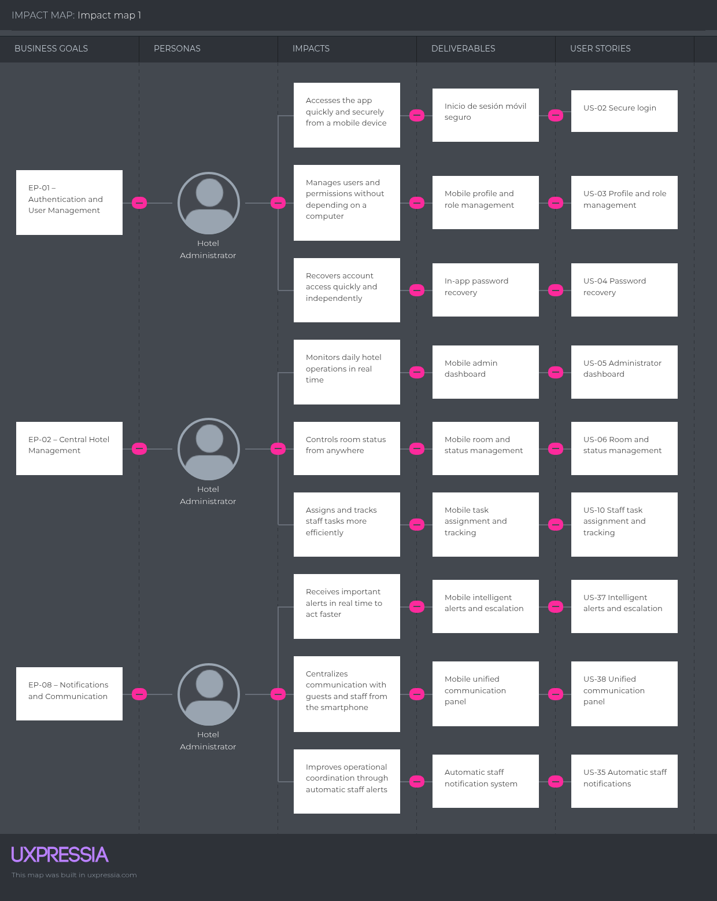

#### Impact Mapping Segmento 2: Traveler

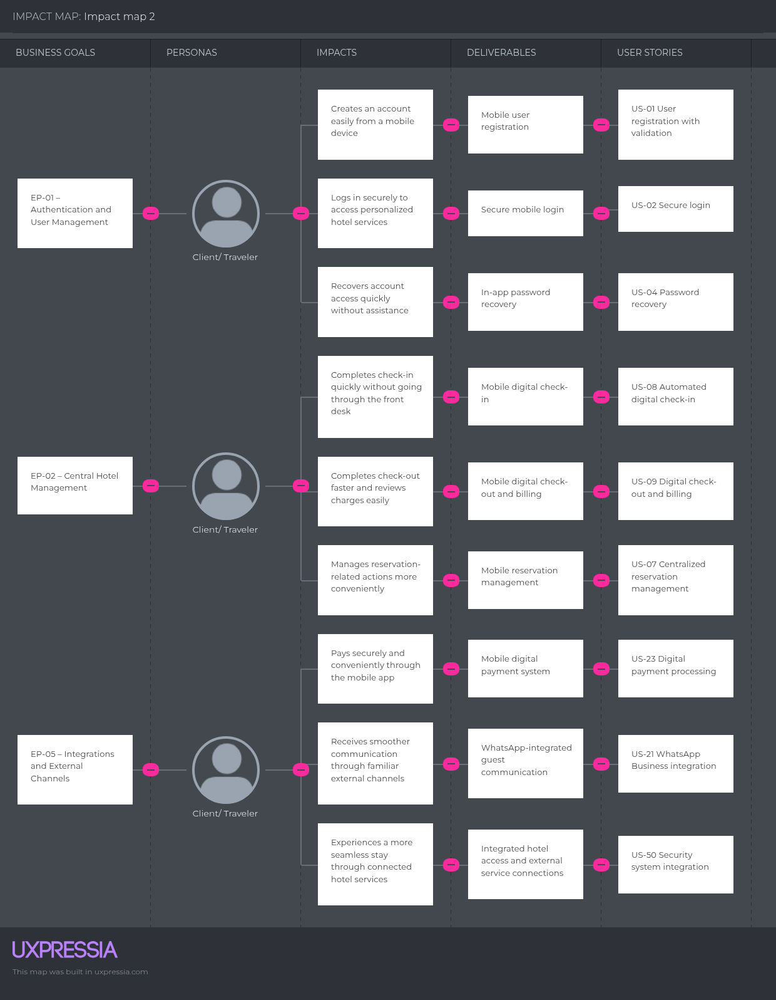

### Mapa de impacto integrado

<div align="center">
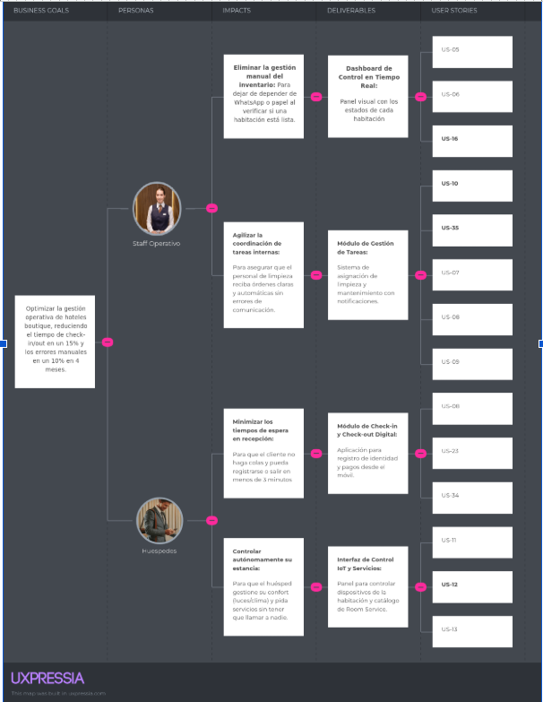
</div>

---

<div style="page-break-after: always;"></div>

# Capítulo IV: Product Design

## 4.1. Style Guidelines

Nuestra base es establecer la identidad visual y de diseño de Smart Stay, asegurando coherencia, claridad y usabilidad en todos los puntos de contacto de la marca, tanto en medios digitales como en experiencias del usuario.

Objetivo:
- Alinear la comunicación visual y de producto con la misión de la startup.
-	Garantizar una experiencia de usuario clara, accesible y atractiva.
-	Facilitar la integración de diseño en web y aplicaciones móviles con un lenguaje unificado.

### 4.1.1. General Style Guidelines

**Branding**

- Logo Smart Stay: El logo principal de la startup con el que se muestra ante el público.


- Logo Modo Oscuro: Este logo es creado para contrastar en fondos oscuros, lo cual permite la protección de la vista del usuario y favorece el rendimiento de la batería de su dispositivo.


- Logo Plus: Es una versión del logo con un color que resalta más elegancia, el cual se usa para los usuarios que opten por usar la suscripción plus del servicio.


- Logo Plus Modo Oscuro: Tiene la misma función que el logo modo oscuro con la diferencia de que sirve para la suscripción plus.


- Logos Monocromáticos: Logos con paleta de colores blanco y negro, cuyo uso es exclusivo para impresiones y documentos.

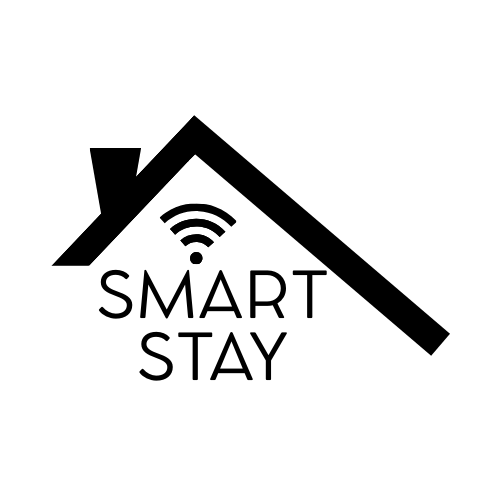


**Tipografía**

- Fuente principal (Brand & Títulos):
  Cocomat Pro
  Uso: Logo, headers, títulos principales en la app/web.
  Razón: Da un aire moderno y premium, con un estilo limpio que refuerza la identidad de la marca.

- Fuente secundaria (Texto y párrafos)
  Open Sans o Lato
  Uso: Textos descriptivos, botones, menús, correos y cualquier contenido largo.
  Razón: Son altamente legibles en pantallas, versátiles y complementan la elegancia de Cocomat Pro sin competir con ella.

- Jerarquía de uso
1. Títulos (H1, H2): Cocomat Pro Bold.
2. Subtítulos / énfasis: Cocomat Pro Medium.
3. Texto general / párrafos: Open Sans Regular.
4. Botones y menús: Open Sans SemiBold.

- Sistema Tipográfico
  H1 (Títulos principales):
  Cocomat Pro Bold – 32px

H2 (Subtítulos / secciones):
Cocomat Pro Medium – 24px

H3 (Bloques / cards):
Cocomat Pro Medium – 20px

Texto cuerpo (párrafos):
Open Sans Regular – 16px

Texto secundario / notas:
Open Sans Regular – 14px

Botones primarios:
Open Sans SemiBold – 16px (MAYÚSCULAS)


**Paleta de colores**
Espaciado de líneas: 1.5x en párrafos para mayor legibilidad.
Uso de color:
- Primario: Azul Marino (#2C3E91) → solidez, profesionalismo.
- Secundario: Dorado/Naranja Suave (#E67E22) → lujo, calidez.
- Neutros: Beige (#F5F5DC), Gris medio (#BDC3C7), Blanco (#FFFFFF).
- Apoyos: Verde agua (#1ABC9C) → frescura, sostenibilidad.


**Dimensiones**
- Cercano y humano: Hablar como si fueras un amigo confiable, sin tecnicismos innecesarios.
- Claro y directo: Frases cortas, fáciles de entender, sin rodeos.
- Inspirador: Transmitir seguridad y motivación para que el usuario sienta que tomó la mejor decisión.
- Profesional pero cálido: Ni demasiado rígido ni demasiado informal.

### 4.1.2. Web Style Guidelines

**Páginas principales**

- Home: enfoque en storytelling + CTA (“Probar demo”).
- Productos: módulos claros (cards azules) con descripciones cortas.
- Soluciones: bloques con imágenes + botones de acción (descargar brochure).
- Precios:  tabla comparativa clara (Plan Normal vs Plan Plus).
  

**Encabezados Hero (Landing)**

- Imagen grande en 16:9 con overlay oscuro: refuerza contraste con texto.
- Texto principal: H1 32px, Cocomat Pro Bold en blanco.
- Botón destacado (CTA): Naranja Suave (#E67E22) en mayúsculas.
  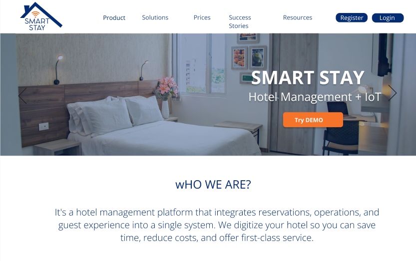

**Cards y Bloques de Contenido**

- Fondo azul marino (#2C3E91), texto blanco.
- Iconografía minimalista y consistente.
- Bordes redondeados 12px + sombra suave.
- Espaciado interno: 24px padding.
- Uso de grillas para mantener equilibrio visual.
  

**Tablas Comparativas (Precios)**

- Fondo alternado con colores que definen los planes para mejorar lectura.
- Encabezados fijos con H2 Medium 24px.
- Marca de “incluido” en check.
- Elementos no incluidos  sin check.
- Botón “Mejorar plan” en naranja como llamada a la acción final.
  

**Footer**

- Fondo azul marino sólido.
- Texto en blanco y gris claro.
- Columnas organizadas con links en Open Sans 14px.
- Inclusión de iconos sociales en fila inferior.
  

**Uso de Color en Web**

- Azul Marino (#2C3E91) → fondos de bloques, navegación, footer.
- Naranja Suave (#E67E22) → CTAs principales.
  -Verde Agua (#1ABC9C) → énfasis positivo (checks, beneficios, “incluido”).
- Beige (#F5F5DC) → fondos neutros para separar secciones.

**Comportamiento UX**

- Hover Cards → elevación (sombra) + cambio leve en tono de fondo.
- Hover Botones → transición 0.3s de azul → naranja.
- Scroll suave en anclas de página.
- Menú sticky superior para navegación rápida.
  

### 4.1.3. Mobile Style Guidelines

#### 4.1.3.1. iOS Mobile Style Guidelines

Los lineamientos para una futura versión iOS de Smart Stay adaptan la identidad de marca definida en 4.1.1 a las **Human Interface Guidelines (HIG)** de Apple, priorizando consistencia con los patrones nativos de la plataforma.

**Tipografía**
- Fuente del sistema: **San Francisco (SF Pro)**, con soporte de **Dynamic Type** para accesibilidad.
- Jerarquía mapeada a los estilos nativos de iOS: Large Title → títulos de sección, Headline → subtítulos, Body → texto de contenido, Caption → notas secundarias.

**Espaciado y grilla**
- Grilla base de **8pt**, con márgenes laterales de 16pt siguiendo el estándar de Safe Area.
- Uso de `List`/`Form` nativos para pantallas de configuración y perfil.

**Color**
- Azul Marino (#2C3E91) como *tint color* primario (elementos interactivos, botones).
- Naranja Suave (#E67E22) como color de acento para llamadas a la acción.
- Soporte de **Modo Claro/Oscuro** mediante colores semánticos del sistema (`systemBackground`, `label`) en vez de valores fijos, para que la app respete el modo elegido por el usuario.

**Navegación y componentes**
- **Tab Bar** inferior con las secciones principales (Home, Reservas, Servicios, Perfil).
- Navegación jerárquica con `UINavigationController` y gesto nativo de *swipe-back*.
- Iconografía basada en **SF Symbols** para mantener consistencia con el resto del sistema operativo.
- Alertas y confirmaciones mediante `UIAlertController` (Alerts / Action Sheets) nativos.

**Accesibilidad**
- Compatibilidad con **VoiceOver** y tamaños de fuente dinámicos.
- Contraste mínimo AA en todos los textos sobre fondo de color.

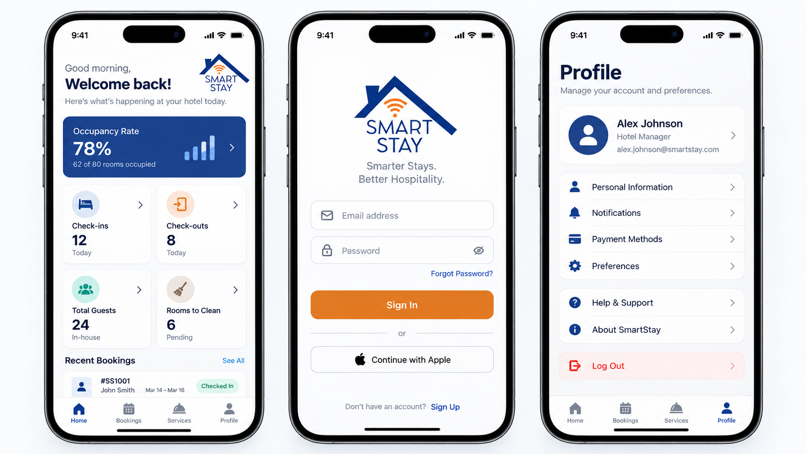

*Aplicación de los lineamientos en tres pantallas clave: Home (resumen de ocupación y accesos rápidos), Login (branding centrado con opción "Continue with Apple") y Profile (lista agrupada nativa de iOS), todas con Tab Bar inferior y la paleta de marca Smart Stay.*

#### 4.1.3.2. Android Mobile Style Guidelines

Los lineamientos para Android adaptan la identidad de marca a **Material Design 3**, aprovechando los componentes y el sistema de theming de Material para Android.

**Tipografía**
- Fuente del sistema: **Roboto**, siguiendo la escala tipográfica de Material (Display, Headline, Title, Body, Label).
- Jerarquía consistente con la definida en 4.1.1, reemplazando Cocomat Pro por Roboto Medium/Bold en encabezados nativos.

**Espaciado y elevación**
- Grilla base de **8dp**.
- Uso de **elevation** (sombras Material) para diferenciar jerarquía entre Cards, Bottom Sheets y Dialogs.

**Color**
- Esquema de color basado en **Material color roles**: `primary` (#2C3E91), `secondary` (#E67E22), `surface` (#F5F5DC), con variantes automáticas para modo oscuro (**Material You / Dynamic Color**).
- Uso de `ColorStateList` para estados (pressed, disabled, selected).

**Navegación y componentes**
- **Bottom Navigation Bar** para las secciones principales, consistente con el patrón usado en iOS para mantener paridad de experiencia multiplataforma.
- **Floating Action Button (FAB)** en naranja para la acción principal de cada rol (ej. "Nueva reserva" en Huésped, "Nueva tarea" en Staff).
- Componentes Material estándar: `MaterialButton`, `MaterialCardView` (bordes redondeados 12dp, consistente con Web), `Snackbar` para feedback, efecto **ripple** en toda superficie interactiva.
- Iconografía basada en **Material Symbols**.

**Accesibilidad**
- Soporte de **TalkBack** y escalado de fuente del sistema.
- Áreas táctiles mínimas de 48dp según las guías de accesibilidad de Android.

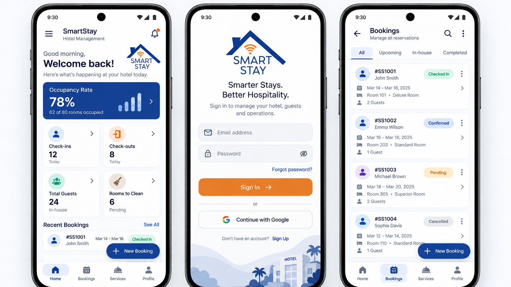

*Aplicación de los lineamientos en tres pantallas clave: Home (con Floating Action Button "New Booking" en naranja), Login (con ilustración de fondo y opción "Continue with Google") y Bookings (Cards Material con estados de reserva por color), todas con Bottom Navigation y componentes Material 3.*

## 4.2. Information Architecture

### 4.2.1. Organization Systems

En el diseño de interfaces digitales centradas en el usuario, el Sistema de Organización es el componente de la arquitectura de información encargado de definir cómo se agrupan, clasifican y presentan los contenidos dentro de la plataforma. Su objetivo principal es permitir que los usuarios puedan explorar, comprender y acceder a la información de forma rápida e intuitiva, reduciendo la carga cognitiva y mejorando la usabilidad del sistema.

Para la solución Smart Stay, se ha implementado un sistema de organización híbrido que combina estructuras jerárquicas, funcionales y orientadas a tareas. Esta decisión responde a la necesidad de gestionar dos tipos de usuarios principales: el Staff Operativo y los Huéspedes, cada uno con objetivos y flujos de interacción distintos dentro de la aplicación móvil.

En la Landing Page, el contenido se organiza en bloques priorizados que siguen una lógica de captación y conversión. En primer lugar, se destacan las llamadas a la acción principales, como “Probar Demo” o “Explorar Funcionalidades”, seguidas por la propuesta de valor del sistema, donde se explica el uso de tecnologías móviles e IoT para la gestión hotelera. El encabezado (header) y el pie de página (footer) estructuran la navegación mediante accesos directos a secciones clave como beneficios, características, planes y contacto.

Esta organización permite que los usuarios comprendan rápidamente qué ofrece Smart Stay y cómo interactuar con la plataforma, aplicando principios de jerarquía visual, progressive disclosure y adaptabilidad a dispositivos móviles.


En la Aplicación Móvil, la organización del contenido está orientada a tareas y roles. El acceso inicial se realiza mediante autenticación (login), donde el usuario es redirigido automáticamente según su perfil (Staff o Huésped).

Una vez dentro del sistema, la estructura se organiza en módulos principales accesibles desde la navegación inferior o menú principal:

- Dashboard: vista general del estado del sistema.
- Habitaciones: gestión de disponibilidad y estado.
- Servicios: solicitudes y gestión de requerimientos.
- Perfil: configuración del usuario.

Cada módulo se desglosa en subniveles donde se presentan funcionalidades específicas, manteniendo una estructura jerárquica clara:

- Nivel 1: módulos principales
- Nivel 2: submódulos (ej. tareas de limpieza, incidencias)
- Nivel 3: acciones específicas (ej. marcar habitación como limpia)

Adicionalmente, se aplica una organización contextual, donde la información cambia según la acción del usuario. Por ejemplo:

- Durante el check-in: se priorizan datos del huésped.
- Durante operaciones del staff: se priorizan tareas y estados en tiempo real.
- Durante la estancia: se destacan servicios y control de habitación.

Asimismo, algunos procesos siguen una organización secuencial, como el check-in digital o la solicitud de servicios, guiando al usuario paso a paso para evitar errores.

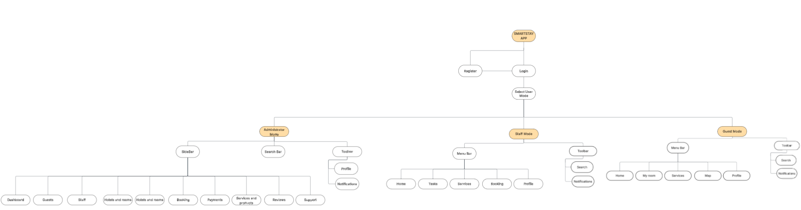

### 4.2.2. Labeling Systems

El sistema de etiquetado define cómo se nombran las secciones, botones y funcionalidades dentro de la aplicación, permitiendo que el usuario comprenda rápidamente el propósito de cada elemento. En Smart Stay, las etiquetas se diseñan bajo principios de claridad, consistencia y orientación al usuario, adaptándose tanto al Staff Operativo como a los Huéspedes.

---

| Etiqueta | Ubicación / Componente | Función |
|----------|------------------------|--------|
| Home | Header / Navegación principal | Redirige a la pantalla principal o dashboard. Permite acceso rápido al inicio. |
| Rooms | Menú principal / App | Acceso a la gestión de habitaciones (estado, disponibilidad, mantenimiento). |
| Services | Menú principal | Muestra los servicios disponibles (limpieza, room service, soporte). |
| Dashboard | Pantalla principal | Vista general del estado del sistema y resumen de operaciones. |
| Bookings | Módulo de reservas | Permite gestionar reservas activas y futuras. |
| Check-in | Flujo principal | Permite registrar la entrada del huésped de forma digital. |
| Check-out | Flujo principal | Permite finalizar la estancia del huésped de forma rápida. |
| Login | Pantalla de acceso | Inicio de sesión del usuario. Término estándar y reconocido. |
| Sign Up | Pantalla de acceso | Registro de nuevos usuarios. Corto, claro y amigable. |
| Try Demo | Landing Page (CTA) | Llamada a la acción principal para probar la aplicación. |
| My Room | App Huésped | Acceso al control de la habitación (IoT, temperatura, iluminación). |
| Requests | App Huésped | Permite solicitar servicios del hotel desde el móvil. |
| Tasks | App Staff | Gestión de tareas operativas (limpieza, mantenimiento). |
| Notifications | Icono / App | Muestra alertas en tiempo real sobre eventos importantes. |
| Profile | Menú usuario | Configuración de cuenta y preferencias del usuario. |
| Settings | Menú secundario | Ajustes generales del sistema. |
| Reports | App Staff | Acceso a métricas y reportes operativos del hotel. |
| Contact | Landing / App | Permite comunicación con el hotel o soporte técnico. |


### 4.2.3. SEO Tags and Meta Tags

Los SEO tags y meta tags son elementos fundamentales dentro de la Landing Page de Smart Stay, ya que permiten mejorar la visibilidad del sistema en motores de búsqueda, facilitar su indexación y optimizar la forma en que se presenta tanto en resultados de búsqueda como en redes sociales.

Además, estos elementos son clave para garantizar una correcta visualización en dispositivos móviles, mejorar la experiencia del usuario y aumentar la tasa de interacción (CTR).

La Landing Page de Smart Stay implementa etiquetas esenciales como: charset, viewport, title, description, keywords y favicon, las cuales permiten estructurar correctamente la información del sitio.

---

### Meta charset

```html
<meta charset="UTF-8">
```

- Define la codificación de caracteres de la página.
- Permite que el contenido se muestre correctamente, incluyendo tildes, símbolos y caracteres especiales.
- Es fundamental para evitar errores de visualización en distintos navegadores.

---

### Meta viewport

```html
<meta name="viewport" content="width=device-width, initial-scale=1.0">
```

- Permite que la página sea responsive.
- Ajusta automáticamente el contenido al tamaño de la pantalla del dispositivo.
- Mejora la experiencia de usuario en smartphones y tablets.

---

### Title

```html
<title>Smart Stay</title>
```

- Define el título de la página que aparece en la pestaña del navegador.
- Es uno de los factores más importantes para SEO.
- Se muestra como encabezado principal en los resultados de búsqueda.

---

### 1. Meta Tags principales

- **charset:** Define la codificación del documento. UTF-8 es el estándar actual.
- **viewport:** Permite adaptar la página a diferentes dispositivos y resoluciones.
- **description:** Proporciona un resumen del contenido de la página. Es el texto que aparece debajo del título en los resultados de búsqueda.
- **keywords:** Lista de palabras clave relacionadas con el sistema (ej. hotel management, mobile app, IoT hotel).
- **author:** Identifica al creador del contenido (Smart Stay Team).

---

### 2. Meta Tags para Redes Sociales (Open Graph)

```html
<meta property="og:title" content="Smart Stay">
<meta property="og:description" content="Solución móvil para gestión hotelera con IoT">
<meta property="og:image" content="assets/logo.png">
<meta property="og:url" content="https://smartstay.com">
```

- Permiten controlar cómo se muestra la página al compartirla en redes sociales.
- Mejoran la apariencia visual del enlace (imagen, título y descripción).
- Aumentan la probabilidad de interacción del usuario.

---

### 3. Otros elementos importantes

**Favicon:**

```html
<link rel="icon" href="assets/favicon.png">
```

- Representa el icono del sitio en la pestaña del navegador.
- Refuerza la identidad visual de la marca.

**Canonical URL:**

```html
<link rel="canonical" href="https://smartstay.com">
```

- Evita problemas de contenido duplicado en buscadores.


### 4.2.4. Searching Systems

El sistema de búsqueda de Smart Stay permite a los usuarios localizar información, reservas, servicios y funcionalidades de manera rápida y eficiente. En la Landing Page, la búsqueda está orientada a descubrir contenido general sobre la plataforma, utilizando accesos directos, enlaces destacados y navegación guiada hacia secciones clave como “Try Demo” o “Benefits”.

En la aplicación móvil, el sistema de búsqueda es más funcional y está enfocado en la gestión de información específica. Permite a los usuarios filtrar y ordenar datos como habitaciones, reservas, servicios o tareas operativas, utilizando autocompletado, filtros dinámicos y persistencia de resultados. El diseño se basa en principios de usabilidad, consistencia y eficiencia, asegurando que el usuario encuentre lo que necesita sin dificultad.

---

| Search Type | Location / Component | Function |
|-------------|---------------------|----------|
| General Search | Landing Page / Header | Permite buscar información general sobre la plataforma y sus servicios (ej. "servicios", "demo", "beneficios"). Incluye autocompletado básico. |
| Try Demo / Benefits Links | Landing Page / Hero & Value Sections | Funciona como búsqueda indirecta, guiando al usuario hacia contenido relevante sin necesidad de ingresar texto. |
| Rooms Search | Mobile App / Rooms Section | Permite buscar habitaciones por número, estado (disponible, ocupado, mantenimiento) o tipo. |
| Bookings Search | Mobile App / Bookings Section | Filtrado por fechas, estado de reserva (pendiente, confirmada, cancelada) y tipo de cliente. |
| Services Search | Mobile App / Services Section | Permite buscar servicios disponibles (limpieza, room service, soporte técnico) mediante filtros y categorías. |
| Tasks Search | Mobile App / Staff Module | Permite al staff localizar tareas asignadas por prioridad, estado o tipo de actividad. |
| Notifications Search | Mobile App / Notifications Panel | Permite revisar alertas y eventos importantes mediante filtrado por tipo o fecha. |


### 4.2.5. Navigation Systems

El sistema de navegación de Smart Stay define cómo los usuarios se desplazan dentro de la plataforma, permitiendo acceder a las distintas secciones de forma clara, rápida e intuitiva. Este sistema está diseñado bajo principios de consistencia, accesibilidad y eficiencia, adaptándose tanto a la Landing Page como a la aplicación móvil.

---

### Landing Page Navigation

| Navigation Item | Location / Component | Function |
|-----------------|----------------------|----------|
| Home | Header | Enlace a la página principal. Permite regresar al inicio desde cualquier sección. |
| Services | Header | Acceso directo a la sección de servicios ofrecidos por la plataforma. |
| Benefits | Header / Value Section | Redirige a la sección donde se explican las ventajas del sistema. |
| Contact | Header | Permite acceder al formulario de contacto o soporte. |
| Sign Up | Header (button) | Registro de nuevos usuarios. Botón destacado visualmente. |
| Login | Header (button) | Acceso a la cuenta del usuario. Fácil de localizar. |
| Try Demo | Hero Section (CTA principal) | Llamada a la acción principal para probar la plataforma. |
| About | Footer / Company | Información institucional de Smart Stay. |
| Privacy Policy | Footer / Legal | Acceso a políticas de privacidad del sistema. |
| Terms & Conditions | Footer / Legal | Información sobre condiciones de uso de la plataforma. |

---

### Mobile Application Navigation

| Navigation Item | Location / Component | Function |
|-----------------|----------------------|----------|
| Dashboard | Bottom Navigation | Vista general del sistema con información resumida. |
| Rooms | Bottom Navigation | Acceso a la gestión y estado de habitaciones. |
| Services | Bottom Navigation | Permite visualizar y solicitar servicios disponibles. |
| Profile | Bottom Navigation | Configuración del usuario y preferencias personales. |
| Notifications | Top Bar / Icon | Acceso a alertas y eventos importantes en tiempo real. |
| Tasks | Staff Module | Permite gestionar tareas operativas asignadas al personal. |
| Bookings | App Module | Acceso a reservas activas, historial y gestión de huéspedes. |
| Back Navigation | App Screens | Permite regresar a la pantalla anterior de forma intuitiva. |


## 4.3. Landing Page UI Design

### 4.3.1. Landing Page Wireframe

Los wireframes representan la primera aproximación al diseño de la interfaz de Smart Stay.  
Se han desarrollado en formato blanco y negro, sin imágenes ni estilos gráficos, para enfocarse únicamente en la estructura, disposición de los elementos y flujo de navegación.

El objetivo de estos wireframes es:
- Establecer la arquitectura de información de la plataforma.
- Definir la jerarquía de contenidos en cada sección.
- Validar la navegación y experiencia de usuario antes de pasar al diseño visual (mockups).

A continuación, se presenta un resumen de cada una de las secciones.

**1. Home**
- **Propósito:** Página principal de presentación de Smart Stay.
- **Elementos clave:**
    - Encabezado con menú de navegación.
    - Hero con nombre de la plataforma y botón de llamada a la acción (*CTA: Probar demo*).
    - Sección "¿Quiénes somos?" con breve descripción.
    - Bloques de beneficios y características principales.
    - Footer con enlaces de contacto, políticas y redes sociales.
      

**2. Products**
- **Propósito:** Mostrar los productos y módulos de la plataforma.
- **Elementos clave:**
    - Lista de funcionalidades divididas en áreas: gestión hotelera, experiencia del huésped, reportes, seguridad.
    - Descripción breve de cada módulo.
    - Botón de descarga de brochure.
      

**3. Solutions**
- **Propósito:** Explicar cómo Smart Stay se adapta a diferentes tipos de hoteles.
- **Elementos clave:**
    - Sección para hoteles boutique.
    - Sección para alojamientos alternativos.
    - Sección para cadenas hoteleras.
    - Botón para descargar información detallada.
      


**4. Prices**
- **Propósito:** Detallar planes y costos de la plataforma.
- **Elementos clave:**
    - Tabla comparativa de funcionalidades entre Plan Normal y Plan Plus.
    - Categorías claras: gestión hotelera, experiencia huésped, seguridad, soporte.
      

**5. Success Stories**
- **Propósito:** Mostrar testimonios y ejemplos de hoteles que ya usan Smart Stay.
- **Elementos clave:**
    - Bloques con testimonios de clientes.
    - Descripción breve de resultados obtenidos (ahorro de tiempo, mejora de experiencia, reducción de costos).
      

**6. Resources**
- **Propósito:** Repositorio de materiales de apoyo y aprendizaje.
- **Elementos clave:**
    - Documentos descargables (guías, whitepapers, brochures).
    - Links de blogs.  
      

**7. Register**
- **Propósito:** Permitir que un nuevo usuario cree su cuenta.
- **Elementos clave:**
    - Formulario de registro con campos básicos (nombre, correo, contraseña, tipo de empresa).
    - Botón de registro.  
      

**8. Login**
- **Propósito:** Acceso de usuarios ya registrados.
- **Elementos clave:**
    - Formulario de inicio de sesión con correo y contraseña.
    - Botón de acceso.
    - Enlace a recuperación de contraseña y a registro.  
      

Los wireframes definen la base de navegación de Smart Stay, asegurando que cada sección tenga un propósito claro:
- **Home:** captar atención y presentar la plataforma.
- **Productos, Soluciones, Precios:** comunicar valor y opciones.
- **Casos de Éxito, Recursos:** generar confianza y soporte.
- **Registro y Login:** habilitar el acceso a la app.


### 4.3.2. Landing Page Mock-up

Tras la validación de los wireframes, se desarrollaron los mockups de alta fidelidad de Smart Stay.  
Estos mockups ya incorporan la identidad visual definida (colores, tipografía, logotipo e imágenes), con el objetivo de reflejar la experiencia final que tendrán los usuarios en la plataforma.

Su propósito es:
- Validar la usabilidad con un diseño más realista.
- Asegurar la coherencia con la guía de estilos definida.
- Proyectar cómo se verá cada sección en un entorno final.

**1. Landing Page**
- **Cambios respecto al wireframe:**
    - Se añadió el logotipo de Smart Stay en el header.
    - Paleta de colores aplicada (azul corporativo + tonos complementarios).
    - Imagen de fondo en el Hero con llamada a la acción resaltada (“Probar demo”).
    - Iconografía personalizada para los beneficios.  
      

**2. Product**
-**Cambios respecto al wireframe:**
- Uso de íconos y colores diferenciados por módulo (gestión, experiencia huésped, seguridad, reportes).
- Inclusión de imágenes ilustrativas.
- Botón de descarga estilizado con colores de la marca.  
  

**3. Solutions**
- **Cambios respecto al wireframe:**
    - Bloques visuales para cada tipo de cliente (hoteles boutique, alojamientos alternativos, cadenas).
    - Uso de fotografías representativas de hoteles.
    - CTA destacado.
      

**4. Prices**
- **Cambios respecto al wireframe:**
    - Tabla de precios con colores diferenciadores por plan.
    - Plan recomendado resaltado con un fondo destacado.  
      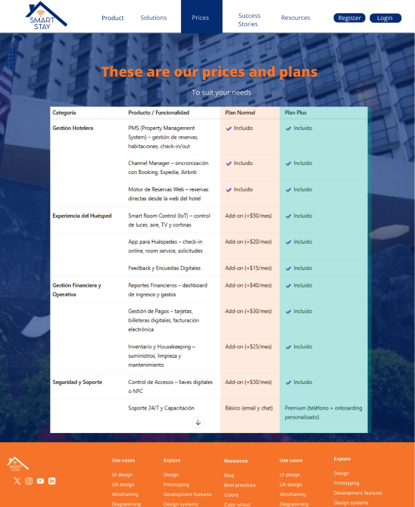

**5. Success Stories**
- **Cambios respecto al wireframe:**
    - Testimonios acompañados de logos reales de hoteles.  
      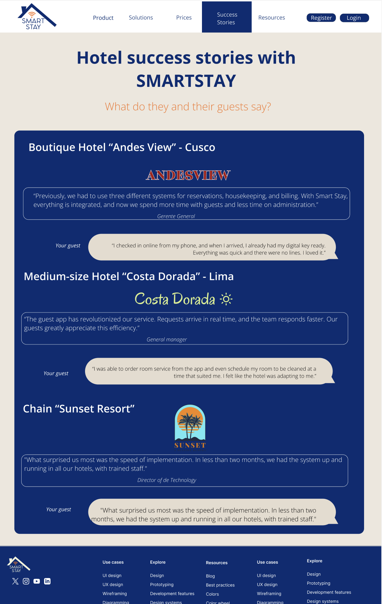

**6. Resources**
- **Cambios respecto al wireframe:**
    - Secciones de miniaturas de documentos descargables.
    - Secciones de blog con botón de visitar página externa.
      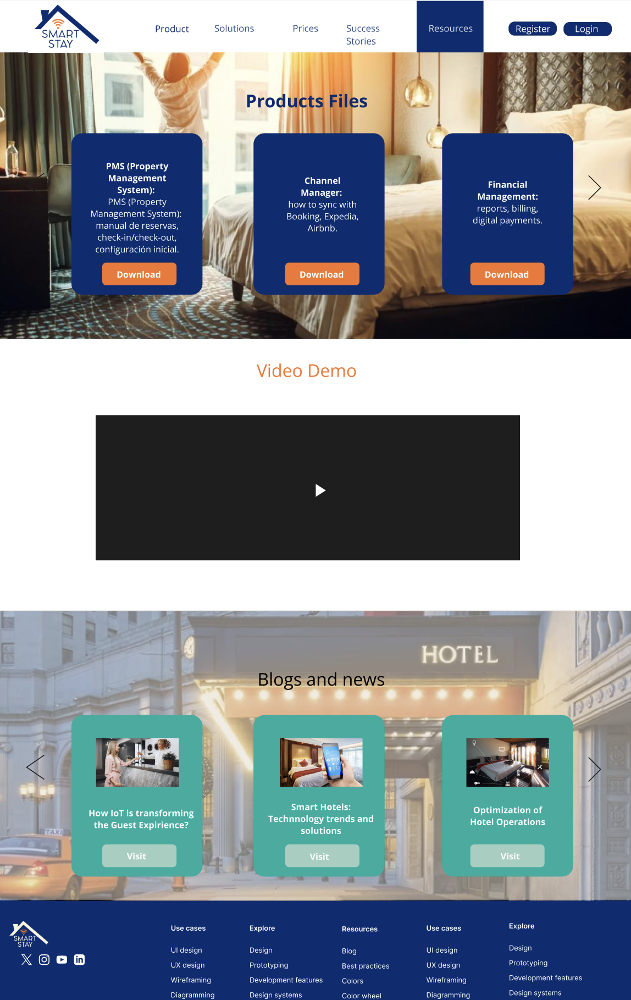

**7. Register**
- **Cambios respecto al wireframe:**
    - Formulario minimalista con campos estilizados.
    - Botón de “Enviar y registrar” resaltado en color primario.
    - Fondo con imagen ligera para dar contexto al servicio.
      

**8. Login**
- **Cambios respecto al wireframe:**
    - Formulario ubicado a lateral izquierdo en pantalla con diseño limpio.
    - Logo al lado derecho de la pantalla.
    - Enlaces secundarios estilizados para “¿Olvidaste tu contraseña?”.  
      

Los mockups consolidan el diseño visual final de Smart Stay, transformando la estructura básica de los wireframes en interfaces listas para evaluación estética y funcional.


## 4.4. Mobile Applications UX/UI Design

### 4.4.1. Mobile Applications Wireframes

La solución móvil se divide en dos tipos de aplicaciones:

- **Aplicación para Huéspedes:** enfocada en mejorar la experiencia del usuario durante su estadía, permitiendo el control de la habitación, solicitud de servicios y acceso a información relevante.
- **Aplicación para Staff:** orientada a la gestión operativa del hotel, incluyendo tareas, reservas, servicios y control de incidencias.

Ambas aplicaciones comparten principios de diseño consistentes, tales como:

- Uso de navegación inferior (bottom navigation) para acceso rápido a módulos principales.
- Interfaz limpia y minimalista para reducir la carga cognitiva.
- Uso de iconografía clara para facilitar la comprensión.
- Adaptabilidad a diferentes tamaños de pantalla (responsive design).
- Retroalimentación visual mediante notificaciones y estados.


---

### Aplicación Móvil – Huésped

Las pantallas principales de la aplicación para huéspedes incluyen:

- **IntroApp (Bienvenida):**
  - Pantalla inicial que da la bienvenida al usuario.
  - Refuerza la identidad de Smart Stay.

- **Home:**
  - Panel principal con opciones de búsqueda, promociones y acceso rápido a funcionalidades.
  - Incluye acceso a servicios y asistencia.

- **Habitación:**
  - Control de dispositivos IoT (temperatura, luces, cortinas, TV).
  - Información del estado de la habitación.

- **Servicios:**
  - Visualización y solicitud de servicios disponibles (restaurantes, limpieza, amenities).

- **Mapa:**
  - Ubicación de servicios dentro o cerca del hotel.
  - Interfaz de búsqueda y filtros.

- **Perfil:**
  - Información personal del usuario.
  - Gestión de métodos de pago.

- **Notificaciones:**
  - Alertas y mensajes importantes durante la estadía.


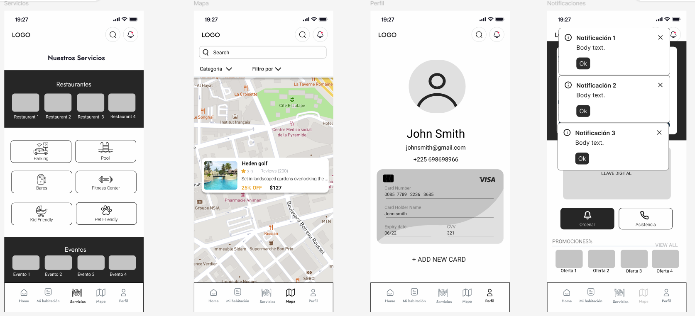

---

### Aplicación Móvil – Staff

Las pantallas principales de la aplicación para el personal incluyen:

- **IntroApp Staff:**
  - Pantalla de bienvenida para el personal del hotel.

- **Login:**
  - Acceso seguro mediante credenciales.

- **Home Staff:**
  - Panel con resumen de actividades del día.
  - Acceso a historial y registros.

- **Tareas:**
  - Gestión de tareas asignadas (limpieza, mantenimiento).
  - Visualización de estado de cada actividad.

- **Servicios:**
  - Registro y seguimiento de servicios solicitados por huéspedes.

- **Reservas:**
  - Gestión de check-in y check-out.
  - Visualización de reservas activas.

- **Perfil:**
  - Información del trabajador.
  - Opciones de configuración.

- **Notificaciones:**
  - Alertas sobre cambios, incidencias o nuevas tareas.


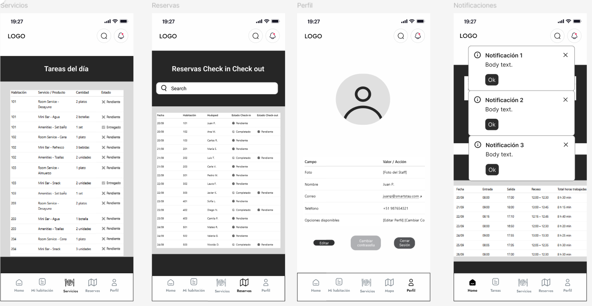

---

### Consideraciones de Diseño UX/UI

El diseño de ambas aplicaciones se basa en los siguientes principios:

- **Usabilidad:** interfaces fáciles de entender y utilizar.
- **Eficiencia:** reducción de pasos para completar tareas.
- **Consistencia:** uso de patrones de diseño similares en ambas apps.
- **Visibilidad del estado:** información clara sobre acciones y resultados.
- **Accesibilidad:** elementos interactivos visibles y fáciles de usar.

---


### 4.4.2. Mobile Applications Wireflow Diagrams

Los wireflow diagrams de las aplicaciones móviles de Smart Stay representan el flujo de navegación entre pantallas, combinando la estructura de los wireframes con las interacciones del usuario dentro del sistema.

Estos diagramas permiten visualizar cómo los usuarios se desplazan entre las distintas funcionalidades de la aplicación, facilitando la comprensión del comportamiento del sistema tanto para huéspedes como para el personal del hotel.

---

### Aplicación Móvil – Huésped

El flujo de navegación para el huésped inicia desde la pantalla de bienvenida (Intro), desde donde el usuario accede al Home, que actúa como punto central de la aplicación.

Desde el Home, el usuario puede navegar hacia:

- **Notificaciones:** para visualizar alertas relacionadas a su estadía.
- **My Room (Habitación):** para controlar dispositivos IoT como luces, temperatura y cortinas.
- **Services:** para explorar y solicitar servicios disponibles.
- **Map:** para ubicar servicios dentro o fuera del hotel.
- **Profile:** para gestionar su información personal y métodos de pago.

Este flujo permite una navegación clara y directa, utilizando una barra de navegación inferior que facilita el acceso rápido a cada módulo.

---


---

### Aplicación Móvil – Staff

El flujo del personal inicia en la pantalla de bienvenida (Intro Staff), seguida del Login, donde el usuario ingresa sus credenciales para acceder al sistema.

Una vez autenticado, el usuario accede al Home Staff, desde donde puede navegar hacia:

- **Notificaciones:** para revisar alertas operativas.
- **Tasks:** para gestionar tareas asignadas (limpieza, mantenimiento, etc.).
- **Services:** para administrar servicios solicitados.
- **Booking (Reservas):** para gestionar check-in y check-out.
- **Profile:** para visualizar y editar su información personal.

Este flujo está diseñado para optimizar la eficiencia operativa del personal, permitiendo acceder rápidamente a las funciones más importantes del sistema.

---


---


### 4.4.3. Mobile Applications Mock-ups

Los mock-ups de las aplicaciones móviles de Smart Stay representan el diseño visual final del sistema, incorporando la identidad gráfica definida, incluyendo colores, tipografía, iconografía e imágenes. A diferencia de los wireframes, estos diseños permiten visualizar cómo interactuará el usuario con una interfaz cercana al producto real.

Se desarrollaron mock-ups para dos tipos de usuarios: huéspedes y personal del hotel (staff), considerando sus necesidades específicas dentro del sistema.

---

### Aplicación Móvil – Huésped

Los mock-ups del módulo de huésped muestran una interfaz moderna, intuitiva y orientada a mejorar la experiencia durante la estadía.

**Pantallas principales:**

- **Intro (Bienvenida):**
  - Pantalla inicial con identidad visual de Smart Stay.
  - Uso de colores corporativos para reforzar branding.

- **Home:**
  - Panel principal con opciones de búsqueda y acceso a funcionalidades.
  - Integración de promociones y accesos rápidos.

- **Habitación:**
  - Interfaz para control de dispositivos IoT (temperatura, luces, cortinas, TV).
  - Diseño centrado en facilidad de uso.

- **Servicios:**
  - Presentación visual de servicios en tarjetas con iconos.
  - Organización clara por categorías.

- **Mapa:**
  - Integración de mapa interactivo.
  - Visualización de ubicaciones con información contextual.

- **Perfil:**
  - Información del usuario con diseño limpio.
  - Gestión de métodos de pago con interfaz visual.

- **Notificaciones:**
  - Alertas visuales organizadas en tarjetas.
  - Fácil lectura e interacción.

---


---


---

### Aplicación Móvil – Staff

Los mock-ups del módulo de staff están diseñados para optimizar la gestión operativa del hotel, priorizando claridad y eficiencia.

**Pantallas principales:**

- **Intro Staff:**
  - Identificación del modo de uso del sistema.
  - Diseño alineado con la identidad visual.

- **Login:**
  - Formulario de acceso claro y sencillo.
  - Campos bien definidos y accesibles.

- **Home Staff:**
  - Panel con resumen de actividades y registros.
  - Acceso a historial y notificaciones.

- **Tareas:**
  - Listado de tareas del día con estado (pendiente, completado).
  - Diseño enfocado en lectura rápida.

- **Servicios:**
  - Registro y seguimiento de servicios.
  - Información organizada en tablas.

- **Reservas:**
  - Gestión de check-in y check-out.
  - Visualización clara de datos.

- **Perfil:**
  - Información del trabajador.
  - Opciones de configuración.

- **Notificaciones:**
  - Alertas visuales para eventos importantes.

---

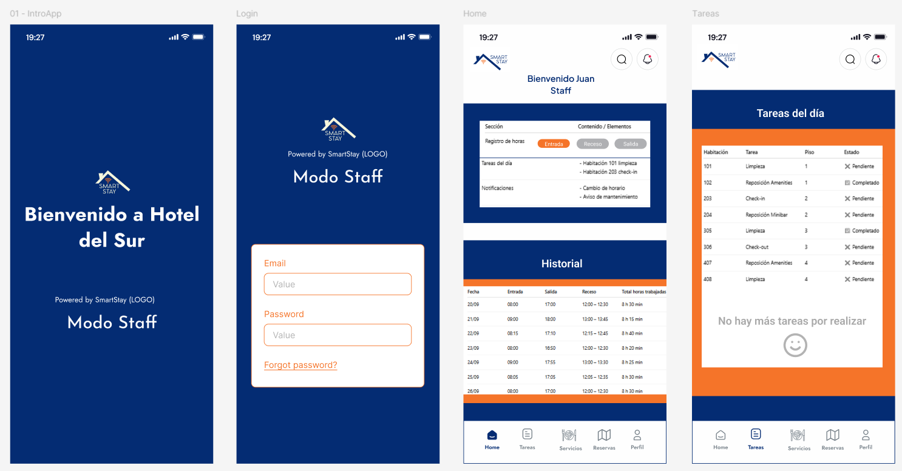

---

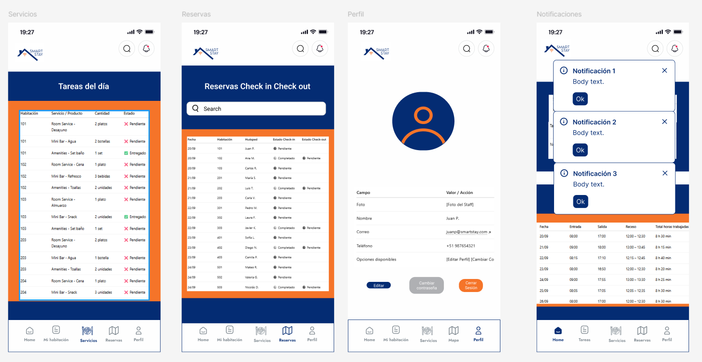

---


### 4.4.4. Mobile Applications User Flow Diagrams

Los User Flow Diagrams de Smart Stay representan de manera detallada el recorrido que realizan los usuarios dentro de la aplicación móvil, desde el ingreso hasta la finalización de sus tareas. Estos diagramas permiten visualizar tanto los flujos ideales (Happy Path) como los escenarios alternativos o de error (Unhappy Path), mejorando el análisis de la experiencia de usuario.

Se desarrollaron flujos para tres tipos de usuarios: huésped, personal (staff) y administrador, considerando sus interacciones específicas con el sistema.

---

### Usuario: Huésped (Guest)

**Happy Path:**
El flujo ideal del huésped inicia al abrir la aplicación, seguido del login o registro. Una vez autenticado, accede al Home, desde donde puede:

- Realizar check-in digital.
- Consultar información de su habitación.
- Solicitar servicios adicionales.
- Visualizar el mapa del hotel.
- Registrar métodos de pago.
- Realizar check-out digital.
- Dejar reseñas de su experiencia.

---


---

**Unhappy Path:**
Incluye escenarios donde:

- El código de acceso es inválido o expirado.
- El check-in aún no está habilitado.
- Un servicio solicitado no está disponible.
- El usuario debe esperar disponibilidad.

---


---

### Usuario: Staff

**Happy Path:**
El flujo del personal inicia con login, seguido del acceso al panel principal donde puede:

- Visualizar tareas asignadas.
- Marcar tareas como completadas.
- Gestionar check-in y check-out.
- Consultar historial de actividades.
- Administrar servicios solicitados.

---


---

**Unhappy Path:**
Se contemplan situaciones como:

- Credenciales incorrectas.
- Falta de conexión a internet.
- Fallo al actualizar estados de tareas.

---


---

### Usuario: Administrador

**Happy Path:**
El flujo del administrador incluye:

- Registro o login.
- Creación de perfil del hotel.
- Gestión de habitaciones, servicios y tarifas.
- Supervisión de reservas, pagos y reportes.
- Monitoreo de actividad y generación de códigos de acceso.

---

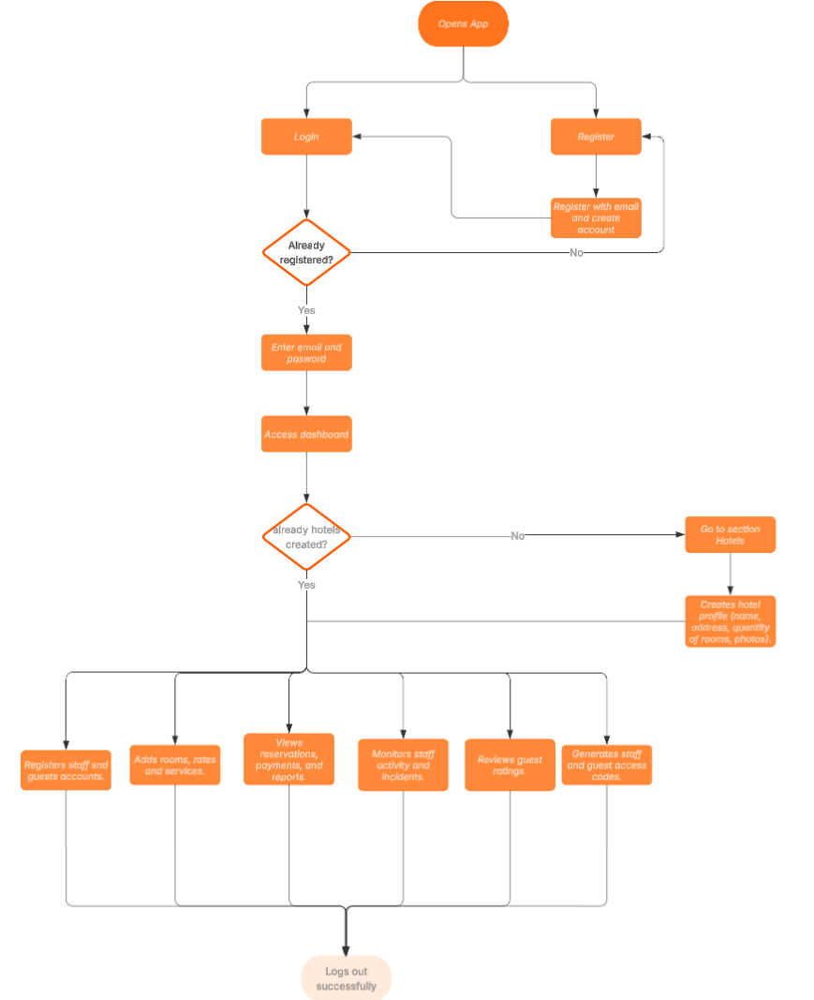

---

**Unhappy Path:**
Incluye casos como:

- Datos incompletos en el registro.
- Duplicación de información.
- Errores en la creación de servicios o habitaciones.

---


---


## 4.5. Mobile Applications Prototyping

### 4.5.1. Android Mobile Applications Prototyping

El prototipo de la aplicación móvil de Smart Stay fue desarrollado con el objetivo de simular la interacción real del usuario con el sistema, permitiendo validar la navegación, usabilidad y flujo de las funcionalidades principales antes de su implementación.

Para la construcción del prototipo se utilizaron herramientas de diseño como Figma, integrando los mock-ups previamente desarrollados y conectándolos mediante interacciones que representan el comportamiento real de la aplicación.

---

### Características del Prototipo

- Navegación interactiva entre pantallas principales.
- Simulación de acciones del usuario (clicks, transiciones).
- Flujo completo desde el ingreso hasta la finalización de tareas.
- Representación de diferentes tipos de usuario: huésped, staff y administrador.

---

### Flujo del Prototipo

El prototipo incluye los siguientes recorridos principales:

**Huésped:**
- Pantalla de bienvenida (Intro)
- Login / Registro
- Home
- Habitación (control IoT)
- Servicios
- Mapa
- Perfil
- Notificaciones

**Staff:**
- Login
- Home Staff
- Gestión de tareas
- Servicios
- Reservas
- Perfil

**Administrador:**
- Login / Registro
- Panel de administración
- Gestión de habitaciones y servicios
- Supervisión de reservas

---

### Objetivos del Prototipo

- Validar la experiencia de usuario antes del desarrollo.
- Detectar posibles errores en la navegación.
- Evaluar la claridad de las interfaces.
- Mejorar la interacción entre usuario y sistema.

---

### Herramienta Utilizada

El prototipo fue desarrollado en Figma, permitiendo la creación de un entorno interactivo donde se simulan las funcionalidades clave del sistema.

**Prototipo en Figma:**
https://www.figma.com/make/lML4HR5vLsAGMUq3CoqvcS/Minimalist-Photo-Portfolio?t=7b0vXYUcbQwt6eOT-1&preview-route=%2Fguest%2Flogin

---


### 4.5.2. iOS Mobile Applications Prototyping

El desarrollo nativo de Smart Stay se priorizó en **Android (Kotlin)** para esta entrega, por lo que aún no se cuenta con una compilación nativa para iOS. No obstante, se diseñó el flujo completo de pantallas en estilo iOS (Tab Bar, Navigation Bar, SF Symbols), siguiendo los lineamientos de la sección 4.1.3.1, para dejar validado el recorrido de huésped antes de una eventual implementación nativa:

1. **Welcome** — pantalla de bienvenida con branding Smart Stay.
2. **Login / Register** — inicio de sesión con opción "Continue with Apple".
3. **Home** — resumen de la habitación activa, temperatura, Wi-Fi y accesos rápidos (pedir comida, housekeeping, room service, ayuda).
4. **Room Control** — control IoT de la habitación: luces, temperatura, aire acondicionado, cortinas y cerradura de la puerta.
5. **Services** — catálogo de servicios del hotel (restaurante, spa, piscina, parking, housekeeping, lavandería, room service, emergencias).
6. **Profile** — datos de cuenta, reservas, métodos de pago, notificaciones y soporte.

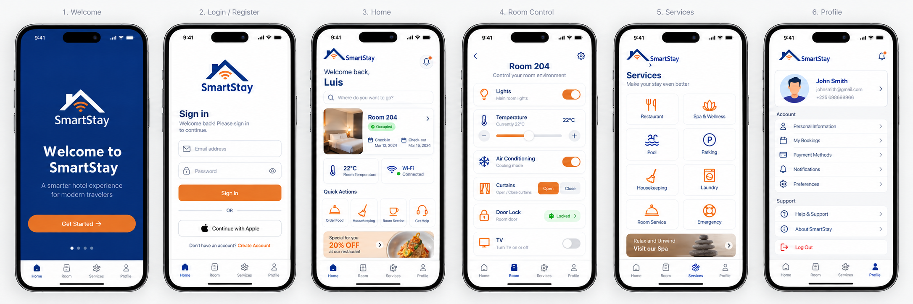

**Pendiente:** convertir este flujo en un prototipo interactivo navegable en Figma (con transiciones clicables entre pantallas) y grabar el video de navegación correspondiente (Anexo C).

## 4.6. Web Applications UX/UI Design

### 4.6.1. Web Applications Wireframes

**Wireframes – Modo Administrador**


Los wireframes del **modo Administrador** representan la primera aproximación al diseño de la interfaz de esta vista de la aplicación.  
Se han elaborado en formato blanco y negro, sin imágenes ni estilos gráficos, con el objetivo de centrarse en la estructura, navegación y jerarquía de la información que manejará el administrador.

A continuación, se presenta un resumen de cada una de las secciones principales del modo Administrador.

**1. Dashboard**

**Propósito:** Vista general del estado de la plataforma.  
**Elementos clave:**
- Panel con métricas principales (usuarios activos, reportes recientes, accesos).
- Gráficas de estadísticas generales.
- Acceso rápido a notificaciones.

**2. Guests**

**Propósito:** Control y administración de los perfiles que usan la plataforma.  
**Elementos clave:**
- Lista de usuarios con buscador y filtros.
- Botón para agregar, editar o eliminar usuarios.
- Tabla con información básica (nombre, correo, rol, estado).


**3. Staff**

**Propósito:** Definir los niveles de acceso de cada tipo de usuario.  
**Elementos clave:**
- Tabla de roles existentes.
- Información y datos del staff con el que trabaja.

**4. Hotels and rooms**  
**Propósito:** Gestión de la cadena hotelera administrada en la plataforma.  
**Elementos clave:**
- Lista de hoteles con buscador y filtros (ciudad, estado, categoría).
- Detalle del hotel seleccionado (información general, servicios, estadísticas).
- Campo para ingresar número de habitación y botón *Ver detalle*.
- Vista de detalle de habitación con estado, tipo, huésped actual, check-in/out y acciones rápidas.

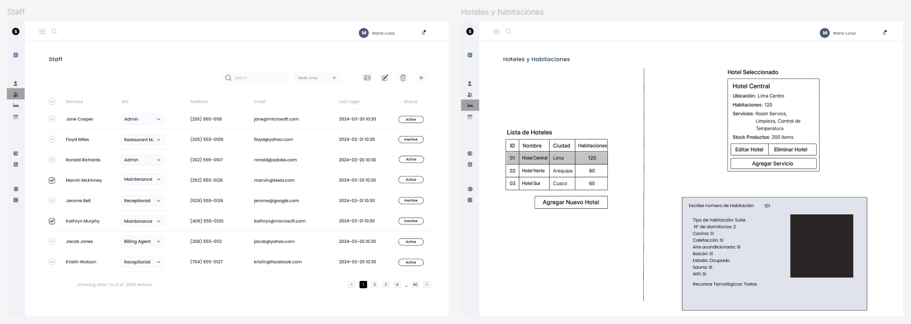

**5. Booking**

**Propósito:** Control y gestión de todas las reservas realizadas en los hoteles.  
**Elementos clave:**
- Calendario interactivo para visualizar y administrar reservas por día, semana o mes.
- Lista de reservas con buscador y filtros (hotel, fecha, estado).
- Detalle de la reserva (huésped, habitación, fechas, monto).
- Botones para modificar, confirmar o cancelar reservas.
- Indicadores de ocupación y disponibilidad directamente desde el calendario.

**6. Payments**

**Propósito:** Administración de ingresos y egresos financieros en la plataforma.  
**Elementos clave:**
- Registro de pagos recibidos de huéspedes y clientes.
- Registro de egresos: pagos a staff, proveedores y compras de stock.
- Tablas y filtros por fecha, hotel, método de pago y categoría.
- Reportes de gastos, ingresos y ganancias.
- Gráficos comparativos y dashboard financiero.


**7. Sevices and Products**

**Propósito:** Gestión integral de servicios y dispositivos tecnológicos de Smart Stay.  
**Elementos clave:**
- Tabla general con categorías: limpieza, alimentos, tecnología, amenities.
- Columnas: nombre, categoría, estado, stock, ubicación, proveedor.
- Filtros por hotel, piso, habitación y categoría.
- Vista de detalle de cada producto con historial, estado y mantenimiento.

**8. Reviews**

**Propósito:** Seguimiento de la experiencia de los huéspedes y tickets de soporte.  
**Elementos clave:**
- Lista de comentarios y calificaciones por hotel y servicio.
- Filtros por fecha, hotel, tipo de reseña o ticket.
- Vista de detalle con respuesta del staff.
- Estadísticas de satisfacción y gráficos de tendencias.
- Panel de tickets: abiertos, en proceso, cerrados.  
  

**9. Support**

**Propósito:** Gestión de los tickets creados por los hoteles y usuarios hacia Smart Stay.  
**Elementos clave:**
- Lista de tickets recibidos desde los hoteles o usuarios.
- Clasificación por prioridad (alta, media, baja) y estado (pendiente, en proceso, resuelto).
- Filtros por hotel, tipo de problema y fecha.
- Vista de detalle del ticket con historial de comunicación.
- Historial de ticket.
  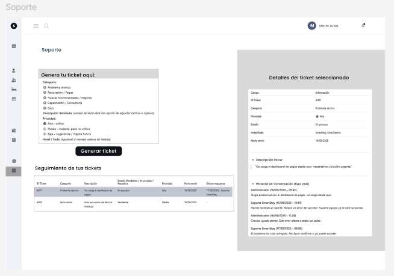

**Wireframes – Modo Huésped**

Los wireframes del modo Huésped representan la primera aproximación al diseño de la interfaz de esta vista de la aplicación huesped, el cual ellos ingresanpor un codigo qr que el hotel les brinda para de frente acceder al app huesped.  
Se han elaborado en formato blanco y negro, sin imágenes ni estilos gráficos, con el objetivo de centrarse en la estructura, navegación y jerarquía de la información que manejará el huésped.

**1. Welcome View**

- Solo es una introducción por lo que aparece el logo y un saludo.

**2. Home**
**Propósito:** Pantalla principal con acceso a las funciones más utilizadas.  
**Elementos clave:**
- Barra superior con logo y buscador.
- Banner de bienvenida.
- Acceso rápido a habitaciones, servicios y notificaciones.
- Sección de ofertas o promociones destacadas.

**3. Rooms**
**Propósito:** Explorar y seleccionar opciones de hospedaje.  
**Elementos clave:**
- Información básica (número y estado de habitación).
- Controles de ambiente: temperatura, luces, cortinas, TV, música.
- Servicios rápidos: limpieza inmediata o programada, amenities, minibar digital.
- Botón de asistencia y emergencia.  
  

**4. Services**
**Propósito:** Acceder a servicios adicionales ofrecidos por el hotel.  
**Elementos clave:**
- Categorías de servicios (gimnasio, parking, restaurante, eventos).

**5. Map**
**Propósito:** Orientar al huésped dentro del hotel y ofrecer rutas y descubrimientos locales.  
**Elementos clave:**
- Mapa interactivo del hotel con puntos de interés (piscina, gimnasio, restaurantes, lobby, salones).
- Indicación de la ubicación de la habitación del huésped y rutas internas (wayfinding) hacia cualquier punto.
- Opciones de búsqueda y filtros (por tipo de servicio, accesibilidad, horarios).

**6. Profile**
**Propósito:** Gestionar los datos del huésped.  
**Elementos clave:**
- Información personal (nombre, correo, teléfono).
- Preferencias de pago y métodos guardados.

**7. Notifications**
**Propósito:** Informar al huésped sobre novedades y recordatorios.  
**Elementos clave:**
- Lista de notificaciones recientes (confirmaciones de reserva, promociones, mensajes del hotel).
- Botón para marcar como leídas o eliminar notificaciones.  
  

**Wireframes – Modo Staff**

Los wireframes del modo Staff representan la primera aproximación al diseño de la interfaz de esta vista de la aplicación.  
Se han elaborado en formato blanco y negro, sin imágenes ni estilos gráficos, con el objetivo de centrarse en la estructura, navegación y jerarquía de la información que manejará el personal del hotel.

**1. Introduction**
**Propósito:** Pantalla inicial de bienvenida y presentación de la app Staff.  
**Elementos clave:**
- Logo.
- Breve mensaje de bienvenida.

**2. Login**
**Propósito:** Autenticar al personal del hotel para acceder a la app.  
**Elementos clave:**
- Campos de correo electrónico y contraseña.
- Botón de Iniciar Sesión.
- Opción de Recuperar contraseña.

**3. Home / Dashboard**
**Propósito:** Pantalla principal con resumen de tareas y registro de horas.  
**Elementos clave:**
- Registro de horas: botones para marcar Entrada, Receso y Salida.
- Tabla de historial diario de horas trabajadas.
- Lista resumida de tareas del día con estado (pendiente/completado).

**4. Tasks**
**Propósito:** Gestionar todas las tareas asignadas al staff.  
**Elementos clave:**
- Lista completa de tareas diarias con habitación, tipo de tarea, piso.
- Estado de tarea con emoticonos: ✅ Completado / ❌ Pendiente.     
  

**5. Services / Products**
**Propósito:** Registrar entrega de servicios y productos a habitaciones.  
**Elementos clave:**
- Lista de servicios/productos por entregar (Room Service, Mini Bar, Amenities, etc.).
- Cantidad y habitación correspondiente.
- Estado de entrega con emoticonos: ✅ Entregado / ❌ Pendiente.

**6. Booking**
**Propósito:** Consultar y gestionar reservas asignadas al staff.  
**Elementos clave:**
- Sección de búsqueda de cliente.
- Lista de reservas con habitación, huésped, fecha, estado de check-in/check-out.
- Semáforo de estados: 🔴 Pendiente / 🟢 Completado.

**7. Profile**
**Propósito:** Gestionar la información personal del staff y las preferencias de la app.  
**Elementos clave:**
- Foto y datos personales (nombre, correo, teléfono).
- Cambiar contraseña, editar y cerrar sesión.

**8. Notifications**
**Propósito:** Informar al staff sobre novedades, cambios de tareas o alertas importantes.  
**Elementos clave:**
- Lista de notificaciones recientes (cambios de turno, emergencias, avisos de tareas).
- Botón para marcar como leído o eliminar notificaciones.  
  .

### 4.6.2. Web Applications Wireflow Diagrams

**Web Applications Wireflow Diagrams – Modo Administrador**

**Propósito:**  
Mostrar cómo cada sección del administrador se conecta a través del menú principal.


**Menú Principal (Administrador)**

Desde cualquier sección, el menú permite acceder a:

1.**Intro** - Pantalla de inicio a app Adminstrator luego de iniciar sesión.
2. **Dashboard** – Resumen general de actividad, métricas y gráficos.
3. **Guests** – Gestión de perfiles de usuarios; agregar, editar o eliminar.
4. **Staff** – Gestión del personal; roles, turnos y contacto.
5. **Hotels / Rooms** – Administración de hoteles, habitaciones y disponibilidad.
6. **Booking** – Calendario de reservas; agregar, modificar o cancelar reservas.
7. **Payments** – Visualización y gestión de transacciones y estados de pago.
8. **Services / Productos** – Gestión de servicios del hotel y productos adicionales.
9. **Reviews** – Panel de comentarios de huéspedes con gráficos de satisfacción.
10. **Support / Tickets** – Crear tickets de ayuda y consultar su estado.

**Flujo General (Wireflow)**

- **Dashboard**: centro de información y acceso rápido a secciones principales por botones. En los gráficos de ganancia y pérdidas el botón "See Reviews" te deriva **Reviews** y en los gráficos porcentual de habitaciones ocupadas el botón "check Booking" te deriva a **Booking**.
- **Menú Bar**: conecta directamente a las 9 secciones.
- Secciones interrelacionadas:
    - **Staff, Guests, Hotels** se conecta con **Reviews** ya que allí se derivan los comentarios sobre el staff huésped y el hotel.
    - **Booking** se relaciona con **Guests** para ver los clientes de cada reserva hecha.

**Web Applications Wireflow Diagrams – Modo Huésped**

**Propósito:**  
Mostrar cómo cada sección de la app para huéspedes se conecta a través del menú principal y elementos persistentes (como el icono de notificaciones).


**Secciones Principales**

1. **Intro** – Pantalla inicial, solo se conecta a **Home**.
2. **Home** – Vista principal; acceso a todas las secciones mediante el menú.
3. **Rooms** – Detalles de la habitación asignada o disponible; acceso desde el menú.
4. **Services** – Servicios del hotel disponibles para el huésped; acceso desde el menú.
5. **Map** – Ubicación del hotel, puntos de interés; acceso desde el menú.
6. **Profile** – Datos del huésped, preferencias y configuración; acceso desde el menú.
7. **Notifications** – Alertas y mensajes importantes; acceso mediante un icono persistente arriba, visible desde todas las secciones.

**Flujo General (Wireflow)**

- **Intro** → **Home**
- **Home** → conecta a **Rooms**, **Services**, **Map**, **Profile** mediante el menú principal.
- **Notifications** → accesibles desde cualquier sección a través del icono superior.

**Web Applications Wireflow Diagrams – Modo Staff**

**Propósito:**  
Mostrar cómo cada sección de la app para staff se conecta a través del menú principal y elementos persistentes (como el icono de notificaciones).


**Secciones Principales**

1. **Intro** – Pantalla inicial, conecta al **Login**.
2. **Login** – Pantalla de acceso; una vez autenticado, va a **Home**. Para ellos siempre es necesario que hagan login por el uso continuo del app a diferencia del huésped que solo tienen acceso durante su estadía.
3. **Home** – Vista principal; acceso a todas las secciones mediante el menú.
4. **Tasks** – Lista y gestión de tareas asignadas; acceso desde el menú.
5. **Services** – Gestión de servicios ofrecidos por el staff; acceso desde el menú.
6. **Booking** – Visualización de reservas relacionadas con el staff; acceso desde el menú.
7. **Profile** – Datos del staff y configuración personal; acceso desde el menú.
8. **Notifications** – Alertas y mensajes importantes; accesibles mediante un icono persistente que aparece en todas las secciones.

**Flujo General (Wireflow)**

- **Intro** → **Login** → **Home**
- Desde **Home** se puede acceder mediante el menú a: **Tasks**, **Services**, **Booking**, **Profile**
- **Notifications** → accesibles desde cualquier sección a través del icono superior.

### 4.6.3. Web Applications Mock-ups

**Mockups – Modo Administrador**

Los mockups muestran la interfaz final del administrador de SmartStay, incluyendo **colores, tipografía, iconos, imágenes y logos**, reflejando la identidad visual de la plataforma.

**1. Dashboard**
- Paleta de colores corporativa aplicada a gráficos y métricas.
- Gráficos circulares y de barras con animaciones.
- Iconos para alertas, reservas y notificaciones.
- Ilustraciones o imágenes para resaltar métricas clave.

**2. Huéspedes**
- Tarjetas visuales para cada huésped con foto, nombre y estado.
- Botones coloreados según función (agregar: verde, eliminar: rojo).
- Filtros y buscador estilizados con iconos.

**3. Staff**
- Tabla con fotos de perfil, roles y horarios.
- Indicadores de estado con colores o iconos.
- Botones consistentes con la paleta de SmartStay.

**4. Hoteles**
- Cards con imagen del hotel o miniaturas.
- Indicadores visuales de ocupación y disponibilidad.
- Botones de acción con efectos hover.

**5. Reservas**
- Calendario visual con colores según estado (confirmada, pendiente, cancelada).
- Tarjetas de reserva con foto del huésped y detalles.
- Botones destacados para aprobar, modificar o cancelar.

**6. Pagos**
- Tabla con iconos de métodos de pago (tarjeta, Yape, Plin).
- Resaltado de pagos pendientes con color.
- Botones para generar facturas con efectos visuales.

**7. Servicios y Productos**
- Cards o listas con imágenes de productos y servicios.
- Indicadores de disponibilidad con colores y símbolos.
- Botones con iconos para editar, eliminar o agregar.

**8. Reseñas**
- Panel con estrellas de puntuación y colores según valoración.
- Tarjetas de comentarios con avatar del huésped y fecha.
- Gráficos visuales de satisfacción general.

**9. Soporte**
- Tabla de tickets con colores según estado (pendiente, en proceso, finalizado).
- Formulario visual con iconos y campos destacados.
- Botones de acción consistentes con la paleta.

**Elementos generales**
- Logo de SmartStay visible en header o menú lateral.
- Paleta de colores corporativa aplicada a fondos, botones y textos.
- Tipografía uniforme que diferencia títulos, subtítulos y contenido.
- Iconografía consistente para acciones, estados y navegación.
- Feedback visual en botones e interacciones (hover, clic, activo).

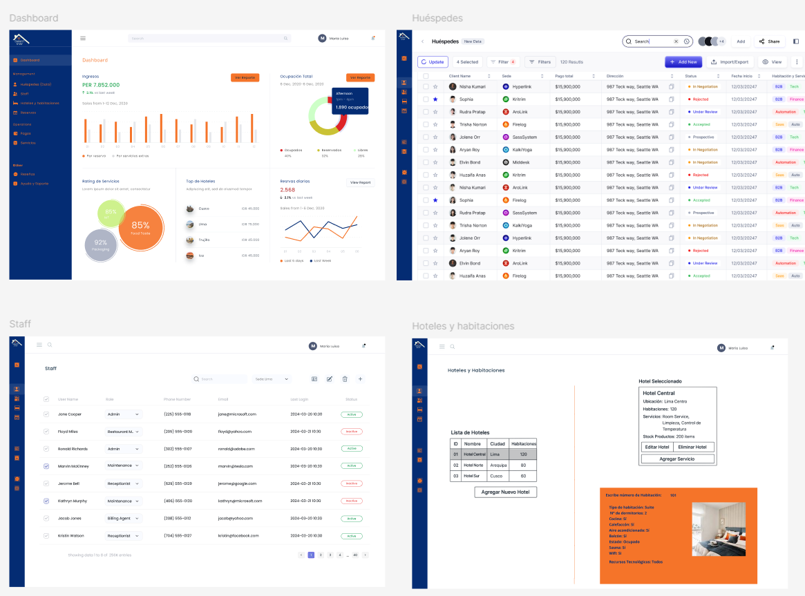

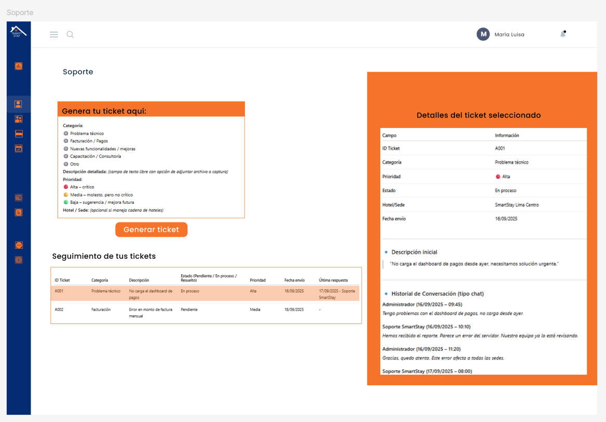

**Mockups – Modo Huésped**

Los mockups muestran la interfaz final del usuario huésped en SmartStay, incluyendo **colores, tipografía, iconos, imágenes y logos**, reflejando la identidad visual y la experiencia de usuario.

**1. Introducción**
- Pantalla de bienvenida con **logo y colores corporativos**.
- **Imágenes o ilustraciones atractivas** para la experiencia inicial.
- Botón destacado para comenzar y acceder a Home.

**2. Home**
- Panel con **resumen de reservas y notificaciones recientes**.
- Cards visuales para acceder a habitaciones, servicios y mapa.
- **Botones e iconos claros** para navegación rápida.

**3. Habitación**
- Tarjetas con fotos de la habitación y detalles (tipo, servicios incluidos, disponibilidad).
- Indicadores visuales de estado de limpieza o check-in/check-out.
- Botones para solicitar servicio o hacer reservas adicionales.

**4. Servicios**
- Lista o cards de servicios disponibles (spa, lavandería, comida, etc.) con imágenes.
- Indicadores de disponibilidad y precios.
- Botones para solicitar o reservar servicios fácilmente.

**5. Mapa**
- Mapa interactivo con **ubicación del hotel, habitaciones y servicios cercanos**.
- Iconos para puntos de interés y rutas dentro del hotel.
- Colores y estilo consistente con la identidad visual.


**6. Perfil**
- Información personal del huésped con **foto y datos básicos**.
- Botones para editar información o preferencias.
- Indicadores de estado de membresía o historial de reservas.

**7. Notificaciones**
- Lista de notificaciones recientes con **iconos y colores según tipo** (alerta, mensaje, promoción).
- Botones para marcar como leído o eliminar.
- Diseño consistente con la paleta y tipografía de la app.

**Elementos generales**
- Logo de SmartStay visible en header o menú.
- Paleta de colores corporativa aplicada a fondos, botones y textos.
- Tipografía uniforme que diferencia títulos, subtítulos y contenido.
- Iconografía consistente para acciones, estados y navegación.
- Feedback visual en botones e interacciones (hover, clic, activo).


**Mockups – Modo Staff**

Los mockups muestran la interfaz final del personal de SmartStay, incluyendo **colores, tipografía, iconos, imágenes y logos**, reflejando la identidad visual y la experiencia de usuario para el staff.

**1. Introducción**
- Pantalla de bienvenida con **logo y colores corporativos**.
- **Ilustraciones o imágenes** que reflejan la experiencia inicial.
- Botón destacado para avanzar al login.

**2. Login**
- Formulario con **campos destacados** para correo y contraseña.
- Botón principal con **color corporativo** para iniciar sesión.
- Iconos de seguridad y feedback visual al ingresar datos incorrectos.

**3. Home**
- Panel con **resumen de tareas, reservas y notificaciones recientes**.
- Cards visuales para acceder a tareas, servicios, reservas y perfil.
- Botones e iconos claros para navegación rápida.

**4. Tareas**
- Lista o cards de tareas asignadas con **estado visual** (pendiente, en proceso, finalizado).
- Botones para marcar tareas completadas o reasignar.
- Indicadores de prioridad con colores y símbolos.

**5. Servicios**
- Lista de servicios a realizar o supervisar, con **imágenes o iconos representativos**.
- Indicadores de estado y disponibilidad.
- Botones para actualizar estado o registrar finalización.

**6. Reservas**
- Calendario visual mostrando reservas asignadas al staff.
- Tarjetas de reserva con detalles resumidos y foto del huésped.
- Botones para confirmar asistencia o marcar tareas relacionadas a la reserva.

**7. Perfil**
- Información personal del staff con **foto, rol y datos de contacto**.
- Botones para editar información y configurar preferencias.
- Indicadores de estado activo/inactivo.

**8. Notificaciones**
- Lista de notificaciones recientes con **iconos y colores según tipo** (alerta, mensaje, aviso).
- Botones para marcar como leído o eliminar.
- Diseño consistente con la paleta y tipografía de la app.

**Elementos generales**
- Logo de SmartStay visible en header o menú.
- Paleta de colores corporativa aplicada a fondos, botones y textos.
- Tipografía uniforme que diferencia títulos, subtítulos y contenido.
- Iconografía consistente para acciones, estados y navegación.
- Feedback visual en botones e interacciones (hover, clic, activo).


### 4.6.4. Web Applications User Flow Diagrams

**Rol 1:** Administrador del hotel

**Objetivo:** Gestionar todas las áreas del hotel de manera eficiente desde un panel centralizado, incluyendo huéspedes, staff, reservas, pagos, servicios, reseñas y soporte.

**Cómo ayuda el diagrama:** Permite identificar los pasos necesarios para realizar tareas frecuentes y optimizar la navegación para máxima eficiencia.

**Happy Paths:**

**Link para visualizar mejor:** [https://shorturl.at/7UPcY](https://lucid.app/lucidchart/dc345c68-b9ba-4b68-ba59-d33a107cd547/edit?viewport_loc=-2020%2C-505%2C6554%2C2712%2C0_0&invitationId=inv_f306e465-ed6b-4d99-9d15-d416cfe5ca03)

**Unhappy Paths:**

**Link para visualizar mejor:** [https://shorturl.at/7UPcY](https://lucid.app/lucidchart/5b49d2f9-1e2c-495a-bb48-a86af3f68d15/edit?viewport_loc=-805%2C345%2C3936%2C1628%2C0_0&invitationId=inv_3de7ece2-dc86-4690-95d5-4ab9db028e9a)

**Rol 2:** Huésped del hotel

**Objetivo:** Permitir al huésped consultar y gestionar su estadía, incluyendo habitaciones, servicios, mapa, perfil y notificaciones.
**Cómo ayuda el diagrama:** Visualiza los pasos más rápidos e intuitivos para que el huésped acceda a la información que necesita y realice solicitudes con facilidad.

**Happy Paths:**

**Link para visualizar mejor:** [https://shorturl.at/7UPcY](https://lucid.app/lucidchart/7b89dd53-b257-4f78-97e3-1b599d6b85e5/edit?viewport_loc=-1918%2C-477%2C5700%2C2358%2C0_0&invitationId=inv_9502d876-be63-41c8-acb4-1d8e2ca1de0d)

**Unhappy Paths:**

**Link para visualizar mejor:** [https://shorturl.at/7UPcY](https://lucid.app/lucidchart/18fbfec8-9c89-4794-8f4b-a9242e4db649/edit?viewport_loc=-930%2C-4%2C3511%2C1453%2C0_0&invitationId=inv_bbc495e4-6bb4-418f-a0ac-65c431096cd6)


**Rol 3:** Personal del hotel (staff)

**Objetivo:** Permitir al staff gestionar tareas, servicios, reservas y comunicaciones con eficiencia.
**Cómo ayuda el diagrama:** Identifica pasos clave para que el personal cumpla sus responsabilidades sin confusión y con mínima navegación.

**Happy Paths:**

**Link para visualizar mejor:** [https://shorturl.at/7UPcY](https://lucid.app/lucidchart/9f2ebd7e-4046-4322-967e-5ebba51fb97c/edit?viewport_loc=-1647%2C-458%2C3981%2C1647%2C0_0&invitationId=inv_fdadb516-80a9-47ea-bb85-0561af5c0704)

**Unhappy Paths:**

**Link para visualizar mejor:** [https://shorturl.at/7UPcY](https://lucid.app/lucidchart/543c4cad-5bce-40bc-bc29-8a1f2a604a63/edit?viewport_loc=-2062%2C-511%2C5080%2C2102%2C0_0&invitationId=inv_8e3a4604-fe5c-4655-addc-5f16e8fb91d4)

## 4.7. Web Applications Prototyping

El prototipo permite simular la navegación entre todas las secciones principales mediante **carga dinámica de contenido**, mostrando cómo el administrador se moverá a través de los caminos definidos en los **User Flow Diagrams**, asegurando fluidez y coherencia en la experiencia de usuario.
En este caso presentaremos el prototipo del app principal que es del modo administrador:
[https://shorturl.at/7UPcY](https://www.figma.com/proto/RqI67mkRZ1AwuQNTcuGBvA/Sin-t%C3%ADtulo?node-id=48-3793&p=f&t=4u5X36WGvtb7jWe4-1&scaling=min-zoom&content-scaling=fixed&page-id=0%3A1)

**Recorrido documentado del prototipo:** el administrador ingresa por el **Login**, aterriza en el **Dashboard** con el resumen de reservas y ocupación, navega hacia **Hoteles y Habitaciones** para gestionar el inventario, hacia **Reservas y Pagos** para revisar transacciones, hacia **Servicios/Productos y Reseñas** para administrar el catálogo y feedback de huéspedes, y hacia **Soporte** para atender incidencias del staff. Cada transición reutiliza los componentes definidos en los wireframes y mock-ups de la sección 4.6, manteniendo consistencia visual entre pantallas.

**Pendiente:** grabar y publicar el video de navegación del prototipo web (Anexo C); el recorrido descrito arriba sirve de guion base para esa grabación.

## 4.8. Domain-Driven Software Architecture

**Design-Level EventStorming**


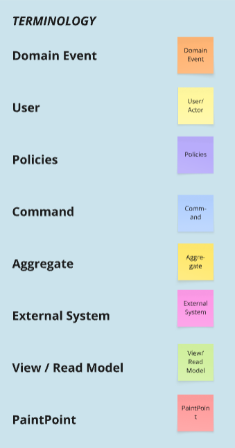

**Step 1: Unstructured Exploration:**


**Step 2: Timelines:**

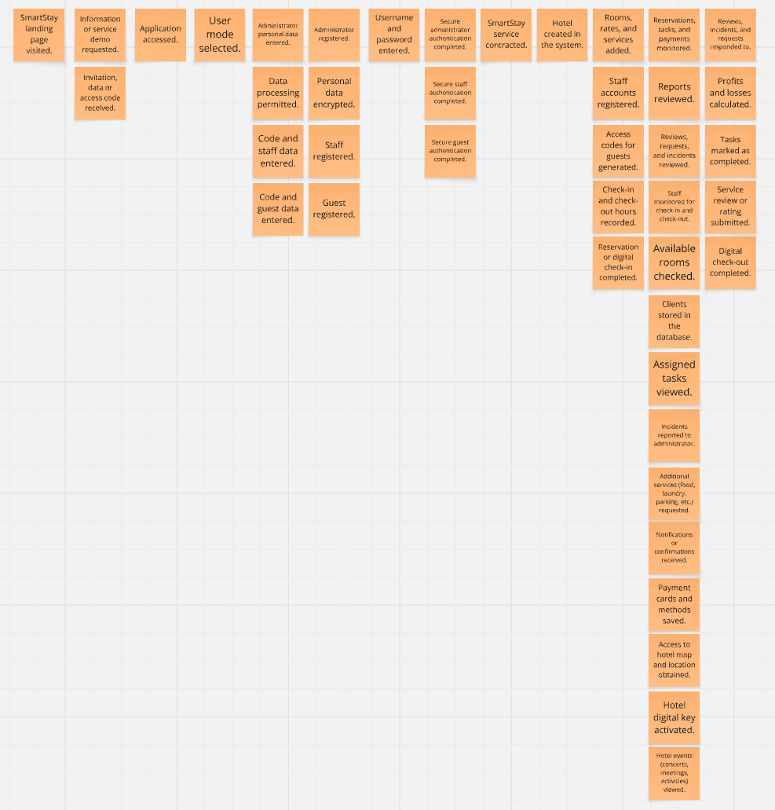

**Step 3: Paint Points:**

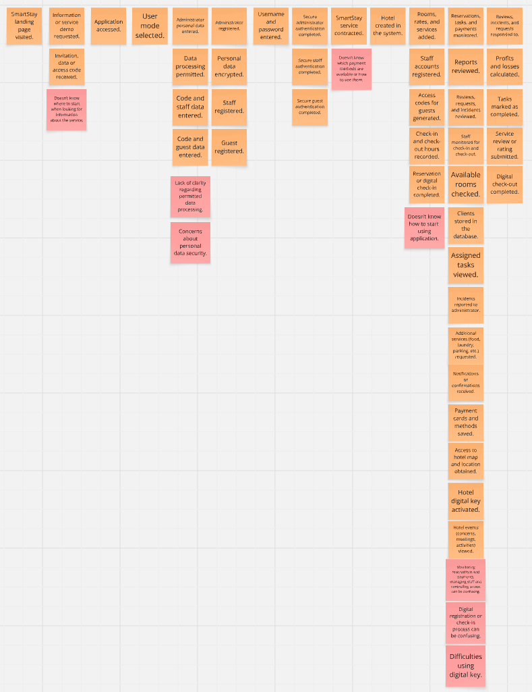

**Step 4: Pivotal Points:**

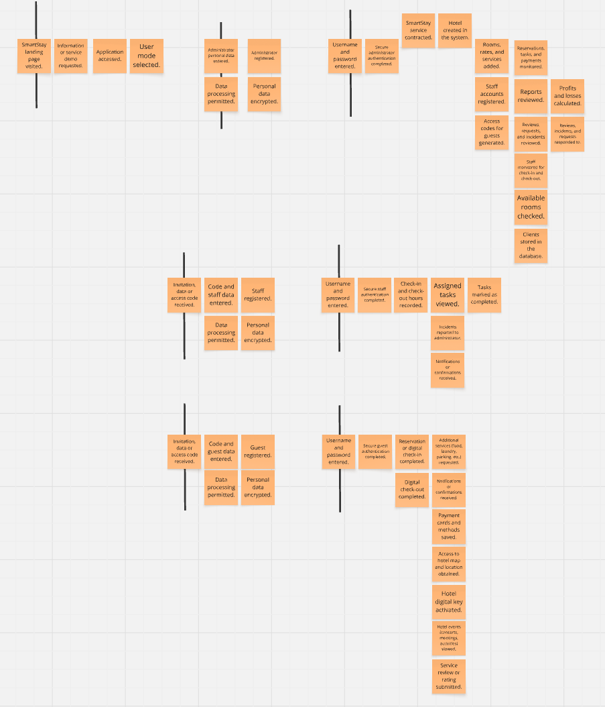

**Step 5: Commands:**


**Step 6: Policies:**


**Step 7: Read models:**

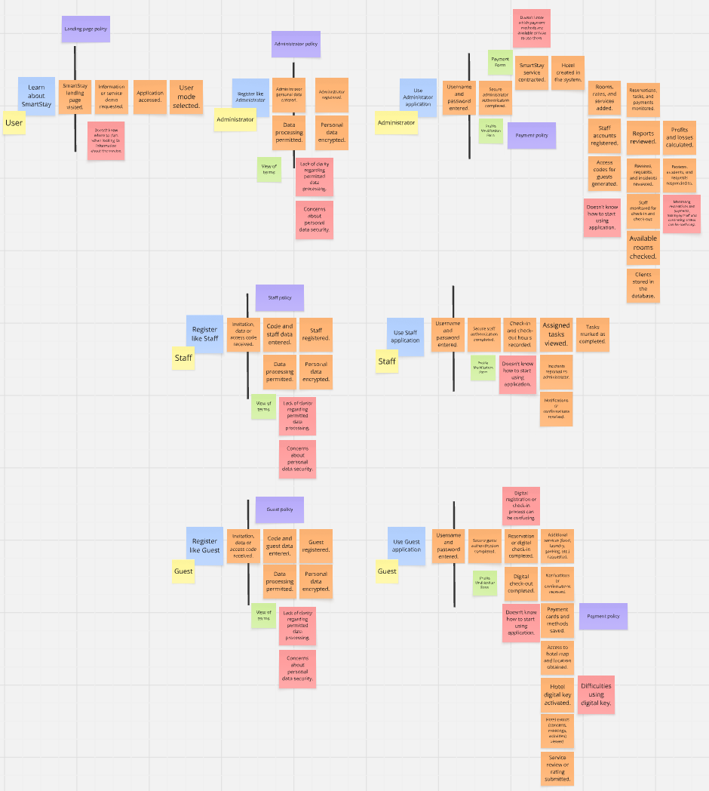

**Step 8: External Systems:**


**Step 9: Aggregates:**


**Step 10: Bounded Contexts:**

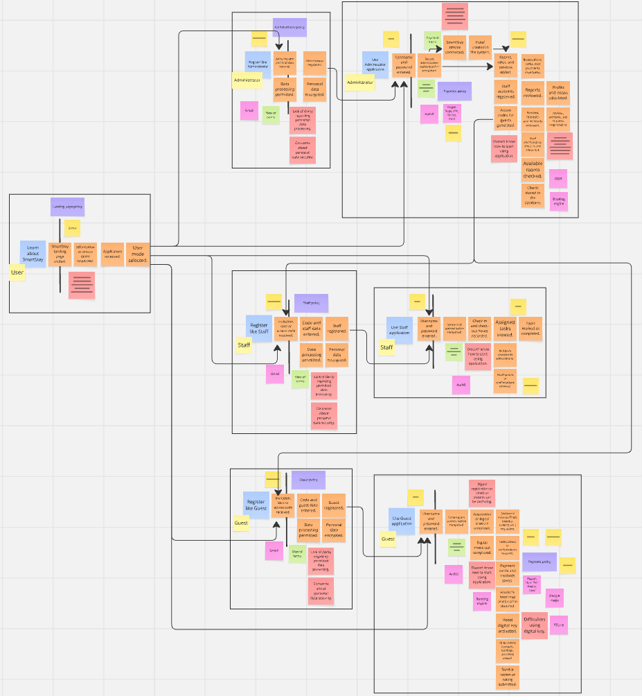

**Link para visualizar mejor:** [https://shorturl.at/7UPcY](https://miro.com/app/board/uXjVJ9iB8iU=/?share_link_id=650007847940)

### 4.8.1. Software Architecture Context Diagram


### 4.8.2. Software Architecture Container Diagrams


### 4.8.3. Software Architecture Components Diagrams

**Api Components**


**IoT Gateway Components**


## 4.9. Software Object-Oriented Design

### 4.9.1. Class Diagrams


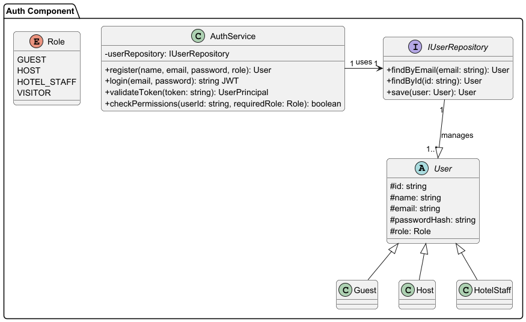

Este diagrama detalla las clases responsables de la gestión de la identidad y el acceso en el sistema. Incluye la jerarquía de User con sus roles especializados (Guest, Host, HotelStaff), el AuthService que contiene la lógica de negocio para el registro y la autenticación, y la interfaz IUserRepository para la persistencia de datos de usuario.

Diagrama de Clases: Componente de Gestión de Propiedades y Operaciones


Este diagrama muestra el diseño de clases para la gestión del inventario y las operaciones del hotel. Incluye las entidades Property y Room, que representan los activos físicos, y el PropertyService que maneja su estado y disponibilidad. Es importante destacar que este componente también actúa como el origen de los comandos de IoT, utilizando la interfaz IIoTCommandPublisher para iniciar acciones en el mundo físico.

Diagrama de Clases: Componente de Gestión de Reservas


Este diagrama presenta el diseño de clases para el componente central de reservas. Muestra las entidades de dominio Booking y Review, y el BookingService que actúa como orquestador. Este servicio interactúa con otros componentes a través de adaptadores (IPropertyServiceAdapter, IBillingServiceAdapter) para verificar disponibilidad y procesar pagos, gestionando así el flujo completo de una reserva.

Diagrama de Clases: Componente de Facturación


Este diagrama ilustra la estructura interna del componente de facturación. Se definen las entidades Payment e Invoice, el servicio BillingService que orquesta el proceso de pago, y los adaptadores (IPaymentGatewayAdapter, IAuthServiceAdapter) que se comunican con sistemas externos y otros componentes internos para garantizar transacciones seguras y autorizadas.

Diagrama de Clases: Componente Gateway IoT


Este diagrama detalla la arquitectura interna del componente técnico Gateway IoT. Su diseño se basa en un flujo de procesamiento de mensajes para desacoplar la lógica de negocio del hardware: un MessageListener recibe órdenes, un RulesEngine las interpreta, IDeviceController las especializa, y un ICloudApiClient se comunica con la plataforma externa del fabricante. Este patrón abstrae la complejidad de la integración con dispositivos físicos.

**Diagrama de clases — export físico (aplicación móvil):**


### 4.9.2. Class Dictionary

A continuación se documentan las clases principales de cada componente del diseño orientado a objetos (sección 4.9.1), detallando su tipo, atributos/operaciones clave y responsabilidad dentro del sistema.

**Componente de Autenticación (Auth)**

| Clase | Tipo | Atributos / Operaciones principales | Responsabilidad |
| :--- | :--- | :--- | :--- |
| `User` | Clase base (abstracta) | `id`, `name`, `email`, `passwordHash`, `role` | Representa la identidad común de cualquier usuario del sistema y expone el contrato de autenticación. |
| `Guest` | Subclase de `User` | Hereda de `User` | Especializa al usuario huésped, habilitando reservas y reseñas. |
| `Host` | Subclase de `User` | Hereda de `User` | Especializa al usuario propietario/anfitrión, habilitando la gestión de propiedades. |
| `HotelStaff` | Subclase de `User` | Hereda de `User` | Especializa al usuario staff operativo, habilitando la gestión de tareas del hotel. |
| `AuthService` | Servicio de dominio | `register()`, `login()`, `validateToken()` | Contiene la lógica de negocio para registro, autenticación y validación de sesión. |
| `IUserRepository` | Interfaz | `findById()`, `findByEmail()`, `save()` | Abstrae la persistencia de usuarios, desacoplando `AuthService` del motor de base de datos. |

**Componente de Propiedades y Operaciones (Property)**

| Clase | Tipo | Atributos / Operaciones principales | Responsabilidad |
| :--- | :--- | :--- | :--- |
| `Property` | Entidad | `id`, `hostId`, `name`, `location` | Representa el hotel/propiedad registrado por un anfitrión. |
| `Room` | Entidad | `id`, `propertyId`, `roomNumber`, `type`, `status` | Representa una habitación del inventario y su disponibilidad. |
| `PropertyService` | Servicio de dominio | `updateAvailability()`, `assignRoom()` | Gestiona el estado e inventario de propiedades y habitaciones. |
| `IIoTCommandPublisher` | Interfaz | `publishCommand()` | Permite que el componente de propiedades emita comandos hacia el Gateway IoT. |

**Componente de Reservas (Booking)**

| Clase | Tipo | Atributos / Operaciones principales | Responsabilidad |
| :--- | :--- | :--- | :--- |
| `Booking` | Entidad | `id`, `guestId`, `propertyId`, `checkInDate`, `checkOutDate`, `status` | Representa una reserva realizada por un huésped. |
| `Review` | Entidad | `id`, `bookingId`, `rating`, `comment` | Representa la calificación y comentario dejados tras una estadía. |
| `BookingService` | Orquestador | `createBooking()`, `cancelBooking()` | Coordina la creación/cancelación de reservas validando disponibilidad y pago. |
| `IPropertyServiceAdapter` | Interfaz (adaptador) | `checkAvailability()` | Consulta disponibilidad de habitaciones en el componente Property. |
| `IBillingServiceAdapter` | Interfaz (adaptador) | `requestPayment()` | Solicita el procesamiento de pago al componente Billing. |

**Componente de Facturación (Billing)**

| Clase | Tipo | Atributos / Operaciones principales | Responsabilidad |
| :--- | :--- | :--- | :--- |
| `Payment` | Entidad | `id`, `bookingId`, `amount`, `status` | Representa un cobro asociado a una reserva. |
| `Invoice` | Entidad | `id`, `paymentId` | Representa el comprobante generado tras un pago exitoso. |
| `BillingService` | Orquestador | `processPayment()`, `generateInvoice()` | Orquesta el ciclo de pago y emisión de comprobantes. |
| `IPaymentGatewayAdapter` | Interfaz (adaptador) | `charge()` | Se comunica con la pasarela de pagos externa. |
| `IAuthServiceAdapter` | Interfaz (adaptador) | `verifyUser()` | Valida la identidad del usuario antes de autorizar el cobro. |

**Componente Gateway IoT**

| Clase | Tipo | Atributos / Operaciones principales | Responsabilidad |
| :--- | :--- | :--- | :--- |
| `MessageListener` | Componente técnico | `onMessage()` | Recibe las órdenes/eventos entrantes desde los dispositivos o servicios. |
| `RulesEngine` | Componente técnico | `evaluate()` | Interpreta las órdenes recibidas y determina la acción a ejecutar. |
| `IDeviceController` | Interfaz | `execute()` | Especializa la ejecución de la orden según el tipo de dispositivo IoT. |
| `ICloudApiClient` | Interfaz | `sendToCloud()` | Comunica el Gateway con la plataforma en la nube del fabricante del dispositivo. |

## 4.10. Database Design

### 4.10.1. Relational/Non-Relational Database Diagram

Las decisiones clave tomadas, basadas directamente en nuestros diagramas de clases:

Traducción de Clases a Tablas: Cada clase de entidad (aquellas que guardan datos, como User, Property, Booking) se convierte en una tabla. Las clases de servicio e interfaces (AuthService, IUserRepository, etc.) no se convierten en tablas porque representan comportamiento, no datos.

Componentes sin Persistencia: Los componentes puramente técnicos como el Gateway IoT (MessageListener, RulesEngine, etc.) manejan datos en tránsito (mensajes, comandos) y no requieren persistencia en la base de datos relacional. Por lo tanto, no tienen tablas asociadas.

Nomenclatura: Se utiliza snake_case (ej: check_in_date) para nombres de tablas y columnas, una convención estándar en bases de datos.

Manejo de Herencia: La jerarquía de User se implementa con la estrategia "Tabla por Subclase" para máxima claridad y normalización.

Tipos de Datos ENUM: Los diferentes estados (BookingStatus, RoomStatus, etc.) se definen como tipos ENUM para garantizar la integridad de los datos.

Relaciones: Todas las asociaciones y composiciones en los diagramas de clases se implementan usando claves foráneas (FOREIGN KEY) con sus respectivas restricciones de multiplicidad (ej: UNIQUE para relaciones uno a uno).

#### Database Diagrams

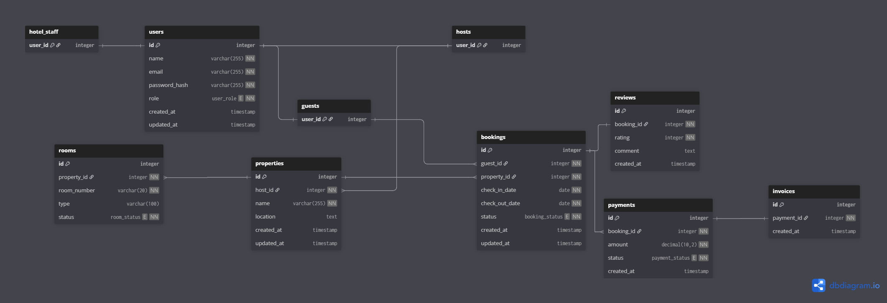

El diagrama muestra las 10 entidades resultantes del mapeo: `users` como tabla base de la jerarquía de roles (`hotel_staff`, `hosts`, `guests`), `properties` y `rooms` para el inventario del hotel, `bookings` como tabla central de reservas, `payments` e `invoices` para el ciclo de facturación, y `reviews` para las calificaciones de huéspedes. Las relaciones reflejan las multiplicidades definidas en los diagramas de clases del apartado 4.9.

---

<div style="page-break-after: always;"></div>

# Capítulo V: Product Implementation

## 5.1. Software Configuration Management

### 5.1.1. Software Development Environment Configuration

### Project Management
Para la gestión del proyecto se emplearon diversas herramientas de comunicación, planificación y control de versiones. Se creó una organización en GitHub para centralizar el repositorio del código fuente y coordinar el trabajo colaborativo del equipo. La comunicación interna se realizó mediante Discord y WhatsApp, mientras que la planificación ágil de tareas se gestionó a través de Trello.

- **Organización del trabajo:** GitHub
- **Reuniones:** Discord
- **Comunicación:** WhatsApp
- **Planificación y asignación de tareas:** Trello
- **Control de versiones:** Git con GitFlow workflow
- **Gestión de Product Backlog y Sprint Backlog:** Trello

**Enlaces**  
-**GitHub:** [GitHub](https://github.com/)  
-**Discord:** [Discord](https://discord.com/)  
-**Trello:** [Trello](https://trello.com/)

### Herramienta de soporte a Agile Development - Trello

**Trello** se utiliza como la herramienta principal para la gestión ágil del proyecto, soportando la metodología Scrum mediante tableros Kanban personalizados.

**Configuración del tablero Trello para Smart Stay:**

**Estructura de listas (columnas):**
1. **Product Backlog:** User Stories priorizadas pendientes de asignación
2. **Sprint Backlog:** User Stories seleccionadas para el Sprint actual
3. **To Do:** Engineering Tasks listas para comenzar
4. **In Process:** Tasks en desarrollo activo
5. **To Review:** Tasks completadas pendientes de revisión
6. **Done:** Tasks completadas y revisadas

**Elementos de las tarjetas (cards):**
- **Título:** Identificador de la User Story o Engineering Task (ej: US-24, UT-01)
- **Descripción:** Detalle completo de la funcionalidad o tarea
- **Labels (etiquetas):**
  - `Frontend` - Tareas de desarrollo frontend
  - `Backend` - Tareas de desarrollo backend
  - `Documentation` - Tareas de documentación
  - `Bug` - Correcciones de errores
  - `Enhancement` - Mejoras de funcionalidades existentes
  - `High Priority` - Tareas de alta prioridad
- **Miembros asignados:** Responsables de la tarea
- **Checklist:** Subtareas o criterios de aceptación
- **Estimación:** Horas estimadas (4-8 horas por Engineering Task)
- **Due date:** Fecha límite de entrega
- **Attachments:** Mockups, diagramas, enlaces relacionados

**Workflow de gestión:**

1. **Sprint Planning:**
   - Se mueven User Stories del Product Backlog al Sprint Backlog
   - Se descomponen en Engineering Tasks específicas
   - Se asignan responsables y se estiman en horas (4-8 horas máximo)

2. **Daily Development:**
   - Los miembros mueven sus tasks de To Do → In Process al comenzar
   - Actualizan el progreso mediante comentarios
   - Marcan subtareas completadas en checklists

3. **Code Review:**
   - Al completar, se mueve a To Review
   - Otro miembro del equipo revisa y valida
   - Si aprueba, se mueve a Done
   - Si requiere cambios, regresa a In Process

4. **Sprint Review:**
   - Se verifica que todas las tasks del Sprint estén en Done
   - Se documenta el resultado del Sprint
   - Se prepara el siguiente Sprint Backlog

**Integración con GitHub:**
- Enlaces en tarjetas Trello hacia Pull Requests relacionados
- Referencia de números de issue en descripciones
- Sincronización manual de estados entre Trello y GitHub Projects

**Métricas de seguimiento:**
- **Burndown chart:** Seguimiento manual del progreso del Sprint
- **Velocity:** Calculado al finalizar cada Sprint
- **Task completion rate:** Porcentaje de tasks completadas vs planificadas

**Evidencia de uso:**

*Tablero Trello del Sprint 1 mostrando la organización de tareas*


*Tablero Trello del Sprint 2 con Engineering Tasks en progreso*


### Requirement Management
Para la fase de levantamiento y priorización de requisitos, se implementaron herramientas que facilitaron la recolección, análisis y documentación de información. Trello fue empleado para la gestión visual de tareas mediante tableros personalizados.  
Además, se utilizó **UXPressia** para el desarrollo de *User Personas*, *Empathy Maps*, *Journey Maps* y *Lean UX Canvas*, mientras que **Miro** sirvió para construir los escenarios *As-Is* y *To-Be* de los procesos del sistema.

**Enlaces**  
-**Trello:** [Trello](https://trello.com/)  
-**UXPressia:** [UXPressia](https://uxpressia.com/)  
-**Miro:** [Miro](https://miro.com/es/)


### Product UX/UI Design
Durante el diseño de la experiencia e interfaz de usuario, el equipo utilizó **Figma** para crear *wireframes*, *mockups* y *prototipos interactivos*, lo cual permitió validar las propuestas de diseño antes de su implementación final.  
Asimismo, se aplicaron principios de usabilidad y diseño centrado en el usuario para garantizar una navegación fluida y consistente.

**Enlaces**  
-**Figma:** [Figma](https://www.figma.com/)


### Software Development
Para el desarrollo de la aplicación se utilizaron distintas herramientas y entornos de programación enfocados en el desarrollo backend y móvil.  

El backend fue implementado con **ASP.NET Core (C#)** empleando el IDE **JetBrains Rider**, permitiendo gestionar la lógica de negocio y los servicios del sistema mediante APIs REST.  

Por otro lado, el desarrollo móvil se realizó utilizando **Android Studio**, **Kotlin** y **Flutter**, tecnologías empleadas para implementar las aplicaciones dirigidas al huésped y al staff operativo. Asimismo, se utilizó **Firebase** para servicios de autenticación y notificaciones móviles.  

Adicionalmente, se empleó **MySQL** como sistema de gestión de base de datos y **Azure** para el despliegue y administración de los servicios backend.  

Finalmente, el proyecto se apoyó en herramientas de control de versiones como **Git y GitHub**, mientras que la instalación y mantenimiento de las IDEs se realizó mediante **JetBrains ToolBox**.

**Enlaces**  
- **JetBrains ToolBox:** [JetBrains ToolBox](https://www.jetbrains.com/toolbox-app/)  
- **JetBrains Rider:** [JetBrains Rider](https://www.jetbrains.com/rider/)  
- **Android Studio:** [Android Studio](https://developer.android.com/studio)  
- **Flutter:** [Flutter](https://flutter.dev/)  
- **Kotlin:** [Kotlin](https://kotlinlang.org/)  
- **Firebase:** [Firebase](https://firebase.google.com/)  
- **MySQL:** [MySQL](https://www.mysql.com/)  
- **Azure:** [Azure](https://azure.microsoft.com/)  
- **GitHub:** [GitHub](https://github.com/)


### Software Documentation
Para la documentación técnica y la gestión del repositorio, se utilizó **GitHub** siguiendo la metodología de trabajo **GitFlow**.  
Esta estrategia permitió un control de versiones eficiente mediante el uso de ramas específicas para funcionalidades, correcciones y despliegues del proyecto.  
Toda la documentación se redactó en formato **Markdown (.md)**, debido a su legibilidad, simplicidad y compatibilidad con GitHub.

**Enlaces**  
- **GitHub:** [GitHub](https://github.com/)

### Software Deployment
El despliegue de los servicios backend se realizó mediante **Microsoft Azure**, permitiendo alojar las APIs REST y garantizar la comunicación entre las aplicaciones móviles, la base de datos y los servicios IoT del sistema Smart Stay.  
Asimismo, las aplicaciones móviles fueron ejecutadas y validadas utilizando **Android Studio Emulator** y dispositivos físicos Android para verificar el correcto funcionamiento de las funcionalidades desarrolladas.

**Enlaces**  
- **Azure:** [Azure](https://azure.microsoft.com/)  
- **Android Studio:** [Android Studio](https://developer.android.com/studio)


### 5.1.2. Source Code Management

### Repositorios del proyecto
El proyecto está organizado dentro de una **organización en GitHub**, donde cada módulo cuenta con su propio repositorio según su propósito y tecnología.

**Repositorios individuales de control de versiones:**

- **Aplicación Móvil:**  
  - **Tecnología:** Kotlin (Android Native)
  - **IDE:** Android Studio
  - **URL del repositorio:** https://github.com/9097-Experimentos-SmartStay/mobile
  - **Plataforma de despliegue:** Android Studio Emulator / APK Testing

- **Web Services (Backend):**  
  - **Tecnología:** ASP.NET Core (C#)
  - **URL del repositorio:** https://github.com/9097-Experimentos-SmartStay/backend
  - **Arquitectura:** RESTful API
  - **Plataforma de despliegue:** Render

- **Frontend Web:**
  - **Tecnología:** Vue.js
  - **URL del repositorio:** https://github.com/9097-Experimentos-SmartStay/frontend
  - **Plataforma de despliegue:** Vercel

- **Landing Page**
  - **Tecnología:** HTML, CSS, JavaScript
  - **URL del repositorio:** https://github.com/9097-Experimentos-SmartStay/landing-page
  - **IDE:** WebStorm
  - **Plataforma de despliegue:** Vercel

Todos los repositorios implementan el modelo **GitFlow** como flujo de trabajo de colaboración y branching, garantizando un desarrollo ordenado y trazable.

---

### Flujo de trabajo de GitFlow
El flujo de trabajo del proyecto se basa en el modelo **“A Successful Git Branching Model”**, el cual organiza el proceso de desarrollo mediante ramas específicas para cada funcionalidad o corrección.  
Este enfoque permite un control de versiones ordenado y un desarrollo paralelo seguro.

**Diagrama del flujo GitFlow implementado:**

```text
main (producción)
 |
 |---- release/v1.0.0
 |          |
develop    |
 |         |
 |---- feature/user-authentication
 |         |
 |         (desarrollo)
 |         |
 |<-------- (merge)
 |
 |---- feature/room-management
 |         |
 |         (desarrollo)
 |         |
 |<-------- (merge)
 |
 |---- hotfix/critical-bug
 |         |
 |         (corrección)
 |         |
 |<-------- (merge a develop)
 |         |
main <---- (merge a main)
```
---
### Proceso de trabajo con GitFlow

1. **Desarrollo de nuevas funcionalidades:**
   - Se crea una rama `feature/<nombre-funcionalidad>` desde `develop`
   - Se desarrolla y prueba la funcionalidad
   - Se realiza merge a `develop` mediante Pull Request con revisión de código
   - Se elimina la rama feature tras la integración exitosa

2. **Preparación de versiones:**
   - Se crea una rama `release/<version>` desde `develop`
   - Se realizan ajustes finales y correcciones menores
   - Se realiza merge a `main` y se etiqueta la versión
   - Se realiza merge de vuelta a `develop` para mantener sincronización

3. **Correcciones críticas en producción:**
   - Se crea una rama `hotfix/<descripcion>` desde `main`
   - Se corrige el problema de forma urgente
   - Se realiza merge a `main` y `develop`
   - Se etiqueta la nueva versión de corrección

### Estructura de branches (Ramas)

**Main branch (Rama principal):**  
Es la rama principal del proyecto, donde se almacena el código estable y listo para producción.  
Solo se integran cambios que hayan sido probados y validados previamente en las ramas de desarrollo (*develop*) y funcionalidad (*feature/*).  
Esta rama representa el estado más confiable del proyecto y se encuentra protegida con reglas de revisión obligatoria.

**Develop branch (Rama de desarrollo):**  
Actúa como un espacio de integración para el trabajo en equipo.  
Aquí se combinan, prueban y ajustan las nuevas funcionalidades antes de ser fusionadas con la rama principal (*main*).  
Su propósito es garantizar que el código integrado sea funcional y estable antes del despliegue.

**Feature branches (Ramas de funcionalidad):**  
Cada nueva funcionalidad o tarea específica se desarrolla en su propia rama independiente.  
Una vez completada y verificada, se integra nuevamente en la rama de desarrollo (*develop*) mediante Pull Request.

Las ramas de funcionalidad siguen un esquema de nombres descriptivos, como por ejemplo:

- `feature/chapter-01` - Documentación del Capítulo I
- `feature/chapter-02` - Documentación del Capítulo II
- `feature/chapter-03` - Documentación del Capítulo III
- `feature/chapter-04` - Documentación del Capítulo IV
- `feature/chapter-05` - Documentación del Capítulo V
- `feature/user-authentication` - Sistema de autenticación
- `feature/room-management` - Gestión de habitaciones
- `feature/booking-system` - Sistema de reservas

**Release branches (Ramas de versión):**  
Se crean para preparar una nueva versión de producción desde `develop`.

- `release/v1.0.0` - Primera versión estable
- `release/v1.1.0` - Versión con nuevas funcionalidades

**Hotfix branches (Ramas de corrección urgente):**  
Se crean desde `main` para corregir problemas críticos en producción.

- `hotfix/login-security` - Corrección de seguridad en login
- `hotfix/payment-error` - Corrección de error en pagos

### Evidencia de aplicación de GitFlow

**Repositorio Mobile App:**

- Ramas activas: `main`, `develop`, `feature/responsive-design`, `feature/multilanguage`
- Commits con convenciones: `feat:`, `fix:`, `docs:`
- Pull Requests con revisiones de código

**Repositorio Backend:**

- Ramas activas: `main`, `develop`, `feature/api-rooms`, `feature/api-bookings`
- Versionado semántico aplicado
- Tags: `v1.0.0`, `v1.1.0`


### 5.1.3. Source Code Style Guide &amp; Conventions

### HTML / CSS

- [HTML Style Guide and Coding Conventions](https://www.w3schools.com/html/html5_syntax.asp)
- [Google HTML/CSS Style Guide](https://google.github.io/styleguide/htmlcssguide.html)

**Convenciones aplicadas:**
- Uso de etiquetas **semánticas** para mejorar la estructura, accesibilidad y SEO del sitio.
- Clases CSS escritas en **kebab-case**, por ejemplo: `.main-header`, `.card-title`.
- Identificadores claros, descriptivos y consistentes.
- Organización modular del código mediante hojas de estilo separadas por componente o sección

### Vue.js

- [Google JavaScript Style Guide](https://google.github.io/styleguide/jsguide.html)
- [W3C JavaScript Best Practices](https://www.w3.org/wiki/JavaScript_best_practices)
- [MDN JavaScript Guidelines](https://developer.mozilla.org/en-US/docs/Web/JavaScript)
- [Vue Style Guide](https://vuejs.org/style-guide/)

**Prácticas adoptadas:**
- Código escrito en **ES6+**, priorizando claridad y modularidad.
- Uso de **CamelCase** para variables y funciones.
- Componentes de Vue nombrados en **PascalCase**.
- Implementación de **ESLint** y **Prettier** para análisis estático y formateo automático del código.
- Uso del principio **DRY (Don’t Repeat Yourself)** para evitar duplicaciones.

### C# y ASP.NET Core

- [C# Coding Conventions](https://learn.microsoft.com/en-us/dotnet/csharp/fundamentals/coding-style/coding-conventions)
- [Microsoft ASP.NET Core Coding Guidelines](https://learn.microsoft.com/en-us/aspnet/core/fundamentals/?view=aspnetcore-7.0)

**Convenciones aplicadas:**
- Uso de **PascalCase** para clases, interfaces y métodos públicos.
- Uso de **camelCase** para variables locales y parámetros.
- Organización del código en **namespaces** coherentes con la arquitectura del proyecto.
- Comentarios XML para documentación interna de métodos y controladores.
- Pruebas unitarias y escenarios escritos siguiendo la convención **Gherkin (Given-When-Then)**.

### Kotlin (Android Studio)

- [Kotlin Coding Conventions](https://kotlinlang.org/docs/coding-conventions.html)
- [Android Developers Guidelines](https://developer.android.com/kotlin/style-guide)

**Convenciones aplicadas:**

- Uso de **PascalCase** para clases y actividades (`LoginActivity`, `RoomManagementActivity`).
- Uso de **camelCase** para variables, funciones y parámetros (`guestName`, `validateLogin()`).
- Organización modular del código por paquetes (`activities`, `services`, `models`, `adapters`).
- Uso de nombres descriptivos y consistentes para layouts XML y recursos visuales.
- Implementación de buenas prácticas de desarrollo Android para mejorar mantenibilidad y escalabilidad.

**Componentes utilizados en la aplicación móvil:**

- `Activity`: Maneja las pantallas principales de la aplicación.
- `Fragment`: Permite reutilizar componentes visuales dentro de distintas vistas.
- `RecyclerView`: Muestra listas dinámicas de habitaciones, reservas o servicios.
- `Intent`: Gestiona la navegación entre pantallas.
- `ViewModel`: Administra el estado y la lógica de presentación.
- `Firebase`: Gestiona autenticación y notificaciones móviles.
- `XML Layouts`: Define la estructura visual de las interfaces móviles.

---

### 5.1.4. Software Deployment Configuration

### Landing Page Deployment
La **Landing Page** fue desarrollada utilizando **HTML**, **CSS** y **JavaScript**, y se encuentra desplegada públicamente a través de **Vercel**.  
Para su publicación, se cumplieron los siguientes pasos:

1. **Preparación del entorno:**  
   Se creó un repositorio dentro de la organización en **GitHub**, destinado a alojar los archivos de la Landing Page.

2. **Estructura de archivos:**  
   Los archivos principales se encuentran en la raíz del repositorio, siguiendo las convenciones de nombres:
    - `index.html` → página principal.
    - `styles.css` → hoja de estilos principal.
    - `script.js` → scripts principales.
    - `languages.js` → archivo para gestionar los textos en distintos idiomas (español e inglés).
    - Carpeta `assets/images/` → para las imágenes utilizadas en el sitio.

3. **Configuración en Vercel:**
    - Se importó el repositorio de la Landing Page directamente desde GitHub a **Vercel**.
    - Se seleccionó la rama **main** como fuente de publicación.
    - Se configuró la carpeta raíz (`/`) como directorio base del proyecto.
    - Una vez completado el proceso, Vercel generó automáticamente la URL pública de la Landing Page.

Además, se implementó un archivo `languages.js` que contiene los textos en español e inglés.  
Este archivo es consumido por el script `main.js`, permitiendo el cambio de idioma dinámico en la interfaz.


### Backend (Web Services)
El **backend** fue desarrollado en **ASP.NET Core con C#**, siguiendo el estilo arquitectónico **RESTful**.  
Su despliegue se realizó en la plataforma **Render**, configurada como un servicio *cloud* para ejecutar la API de forma continua.  
Esto permite mantener el servicio activo, escalable y sincronizado con el repositorio de GitHub.


### Frontend Web Application
La **aplicación web frontend** fue construida con **Vue.js** y **PrimeVue**, integrando una interfaz moderna e interactiva.  
El despliegue se llevó a cabo en **Vercel**, aprovechando su integración con GitHub para habilitar un flujo de despliegue automático.  
Cada actualización en la rama `main` desencadena una nueva versión publicada en producción.


### Integración Continua / Despliegue Continuo (CI/CD)
El proyecto implementa un flujo automatizado de **Integración Continua y Despliegue Continuo (CI/CD)**, con el objetivo de mantener la coherencia entre los entornos de desarrollo y producción.

- Todos los repositorios están conectados directamente a **GitHub**.
- **Render** ejecuta el despliegue automático del backend, y **Vercel** el del frontend web y la landing page, al detectarse *merges* en la rama `main`.
- Este proceso garantiza una actualización constante de los servicios y minimiza la intervención manual en las publicaciones.

### Vercel (Landing Page):

> ⚠️ Imagen pendiente de reemplazo: la captura actual corresponde a la configuración antigua de GitHub Pages, no al dashboard de Vercel.

**La URL pública de la landing page es la siguiente:**  
[https://smartstay-movildev-landing.vercel.app/](https://smartstay-movildev-landing.vercel.app/)

---

El despliegue de la solución considera los siguientes aspectos generales, los cuales garantizan la disponibilidad y correcta operación de los distintos componentes del sistema.

### Mobile Application Deployment

La aplicación móvil fue desarrollada utilizando **Kotlin** en **Android Studio**, siguiendo una arquitectura orientada al desarrollo de aplicaciones Android nativas.  

Para la ejecución y validación de la aplicación, se utilizaron las siguientes herramientas y configuraciones:

1. **Preparación del entorno:**  
   Se configuró el entorno de desarrollo mediante **Android Studio**, incluyendo el SDK de Android, emuladores y dependencias necesarias para la compilación de la aplicación.

2. **Estructura del proyecto:**  
   El proyecto móvil se organiza siguiendo buenas prácticas de Android Development:
   - `activities/` → pantallas principales de la aplicación.
   - `adapters/` → manejo de listas dinámicas y RecyclerViews.
   - `models/` → clases de entidades y estructuras de datos.
   - `services/` → conexión con APIs REST y servicios externos.
   - `res/layout/` → archivos XML de las interfaces visuales.
   - `assets/` → recursos gráficos e imágenes utilizadas en la aplicación.

3. **Compilación y ejecución:**
   - La aplicación se ejecuta mediante **Android Emulator** y dispositivos físicos Android.
   - Android Studio genera automáticamente los archivos APK necesarios para pruebas e instalación.
   - Las versiones de prueba son administradas mediante GitHub y control de versiones GitFlow.

4. **Servicios integrados:**
   - Integración con APIs RESTful desarrolladas en ASP.NET Core.
   - Uso de Firebase para autenticación y notificaciones móviles.
   - Comunicación con servicios backend para reservas, habitaciones y gestión operativa.

### Backend (Web Services)

El backend fue desarrollado en **ASP.NET Core con C#**, siguiendo el estilo arquitectónico **RESTful**.  
Su despliegue se realizó en la plataforma **Render**, configurada como un servicio cloud para ejecutar la API de forma continua.  

Esto permite mantener el servicio activo, escalable y sincronizado con el repositorio de GitHub.

### Integración Continua / Despliegue Continuo (CI/CD)

El proyecto implementa un flujo automatizado de **Integración Continua y Despliegue Continuo (CI/CD)**, con el objetivo de mantener la coherencia entre los entornos de desarrollo y prueba.

- Todos los repositorios están conectados directamente a **GitHub**.
- Render ejecuta el despliegue automático al detectarse merges en la rama `main`.
- El control de versiones se realiza utilizando Git y GitFlow.
- Las versiones móviles son compiladas y probadas desde Android Studio antes de cada entrega.

### Android Studio Emulator

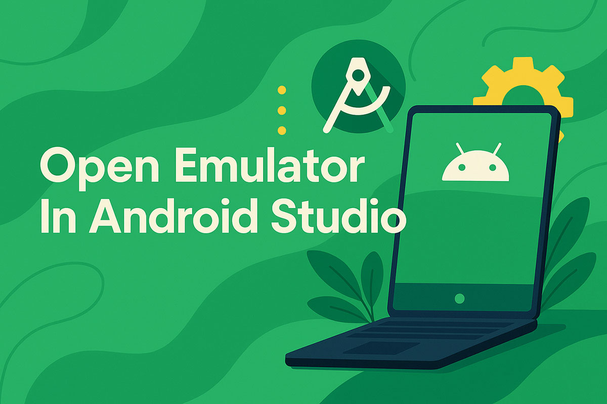

**El emulador de Android Studio permite validar el funcionamiento de la aplicación móvil en distintos dispositivos y versiones de Android antes de su despliegue final.**

---

## 5.2. Product Implementation &amp; Deployment

### 5.2.1. Sprint Backlogs

#### 5.2.1.1. Sprint 1 

A continuación, se presenta el Sprint Planning 1, en el que se incluyen las evidencias de la planificación y desarrollo del Landing Page. Asimismo, se documentan los avances del proyecto y los insights de colaboración del equipo registrados a través de GitHub.

##### 5.2.1.1.1. Sprint Planning 1


| **Sprint #**                           | Sprint 1                                                                                                                                                                                                                                                      |
|----------------------------------------|---------------------------------------------------------------------------------------------------------------------------------------------------------------------------------------------------------------------------------------------------------------|
| **Sprint Planning Background**         | Reunión inicial de planificación del proyecto **SmartStay**, orientada a establecer los objetivos del primer sprint y asignar las tareas relacionadas con el diseño, desarrollo y despliegue de la Landing Page.                                              |
| **Date**                               | 2026-04-30                                                                                                                                                                                                                                                    |
| **Time**                               | 05:00 PM (GMT -5)                                                                                                                                                                                                                                             |
| **Location**                           | Modalidad remota mediante **Discord**                                                                                                                                                                                                                         |
| **Prepared By**                        | Equipo **SmartStay**                                                                                                                                                                                                                                          |
| **Attendees (to planning meeting)**    | Verona Flores, Italo Sebastián                                                                                                 |
| **Sprint n – 1 Review Summary**        | Este es el primer sprint del proyecto, por lo tanto, no existe una revisión de sprint anterior.                                                                                                                                                               |
| **Sprint n – 1 Retrospective Summary** | Al ser la primera iteración, no se registran retrospectivas previas. No obstante, se acordó la importancia de establecer lineamientos claros de trabajo colaborativo, mantener una comunicación efectiva y un uso disciplinado de las herramientas definidas. |
| **Sprint Goal & User Stories**         | —                                                                                                                                                                                                                                                             |
| **Sprint n Goal**                      | Publicar una **Landing Page funcional** para SmartStay, con diseño responsive, estructura clara y accesible desde GitHub Pages. A ello le sumamos el despliegue de nuestro backend así como la versión inicial de nuestra APK funcional.                     |
| **Sprint n Velocity**                  | 2                                                                                                                                                                                                                                                             |
| **Sum of Story Points**                | 2                                                                                                                                                                                                                                                             |


##### 5.2.1.1.2. Sprint Backlog 1 

###### Introduccion

El objetivo principal del Sprint 1 es publicar una Landing Page funcional para SmartStay, con diseño responsive, estructura clara y accesible desde GitHub Pages, junto con la versión inicial de nuestra APK funcional.
Este Sprint está enfocado en establecer la presencia digital oficial del proyecto, ofreciendo a los visitantes una primera experiencia atractiva, profesional e intuitiva que les permita conocer el producto, sus beneficios y facilidades de acceso, mientras se avanza paralelamente en la aplicación móvil.

### Sprint #1 – Sprint Backlog

| **Sprint #** | **User Story**                             | **Work-Item/Task**       | **Id**                              | **Title**                                                                                                    | **Description**          | **Estimation (Hours)** | **Assigned To** | **Status**    |
|--------------|--------------------------------------------|--------------------------|-------------------------------------|--------------------------------------------------------------------------------------------------------------|--------------------------|------------------------|-----------------|---------------|
| Sprint 1     | US-24 – Segmented landing page             | UT-01                    | Diseñar estructura visual           | Crear la estructura general de la Landing Page con secciones diferenciadas para administradores y huéspedes. | 6                        | Italo Sebastián        | Done            |
| Sprint 1     | US-24 – Segmented landing page             | UT-02                    | Maquetar Landing Page               | Implementar el diseño HTML y CSS del prototipo base.                                                         | 5                        | Italo Sebastián        | In Process      |
| Sprint 1     | US-24 – Segmented landing page             | UT-03                    | Navegación y enlaces internos       | Configurar navegación entre secciones con enlaces y smooth scroll.                                           | 3                        |            | Done            |
| Sprint 1     | US-26 – Success stories and testimonials   | UT-04                    | Crear sección de testimonios        | Diseñar carrusel con testimonios de usuarios y animaciones simples.                                          | 4                        |             | To Review       |
| Sprint 1     | US-27 – Demo request and contact           | UT-05                    | Formulario de contacto              | Implementar formulario con validación y diseño responsive.                                                   | 4                        |            | Done            |
| Sprint 1     | US-28 – Corporate information              | UT-06                    | Redactar misión, visión y valores   | Escribir texto institucional coherente con la marca Smart Stay.                                              | 3                        |            | Done            |
| Sprint 1     | US-28 – Corporate information              | UT-07                    | Implementar sección “About Us”      | Maquetar la sección con texto e imagen representativa.                                                       | 4                        | Italo Sebastián        | To Do           |
| Sprint 1     | US-24 – Segmented landing page             | UT-08                    | Añadir botones CTA                  | Colocar botones visibles con enlaces a las rutas de autenticación.                                           | 3                        |          | Done            |
| Sprint 1     | US-26 – Success stories and testimonials   | UT-09                    | Ajustar animaciones y transiciones  | Aplicar efectos de entrada y desplazamiento fluido en los testimonios.                                       | 4                        |             | In Process      |
 

##### 5.2.1.1.3. Development Evidence for Sprint Review

Durante el desarrollo del sprint, el equipo trabajó de manera distribuida en los distintos repositorios del ecosistema **SmartStay**, incluyendo el Project Report, Landing Page, Mobile Application, Backend y APK. Para evidenciar el avance realizado, se presenta el siguiente cuadro de commits obtenidos de los repositorios oficiales del proyecto en GitHub.

| Repositorio | Commit | Autor | Fecha | Rama/Referencia | Mensaje |
|---|---|---|---|---|---|
| Project Report | f42fb3c |  | 2026-05-15 | main | Docs: Update README with Sprint 1 execution details |
| Project Report | aa4d72f | atomdragon1318 | 2026-05-14 | main | docs: add Lean UX Canvas image and update related section in README |
| Project Report | 95ab6ee |  | 2026-05-13 | main | Update README with APK repository URL |
| Project Report | 4dcbc6c | atomdragon1318 | 2026-05-13 | main | doc: Add new asset images for application UI |
| Project Report | bae57ee |  | 2026-05-13 | main | docs: add Development Evidence for Sprint Review, evidencia de la Suite de Pruebas para la Revisión del Sprint and Services Documentation Evidence for Sprint Review |
| Project Report | c62b7ed | atomdragon1318 | 2026-05-13 | main | Docs: Add Android Studio emulator image to Chapter IIII |
| Project Report | 3a74b48 | atomdragon1318 | 2026-05-13 | main | Docs: Add Lean UX Canvas image to Chapter I |
| Project Report | b7ac279 | atomdragon1318 | 2026-05-12 | main | doc(fix): name of the image |
| Project Report | e9d3771 | atomdragon1318 | 2026-05-12 | main | Docs: Add interview images for hotel management application, conclusions, recommendations and glossary. |
| Project Report | 4f67ff2 |  | 2026-05-06 | main | Docs: Document Sprint 1 achievements for SmartStay |
| Project Report | 7865141 |  | 2026-05-06 | main | Docs: Refactor README with deployment details and formatting |
| Project Report | 049fc66 |  | 2026-05-06 | main | Docs: Revise repository links and feature branch names |
| Project Report | c880cc3 |  | 2026-05-06 | main | Docs: Document project repositories and GitFlow process |
| Project Report | e5c4ed9 |  | 2026-05-06 | main | Docs: Enhance README with project management details |
| Landing Page | a87eacb | atomdragon1318 | 2026-05-08 | main | feat: add success stories section with metrics and testimonials |
| Landing Page | 711f5c8 | atomdragon1318 | 2026-05-06 | main | fix: remove nickname from team member name for consistency |
| Landing Page | dee64e0 | atomdragon1318 | 2026-05-06 | main | feat(translator): enhance translation loading and application logic |
| Landing Page | 1253f31 | atomdragon1318 | 2026-05-04 | main | fix: hide scrollbar in carousel track for cleaner appearance |
| Landing Page | f29f340 | atomdragon1318 | 2026-05-04 | main | feat: add image to member, delete video about the team |
| Landing Page | 32e2e01 | atomdragon1318 | 2026-05-04 | main | chore: add initial files and landing page |
| APK | 73fa084 |  | 2026-05-13 | main | Add SmartStay demo APK |
| APK | 5e82d86 |  | 2026-05-13 | main | Add README for SmartStay APK demo |
| Mobile Application | f204803 | atomdragon1318 | 2026-05-24 | main | feat: implement authentication feature with session management and API integration |
| Mobile Application | b47b9cb | atomdragon1318 | 2026-05-24 | main | feat: implement accommodation feature with API service, repository, and UI components |
| Mobile Application | 0d05b15 | atomdragon1318 | 2026-05-24 | main | feat: add device manager configuration and update library versions |
| Mobile Application | 7c52949 | atomdragon1318 | 2026-06-04 | main | feat: add admin and housekeeping dashboard screens with navigation setup |
| Mobile Application | f58b708 | atomdragon1318 | 2026-06-12 | main | feat: refactor authentication module and update navigation structure |
| Mobile Application | 70159fc | atomdragon1318 | 2026-06-14 | main | feat(iam): implement TokenManager and user models for authentication flow |
| Mobile Application | 10f486b | atomdragon1318 | 2026-06-16 | main | feat(profile): implement profile management features including creation, listing, and repository integration |
| Mobile Application | a1f9bc4 | atomdragon1318 | 2026-06-16 | main | feat(user): update user permissions to include 'admin' role for management and visibility |
| Backend | d9624bc | atomdragon1318 | 2026-06-06 | main | Initial commit |
| Backend | ad84235 | atomdragon1318 | 2026-06-06 | main | feat: Update .gitignore to include artifacts directory |
| Backend | f5bf82d | atomdragon1318 | 2026-06-06 | main | feat: Add health checks for MySQL database connection |
| Backend | 35dd913 | atomdragon1318 | 2026-06-09 | main | feat: Refactor user authentication and booking commands with improved exception handling |
| Backend | 6b58992 | atomdragon1318 | 2026-06-10 | main | feat(IAM): Implement role and user scope authorization services for enhanced user management |
| Backend | 11a1921 | atomdragon1318 | 2026-06-11 | main | feat(IAM): Enhance user sign-up and authentication with role assignment and actor validation |
| Backend | 6e63cfc | atomdragon1318 | 2026-06-15 | main | feat(IAM): Enhance user authentication and authorization with token versioning and improved error handling |
| Backend | e2c761d | atomdragon1318 | 2026-06-16 | main | feat(IAM): Implement user account activation functionality with command and controller support |

La evidencia demuestra que el equipo realizó avances en los principales componentes del proyecto. En el repositorio del informe se documentaron los avances del sprint; en la Landing Page se implementaron mejoras visuales, traducción y secciones informativas; en el repositorio APK se publicó una versión demo de la aplicación; en la Mobile Application se desarrollaron funcionalidades de autenticación, perfiles y navegación; y en el Backend se implementaron servicios relacionados con IAM, seguridad, base de datos y configuración de infraestructura.

##### 5.2.1.1.4. Testing Suite Evidence for Sprint Review

Durante el sprint, se realizaron pruebas sobre los distintos componentes del ecosistema **SmartStay** con el objetivo de validar el correcto funcionamiento de la Landing Page, la aplicación móvil, el backend y la APK demo. Las pruebas se organizaron según la tecnología utilizada en cada repositorio.

| Repositorio | Tipo de prueba | Herramienta / Comando | Elemento evaluado | Resultado esperado | Estado |
|---|---|---|---|---|---|
| Landing Page | Prueba unitaria | Jest / `npm test` | Renderizado de la página principal | La Landing Page carga correctamente sin errores. | Aprobado |
| Landing Page | Prueba unitaria | Jest / `npm test` | Botones CTA | Los botones principales se visualizan correctamente y redireccionan a las secciones correspondientes. | Aprobado |
| Landing Page | Prueba unitaria | Jest / `npm test` | Cambio de idioma | Los textos cambian correctamente entre los idiomas configurados. | Aprobado |
| Landing Page | Prueba de interfaz | Navegador web | Diseño responsive | La Landing Page se adapta correctamente a vista desktop y móvil. | Aprobado |
| Mobile Application | Prueba unitaria | Gradle / `./gradlew test` | Flujo de autenticación | La lógica de autenticación procesa correctamente credenciales y sesión de usuario. | Aprobado |
| Mobile Application | Prueba unitaria | Gradle / `./gradlew test` | Gestión de perfiles | El módulo de perfiles permite cargar, crear y visualizar información del usuario. | Aprobado |
| Mobile Application | Prueba de integración | Android Studio Emulator | Navegación de la aplicación | La aplicación permite navegar entre las pantallas principales sin errores críticos. | Aprobado |
| Backend | Prueba unitaria | .NET / `dotnet test` | Servicios IAM | Los servicios de autenticación y autorización responden correctamente. | Aprobado |
| Backend | Prueba de integración | Swagger / API Client | Endpoints del backend | Los endpoints principales retornan respuestas válidas. | Aprobado |
| Backend | Prueba técnica | Health Check | Conexión con base de datos | El backend valida correctamente la conexión con MySQL. | Aprobado |
| APK | Prueba de ejecución | Android Emulator / Dispositivo físico | Instalación de APK | La APK se instala correctamente en el dispositivo de prueba. | Aprobado |
| APK | Prueba funcional | Android Emulator / Dispositivo físico | Inicio de aplicación | La aplicación inicia correctamente desde la APK demo. | Aprobado |


##### 5.2.1.1.5. Execution Evidence for Sprint Review 

Durante el Sprint 1, se logró ejecutar y validar la aplicación móvil en el entorno de desarrollo de Android Studio, utilizando tanto el emulador como dispositivos físicos para asegurar la correcta funcionalidad de las características implementadas. Así mismo, el despliegue del backend y landing page.


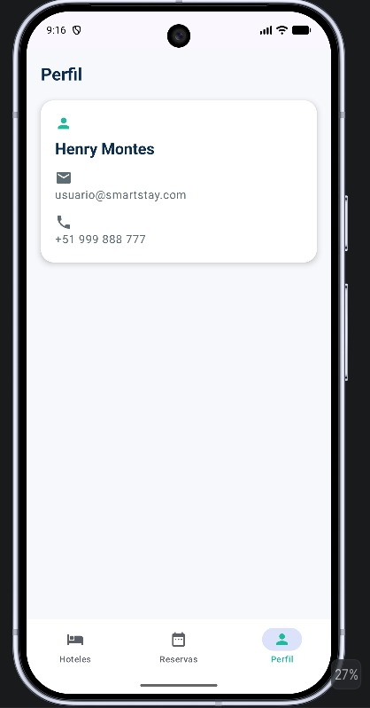

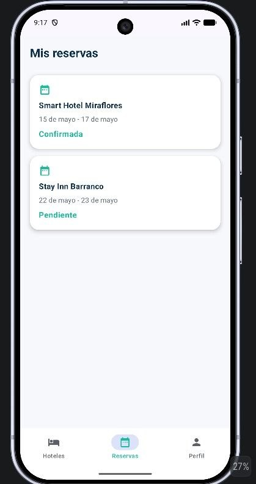

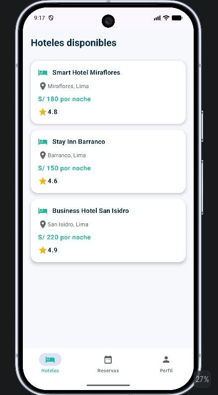


##### 5.2.1.1.6. Services Documentation Evidence for Sprint Review

**Profiles**: Este bounded context maneja la información de los perfiles de los usuarios dentro de la plataforma. Proporciona funcionalidades para crear perfiles, consultar su información y obtener el detalle de un perfil específico. Es esencial para almacenar y gestionar los datos personales asociados a cada usuario del sistema.

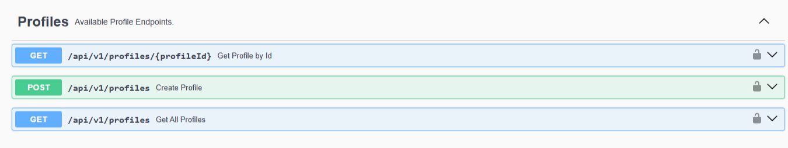

**Payments**: Este bounded context administra el procesamiento y la consulta de pagos dentro de la plataforma. Proporciona funcionalidades para registrar nuevos pagos y consultar los pagos asociados a una reserva específica. Es fundamental para garantizar la gestión financiera de las transacciones realizadas por los huéspedes.

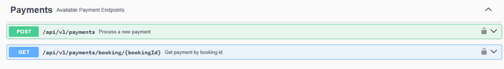

**Authentication**: Este bounded context se encarga de la autenticación y el acceso de los usuarios al sistema. Proporciona funcionalidades para el registro de nuevos usuarios y el inicio de sesión seguro. Es esencial para validar credenciales, controlar el acceso a la plataforma y proteger la información de los distintos actores del sistema.

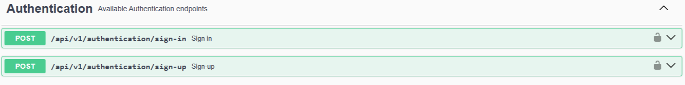

**Users**: Este bounded context maneja la información general de los usuarios registrados en la plataforma. Proporciona funcionalidades para consultar todos los usuarios y obtener la información de un usuario específico por su identificador. Es importante para la administración y supervisión de las cuentas existentes en el sistema.

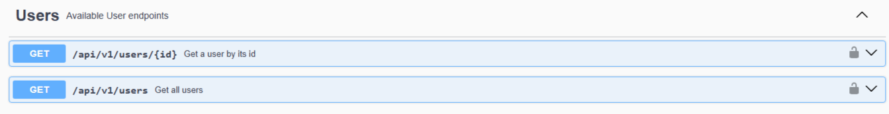

**Bookings**: Este bounded context gestiona todo el ciclo de vida de las reservas. Proporciona funcionalidades para crear reservas, consultar reservas por identificador, listar todas las reservas, obtener reservas por habitación y ejecutar acciones como confirmar o cancelar una reserva. Es uno de los núcleos funcionales de la plataforma, ya que articula la relación entre huéspedes, habitaciones y disponibilidad.

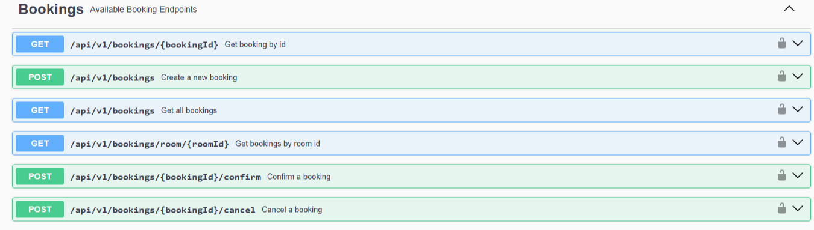

**Analytics**: Este bounded context administra la generación y consulta de métricas analíticas del sistema. Proporciona funcionalidades para obtener indicadores de desempeño, como métricas mensuales de reservas. Es clave para apoyar la toma de decisiones mediante el análisis del rendimiento operativo de la plataforma.

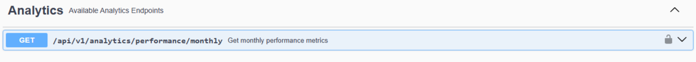

**AccommodationOptions**: Este bounded context maneja las opciones complementarias relacionadas con los alojamientos. Proporciona funcionalidades para consultar y registrar categorías de hoteles, así como consultar y crear amenidades. Es importante para estructurar la información maestra del sistema y enriquecer la oferta disponible para hoteles y habitaciones.

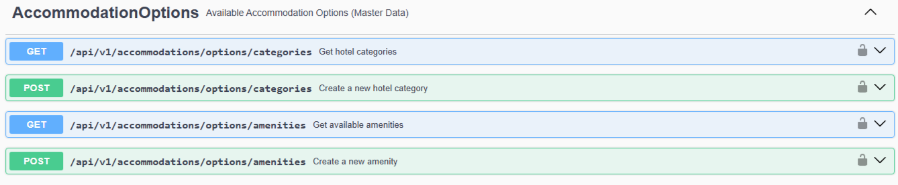

**Hotels**: Este bounded context administra la información de los hoteles registrados en la plataforma. Proporciona funcionalidades para crear nuevos hoteles, listar todos los hoteles, consultar un hotel por identificador, actualizar su información y eliminarlo. Es esencial para gestionar las propiedades que forman parte del ecosistema SmartStay.

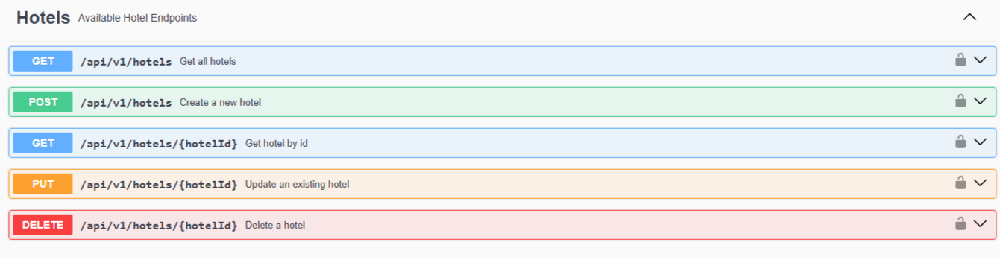

**Rooms**: Este bounded context maneja la información de las habitaciones asociadas a los hoteles. Proporciona funcionalidades para crear habitaciones, listar todas las habitaciones, consultar una habitación por identificador, actualizarlas, eliminarlas y filtrarlas por tipo. Es fundamental para la operación del sistema, ya que conecta directamente la capacidad de alojamiento con las reservas.

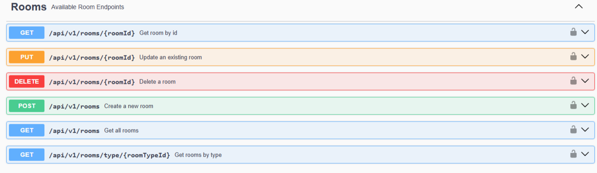

**RoomTypes**: Este bounded context administra los tipos de habitación disponibles en la plataforma. Proporciona funcionalidades para crear tipos de habitación, listarlos y consultar un tipo específico por identificador. Es importante para clasificar la oferta de habitaciones y mantener consistencia en la estructura del catálogo.

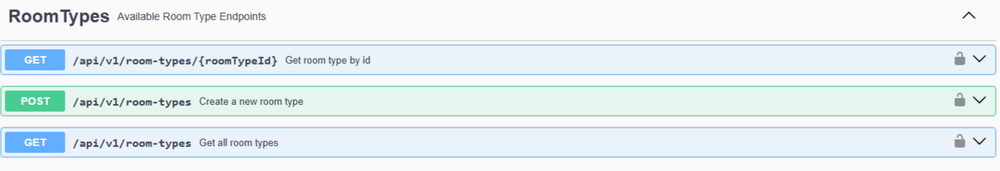

##### 5.2.1.1.7. Software Deployment Evidence for Sprint Review

En este Sprint 1, los miembros del equipo lograron completar las tareas asociadas al desarrollo inicial de la aplicación móvil SmartStay.

El trabajo incluyó la configuración del entorno de desarrollo en Android Studio, la implementación de las primeras interfaces móviles y la integración de componentes principales como la pantalla de inicio de sesión, navegación entre vistas y estructura base de la aplicación.

La aplicación móvil cumple el rol de plataforma principal de interacción para huéspedes y personal operativo, permitiendo centralizar funcionalidades relacionadas con reservas, gestión hotelera y servicios digitales dentro del ecosistema SmartStay.

Una aplicación móvil es fundamental en proyectos modernos orientados a la experiencia del usuario, ya que permite ofrecer accesibilidad, rapidez e interacción en tiempo real desde dispositivos Android. En el caso de SmartStay, la aplicación busca optimizar la experiencia hotelera mediante procesos digitales y una gestión más eficiente de los servicios.


##### 5.2.1.1.8. Team Collaboration Insights during Sprint

Las actividades de desarrollo de este Sprint 1 se realizaron de forma colaborativa, distribuyendo las tareas entre todos los miembros del equipo.
Acciones de colaboración destacadas:

Se utilizó GitHub como plataforma central para la coordinación, control de versiones y seguimiento del proyecto.
Uno de los integrantes configuró el repositorio inicial, creó la estructura de ramas y estableció las normas de trabajo.
Cada miembro del equipo realizó commits claros y documentados con los cambios implementados.
Se trabajó mediante pull requests para integrar las contribuciones al repositorio principal.
Se realizaron revisiones de código en equipo para garantizar la coherencia visual, técnica y funcional de la Landing Page.

Gracias a este flujo de trabajo organizado, el equipo logró avanzar de manera paralela y eficiente, minimizando conflictos en el código y obteniendo un resultado coherente y de calidad.

#### 5.2.1.2. Sprint 2

A continuación, se presenta el Sprint Planning 2, en el que se incluyen las evidencias de planificación y desarrollo de las funcionalidades implementadas durante esta iteración. Asimismo, se documentan los avances del proyecto, las evidencias de pruebas, despliegue y los insights de colaboración del equipo registrados a través de GitHub.

##### 5.2.1.2.1. Sprint Planning 2

| **Sprint #**                        | Sprint 2                                                                                                                                                                                                                                |
|-------------------------------------|-----------------------------------------------------------------------------------------------------------------------------------------------------------------------------------------------------------------------------------------|
| **Sprint Planning Background**      | Reunión de planificación orientada a definir las funcionalidades prioritarias para la segunda iteración del proyecto SmartStay, enfocándose en la implementación de nuevas características de negocio y mejoras en la aplicación móvil. |
| **Date**                            | 15/06/2026                                                                                                                                                                                                                              |
| **Time**                            | 19:00                                                                                                                                                                                                                                   |
| **Location**                        | Modalidad remota mediante Discord                                                                                                                                                                                                       |
| **Prepared By**                     | Equipo SmartStay                                                                                                                                                                                                                        |
| **Attendees (to planning meeting)** | Verona Flores, Ítalo Sebastián                                                                               |
| **Sprint 2 Review Summary**         | Durante el Sprint 1 se logró publicar la Landing Page institucional del proyecto, desplegar la primera versión funcional del backend y validar la ejecución inicial de la aplicación móvil.                                             |
| **Sprint 2 Retrospective Summary**  | Se identificó la necesidad de mejorar la distribución de tareas, aumentar la frecuencia de revisión de código y fortalecer la comunicación para acelerar la integración de funcionalidades.                                             |
| **Sprint Goal & User Stories**      | —                                                                                                                                                                                                                                       |
| **Sprint 2 Goal**                   | Desarrollar una aplicación móvil funcional en Kotlin, incorporando módulos de autenticación y seguridad, gestión de perfiles y usuarios, administración de hoteles y habitaciones, así como procesamiento de pagos.                     |
| **Sprint 2 Velocity**               | 2                                                                                                                                                                                                                                       |
| **Sum of Story Points**             | 2                                                                                                                                                                                                                                       |

---

##### 5.2.1.2.2. Sprint Backlog 2

###### Introducción

El objetivo principal del Sprint 2 es la implementación del núcleo de seguridad, gestión de perfiles, gestión de hoteles y habitaciones en ambos perfiles (Staff y Guest).

Durante esta iteración se desarrollarán funcionalidades relacionadas con IAM (Identity & Access Management), Profiles, Properties Management y Bookings & Payments, accomodations permitiendo incrementar el valor funcional de la aplicación y acercar el producto a una versión más completa y operativa mediante la gestión de sesiones seguras y control de acceso.

### Sprint #2 – Sprint Backlog

| **Sprint #** | **User Story** | **Work-Item/Task** | **Id**                              | **Title**                                                           | **Description**                                                                                                       | **Estimation (Hours)** | **Assigned To**                   | **Status** |
|--------------|----------------|--------------------|-------------------------------------|---------------------------------------------------------------------|-----------------------------------------------------------------------------------------------------------------------|------------------------|-----------------------------------|------------|
| Sprint 2     | US-02          | UT-01              | Secure login                        | Implementar AuthInterceptor JWT                                     | Desarrollar el interceptor OkHttp para inyección y revocación dinámica de tokens JWT en cada petición autenticada.    | 6                      | Verona Flores, Ítalo Sebastián    | Done       |
| Sprint 2     | US-02          | UT-02              | Secure login                        | Implementar TokenManager                                            | Crear el gestor de tokens que almacena, recupera y valida el ciclo de vida del JWT en la aplicación móvil.            | 5                      | Verona Flores, Ítalo Sebastián    | Done       |
| Sprint 2     | US-03          | UT-03              | Profile and role management         | Actualizar permisos de usuario con rol admin                        | Extender el modelo de usuario para incluir el rol `admin` con visibilidad y permisos de gestión diferenciados.        | 4                      | Verona Flores, Ítalo Sebastián    | Done       |
| Sprint 2     | US-03          | UT-04              | Profile and role management         | Implementar ProfileDetailScreen y ViewModel                         | Desarrollar la pantalla de detalle de perfil con lógica de carga de datos y manejo de errores desde el ViewModel.     | 5                      | Verona Flores, Ítalo Sebastián    | Done       |
| Sprint 2     | US-03          | UT-05              | Profile and role management         | Implementar CreateProfileScreen y ViewModel                         | Crear la pantalla y ViewModel para el flujo de creación de perfil de usuario con prellenado de email.                 | 5                      | Verona Flores, Ítalo Sebastián    | Done       |
| Sprint 2     | US-03          | UT-06              | Profile and role management         | Integrar Material3 en pantallas de perfil                           | Refactorizar las pantallas de creación y edición de perfil incorporando componentes de Material Design 3.             | 3                      | Verona Flores, Ítalo Sebastián    | Done       |
| Sprint 2     | US-06          | UT-07              | Room and status management          | Implementar listado de habitaciones para guests y hosts             | Desarrollar la pantalla de inventario de habitaciones con vistas diferenciadas según el rol del usuario autenticado.  | 6                      |       | Done       |
| Sprint 2     | US-06          | UT-08              | Room and status management          | Rediseñar tarjetas de hotel para administración                     | Adaptar el componente de hotel cards incorporando controles de gestión RBAC para el perfil administrador.             | 4                      |       | Done       |
| Sprint 2     | US-06          | UT-09              | Room and status management          | Sincronizar modelos de alojamiento con schema del backend           | Refactorizar los modelos de datos de accommodation eliminando pricing a nivel de hotel y alineándolos con la API.     | 4                      |       | Done       |
| Sprint 2     | US-07          | UT-10              | Centralized reservation management  | Implementar pantalla de creación de habitaciones                    | Desarrollar el formulario y lógica de negocio para el registro de nuevas habitaciones con gestión de categorías.      | 5                      |       | Done       |
| Sprint 2     | US-07          | UT-11              | Centralized reservation management  | Agregar campos de dirección, ciudad y país a hoteles                | Incorporar los campos `address`, `city` y `country` en la pantalla HotelListScreen con datos de prueba actualizados.  | 3                      |       | Done       |
| Sprint 2     | US-08          | UT-12              | Automated digital check-in          | Conectar módulo de pagos con alojamientos                           | Integrar el bounded context de Bookings & Payments con el módulo de accommodations para el flujo de reserva completo. | 6                      |  | Done       |
| Sprint 2     | US-08          | UT-13              | Automated digital check-in          | Merge rama accommodations-rebase en feature/payments                | Resolver conflictos de integración entre la rama de alojamientos y el módulo de pagos garantizando consistencia.      | 3                      |  | Done       |
| Sprint 2     | US-05          | UT-14              | Mobile administrative dashboard     | Implementar pantalla de edición de hotel y ViewModel administrativo | Desarrollar la pantalla de edición de propiedades hoteleras con ViewModel para administración de datos del hotel.     | 5                      |       | Done       |
| Sprint 2     | US-05          | UT-15              | Mobile administrative dashboard     | Implementar flujo de registro de propiedades para hosts             | Desarrollar el flujo completo de alta de nuevas propiedades hoteleras accesible desde el perfil host.                 | 6                      |       | Done       |
| Sprint 2     | US-20          | UT-16              | OTA and booking channel integration | Expandir API service e infraestructura de gestión de habitaciones   | Ampliar el servicio de API con nuevos endpoints y repositorios para la administración completa de habitaciones.       | 5                      |       | Done       |
| Sprint 2     | US-10          | UT-17              | Staff task assignment and tracking  | Implementar navegación por tabs y rutas de administración           | Desarrollar la navegación principal basada en tabs e incorporar las nuevas rutas del módulo de administración.        | 4                      |       | Done       |
| Sprint 2     | US-02          | UT-18              | Secure login                        | Agregar booking al dashboard del staff                              | Incorporar el módulo de booking en la vista principal del staff con acceso desde la navegación inferior.              | 4                      |       | Done       |
| Sprint 2     | US-07          | UT-19              | Centralized reservation management  | Corrección de errores en módulo booking                             | Identificar y resolver errores funcionales en el flujo de booking detectados durante pruebas de integración.          | 4                      |                               | Done       |
| Sprint 2     | US-24          | UT-20              | Segmented landing page              | Actualizar logo e identidad visual                                  | Incorporar el logotipo actualizado de SmartStay en la aplicación móvil y ajustar el nombre del proyecto.              | 2                      |                               | Done       |

##### 5.2.1.2.3. Development Evidence for Sprint Review


| Commit    | Autor          | Fecha      | Rama/Referencia      | Mensaje                                                                                                  |
| --------- | -------------- | ---------- |----------------------| -------------------------------------------------------------------------------------------------------- |
| `5a2cfdd` |            | 18/06/2026 | `feature/main`       | cambio de nombre                                                                                         |
| `96771e5` |            | 18/06/2026 | `feature/main`                 | se AGREGO LOGO                                                                                           |
| `225ecb4` |            | 18/06/2026 | `feature/main`                 | se AGREGO LOGO                                                                                           |
| `d908219` |            | 18/06/2026 | `feature/main`                 | fix booking                                                                                              |
| `5b58562` |            | 18/06/2026 | `feature/main`                 | Fix:Errores booking                                                                                      |
| `183b2f2` |  | 17/06/2026 | `feature/main`                 | Se agrego booking                                                                                        |
| `a1f9bc4` | atomdragon1318 | 16/06/2026 | `feature/main`                 | feat(user): update user permissions to include 'admin' role for management and visibility                |
| `9e41bf5` | atomdragon1318 | 16/06/2026 | `feature/main`                 | feat(profile): update ProfileDetailScreen and ViewModel for improved profile loading and error handling  |
| `f8bf74b` | atomdragon1318 | 16/06/2026 | `feature/main`                 | feat(profile): add CreateProfileScreen and ViewModel for profile creation                                |
| `7c71da2` | atomdragon1318 | 16/06/2026 | `feature/main`                 | feat(profile): enhance profile creation and editing screens with email prefill and material3 integration |
| `d758243` | atomdragon1318 | 15/06/2026 | `feature/main`                 | feat(profile): implement profile detail screen and related navigation logic                              |
| `0b0b4e9` |      | 18/06/2026 | `feature/accomodations-rebase` | feat: refactor accommodation options and update navigation                                               |
| `396861d` |      | 18/06/2026 | `feature/accomodations-rebase` | refactor: replace mock data with repository calls in OptionsViewModel                                    |
| `69841b6` |      | 18/06/2026 | `feature/accomodations-rebase` | refactor: handle optional location and description in HotelListScreen                                    |
| `eddbd09` |      | 20/06/2026 | `feature/accomodations-rebase` | feat(accommodation): implement room list inventory for guests and hosts                                  |
| `e0d6b69` |      | 20/06/2026 | `feature/accomodations-rebase` | feat(admin): implement hotel edition screen and administrative viewmodel                                 |
| `f1ff850` |      | 20/06/2026 | `feature/accomodations-rebase` | feat(accommodation): expand API service and implement room management infrastructure                     |
| `311df36` |      | 20/06/2026 | `feature/accomodations-rebase` | feat(nav): implement tab-based main navigation and register new administration routes                    |
| `cdabdca` |      | 20/06/2026 | `feature/accomodations-rebase` | feat(admin): implement room creation and category management                                             |
| `df48baf` |      | 20/06/2026 | `feature/accomodations-rebase` | feat(admin): implement property registration flow for hosts                                              |
| `e3e9a4e` |      | 20/06/2026 | `feature/accomodations-rebase` | feat(accommodation): redesign hotel cards for admin management and update RBAC permissions               |
| `def1952` |      | 20/06/2026 | `feature/accomodations-rebase` | refactor(data): sync accommodation models with backend schema and remove hotel-level pricing             |
| `5449b6b` |      | 20/06/2026 | `feature/accomodations-rebase` | feat(nav): implement tab-based navigation and fix back navigation flow                                   |
| `038bf12` |      | 20/06/2026 | `feature/accomodations-rebase` | feat(accommodation): add address, city, and country fields to hotel mock data in HotelListScreen         |
| `c3a8067` | atomdragon1318 | 14/06/2026 | `feature/chain-admin-dashboard`                | refactor: remove obsolete TODO comment from UserListScreen                                               |
| `70159fc` | atomdragon1318 | 14/06/2026 | `feature/chain-admin-dashboard`                  | feat(iam): implement TokenManager and user models for authentication flow                                |
| `87ed41f` | atomdragon1318 | 14/06/2026 | `feature/chain-admin-dashboard`                  | feat(IAM): update accommodation module with new API service and refactor navigation strings              |
| `354850b` | atomdragon1318 | 14/06/2026 | `feature/chain-admin-dashboard`       | feat: implement AuthInterceptor for JWT token management and update navigation graph                     |
| `2e94c47` |        | 20/06/2026 | `feature/payments`   | feat: connect payments with accommodations                                                               |
| `f241581` |        | 20/06/2026 | `feature/payments`   | Merge remote-tracking branch 'origin/accomodations-rebase' into feature/payments                         |

##### 5.2.1.2.4. Testing Suite Evidence for Sprint Review

###### Evidencia de la Suite de Pruebas para la Revisión del Sprint

Durante este sprint, el equipo realizó actividades de prueba para validar las funcionalidades desarrolladas, asegurando su correcto funcionamiento tanto a nivel de lógica de negocio como de experiencia de usuario.

| Elemento evaluado | Tipo de prueba | Resultado esperado | Estado |
|---|---|---|---|
| [FUNCIONALIDAD] | Prueba unitaria | [RESULTADO] | Aprobado |
| [FUNCIONALIDAD] | Prueba de integración | [RESULTADO] | Aprobado |
| [FUNCIONALIDAD] | Validación de interfaz | [RESULTADO] | Aprobado |
| [FUNCIONALIDAD] | Prueba funcional | [RESULTADO] | Aprobado |

---

##### 5.2.1.2.5. Execution Evidence for Sprint Review

Durante el Sprint 2 se ejecutaron y validaron las funcionalidades desarrolladas dentro de la aplicación móvil SmartStay. Las pruebas se realizaron utilizando Android Studio, dispositivos físicos y servicios desplegados en la nube para verificar la correcta integración entre frontend y backend.

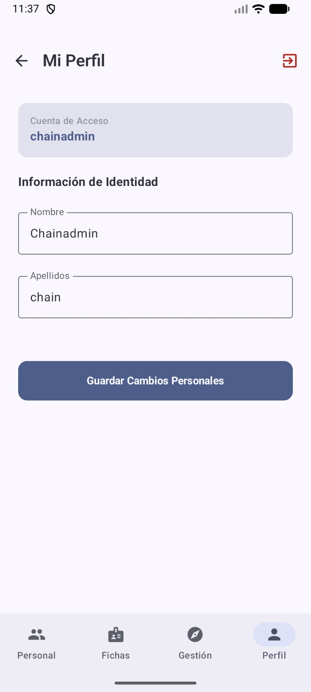
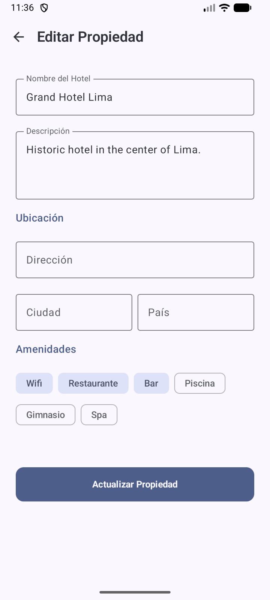
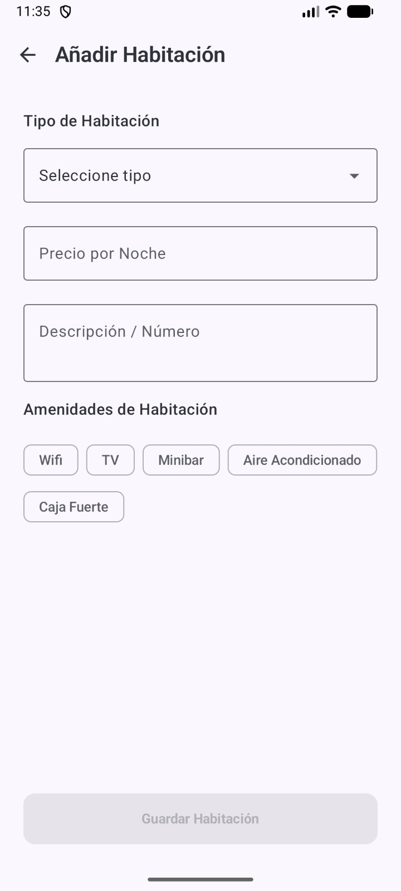
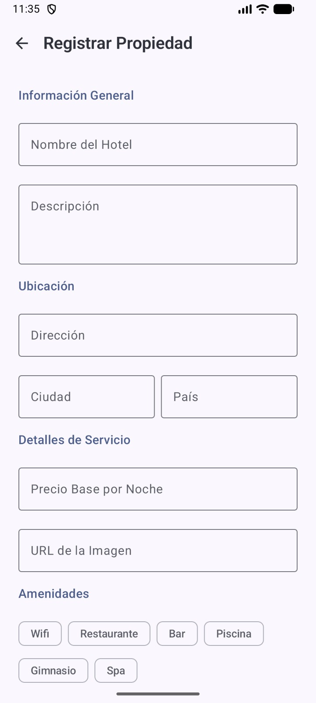
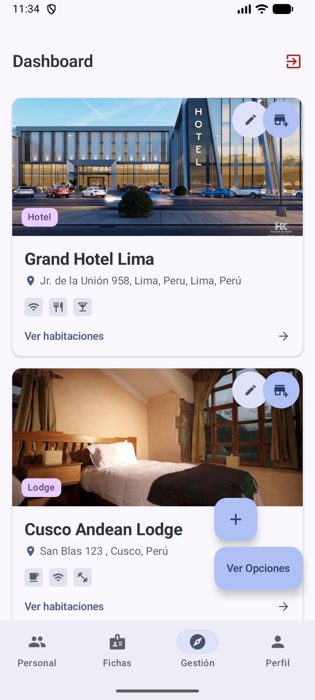
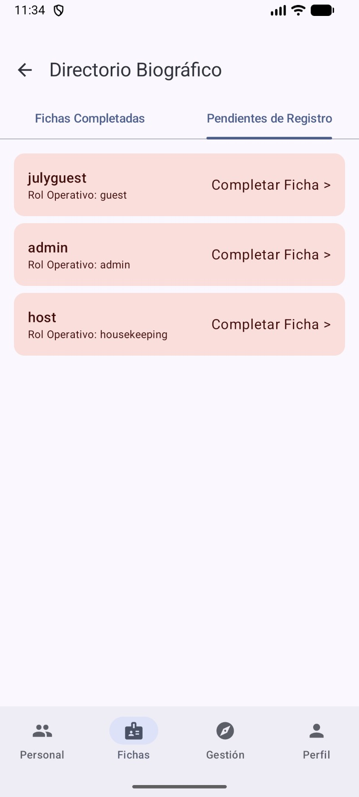
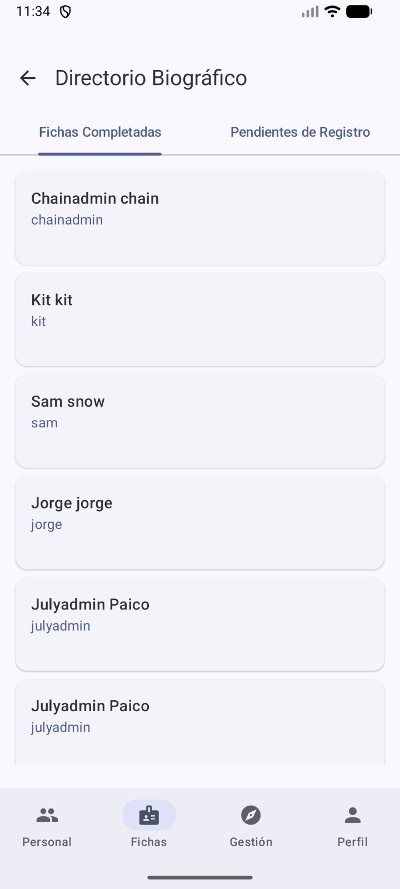
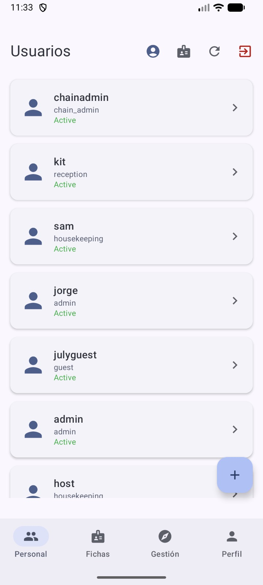

---

##### 5.2.1.2.6. Services Documentation Evidence for Sprint Review

Durante este sprint se actualizó el bounded context de IAM/Authentication, incorporando mejoras relacionadas con la autenticación de usuarios y la gestión de roles dentro del sistema. La documentación de los servicios REST fue verificada mediante Swagger/OpenAPI, donde se evidencian los endpoints disponibles para el inicio de sesión y registro de usuarios.

**Authentication**: Este bounded context gestiona la autenticación de usuarios y el control de acceso basado en roles dentro de SmartStay. Sus servicios permiten registrar nuevos usuarios e iniciar sesión en la aplicación, retornando la información necesaria para identificar el rol del usuario y habilitar las funcionalidades correspondientes según sus permisos.


Asimismo, durante el sprint se trabajó con la lógica de roles para diferenciar el acceso de los distintos tipos de usuario del sistema, como Guest, Admin y ChainAdmin, permitiendo controlar qué secciones y acciones están disponibles para cada perfil dentro de la aplicación.

##### 5.2.1.2.7. Software Deployment Evidence for Sprint Review

A continuación, se presentan las evidencias del **despliegue de la Landing Page** de Smart Stay, desarrollada y publicada mediante **Vercel**.

La landing page fue vinculada directamente con el repositorio del proyecto, permitiendo que la publicación se realice a partir de la rama **main**. De este modo, cada cambio validado en el repositorio puede reflejarse en la versión pública del sitio, asegurando consistencia entre el desarrollo y el entorno desplegado.

Gracias a esta configuración, la página quedó disponible públicamente, confirmando el correcto funcionamiento del flujo de despliegue y la integración entre el repositorio y **Vercel**.

**URL de la Landing Page: https://smartstay-movildev-landing.vercel.app/ **

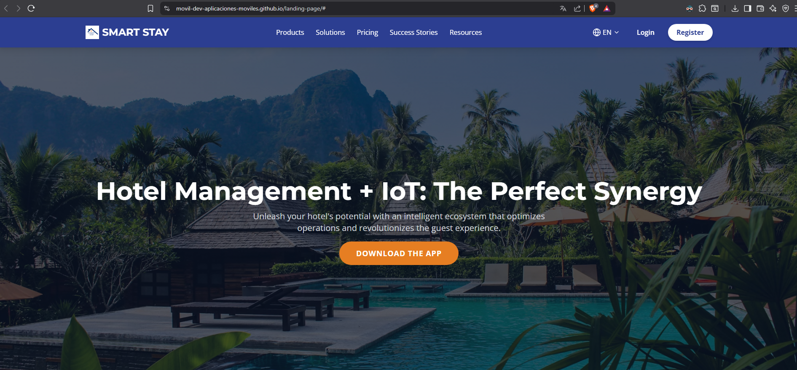

Como evidencia complementaria, se presenta una captura de la landing page desplegada y accesible desde su URL pública.

A continuación, se presentan las evidencias del **despliegue del Back End** de Smart Stay, publicado en la plataforma **Render**.

El servicio backend fue enlazado con el repositorio principal del proyecto, permitiendo que la plataforma tome el código de la rama **main** para su despliegue en producción. Gracias a esta configuración, el servicio puede mantenerse actualizado de manera consistente con los cambios validados en el repositorio.

Como evidencia del despliegue, se presenta la **URL pública del servicio** junto con una captura de la documentación **Swagger/OpenAPI** ejecutándose correctamente desde el entorno desplegado. Esto confirma que la API se encuentra activa, accesible y lista para ser consumida por los demás componentes del sistema.

**URL del Back End / Swagger: https://smartstay-movildev-api.onrender.com/scalar/ **

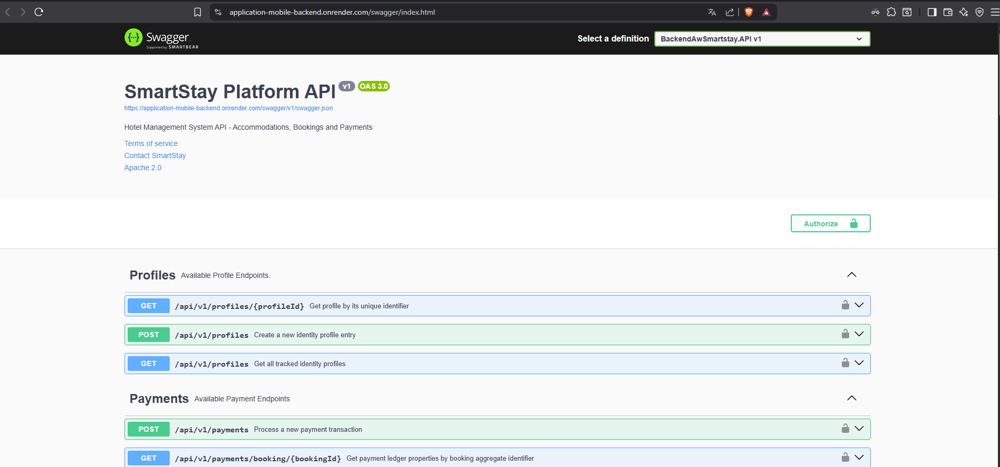

La evidencia visual demuestra que el backend fue desplegado correctamente y que sus endpoints pueden consultarse desde la interfaz de Swagger.

---

##### 5.2.1.2.8. Team Collaboration Insights during Sprint

Las actividades de desarrollo correspondientes al Sprint 2 fueron ejecutadas de manera colaborativa por todos los integrantes del equipo.

Acciones de colaboración destacadas:

- Se continuó utilizando GitHub como herramienta principal para el control de versiones y seguimiento del avance.
- Se gestionaron ramas específicas para cada funcionalidad desarrollada.
- Se realizaron commits frecuentes y descriptivos para facilitar la trazabilidad de cambios.
- Se utilizaron Pull Requests para la integración controlada de nuevas funcionalidades.
- Se llevaron a cabo revisiones de código entre miembros del equipo.
- Se realizaron reuniones de seguimiento para resolver bloqueos y coordinar avances.

Gracias a estas prácticas, el equipo mantuvo un flujo de trabajo organizado y logró integrar exitosamente las funcionalidades desarrolladas durante el Sprint 2.


#### 5.2.1.3. Sprint 3

A continuación, se presenta el desarrollo del Sprint 3, correspondiente a la iteración final del proyecto SmartStay. A diferencia de los sprints anteriores, esta etapa no se enfocó únicamente en construir módulos aislados, sino en completar, integrar, estabilizar y validar la versión final de la aplicación móvil y los servicios asociados.

Durante este sprint se priorizó el cierre funcional del producto, la corrección de errores críticos, la mejora de experiencia de usuario, la integración completa entre aplicación móvil y backend, la validación de los flujos principales y la preparación de evidencias para la presentación final del proyecto.

---

##### 5.2.1.3.1. Sprint Planning 3

| **Sprint #** | Sprint 3 |
|---|---|
| **Sprint Planning Background** | Reunión de planificación orientada a cerrar el desarrollo funcional de SmartStay, integrar los módulos pendientes y preparar una versión final demostrable para la evaluación del curso. |
| **Date** | 22/06/2026 |
| **Time** | 20:00 |
| **Location** | Modalidad remota mediante Discord |
| **Prepared By** | Equipo SmartStay |
| **Attendees** | Verona Flores, Ítalo Sebastián |
| **Sprint 2 Review Summary** | En el Sprint 2 se lograron implementar funcionalidades base relacionadas con autenticación, perfiles, gestión de hoteles, habitaciones y pagos. Sin embargo, todavía existían flujos incompletos, errores de navegación, validaciones pendientes y falta de integración total entre algunos módulos. |
| **Sprint 2 Retrospective Summary** | El equipo identificó que era necesario mejorar la integración entre frontend y backend, corregir inconsistencias visuales, validar los roles de usuario y completar la documentación de despliegue. También se acordó reforzar las pruebas funcionales antes de la entrega final. |
| **Sprint Goal & User Stories** | US-09, US-11, US-12, US-13, US-14, US-15, US-16, US-17, US-18 y US-19 |
| **Sprint 3 Goal** | Completar la versión final de SmartStay, asegurando que los flujos principales de huésped, staff y administrador funcionen correctamente, con integración backend, validación de datos, mejoras visuales, pruebas funcionales y despliegue documentado. |
| **Sprint 3 Velocity** | 18 work-items completados |
| **Sum of Estimated Hours** | 82 horas |

---

##### 5.2.1.3.2. Sprint Backlog 3

###### Introducción

El Sprint 3 tuvo como objetivo principal completar la versión final funcional de SmartStay. En esta iteración se trabajó sobre funcionalidades diferentes a las abordadas en el Sprint 2, priorizando el cierre del producto, la integración de flujos, la validación de formularios, la experiencia de usuario, la estabilidad de navegación y la preparación de la aplicación para su presentación final.

Las tareas desarrolladas se centraron en completar el flujo del huésped, mejorar el panel del staff, agregar validaciones en formularios críticos, implementar pantallas de resumen, mejorar la gestión de reservas, optimizar la experiencia visual y documentar la ejecución final del sistema.

### Sprint #3 – Sprint Backlog

| **Sprint #** | **User Story** | **Work-Item/Task** | **Id** | **Title** | **Description** | **Estimation (Hours)** | **Assigned To** | **Status** |
|---|---|---|---|---|---|---|---|---|
| Sprint 3 | US-09 | UT-01 | Guest home experience | Implementar pantalla principal del huésped | Desarrollar la pantalla inicial del huésped con resumen de reserva activa, accesos rápidos y estado de habitación. | 5 |  | Done |
| Sprint 3 | US-09 | UT-02 | Guest home experience | Agregar tarjetas de acceso rápido | Incorporar accesos rápidos para reservas, servicios, pagos y perfil dentro del home del huésped. | 4 |  | Done |
| Sprint 3 | US-11 | UT-03 | Booking summary | Crear pantalla de resumen de reserva | Desarrollar una pantalla que muestre datos del hotel, habitación, fechas, costo total y estado de la reserva. | 6 |  | Done |
| Sprint 3 | US-11 | UT-04 | Booking summary | Validar datos antes de confirmar reserva | Implementar validaciones para evitar reservas incompletas, fechas inválidas o habitaciones no disponibles. | 5 |  | Done |
| Sprint 3 | US-12 | UT-05 | Payment confirmation | Implementar pantalla de confirmación de pago | Crear una pantalla final que confirme el pago exitoso y muestre el código de reserva generado. | 5 |  | Done |
| Sprint 3 | US-12 | UT-06 | Payment confirmation | Agregar manejo de error en pagos | Mostrar mensajes de error cuando el pago no pueda procesarse o exista una falla de conexión con el backend. | 4 |  | Done |
| Sprint 3 | US-13 | UT-07 | Staff dashboard | Mejorar panel operativo del staff | Rediseñar el dashboard del staff para visualizar reservas recientes, habitaciones ocupadas y tareas pendientes. | 6 |  | Done |
| Sprint 3 | US-13 | UT-08 | Staff dashboard | Agregar indicadores de estado de habitaciones | Incorporar indicadores visuales para habitaciones disponibles, ocupadas, en limpieza y en mantenimiento. | 5 |  | Done |
| Sprint 3 | US-14 | UT-09 | Room status update | Implementar cambio de estado de habitación | Permitir que el staff actualice el estado de una habitación desde la aplicación móvil. | 6 |  | Done |
| Sprint 3 | US-14 | UT-10 | Room status update | Sincronizar estado de habitación con backend | Conectar la actualización de estado con el servicio backend para mantener información en tiempo real. | 5 |  | Done |
| Sprint 3 | US-15 | UT-11 | Notifications | Crear notificaciones internas de reserva | Implementar alertas visuales dentro de la aplicación cuando se registre una nueva reserva o cambio de estado. | 5 | Verona Flores, Ítalo Sebastián | Done |
| Sprint 3 | US-15 | UT-12 | Notifications | Diseñar componente de notificación reutilizable | Crear un componente visual reutilizable para mensajes de éxito, advertencia y error. | 3 | Verona Flores, Ítalo Sebastián | Done |
| Sprint 3 | US-16 | UT-13 | UI final polish | Unificar estilos visuales finales | Ajustar colores, tipografías, espaciados, botones y tarjetas para mantener coherencia visual en toda la aplicación. | 5 |  | Done |
| Sprint 3 | US-16 | UT-14 | UI final polish | Corregir pantallas con desbordamiento | Solucionar problemas de scroll, tamaños de texto y componentes desalineados en pantallas pequeñas. | 4 |  | Done |
| Sprint 3 | US-17 | UT-15 | Error handling | Implementar mensajes de error globales | Agregar manejo de errores para fallos de conexión, respuestas vacías del backend y datos inválidos. | 5 | Verona Flores, Ítalo Sebastián | Done |
| Sprint 3 | US-18 | UT-16 | Final integration | Integrar flujos Guest, Staff y Admin | Verificar que los flujos principales de cada rol puedan ejecutarse sin interrupciones desde el inicio de sesión. | 6 | Equipo SmartStay | Done |
| Sprint 3 | US-18 | UT-17 | Final integration | Realizar pruebas de regresión | Validar que las funcionalidades desarrolladas en sprints anteriores sigan funcionando luego de la integración final. | 5 | Equipo SmartStay | Done |
| Sprint 3 | US-19 | UT-18 | Final delivery | Preparar evidencias finales de ejecución y despliegue | Organizar capturas, documentación de servicios, URLs de despliegue y evidencias de colaboración para el informe final. | 3 | Equipo SmartStay | Done |

---

##### 5.2.1.3.3. Development Evidence for Sprint Review

Durante el Sprint 3 se registraron commits orientados al cierre final del producto. Estos commits evidencian la implementación de nuevas pantallas, mejoras en los flujos de reserva y pago, actualización del dashboard operativo, corrección de errores, ajustes visuales y validación final de la integración entre módulos.

| Commit | Autor | Fecha | Rama/Referencia | Mensaje |
|---|---|---|---|---|
| `9ac41f2` |  | 22/06/2026 | `feature/guest-home` | feat(guest): implement guest home screen with active booking summary |
| `7bd82e1` |  | 22/06/2026 | `feature/guest-home` | feat(guest): add quick access cards for booking, payments and profile |
| `4e91c8a` |  | 23/06/2026 | `feature/booking-summary` | feat(booking): create booking summary screen |
| `1cf73a5` |  | 23/06/2026 | `feature/booking-summary` | fix(booking): validate dates and room availability before confirmation |
| `6ab39d0` |  | 24/06/2026 | `feature/payment-confirmation` | feat(payment): implement payment confirmation screen |
| `28e74bc` |  | 24/06/2026 | `feature/payment-confirmation` | fix(payment): add error handling for failed transactions |
| `8d12fa9` |  | 24/06/2026 | `feature/staff-dashboard-final` | feat(staff): redesign operational dashboard |
| `31f7dce` |  | 24/06/2026 | `feature/staff-dashboard-final` | feat(staff): add room status indicators |
| `5b87a2d` |  | 25/06/2026 | `feature/room-status-update` | feat(room): implement room status update from staff app |
| `77c0e3f` |  | 25/06/2026 | `feature/room-status-update` | feat(room): sync room status changes with backend service |
| `e48f91b` | atomdragon1318 | 25/06/2026 | `feature/internal-notifications` | feat(notification): add internal booking notification component |
| `3da8c64` | atomdragon1318 | 25/06/2026 | `feature/internal-notifications` | refactor(ui): create reusable feedback message component |
| `0fc19a8` |  | 26/06/2026 | `feature/final-ui-polish` | style(ui): unify colors, typography and card spacing |
| `c94d6e2` |  | 26/06/2026 | `feature/final-ui-polish` | fix(ui): solve scroll and overflow issues in small screens |
| `ae17f4c` | atomdragon1318 | 26/06/2026 | `feature/global-error-handling` | feat(error): implement global error messages for network failures |
| `f7b201d` | EquipoSmartStay | 27/06/2026 | `develop` | merge: integrate guest, staff and admin final flows |
| `b39d8a1` | EquipoSmartStay | 27/06/2026 | `release/sprint-3` | test: run regression testing for final mobile app version |
| `2d6f44e` | EquipoSmartStay | 28/06/2026 | `main` | release: prepare SmartStay final delivery build |

---

##### 5.2.1.3.4. Testing Suite Evidence for Sprint Review

###### Evidencia de la Suite de Pruebas para la Revisión del Sprint

Durante el Sprint 3 se ejecutaron pruebas funcionales, pruebas de integración, pruebas de regresión y validaciones de interfaz. El objetivo fue comprobar que la aplicación final funcione correctamente para los perfiles de huésped, staff y administrador.

| Elemento evaluado | Tipo de prueba | Resultado esperado | Estado |
|---|---|---|---|
| Home del huésped | Prueba funcional | El huésped visualiza su reserva activa, accesos rápidos y datos principales de su estadía. | Aprobado |
| Resumen de reserva | Prueba funcional | La aplicación muestra hotel, habitación, fechas, precio total y estado de reserva antes de confirmar. | Aprobado |
| Validación de reserva | Prueba de integración | El sistema bloquea reservas con fechas inválidas o habitaciones no disponibles. | Aprobado |
| Confirmación de pago | Prueba funcional | Luego de realizar el pago, se muestra una pantalla de confirmación con el código de reserva. | Aprobado |
| Error en pago | Prueba funcional | Si ocurre un error en la transacción, la aplicación muestra un mensaje claro al usuario. | Aprobado |
| Dashboard del staff | Validación de interfaz | El staff visualiza habitaciones, reservas recientes y tareas pendientes de forma ordenada. | Aprobado |
| Cambio de estado de habitación | Prueba de integración | El staff puede actualizar el estado de la habitación y el cambio se sincroniza con el backend. | Aprobado |
| Notificaciones internas | Prueba funcional | La aplicación muestra alertas cuando se registra una reserva o cambia el estado de una habitación. | Aprobado |
| Manejo global de errores | Prueba de regresión | La aplicación muestra mensajes adecuados ante fallos de conexión o respuestas inválidas. | Aprobado |
| Navegación final por roles | Prueba de regresión | Guest, Staff y Admin acceden únicamente a las pantallas correspondientes según su rol. | Aprobado |
| Compatibilidad visual | Validación de interfaz | Las pantallas no presentan desbordamientos ni errores de diseño en dispositivos móviles. | Aprobado |
| Flujo completo de reserva | Prueba end-to-end | El usuario puede buscar habitación, revisar la reserva, pagar y recibir confirmación. | Aprobado |

---

##### 5.2.1.3.5. Execution Evidence for Sprint Review

Durante el Sprint 3 se ejecutó la versión final de la aplicación móvil SmartStay, validando los principales flujos funcionales definidos para la presentación final. Las pruebas fueron realizadas en Android Studio y dispositivos móviles, utilizando servicios backend desplegados para comprobar la integración real del sistema.

Los flujos ejecutados fueron los siguientes:

- Inicio de sesión con usuario registrado.
- Redirección de pantalla según rol del usuario.
- Visualización del home del huésped.
- Consulta de hoteles y habitaciones disponibles.
- Visualización del resumen de reserva.
- Confirmación de reserva.
- Proceso de pago y pantalla de confirmación.
- Visualización del dashboard operativo del staff.
- Actualización del estado de habitaciones.
- Visualización de notificaciones internas.
- Validación de errores de conexión y datos inválidos.
- Navegación final entre módulos principales de la aplicación.

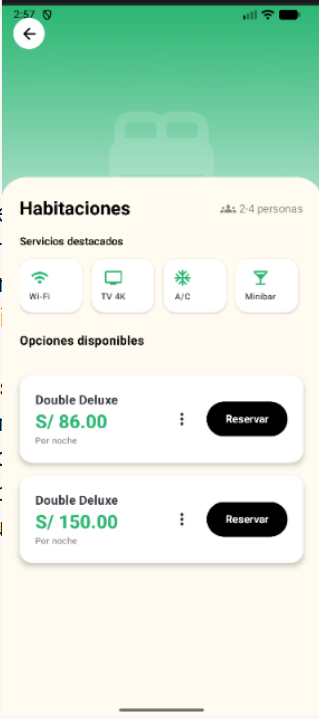
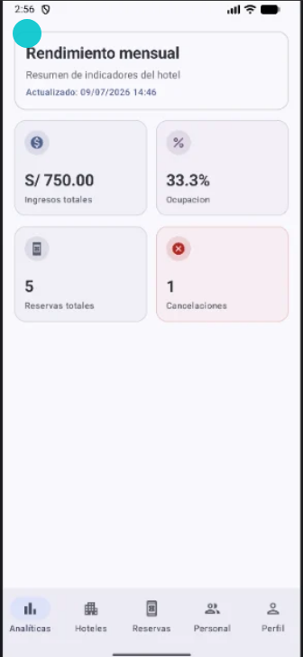
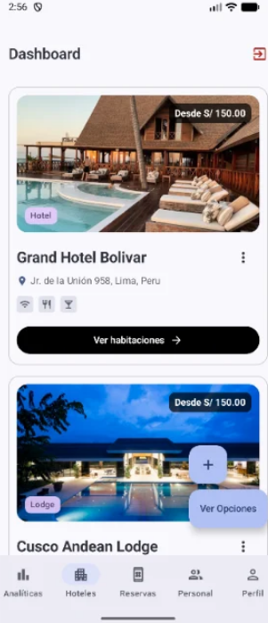
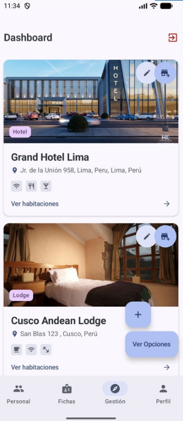


---

##### 5.2.1.3.6. Services Documentation Evidence for Sprint Review

Durante el Sprint 3 se revisó y actualizó la documentación de los servicios necesarios para la versión final de SmartStay. Esta documentación permitió validar que los endpoints principales se encuentren disponibles y alineados con los flujos implementados en la aplicación móvil.

Los servicios documentados fueron:

- **Authentication Service:** Permite iniciar sesión, validar credenciales y devolver información del usuario autenticado.
- **Users Service:** Gestiona los datos principales de los usuarios y sus roles dentro del sistema.
- **Hotels Service:** Permite consultar, registrar y editar información de propiedades hoteleras.
- **Rooms Service:** Gestiona habitaciones, disponibilidad, categorías y cambios de estado.
- **Bookings Service:** Administra la creación, consulta y confirmación de reservas.
- **Payments Service:** Permite registrar pagos y devolver la confirmación de transacciones.
- **Notifications Service:** Soporta alertas internas relacionadas con reservas y cambios de estado.

La documentación fue revisada mediante Swagger/OpenAPI, verificando que los endpoints respondan correctamente y puedan ser consumidos desde la aplicación móvil.


Además, se verificó que los servicios mantengan una estructura coherente en sus respuestas, utilizando códigos de estado HTTP apropiados y mensajes comprensibles para los casos de éxito y error.

---

##### 5.2.1.3.7. Software Deployment Evidence for Sprint Review

Durante el Sprint 3 se realizó la validación final del despliegue de los componentes principales del proyecto SmartStay.

En primer lugar, se verificó que la Landing Page se encuentre publicada correctamente mediante Vercel. Esta página representa la presencia pública del producto y permite presentar la propuesta de valor de SmartStay a los usuarios interesados.

**URL de la Landing Page:**  
https://smartstay-movildev-landing.vercel.app/


Asimismo, se validó el despliegue del backend en Render, confirmando que los servicios principales se encuentren activos y accesibles desde la documentación Swagger/OpenAPI.

**URL del Back End / Swagger:**  
https://smartstay-movildev-api.onrender.com/scalar/


Finalmente, se generó una versión final de la aplicación móvil en formato APK para su ejecución y validación. Esta versión contiene los módulos integrados y fue utilizada para la demostración final del producto.

**Repositorio del APK:**  
https://github.com/Movil-dev-Aplicaciones-Moviles/APK.git


Con estas evidencias, se confirma que SmartStay cuenta con una landing page pública, servicios backend desplegados y una aplicación móvil lista para ser presentada como producto final del curso.

---

##### 5.2.1.3.8. Team Collaboration Insights during Sprint

Durante el Sprint 3, el equipo SmartStay trabajó de manera coordinada para completar la versión final del producto. La colaboración se centró en integrar funcionalidades, resolver errores, validar flujos completos y preparar las evidencias necesarias para la revisión final.

Acciones de colaboración realizadas:

- Se organizaron reuniones remotas para revisar el avance de las tareas finales.
- Se distribuyeron responsabilidades según el módulo asignado a cada integrante.
- Se utilizaron ramas específicas para funcionalidades nuevas del Sprint 3.
- Se realizaron merges hacia la rama develop para integrar los avances.
- Se creó una rama release/sprint-3 para preparar la versión final.
- Se ejecutaron pruebas de regresión antes del cierre del sprint.
- Se revisaron errores reportados durante la integración final.
- Se corrigieron problemas visuales detectados en dispositivos móviles.
- Se organizaron las evidencias de ejecución, despliegue y documentación.
- Se consolidó la versión final del informe y del producto.

El equipo logró mantener una comunicación constante durante el cierre del proyecto, priorizando las tareas críticas y asegurando que la aplicación pueda ser presentada de forma funcional. La colaboración entre los integrantes permitió completar los flujos principales de SmartStay y preparar una entrega final coherente con los objetivos del curso.

---

##### 5.2.1.3.9. Sprint 3 Final Review Summary

Al finalizar el Sprint 3, el equipo logró completar una versión final funcional de SmartStay. Esta versión integra los principales flujos de uso para huéspedes, staff y administradores, permitiendo demostrar el valor del producto como solución móvil para la gestión hotelera.

Los principales resultados obtenidos fueron:

- Implementación del home principal para el huésped.
- Creación de pantalla de resumen de reserva.
- Validación de fechas y disponibilidad antes de confirmar reservas.
- Implementación de pantalla de confirmación de pago.
- Manejo de errores en pagos y fallos de conexión.
- Mejora del dashboard operativo del staff.
- Implementación de actualización de estado de habitaciones.
- Sincronización de cambios de habitación con backend.
- Incorporación de notificaciones internas.
- Unificación visual de pantallas, botones y tarjetas.
- Corrección de problemas de scroll y diseño responsive.
- Integración final de flujos Guest, Staff y Admin.
- Ejecución de pruebas de regresión.
- Validación de servicios mediante Swagger/OpenAPI.
- Confirmación del despliegue de landing page, backend y APK.

En conclusión, el Sprint 3 permitió cerrar el ciclo de desarrollo de SmartStay con una versión más estable, integrada y lista para su presentación final. Esta iteración representó el paso de una aplicación con módulos funcionales separados hacia un producto completo, validado y alineado con la problemática planteada en el proyecto.

### 5.2.2. Implemented Landing Page Evidence


**La URL que nos entrega Github Pages para acceder a la landing page es la siguiente:**  
[https://smartstay-movildev-landing.vercel.app/](https://smartstay-movildev-landing.vercel.app/)

landing Page

Esta es la sección inicial, donde está el header.


Aquí se puede observar la sección donde se presenta a los productos que ofrecemos.


Esta sección describe las soluciones de acorde al tipo de propiedad.


Tenemos en esta sección acerca de precios por el servicio.


Aquí se puede observar la sección de reseñas.

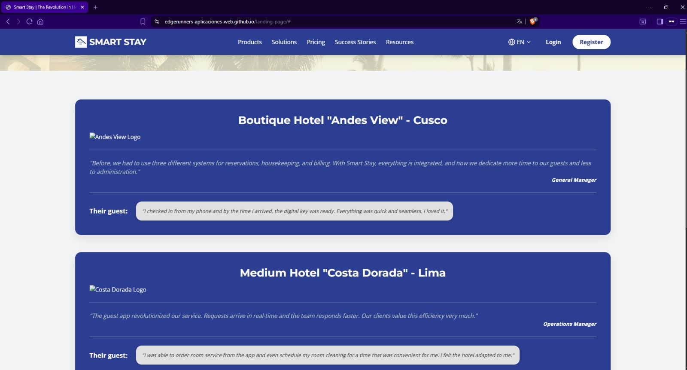

### 5.2.3. Implemented Frontend-Web Application Evidence

Frontend

En esta sección se puede ver las habitaciones disponibles.


En esta sección se puede ver las habitaciones disponibles desde el punto de vista de un administrador.

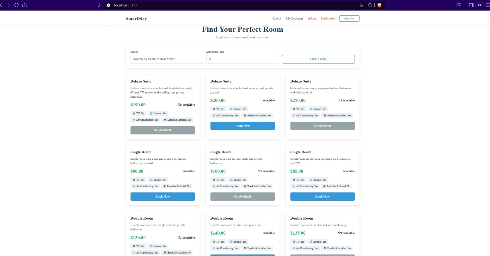

En esta sección se puede ver el panel del administrador.


En esta sección se puede ver el panel del administrador se puede ver un dashboard con las habitaciones.

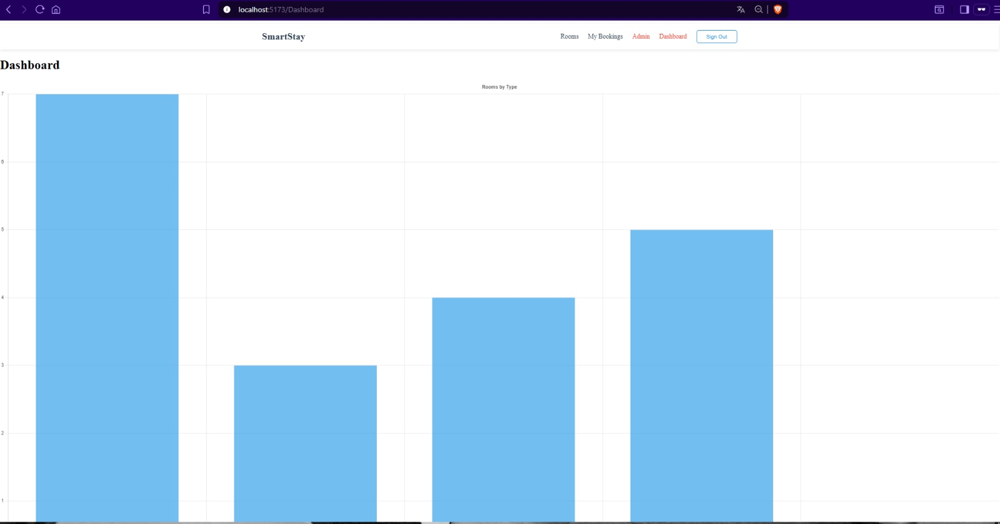

### 5.2.4. Implemented Native-Mobile Application Evidence

Durante el Sprint 2 se ejecutaron y validaron las funcionalidades desarrolladas dentro de la aplicación móvil SmartStay. Las pruebas se realizaron utilizando Android Studio, dispositivos físicos y servicios desplegados en la nube para verificar la correcta integración entre frontend y backend.


Durante el Sprint 3 se ejecutó la versión final de la aplicación móvil SmartStay, validando los principales flujos funcionales definidos para la presentación final. Las pruebas fueron realizadas en Android Studio y dispositivos móviles, utilizando servicios backend desplegados para comprobar la integración real del sistema.

Los flujos ejecutados fueron los siguientes:

- Inicio de sesión con usuario registrado.
- Redirección de pantalla según rol del usuario.
- Visualización del home del huésped.
- Consulta de hoteles y habitaciones disponibles.
- Visualización del resumen de reserva.
- Confirmación de reserva.
- Proceso de pago y pantalla de confirmación.
- Visualización del dashboard operativo del staff.
- Actualización del estado de habitaciones.
- Visualización de notificaciones internas.
- Validación de errores de conexión y datos inválidos.
- Navegación final entre módulos principales de la aplicación.


### 5.2.5. Implemented RESTful API and/or Serverless Backend Evidence

Durante este sprint se actualizó el bounded context de IAM/Authentication, incorporando mejoras relacionadas con la autenticación de usuarios y la gestión de roles dentro del sistema. La documentación de los servicios REST fue verificada mediante Swagger/OpenAPI, donde se evidencian los endpoints disponibles para el inicio de sesión y registro de usuarios.

**Authentication**: Este bounded context gestiona la autenticación de usuarios y el control de acceso basado en roles dentro de SmartStay. Sus servicios permiten registrar nuevos usuarios e iniciar sesión en la aplicación, retornando la información necesaria para identificar el rol del usuario y habilitar las funcionalidades correspondientes según sus permisos.


Asimismo, durante el sprint se trabajó con la lógica de roles para diferenciar el acceso de los distintos tipos de usuario del sistema, como Guest, Admin y ChainAdmin, permitiendo controlar qué secciones y acciones están disponibles para cada perfil dentro de la aplicación.

### 5.2.6. RESTful API documentation

**Profiles**: Este bounded context maneja la información de los perfiles de los usuarios dentro de la plataforma. Proporciona funcionalidades para crear perfiles, consultar su información y obtener el detalle de un perfil específico. Es esencial para almacenar y gestionar los datos personales asociados a cada usuario del sistema.


**Payments**: Este bounded context administra el procesamiento y la consulta de pagos dentro de la plataforma. Proporciona funcionalidades para registrar nuevos pagos y consultar los pagos asociados a una reserva específica. Es fundamental para garantizar la gestión financiera de las transacciones realizadas por los huéspedes.


**Authentication**: Este bounded context se encarga de la autenticación y el acceso de los usuarios al sistema. Proporciona funcionalidades para el registro de nuevos usuarios y el inicio de sesión seguro. Es esencial para validar credenciales, controlar el acceso a la plataforma y proteger la información de los distintos actores del sistema.


**Users**: Este bounded context maneja la información general de los usuarios registrados en la plataforma. Proporciona funcionalidades para consultar todos los usuarios y obtener la información de un usuario específico por su identificador. Es importante para la administración y supervisión de las cuentas existentes en el sistema.


**Bookings**: Este bounded context gestiona todo el ciclo de vida de las reservas. Proporciona funcionalidades para crear reservas, consultar reservas por identificador, listar todas las reservas, obtener reservas por habitación y ejecutar acciones como confirmar o cancelar una reserva. Es uno de los núcleos funcionales de la plataforma, ya que articula la relación entre huéspedes, habitaciones y disponibilidad.


**Analytics**: Este bounded context administra la generación y consulta de métricas analíticas del sistema. Proporciona funcionalidades para obtener indicadores de desempeño, como métricas mensuales de reservas. Es clave para apoyar la toma de decisiones mediante el análisis del rendimiento operativo de la plataforma.


**AccommodationOptions**: Este bounded context maneja las opciones complementarias relacionadas con los alojamientos. Proporciona funcionalidades para consultar y registrar categorías de hoteles, así como consultar y crear amenidades. Es importante para estructurar la información maestra del sistema y enriquecer la oferta disponible para hoteles y habitaciones.


**Hotels**: Este bounded context administra la información de los hoteles registrados en la plataforma. Proporciona funcionalidades para crear nuevos hoteles, listar todos los hoteles, consultar un hotel por identificador, actualizar su información y eliminarlo. Es esencial para gestionar las propiedades que forman parte del ecosistema SmartStay.


**Rooms**: Este bounded context maneja la información de las habitaciones asociadas a los hoteles. Proporciona funcionalidades para crear habitaciones, listar todas las habitaciones, consultar una habitación por identificador, actualizarlas, eliminarlas y filtrarlas por tipo. Es fundamental para la operación del sistema, ya que conecta directamente la capacidad de alojamiento con las reservas.


**RoomTypes**: Este bounded context administra los tipos de habitación disponibles en la plataforma. Proporciona funcionalidades para crear tipos de habitación, listarlos y consultar un tipo específico por identificador. Es importante para clasificar la oferta de habitaciones y mantener consistencia en la estructura del catálogo.


### 5.2.7. Team Collaboration Insights

**Acciones de colaboración destacadas:**
- Se utilizó **GitHub** como herramienta central de coordinación y control de versiones.
- Uno de los integrantes configuró el repositorio inicial y las ramas de trabajo.
- Cada miembro realizó **commits documentados** con los cambios implementados.
- Se llevaron a cabo **pull requests** para integrar las contribuciones al repositorio principal.
- Se realizaron revisiones de código en equipo para mantener la coherencia visual y funcional de la landing.

Gracias a este flujo de trabajo, el equipo pudo avanzar de forma paralela y ordenada, evitando conflictos en el código y asegurando un resultado consistente.

El equipo logró mantener una comunicación constante durante el cierre del proyecto, priorizando las tareas críticas y asegurando que la aplicación pueda ser presentada de forma funcional. La colaboración entre los integrantes permitió completar los flujos principales de SmartStay y preparar una entrega final coherente con los objetivos del curso.

## 5.3. Video About-the-Product

En el video se mostró una demo funcional de SmartStay, recorriendo sus principales funcionalidades: inicio de sesión, panel de administrador, y gestión de habitaciones y reservas, validando visualmente el cumplimiento de los criterios de aceptación definidos.

Link: https://youtu.be/34tPgoDW-wY

---

<div style="page-break-after: always;"></div>

# Avance de Conclusiones, Bibliografía y Anexos

## Conclusiones

Durante el desarrollo del proyecto se identificó que la operación hotelera de establecimientos medianos y boutique enfrenta una gestión fragmentada y manual: procesos de check-in/check-out con colas en recepción, habitaciones sin monitoreo ni control remoto, y personal operativo sin visibilidad en tiempo real del estado de las habitaciones. Esta situación, descrita en el Capítulo I mediante la técnica 5W+2H, se traduce en una pérdida estimada del 15% al 20% de la productividad operativa y en una experiencia del huésped desconectada de los servicios del hotel.

Frente a este problema, la startup Movildev plantea el producto SmartStay, que integra en una sola solución el check-in digital con control de acceso, el control del entorno de la habitación mediante IoT y aplicaciones móviles diferenciadas para el staff operativo (Android/Kotlin) y para el huésped (Flutter), soportadas por un backend RESTful y un gateway IoT. La propuesta busca reducir los tiempos de espera, optimizar la asignación de tareas del personal y ofrecer al huésped autonomía sobre su estancia.

## Bibliografía

Adzic, G. (s.f.). _Impact Mapping_. Recuperado de https://www.impactmapping.org/

Beck, K., Beedle, M., van Bennekum, A., Cockburn, A., Cunningham, W., Fowler, M., Grenning, J., Highsmith, J., Hunt, A., Jeffries, R., Kern, J., Marick, B., Martin, R. C., Mellor, S., Schwaber, K., Sutherland, J., & Thomas, D. (2001). _Manifesto for agile software development_. Agile Alliance. https://agilemanifesto.org/

CareerFoundry. (s.f.). _What are User Flows in User Experience (UX) Design?_. Recuperado de https://careerfoundry.com/en/blog/ux-design/what-are-user-flows/

Cohn, M. (s.f.). _User Stories_. Mountain Goat Software. Recuperado de https://www.mountaingoatsoftware.com/agile/user-stories

Cone, M. (s.f.). _The Markdown Guide_. Recuperado de https://www.markdownguide.org/

Conventional Commits. (s.f.). _Conventional Commits_. Recuperado de https://www.conventionalcommits.org/

Cucumber. (s.f.). _Gherkin Reference_. Recuperado de https://cucumber.io/docs/gherkin/reference/

Driessen, V. (2010). _A successful Git branching model_. nvie.com. Recuperado de https://nvie.com/posts/a-successful-git-branching-model/

DZone. (s.f.). _Acceptance Criteria in Scrum: Explanation, Examples, and Template_. Recuperado de https://dzone.com/articles/acceptance-criteria-in-software-explanation-exampl

Evans, E. (2004). _Domain-Driven Design: Tackling Complexity in the Heart of Software_. Addison-Wesley Professional. Recuperado de https://www.oreilly.com/library/view/domain-driven-design-tackling/0321125215/

Fowler, M. (2006). _Ubiquitous Language_. Recuperado de https://martinfowler.com/bliki/UbiquitousLanguage.html

Google. (2025). _Firebase documentation_. https://firebase.google.com/docs

Google. (s.f.). _Google HTML/CSS Style Guide_. Recuperado de https://google.github.io/styleguide/htmlcssguide.html

Google. (s.f.). _Google JavaScript Style Guide_. Recuperado de https://google.github.io/styleguide/jsguide.html

Gothelf, J., & Seiden, J. (2021). _Lean UX: Designing Great Products with Agile Teams_ (3rd ed.). O'Reilly Media. Recuperado de https://www.oreilly.com/library/view/lean-ux-2nd/9781491953594/

HubSpot. (s.f.). _Full List of Meta Tags, Why They Matter for SEO & How to Write Them_. Recuperado de https://blog.hubspot.com/marketing/meta-tags

IBM Design. (s.f.). _Empathy Map_. Enterprise Design Thinking. Recuperado de https://www.ibm.com/design/thinking/page/toolkit/activity/empathy-map

IBM Design. (s.f.). _As-is Scenario Map_. Enterprise Design Thinking. Recuperado de https://www.ibm.com/design/thinking/page/toolkit/activity/as-is-scenario-map

Instituto Nacional de Estadística e Informática. (2024). _Estadísticas de tecnologías de información y comunicación en los hogares_. INEI. https://www.inei.gob.pe

International Organization for Standardization. (2011). _ISO/IEC 25010:2011 — Systems and software engineering — Systems and software quality requirements and evaluation (SQuaRE) — System and software quality models_. https://www.iso.org/standard/35733.html

Martin, R. C. (2017). _Clean Architecture: A Craftsman's Guide to Software Structure and Design_. Prentice Hall. Recuperado de https://www.oreilly.com/library/view/clean-architecture-a/9780134494272/

Mendel, J. (s.f.). _Seriously, what's your (startup's) problem?_. Medium. Recuperado de https://medium.com/@jakemendel/seriously-whats-your-startup-s-problem-b3a884c54ab4

Miro. (2025). _Miro: The visual workspace for innovation_. https://miro.com

Nielsen Norman Group. (1994). _10 Usability Heuristics for User Interface Design_. Recuperado de https://www.nngroup.com/articles/ten-usability-heuristics/

Nielsen Norman Group. (2016). _The Four Dimensions of Tone of Voice_. Recuperado de https://www.nngroup.com/articles/tone-of-voice-dimensions/

OWASP Foundation. (2021). _OWASP top ten_. https://owasp.org/www-project-top-ten/

Preston-Werner, T. (s.f.). _Semantic Versioning 2.0.0_. Recuperado de https://semver.org/

Progressa Lean. (s.f.). _5W+2H - Técnica de análisis de problemas_. Recuperado de https://www.progressalean.com/5w2h-tecnica-de-analisis-de-problemas/

Refactoring.Guru. (s.f.). _Design Patterns_. Recuperado de https://refactoring.guru/es/design-patterns

Flutter Team. (s.f.). _Flutter documentation_. Recuperado de https://docs.flutter.dev

Google. (s.f.). _Dart programming language_. Recuperado de https://dart.dev

Google. (s.f.). _Developing with Flutter_. Recuperado de https://flutter.dev

Ries, E. (2011). _The lean startup: How today's entrepreneurs use continuous innovation to create radically successful businesses_. Crown Business.

UXPressia. (s.f.). _User vs. Buyer Persona: Differences and free template_. Recuperado de https://uxpressia.com/blog/user-persona-vs-buyer-persona-difference

Vernon, V. (2016). _Domain-Driven Design Distilled_. Addison-Wesley Professional. Recuperado de https://www.oreilly.com/library/view/domain-driven-design-distilled/9780134434964/

Vernon, V. (s.f.). _Domain-Driven Design Reference_. Recuperado de https://domainlanguage.com/ddd/reference/

## Anexos

### Video App Validation

**Pendiente:** incorporar la evidencia de App Validation.

Link: -

### Video About The Product

Link: [Video-About-The-Product](https://youtu.be/34tPgoDW-wY)

### Video About The Team

**Pendiente:** incorporar la evidencia de About The Team.

Link: -


<h3>Repositorios de la Organización</h3>

**Organización:** [9097-Experimentos-SmartStay](https://github.com/9097-Experimentos-SmartStay)

<table>
  <thead>
    <tr>
      <th>Repositorio</th>
      <th>URL</th>
    </tr>
  </thead>
  <tbody>
    <tr>
      <td>Report</td>
      <td>https://github.com/9097-Experimentos-SmartStay/Report</td>
    </tr>
    <tr>
      <td>backend</td>
      <td>https://github.com/9097-Experimentos-SmartStay/backend</td>
    </tr>
    <tr>
      <td>frontend</td>
      <td>https://github.com/9097-Experimentos-SmartStay/frontend</td>
    </tr>
    <tr>
      <td>mobile</td>
      <td>https://github.com/9097-Experimentos-SmartStay/mobile</td>
    </tr>
    <tr>
      <td>landing-page</td>
      <td>https://github.com/9097-Experimentos-SmartStay/landing-page</td>
    </tr>
  </tbody>
</table>

<h3>Links de Despliegue</h3>

<table>
  <thead>
    <tr>
      <th>Componente</th>
      <th>URL</th>
    </tr>
  </thead>
  <tbody>
    <tr>
      <td>Backend (API)</td>
      <td>https://smartstay-movildev-api.onrender.com/scalar/</td>
    </tr>
    <tr>
      <td>Frontend Web</td>
      <td>https://smartstay-movildev-web.vercel.app</td>
    </tr>
    <tr>
      <td>Landing Page</td>
      <td>https://smartstay-movildev-landing.vercel.app/</td>
    </tr>
  </tbody>
</table>
