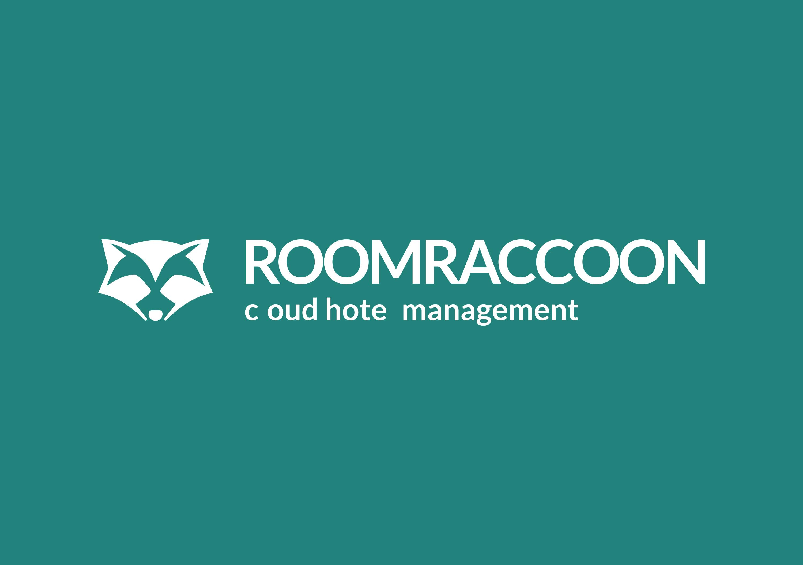
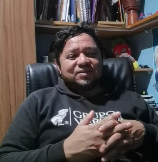
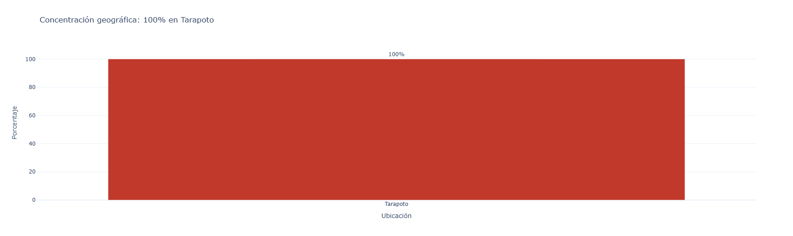
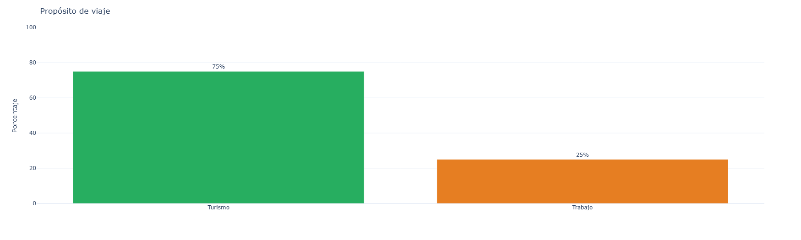
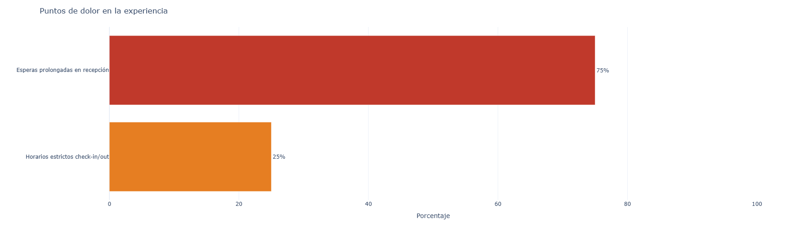
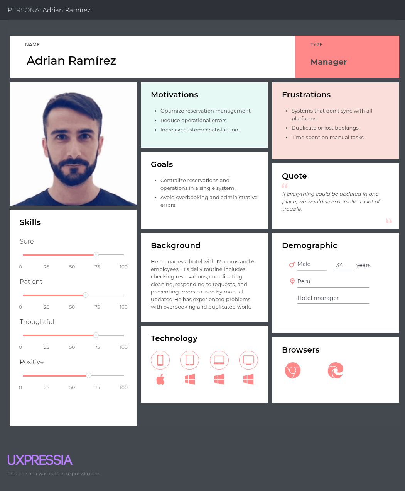
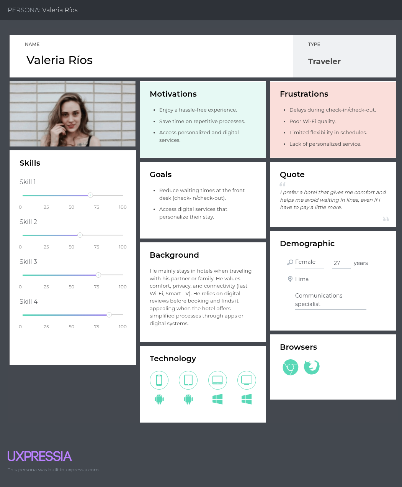
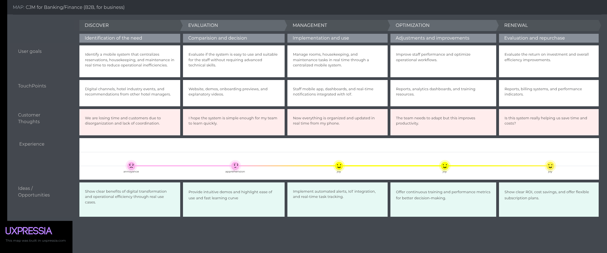
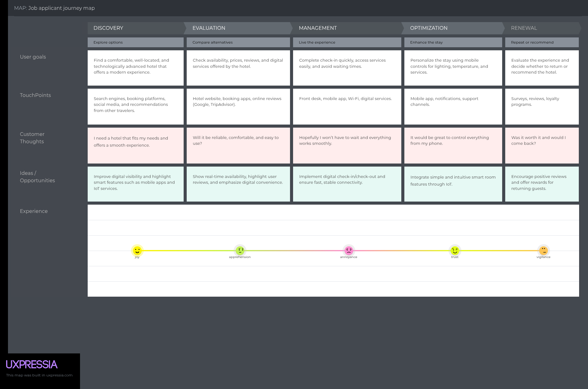

# Capítulo II: Requirements Elicitation & Analysis

## 2.1. Competidores

El mercado de soluciones para gestión hotelera presenta diversos actores. Sin embargo, la mayoría se centra en interfaces web, dejando un vacío en la experiencia móvil fluida e integrada con dispositivos físicos (IoT) que Smart Stay busca cubrir.

### 2.1.1. Análisis competitivo

<table border="1" cellpadding="10" cellspacing="0" style="width: 100%; border-collapse: collapse; font-family: Segoe UI, Arial, sans-serif; font-size: 13px; border: 1px solid #000;">
  <thead>
    <tr>
      <th style="text-align: left; width: 15%; border: 1px solid #000;">¿Por qué llevar a cabo este análisis?</th>
      <th colspan="4" style="text-align: left; border: 1px solid #000;">El objetivo es identificar las brechas tecnológicas en la oferta actual de gestión hotelera para diferenciar a Smart Stay mediante una experiencia móvil nativa e integración IoT dirigida a hoteles boutique en LATAM.</th>
    </tr>
    <tr style="text-align: center;">
      <th style="border: 1px solid #000;">Categoría / Aspecto</th>
      <th style="border: 1px solid #000;"><strong>Smart Stay</strong> </th>
      <th style="border: 1px solid #000;"><strong>Oracle Hospitality</strong> </th>
      <th style="border: 1px solid #000;"><strong>Room Raccoon</strong> </th>
      <th style="border: 1px solid #000;"><strong>Sistemas Manuales</strong> </th>
    </tr>
  </thead>
  <tbody>
    <tr>
      <td colspan="5" style="font-weight: bold; border: 1px solid #000; letter-spacing: 1px;">PERFIL</td>
    </tr>
    <tr>
      <td style="border: 1px solid #000;"><strong>Overview</strong></td>
      <td style="border: 1px solid #000;">Plataforma de gestión hotelera con enfoque en hoteles boutique, integrando IoT y una experiencia móvil nativa para el huésped.</td>
      <td style="border: 1px solid #000;">Soluciones globales y robustas (PMS/OPERA) diseñadas para la gestión de grandes cadenas hoteleras internacionales.</td>
      <td style="border: 1px solid #000;">SaaS en la nube todo-en-uno (PMS, Channel Manager) intuitivo, orientado a hoteles pequeños e independientes.</td>
      <td style="border: 1px solid #000;">Sistemas tradicionales basados en herramientas físicas o digitales básicas como Excel y registros en papel.</td>
    </tr>
    <tr>
      <td style="border: 1px solid #000;"><strong>Ventaja competitiva</strong> <small>¿Qué valor ofrece a los clientes?</small></td>
      <td style="border: 1px solid #000;">Control total del entorno de la habitación y personalización profunda desde una <strong>aplicación móvil nativa</strong>.</td>
      <td style="border: 1px solid #000;">Reconocimiento de marca global, alta confiabilidad y cumplimiento de estándares para operaciones a gran escala.</td>
      <td style="border: 1px solid #000;">Facilidad de implementación, soporte técnico valorado y una interfaz puramente web simplificada.</td>
      <td style="border: 1px solid #000;">Costo de adquisición nulo y flexibilidad operativa total al no depender de infraestructura de software especializada.</td>
    </tr>
    <tr>
      <td colspan="5" style="font-weight: bold; border: 1px solid #000; letter-spacing: 1px;">PERFIL DE MARKETING</td>
    </tr>
    <tr>
      <td style="border: 1px solid #000;"><strong>Mercado objetivo</strong></td>
      <td style="border: 1px solid #000;">Hoteles boutique y medianos en crecimiento en Latinoamérica que buscan diferenciación tecnológica.</td>
      <td style="border: 1px solid #000;">Grandes cadenas hoteleras transnacionales y resorts de lujo con procesos operativos complejos.</td>
      <td style="border: 1px solid #000;">Pequeños hoteles, hostales, Bed & Breakfasts y apartamentos turísticos de gestión independiente.</td>
      <td style="border: 1px solid #000;">Micro-hoteles o establecimientos con baja madurez tecnológica que no han iniciado su transformación digital.</td>
    </tr>
    <tr>
      <td style="border: 1px solid #000;"><strong>Estrategias de marketing</strong></td>
      <td style="border: 1px solid #000;">Posicionamiento basado en la modernización, eficiencia operativa móvil y la "Experiencia del Huésped 4.0".</td>
      <td style="border: 1px solid #000;">Ventas corporativas directas (B2B), branding global y presencia en las principales conferencias del sector.</td>
      <td style="border: 1px solid #000;">Marketing digital enfocado en SEO/SEM, resaltando la facilidad de uso y las reseñas positivas de usuarios.</td>
      <td style="border: 1px solid #000;">Inexistente; la adopción se da por costumbre o falta de conocimiento de alternativas digitales.</td>
    </tr>
    <tr>
      <td colspan="5" style="font-weight: bold; border: 1px solid #000; letter-spacing: 1px;">PERFIL DE PRODUCTO</td>
    </tr>
    <tr>
      <td style="border: 1px solid #000;"><strong>Productos & Servicios</strong></td>
      <td style="border: 1px solid #000;">PMS, Channel Manager, Motor de Reservas y <strong>aplicaciones móviles</strong> para huéspedes y personal con control IoT.</td>
      <td style="border: 1px solid #000;">Suite OPERA Cloud (PMS, Ventas, POS) con reportes avanzados e integraciones extensas.</td>
      <td style="border: 1px solid #000;">Plataforma unificada que incluye PMS, Channel Manager, sistema de pagos y gestión de limpieza (Housekeeping).</td>
      <td style="border: 1px solid #000;">Plantillas de hojas de cálculo, libros de registro físico y calendarios manuales.</td>
    </tr>
    <tr>
      <td style="border: 1px solid #000;"><strong>Precios & Costos</strong></td>
      <td style="border: 1px solid #000;">Modelo SaaS por suscripción mensual escalable + inversión inicial en hardware para los dispositivos IoT.</td>
      <td style="border: 1px solid #000;">Licenciamiento de nivel empresarial con costos elevados de implementación, soporte y mantenimiento especializado.</td>
      <td style="border: 1px solid #000;">Esquema de suscripción mensual transparente y accesible, basado principalmente en el número de habitaciones.</td>
      <td style="border: 1px solid #000;">Gratuito o limitado al costo de licencias básicas de software de oficina.</td>
    </tr>
    <tr>
      <td style="border: 1px solid #000;"><strong>Canales de distribución</strong> <small>(Web y/o Móvil)</small></td>
      <td style="border: 1px solid #000;">Plataforma en la nube y <strong>aplicaciones móviles nativas</strong> (Android/iOS) y multiplataforma.</td>
      <td style="border: 1px solid #000;">Aplicación web basada en la nube optimizada para terminales de escritorio en estaciones de trabajo.</td>
      <td style="border: 1px solid #000;">Interfaz web accesible desde navegadores a través de cualquier dispositivo con conexión a internet.</td>
      <td style="border: 1px solid #000;">Offline; requiere presencia física para la manipulación y consulta de registros.</td>
    </tr>
    <tr style="text-align: center;">
      <td colspan="5" style="font-weight: bold; border: 1px solid #000; letter-spacing: 1px;">ANÁLISIS SWOT</td>
    </tr>
    <tr>
      <td style="border: 1px solid #000;"><strong>Fortalezas</strong></td>
      <td style="border: 1px solid #000;">Propuesta de valor única con IoT y enfoque en <strong>desarrollo móvil nativo</strong>.</td>
      <td style="border: 1px solid #000;">Líder indiscutible del mercado con un producto altamente robusto y escalable.</td>
      <td style="border: 1px solid #000;">Proceso de configuración rápido y excelente reputación en el segmento PYME.</td>
      <td style="border: 1px solid #000;">Simplicidad absoluta sin necesidad de capacitación técnica para el personal.</td>
    </tr>
    <tr>
      <td style="border: 1px solid #000;"><strong>Debilidades</strong></td>
      <td style="border: 1px solid #000;">Marca nueva en el mercado; requiere educación del cliente sobre la instalación de hardware físico.</td>
      <td style="border: 1px solid #000;">Interfaz de usuario compleja y costos de entrada prohibitivos para hoteles locales pequeños.</td>
      <td style="border: 1px solid #000;">Funcionalidades limitadas para la gestión de dispositivos físicos y hardware en tiempo real.</td>
      <td style="border: 1px solid #000;">Propenso a errores humanos críticos, nula capacidad de escala y falta de conectividad online.</td>
    </tr>
    <tr>
      <td style="border: 1px solid #000;"><strong>Oportunidades</strong></td>
      <td style="border: 1px solid #000;">Alta demanda de soluciones sin contacto (contactless) y experiencias digitales personalizadas.</td>
      <td style="border: 1px solid #000;">Migración de su extensa base de clientes antiguos hacia infraestructuras modernas en la nube.</td>
      <td style="border: 1px solid #000;">Expansión hacia mercados emergentes mediante la adición de módulos de gestión simplificados.</td>
      <td style="border: 1px solid #000;">La necesidad obligatoria de digitalización representa el punto de partida para adoptar software básico.</td>
    </tr>
    <tr>
      <td style="border: 1px solid #000;"><strong>Amenazas</strong></td>
      <td style="border: 1px solid #000;">Competidores establecidos desarrollando módulos móviles básicos para competir en el mismo nicho.</td>
      <td style="border: 1px solid #000;">Surgimiento de startups ágiles que ofrecen soluciones especializadas a una fracción del costo.</td>
      <td style="border: 1px solid #000;">Saturación del mercado de PMS básicos y guerra de precios entre proveedores SaaS.</td>
      <td style="border: 1px solid #000;">Cualquier solución de software gratuita o de bajo costo representa una amenaza existencial para este método.</td>
    </tr>
  </tbody>
</table>

### 2.1.2. Estrategias y tácticas frente a competidores

Para posicionarse de forma efectiva frente a la competencia, **Smart Stay** implementará las siguientes estrategias:

#### Estrategias

1. **Diferenciación Tecnológica**: Integrar la gestión hotelera con IoT de manera completa, algo que los competidores actuales aún no ofrecen de forma integral.
2. **Enfoque en nicho**: Dirigirnos específicamente a hoteles boutique y pequeños (20-100 habitaciones), un segmento que los grandes como Oracle o Amadeus suelen dejar de lado.
3. **Modelo de suscripción accesible**: Precios escalables según el número de habitaciones, lo que nos permite competir contra soluciones caras sin sacrificar ninguna funcionalidad.
4. **Soporte local y en español**: Ofrecer un acompañamiento cercano y personalizado que facilita la adopción, marcando una gran diferencia frente a competidores extranjeros.
5. **Valor medible**: Compromiso claro de reducir los costos operativos entre un 10-20%.

#### Tácticas

- **Programa piloto** con hoteles boutique de Lima para generar casos de éxito reales y testimonios auténticos.
- **Alianzas estratégicas** con gremios turísticos (como FEDECATUR) para acelerar la adopción en el sector.
- **Capacitación continua** para el personal hotelero, ayudando a reducir la resistencia al cambio.
- **Marketing digital enfocado en ROI**: Mostrar comparativas claras de costos y beneficios frente a los sistemas tradicionales.
- **Integraciones rápidas** con los PMS existentes para facilitar la migración y minimizar fricciones.
- **Atención postventa 24/7** como una ventaja competitiva clave frente a otras startups con soporte limitado.

## 2.2. Entrevistas

Con el objetivo de profundizar en las necesidades y expectativas de los segmentos objetivos, se realizaron entrevistas semiestructuradas a administradores de hoteles boutique y a huéspedes. Esta información cualitativa sirvió como base para identificar problemáticas actuales y orientar la definición de requisitos del sistema.

### 2.2.1. Diseño de entrevistas

### Entrevista – Segmento 1: Staff Operativo

1. ¿Cómo te llamas y qué cargo ocupas en el hotel?
2. ¿En qué distrito o ciudad se encuentra el hotel?
3. ¿Cuántas habitaciones y personal gestionan aproximadamente?
4. ¿Podrías contarme cómo es un día típico de trabajo administrando el hotel?
5. ¿Qué tan seguido deben gestionar procesos como reservas, check-in/check-out o facturación?
6. ¿Cómo suelen organizar actualmente la gestión de reservas y pagos?
7. ¿Han tenido dificultades con sobrerreservas, disponibilidad de habitaciones o errores de facturación?
8. ¿Qué dispositivos usas con mayor frecuencia para gestionar el hotel?
9. ¿Qué aplicaciones o sistemas usas actualmente en tu día a día para el manejo del hotel?
10. ¿Has tenido alguna dificultad o experiencia negativa al usarlas?
11. ¿Qué te motivaría a adoptar una nueva herramienta digital para centralizar reservas, pagos y tareas del personal?
12. Si una herramienta digital lograra optimizar tus operaciones y reducir tus costos, ¿cómo valorarías invertir en una suscripción mensual para acceder a ella?
13. ¿Cuáles son tus principales preocupaciones respecto a la gestión del hotel?

### Entrevista – Segmento 2: Huéspedes de Hoteles

1. ¿Cómo te llamas y con qué frecuencia viajas por turismo o trabajo?
2. ¿Qué tipo de hotel sueles elegir (boutique, cadena internacional, Airbnb, etc.) y por qué?
3. ¿Qué valoras más en un hotel: ubicación, precio, comodidad o servicios digitales?
4. ¿Cómo fue tu última experiencia de check-in y check-out? ¿Qué mejorarías?
5. ¿Qué tan importante es para ti poder personalizar tu habitación (temperatura, luz, limpieza, room service) desde tu celular u otro dispositivo tecnológico?
6. ¿Qué servicios digitales utilizas más durante tu estadía en un hotel (WiFi, app del hotel, WhatsApp, smart TV, llaves digitales)?
7. ¿Has tenido experiencias negativas con la gestión del hotel (esperas largas, problemas con el servicio, falta de personalización)?
8. ¿Qué opinas de un sistema que te permita hacer check-in sin pasar por recepción y controlar tu habitación desde una app?
9. ¿Estarías dispuesto a pagar un poco más por un hotel que ofrezca experiencias digitales y personalización avanzada? ¿Cuánto aproximadamente?
10. ¿Qué tanto influyen las reseñas digitales y la reputación online en tu decisión de reservar un hotel?
11. Si un hotel ofreciera un servicio totalmente digitalizado, ¿qué expectativa tendrías respecto al trato humano? ¿Lo consideras un valor agregado o no es necesario?
12. ¿Qué recomendarías para que la experiencia digital en un hotel sea cómoda y no complicada para los huéspedes?

### 2.2.2. Registro de entrevistas

### Entrevista – Segmento 1: Administradores de Hoteles Boutique y Pequeños

#### Entrevista 1

Datos del entrevistado:

**Nombre completo:** Adrian Saavedra Angulo

**Edad:** 34 años

**Ciudad:** Tarapoto

**Duración:** 8:07 minutos

**Evidencia:** 

**Resumen de la entrevista**

Adrián administra un hotel de 12 habitaciones en Tarapoto con un equipo de 6 personas. Su rutina diaria incluye revisar reservas, coordinar limpieza, organizar recojos y responder a nuevas solicitudes. Los procesos de reservas y facturación son constantes por el alto movimiento del negocio.
Aunque cuentan con un sistema propio, han tenido problemas de sobreventa porque no se sincroniza con todas las plataformas, lo que obliga a actualizaciones manuales y genera errores. Adrián estaría motivado a usar una herramienta que centralice la gestión y se integre con plataformas externas, siempre que el costo de suscripción sea razonable.

**URL del video:** <https://tinyurl.com/ywcf7dpk>

---

#### Entrevista 2

Datos del entrevistado:

**Nombre completo:** Monica Hernandez Vela

**Edad:** 33 años

**Ciudad:** Tarapoto

**Duración:** 5:53 minutos

**Evidencia:** 

**URL del video:** <https://tinyurl.com/59zmmrjb>
**Resumen de la entrevista**

Mónica administra un hotel de 12 habitaciones en Tarapoto con un equipo de 4 personas. Su rutina diaria incluye organizar los desayunos, coordinar la limpieza, asignar habitaciones, atender a los turistas y revisar constantemente las reservas. Utiliza un sistema propio a través de la página web del hotel, gestionado principalmente desde laptops y computadoras, y se comunica con su personal mediante WhatsApp.
Ha tenido dificultades con el uso del sistema actual y señala que le motivaría adoptar una herramienta digital que centralice la gestión de reservas y operaciones, siempre que pueda adaptarse a las características de su hotel. Considera razonable pagar una suscripción mensual si contribuye a mejorar los servicios del establecimiento.

---

#### Entrevista 3

Datos del entrevistado:
**Nombre completo:** Alejandra Beltrán Diaz

**Edad:** 23 años

**Ciudad:** Tarapoto

**Duración:** 4:11 minutos

**Evidencia:** 

**URL del video:** <https://tinyurl.com/2p9n2kmb>

**Resumen de la entrevista**

Valeria Alejandra administra un hotel de 19 habitaciones junto a un equipo de 5 personas. Su día típico comienza organizando al personal de limpieza, revisando las reservas recibidas por WhatsApp y luego trasladándolas a un archivo Excel para llevar el control. Su principal herramienta es este archivo, aunque reconoce que no siempre guarda correctamente la información, lo que ha ocasionado problemas con reservas perdidas.
También ha tenido experiencias negativas con WhatsApp, ya que a veces resulta difícil ubicar las reservas registradas en la aplicación. Para ella, un sistema ideal de gestión debería incluir notificaciones automáticas que recuerden las reservas del día. Valeria considera que pagar una suscripción mensual sería una buena opción si la herramienta realmente simplifica las labores administrativas del hotel.

---

### Entrevista – Segmento 2: Huéspedes de Hoteles Boutique

#### Entrevista 1

Datos del entrevistado:

**Nombre completo:** Diego Michael Segura Martínez

**Edad:** 25 años

**Distrito:** Santa Anita – Lima Metropolitana

**Duración:** 5:34 minutos

**Evidencia:** 

**URL del video:** <https://tinyurl.com/me55rvnx>

**Resumen de la entrevista**

Diego suele hospedarse en hoteles cuando viaja, principalmente con su pareja y en menor medida con su familia. Prefiere hoteles cómodos, con privacidad y buena experiencia. Valora la comodidad y los servicios digitales que simplifiquen su estadía.
Su principal frustración son las esperas en recepción y la falta de personalización. Le atrae la idea de un sistema digital que permita check-in/check-out sin filas y control de la habitación desde el celular (luz, temperatura, room service).
Utiliza principalmente WiFi y Smart TV, pero estaría dispuesto a usar una app centralizada. Confía en las reseñas digitales para tomar decisiones y estaría dispuesto a pagar entre 10% y 15% más por un hotel con experiencias digitales avanzadas.
Considera que el trato humano sigue siendo un valor agregado, aunque la digitalización es clave. Recomienda que los sistemas sean fáciles de usar y que cada hotel cuente con una página clara con descripción completa y disponibilidad de habitaciones en tiempo real.

---

#### Entrevista 2

Datos del entrevistado:

**Nombre completo:** Juan Salcedo

**Edad:** 44 años

**Distrito:** San Borja – Lima Metropolitana

**Duración:** 6:11 minutos

**Nombre:** Juan Salcedo  
**Edad:** 44 años  
**Distrito:** San Borja

**Evidencia:** 

**URL del video:** <https://tinyurl.com/3mv3ytt5>

**Resumen de la entrevista**

Juan viaja por trabajo cada 1-2 meses y prefiere alojamientos cómodos, autónomos y con buena conectividad, optando principalmente por Airbnb y, en menor medida, por hoteles. Valora especialmente la ubicación céntrica, el Wi-Fi de calidad y la facilidad tecnológica. Considera que los horarios estrictos de check-in y check-out son una gran limitación, y aunque nunca ha usado una habitación totalmente “smart”, le interesa la idea, aunque cree que aún no está bien implementada en Perú. No pagaría más por funciones digitales avanzadas, ya que las asocia con un público más joven. Usa Wi-Fi como servicio indispensable, junto con laptop y smartphone, y ha tenido experiencias negativas relacionadas con demoras en la atención y falta de limpieza, además de percibir una falta de personalización en el servicio. Recomienda priorizar la mejora del Wi-Fi (fibra óptica) y mantener una atención eficiente, considerando que la digitalización debe complementar, pero no reemplazar, el buen trato humano.

---

#### Entrevista 3

Datos del entrevistado:

**Nombre completo:** Tadeo Loja Beloglio

**Edad:** 22 años

**Distrito:** Santiago de Surco – Lima Metropolitana

**Duración:** 7:21 minutos

**Evidencia:** 

**URL del video:** <https://tinyurl.com/3ztyph92>

**Resumen de la entrevista**

Tadeo viaja por turismo una vez al año y suele elegir hoteles de cadenas internacionales porque le ofrecen mayor confianza y calidad de servicio, aunque también considera opciones boutique si el precio es conveniente. Lo que más valora es el precio y la comodidad, seguido de la ubicación. Su última experiencia de check-in fue lenta, mientras que el check-out resultó rápido, por lo que cree que ambos procesos deberían digitalizarse.

No considera esencial la personalización de la habitación, pero sí cómodo poder controlar luz y temperatura desde el celular. Durante sus estadías utiliza principalmente el WiFi y la smart TV, y le gustaría contar con llaves digitales.

Entre los problemas que ha tenido destacan las largas esperas en recepción y la falta de coordinación en la limpieza. Considera muy práctico un sistema de check-in digital y control de la habitación mediante una app, y estaría dispuesto a pagar hasta un 5% más por ello siempre que mejore la experiencia.

Las reseñas digitales influyen en un 70% en su decisión de reserva. Para él, el trato humano sigue siendo un valor agregado incluso en un hotel digitalizado, y recomienda que la experiencia digital se concentre en una app única, sencilla y con asistencia rápida.

### 2.2.3. Análisis de entrevistas

En esta sección se presenta un análisis detallado por cada segmento objetivo, identificando con sustento estadístico (porcentajes) todas las características objetivas y subjetivas que representan los aspectos más comunes de cada segmento, necesarios para la construcción de los arquetipos. La información se basa en las entrevistas registradas y sus respectivos resúmenes, respaldada por fuentes académicas y de la industria.

**Segmento 1: Administradores de Hoteles Boutique y Pequeños**

**Características Demográficas**

**Perfil de Edad y Ubicación**
Los administradores entrevistados presentan una edad promedio de **30.0 años**, con un rango que va desde los 23 hasta los 34 años.

El **100%** de los entrevistados se ubican en Tarapoto, lo que indica una concentración geográfica específica en esta región turística del Perú. Este hallazgo se alinea con las tendencias nacionales, ya que según _Statista Market Forecast (2025)_, Peru ha experimentado un crecimiento significativo en el mercado hotelero, posicionándose como un actor clave en la industria hotelera latinoamericana.

**Características del Negocio**
Los hoteles administrados por este segmento tienen un tamaño promedio de **14.3 habitaciones**, con un rango que va desde 12 hasta 19 habitaciones, confirmando que se trata efectivamente de establecimientos boutique y pequeños. El equipo de trabajo promedio es de **5.0 personas**, variando entre 4 y 6 empleados, lo que refleja operaciones de escala reducida pero con estructura organizacional definida. Estas características coinciden con las tendencias identificadas por _Statista_, donde los viajeros en Perú buscan cada vez más experiencias únicas y auténticas, impulsando la demanda de hoteles boutique.

**Herramientas Tecnológicas Actuales**

**Diversidad de Sistemas**
El análisis revela una heterogeneidad en los sistemas utilizados:

- **66.7%** (2 de 3 administradores) utilizan sistemas propios desarrollados para sus hoteles.
- **33.3%** (1 de 3 administradores) depende de herramientas básicas como Excel y WhatsApp.

Esta distribución indica que, aunque la mayoría cuenta con algún nivel de digitalización, existe una brecha significativa en la sofisticación de las herramientas empleadas. Este panorama refleja los hallazgos de un estudio académico sobre barreras de adopción tecnológica en hoteles pequeños y medianos, donde se identificó que la falta de recursos financieros, conocimiento de TI y resistencia al cambio son las principales limitaciones.

**Problemas Identificados**

**Distribución Equitativa de Problemas**
Cada administrador enfrenta diferentes tipos de desafíos, con una distribución del **33.3%** para cada categoría:

- **Problemas de sincronización:** Adrián experimenta sobreventa debido a la falta de sincronización entre plataformas.
- **Dificultades operativas:** Mónica tiene complicaciones con el uso de su sistema actual.
- **Pérdida de información:** Alejandra sufre pérdidas de reservas por las limitaciones de sus herramientas básicas.

Estas problemáticas están documentadas en la literatura académica, donde se ha identificado que las organizaciones hoteleras pequeñas y medianas son más reluctantes a adoptar nuevas tecnologías de información que las más grandes, debido a la falta de entrenamiento, recursos financieros limitados y percepción de costos elevados.

**Actitud hacia Nueva Tecnología**

**Unanimidad en la Aceptación**
Los resultados muestran una receptividad completa hacia soluciones tecnológicas mejoradas:

- **100%** de los administradores expresan motivación para adoptar una nueva herramienta de gestión.
- **100%** están dispuestos a pagar una suscripción mensual, siempre que el costo sea razonable y justifique la mejora en la eficiencia operativa.

Esta disposición positiva contrasta con estudios previos pero se alinea con las tendencias post-pandemia. Según _Oracle Hospitality & Skift (2022)_, el **89%** de los ejecutivos hoteleros latinoamericanos afirmaron que la pandemia aceleró su adopción de tecnología hotelera, comparado con el 76% globalmente.

---

**Segmento 2: Huéspedes de Hoteles Boutique**

**Características Demográficas**

**Perfil Generacional**
Los huéspedes entrevistados tienen una edad promedio de **28.0 años**, con un rango de 21 a 44 años. El **75%** pertenece a la generación Millennial/Gen Z (menores de 26 años), lo que sugiere un segmento predominantemente joven y digitalmente nativo. Esta composición demográfica es especialmente relevante, ya que según _Hotel Tech Report (2025)_, los millennials son **57% más propensos** a ser influenciados por la tecnología hotelera.

**Patrones de Viaje y Preferencias Tecnológicas**

**Propósito y Frecuencia**
El análisis de los patrones de viaje revela:

- **75%** viaja por turismo (Diego, Tadeo, Joaquín).
- **25%** viaja por trabajo (Juan).
- **100%** mantiene una frecuencia regular de viaje (anual o cada 1-2 meses).

Las preferencias de esta generación están bien documentadas en la investigación de _Mews (2025)_, que indica que las estimaciones sugieren que los millennials representarán el **50%** de los huéspedes hoteleros en los próximos años, convirtiéndolos en críticos para los ingresos y el crecimiento de marca de los hoteles.

**Problemas Más Frecuentes y Expectativas Digitales**

**Consenso en Puntos de Dolor**
Los problemas identificados muestran patrones claros:

- **75%** experimenta esperas prolongadas en recepción como principal frustración.
- **25%** señala problemas con horarios estrictos de check-in/check-out.

Estos hallazgos se correlacionan directamente con estudios globales de la industria. Según _Oracle Hospitality & Skift (2022)_, el **65%** de los huéspedes desean que los hoteles ofrezcan tecnologías que minimicen el contacto con el personal y otros huéspedes. Además, el **43%** de los huéspedes de lujo esperan no hacer filas, según _Hotel Tech Report (2025)_.

**Actitud hacia la Digitalización**

**Alta Receptividad Tecnológica**
Los resultados demuestran una fuerte inclinación hacia soluciones digitales:

- **75%** muestra alto interés en digitalización de servicios hoteleros.
- **75%** está dispuesto a pagar un sobrecosto por experiencias digitales mejoradas.
- **100%** considera las reseñas digitales como factor influyente en sus decisiones.

- Estos datos se alinean con investigaciones globales que indican que el **74%** de los huéspedes esperan poder hacer en línea cualquier cosa que ya pueden hacer en persona o por teléfono. Además, el **48%** de los huéspedes considera las reseñas en línea como el factor principal para elegir un hotel.

**Disposición de Pago por Digitalización**

- **25%** pagaría entre 10-15% adicional.
- **50%** pagaría entre 5-10% adicional.
- **25%** no pagaría sobrecosto adicional.

La disposición a pagar por tecnología varía según la generación. Mientras que el **35%** de la Gen Z considera que la velocidad del Wi-Fi es más importante que la comodidad de la cama, los usuarios de mayor edad muestran menos disposición a pagar extra por funciones digitales avanzadas.

**Influencia de Reseñas Digitales**

- **50%** reporta alta influencia de reseñas (70% o más en su decisión).
- **100%** considera las reseñas como factor relevante en su proceso de selección.

Esta tendencia refleja datos globales donde las reseñas en línea han reemplazado el boca a boca tradicional, con los millennials consultando plataformas como TripAdvisor, Google y redes sociales antes de reservar.

## 2.3. Needfinding

### 2.3.1. User Personas

**Segmento 1 – Administradores de Hoteles Boutique y Pequeños en Lima**

**Segmento 2 – Huéspedes de Hoteles**

### 2.3.2. User Task Matrix

En esta sección se presenta el **User Task Matrix**, que concentra las tareas que los User Persona realizan para cumplir sus objetivos en la gestión hotelera y la experiencia de estadía. Las tareas descritas existen independientemente de cualquier solución de software, pero se analizan considerando el contexto de digitalización, movilidad e integración con tecnologías IoT.

Se consideran dos segmentos con sus respectivos User Persona:

- **Administradores de Hoteles Boutique y Pequeños en Lima** (User Persona: Administrador)  
- **Huéspedes de Hoteles Boutique** (User Persona: Huésped)  

---

### Matriz de Tareas

| Tarea / Task | Administradores Frecuencia | Administradores Importancia | Huéspedes Frecuencia | Huéspedes Importancia |
|-------------|--------------------------|-----------------------------|----------------------|-----------------------|
| Centralizar reservas, housekeeping y mantenimiento en un solo sistema | Alta | Alta | Media | Alta |
| Evitar sobreventa mediante sincronización en tiempo real | Media | Alta | Baja | Media |
| Gestionar check-in/check-out digital (sin contacto) | Alta | Alta | Alta | Alta |
| Monitorear ocupación, disponibilidad y estado de habitaciones en tiempo real | Alta | Alta | Media | Media |
| Generar reportes operativos y métricas (KPIs) | Media | Alta | Baja | Media |
| Gestionar pagos y facturación digital | Media | Alta | Media | Alta |
| Coordinar housekeeping y mantenimiento con notificaciones en tiempo real | Alta | Alta | Baja | Media |
| Capacitar al personal en el uso de aplicaciones móviles | Media | Media | Baja | Media |
| Controlar costos operativos y consumo energético (IoT) | Media | Alta | Baja | Media |
| Integrar canales digitales (OTAs, apps, plataformas online) | Media | Alta | Media | Alta |
| Gestionar reseñas y reputación digital | Media | Alta | Alta | Alta |
| Personalizar servicios y comunicación con el huésped | Media | Media | Media | Alta |
| Realizar reservas y pagos desde el móvil | — | — | Alta | Alta |
| Realizar check-in/check-out sin contacto | — | — | Alta | Alta |
| Controlar la habitación mediante app (luces, temperatura, servicios IoT) | — | — | Media | Alta |
| Solicitar servicios del hotel desde la app (room service, soporte) | — | — | Alta | Alta |
| Acceder a información del hotel y recomendaciones digitales | — | — | Media | Media |
| Evaluar experiencia y dejar reseñas post-estadía | — | — | Media | Alta |

---

### Análisis

#### Tareas de mayor frecuencia e importancia compartidas

- **Gestión de check-in/check-out digital:** Alta/Alta en ambos perfiles, siendo un punto crítico que impacta directamente en la experiencia del huésped y la eficiencia operativa.  
- **Gestión de reseñas y reputación digital:** Alta importancia en ambos segmentos, ya que influye en la decisión de futuros clientes y en los ingresos del hotel.  

---

#### Tareas críticas para Administradores

Las tareas más relevantes están orientadas a la **optimización operativa mediante digitalización y tiempo real**, entre ellas:

- Centralizar reservas, housekeeping y mantenimiento  
- Monitorear ocupación y estado de habitaciones en tiempo real  
- Evitar sobreventa mediante sincronización de datos  
- Integrar múltiples canales digitales  
- Gestionar pagos, facturación y reportes  

Además, destaca el:

- **Control de costos operativos y consumo energético (IoT)**  
  → Alta importancia por su impacto financiero y eficiencia del hotel  

---

#### Tareas críticas para Huéspedes

El huésped presenta un enfoque **mobile-first**, priorizando:

- Reservas y pagos desde el smartphone  
- Check-in/check-out sin contacto  
- Solicitud de servicios mediante apps  
- Experiencia personalizada dentro de la habitación  

También destacan:

- **Control del entorno mediante IoT (luces, temperatura, servicios)**  
- Acceso rápido a información y servicios digitales  

---

#### Diferencias clave

- **Administradores:** Enfocados en eficiencia operativa, coordinación interna y control de recursos.  
- **Huéspedes:** Enfocados en rapidez, autonomía, comodidad y experiencia digital personalizada.  

---

#### Coincidencias

- Ambos segmentos valoran procesos rápidos y eficientes.  
- Ambos dependen de una **correcta gestión de información en tiempo real**.  
- Existe una alineación clara hacia la **digitalización, automatización y autoservicio**.  

### 2.3.3. User Journey Mapping

El **User Journey Mapping** permite visualizar las etapas que recorren los usuarios desde el descubrimiento de la solución hasta la evaluación final de su experiencia. A través de este recurso se identifican los objetivos de los usuarios, los puntos de contacto con el servicio, sus pensamientos, percepciones y oportunidades de mejora en cada fase del proceso.

En el caso de **Smart Stay**, se elaboraron dos mapas diferenciados según los segmentos objetivos:

- **Segmento 1:** enfocado en la gestión operativa y la centralización de reservas.

- **Segmento 2:** centrado en la experiencia de estadía y la digitalización de servicios.

Estos recorridos permiten detectar fricciones, validar expectativas y proponer mejoras orientadas a optimizar tanto la gestión hotelera como la satisfacción de los huéspedes.

### 2.3.4. Empathy Mapping

El Empathy Mapping permite comprender en profundidad las emociones, pensamientos y comportamientos de los usuarios, facilitando una conexión más humana con sus necesidades reales. A través de esta herramienta, se identifican los dolores, motivaciones y expectativas de los distintos perfiles, lo que contribuye al diseño de soluciones más relevantes y personalizadas.

En el caso de Smart Stay, se elaboraron dos mapas de empatía diferenciados según los segmentos objetivos:

##### 1. Segmento Objetivo 1: STAFF OPERATIVO

##### 2. Segmento Objetivo 2: HUÉSPEDES

Estos mapas permiten visualizar cómo cada tipo de usuario piensa, siente y actúa frente al servicio, además de reconocer los puntos de dolor (pains) y las ganancias esperadas (gains). El análisis conjunto de ambos segmentos brinda una visión integral para mejorar la eficiencia operativa del hotel y elevar la satisfacción del huésped, alineando tecnología y experiencia humana.

#### 1. Segmento Objetivo 1: STAFF OPERATIVO

---

#### 2. Segmento Objetivo 2: HUÉSPEDES

### 2.3.5. As-is Scenario Mapping

**Pendiente:** versión As-Is del scenario mapping con filas Phases / Doing / Thinking / Feeling. No existe una fuente equivalente en los reportes de referencia (Movil-dev documenta Big Picture EventStorming, no As-Is Scenario Mapping).

## 2.4. Ubiquitous Language

| **Término en Inglés**        | **Término en Español**             | **Definición**                                                                                                                                      |
|------------------------------|------------------------------------|-----------------------------------------------------------------------------------------------------------------------------------------------------|
| Hotel Administrator          | Administrador del hotel            | Usuario encargado de la gestión operativa del hotel. Supervisa reservas, limpieza, facturación y coordinación con el personal.                      |
| Reservation Management       | Gestión de reservas                | Proceso centralizado de registro, confirmación, modificación y cancelación de reservas en tiempo real.                                              |
| Overbooking                  | Sobreventa                         | Situación en la que el hotel vende más habitaciones de las disponibles debido a la falta de sincronización en los sistemas de reserva.              |
| Housekeeping Schedule        | Programación de limpieza           | Organización de tareas de limpieza y mantenimiento de habitaciones, coordinadas desde el sistema de gestión.                                        |
| Digital Check-In / Check-Out | Registro digital de entrada/salida | Funcionalidad que permite al huésped ingresar o salir del hotel sin necesidad de hacer filas en recepción, a través de una aplicación o portal web. |
| Guest Profile                | Perfil del huésped                 | Información digital del cliente que incluye preferencias, historial de estadías y solicitudes especiales.                                           |
| Smart Room Control           | Control inteligente de habitación  | Función que permite al huésped manejar servicios como iluminación, temperatura o room service desde su dispositivo móvil.                           |
| Real-Time Notification       | Notificación en tiempo real        | Alerta automática que informa sobre nuevas reservas, cambios en disponibilidad o solicitudes de huéspedes.                                          |
| Financial Report             | Reporte financiero                 | Documento digital generado por el sistema que resume ingresos, gastos y métricas clave para evaluar la rentabilidad del hotel.                      |
| Guest Feedback               | Retroalimentación del huésped      | Opiniones y calificaciones que los huéspedes comparten sobre su estadía, utilizadas para mejorar los servicios.                                     |
