# Capítulo IV: Product Design

## 4.1. Style Guidelines

Nuestra base es establecer la identidad visual y de diseño de Smart Stay, asegurando coherencia, claridad y usabilidad en todos los puntos de contacto de la marca, tanto en medios digitales como en experiencias del usuario.

Objetivo:
- Alinear la comunicación visual y de producto con la misión de la startup.
-	Garantizar una experiencia de usuario clara, accesible y atractiva.
-	Facilitar la integración de diseño en web y aplicaciones móviles con un lenguaje unificado.

### 4.1.1. General Style Guidelines

**Branding**

- Logo Smart Stay: El logo principal de la startup con el que se muestra ante el público.


- Logo Modo Oscuro: Este logo es creado para contrastar en fondos oscuros, lo cual permite la protección de la vista del usuario y favorece el rendimiento de la batería de su dispositivo.


- Logo Plus: Es una versión del logo con un color que resalta más elegancia, el cual se usa para los usuarios que opten por usar la suscripción plus del servicio.

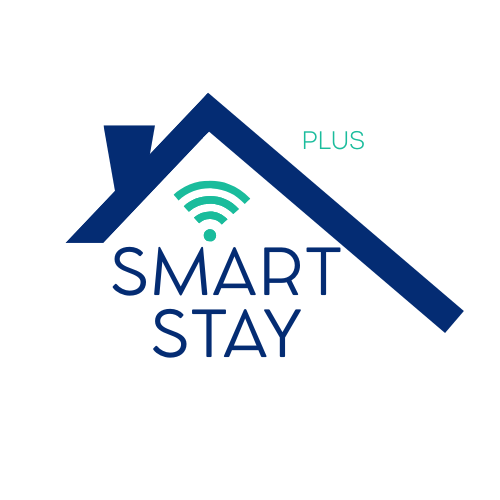

- Logo Plus Modo Oscuro: Tiene la misma función que el logo modo oscuro con la diferencia de que sirve para la suscripción plus.

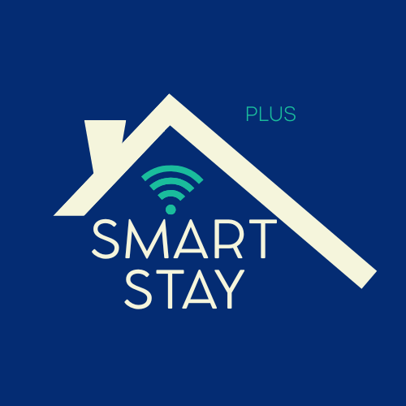

- Logos Monocromáticos: Logos con paleta de colores blanco y negro, cuyo uso es exclusivo para impresiones y documentos.


**Tipografía**

- Fuente principal (Brand & Títulos):
  Cocomat Pro
  Uso: Logo, headers, títulos principales en la app/web.
  Razón: Da un aire moderno y premium, con un estilo limpio que refuerza la identidad de la marca.

- Fuente secundaria (Texto y párrafos)
  Open Sans o Lato
  Uso: Textos descriptivos, botones, menús, correos y cualquier contenido largo.
  Razón: Son altamente legibles en pantallas, versátiles y complementan la elegancia de Cocomat Pro sin competir con ella.

- Jerarquía de uso
1. Títulos (H1, H2): Cocomat Pro Bold.
2. Subtítulos / énfasis: Cocomat Pro Medium.
3. Texto general / párrafos: Open Sans Regular.
4. Botones y menús: Open Sans SemiBold.

- Sistema Tipográfico
  H1 (Títulos principales):
  Cocomat Pro Bold – 32px

H2 (Subtítulos / secciones):
Cocomat Pro Medium – 24px

H3 (Bloques / cards):
Cocomat Pro Medium – 20px

Texto cuerpo (párrafos):
Open Sans Regular – 16px

Texto secundario / notas:
Open Sans Regular – 14px

Botones primarios:
Open Sans SemiBold – 16px (MAYÚSCULAS)


**Paleta de colores**
Espaciado de líneas: 1.5x en párrafos para mayor legibilidad.
Uso de color:
- Primario: Azul Marino (#2C3E91) → solidez, profesionalismo.
- Secundario: Dorado/Naranja Suave (#E67E22) → lujo, calidez.
- Neutros: Beige (#F5F5DC), Gris medio (#BDC3C7), Blanco (#FFFFFF).
- Apoyos: Verde agua (#1ABC9C) → frescura, sostenibilidad.


**Dimensiones**
- Cercano y humano: Hablar como si fueras un amigo confiable, sin tecnicismos innecesarios.
- Claro y directo: Frases cortas, fáciles de entender, sin rodeos.
- Inspirador: Transmitir seguridad y motivación para que el usuario sienta que tomó la mejor decisión.
- Profesional pero cálido: Ni demasiado rígido ni demasiado informal.

### 4.1.2. Web Style Guidelines

**Páginas principales**

- Home: enfoque en storytelling + CTA (“Probar demo”).
- Productos: módulos claros (cards azules) con descripciones cortas.
- Soluciones: bloques con imágenes + botones de acción (descargar brochure).
- Precios:  tabla comparativa clara (Plan Normal vs Plan Plus).
  

**Encabezados Hero (Landing)**

- Imagen grande en 16:9 con overlay oscuro: refuerza contraste con texto.
- Texto principal: H1 32px, Cocomat Pro Bold en blanco.
- Botón destacado (CTA): Naranja Suave (#E67E22) en mayúsculas.
  

**Cards y Bloques de Contenido**

- Fondo azul marino (#2C3E91), texto blanco.
- Iconografía minimalista y consistente.
- Bordes redondeados 12px + sombra suave.
- Espaciado interno: 24px padding.
- Uso de grillas para mantener equilibrio visual.
  

**Tablas Comparativas (Precios)**

- Fondo alternado con colores que definen los planes para mejorar lectura.
- Encabezados fijos con H2 Medium 24px.
- Marca de “incluido” en check.
- Elementos no incluidos  sin check.
- Botón “Mejorar plan” en naranja como llamada a la acción final.
  

**Footer**

- Fondo azul marino sólido.
- Texto en blanco y gris claro.
- Columnas organizadas con links en Open Sans 14px.
- Inclusión de iconos sociales en fila inferior.
  

**Uso de Color en Web**

- Azul Marino (#2C3E91) → fondos de bloques, navegación, footer.
- Naranja Suave (#E67E22) → CTAs principales.
  -Verde Agua (#1ABC9C) → énfasis positivo (checks, beneficios, “incluido”).
- Beige (#F5F5DC) → fondos neutros para separar secciones.

**Comportamiento UX**

- Hover Cards → elevación (sombra) + cambio leve en tono de fondo.
- Hover Botones → transición 0.3s de azul → naranja.
- Scroll suave en anclas de página.
- Menú sticky superior para navegación rápida.
  

### 4.1.3. Mobile Style Guidelines

#### 4.1.3.1. iOS Mobile Style Guidelines

**Pendiente:** lineamientos de estilo específicos para iOS (Human Interface Guidelines). No existe una fuente equivalente en los reportes de referencia.

#### 4.1.3.2. Android Mobile Style Guidelines

**Pendiente:** lineamientos de estilo específicos para Android (Material Design). No existe una fuente equivalente en los reportes de referencia.

## 4.2. Information Architecture

### 4.2.1. Organization Systems

En el diseño de interfaces digitales centradas en el usuario, el Sistema de Organización es el componente de la arquitectura de información encargado de definir cómo se agrupan, clasifican y presentan los contenidos dentro de la plataforma. Su objetivo principal es permitir que los usuarios puedan explorar, comprender y acceder a la información de forma rápida e intuitiva, reduciendo la carga cognitiva y mejorando la usabilidad del sistema.

Para la solución Smart Stay, se ha implementado un sistema de organización híbrido que combina estructuras jerárquicas, funcionales y orientadas a tareas. Esta decisión responde a la necesidad de gestionar dos tipos de usuarios principales: el Staff Operativo y los Huéspedes, cada uno con objetivos y flujos de interacción distintos dentro de la aplicación móvil.

En la Landing Page, el contenido se organiza en bloques priorizados que siguen una lógica de captación y conversión. En primer lugar, se destacan las llamadas a la acción principales, como “Probar Demo” o “Explorar Funcionalidades”, seguidas por la propuesta de valor del sistema, donde se explica el uso de tecnologías móviles e IoT para la gestión hotelera. El encabezado (header) y el pie de página (footer) estructuran la navegación mediante accesos directos a secciones clave como beneficios, características, planes y contacto.

Esta organización permite que los usuarios comprendan rápidamente qué ofrece Smart Stay y cómo interactuar con la plataforma, aplicando principios de jerarquía visual, progressive disclosure y adaptabilidad a dispositivos móviles.


En la Aplicación Móvil, la organización del contenido está orientada a tareas y roles. El acceso inicial se realiza mediante autenticación (login), donde el usuario es redirigido automáticamente según su perfil (Staff o Huésped).

Una vez dentro del sistema, la estructura se organiza en módulos principales accesibles desde la navegación inferior o menú principal:

- Dashboard: vista general del estado del sistema.
- Habitaciones: gestión de disponibilidad y estado.
- Servicios: solicitudes y gestión de requerimientos.
- Perfil: configuración del usuario.

Cada módulo se desglosa en subniveles donde se presentan funcionalidades específicas, manteniendo una estructura jerárquica clara:

- Nivel 1: módulos principales
- Nivel 2: submódulos (ej. tareas de limpieza, incidencias)
- Nivel 3: acciones específicas (ej. marcar habitación como limpia)

Adicionalmente, se aplica una organización contextual, donde la información cambia según la acción del usuario. Por ejemplo:

- Durante el check-in: se priorizan datos del huésped.
- Durante operaciones del staff: se priorizan tareas y estados en tiempo real.
- Durante la estancia: se destacan servicios y control de habitación.

Asimismo, algunos procesos siguen una organización secuencial, como el check-in digital o la solicitud de servicios, guiando al usuario paso a paso para evitar errores.


### 4.2.2. Labeling Systems

El sistema de etiquetado define cómo se nombran las secciones, botones y funcionalidades dentro de la aplicación, permitiendo que el usuario comprenda rápidamente el propósito de cada elemento. En Smart Stay, las etiquetas se diseñan bajo principios de claridad, consistencia y orientación al usuario, adaptándose tanto al Staff Operativo como a los Huéspedes.

---

| Etiqueta | Ubicación / Componente | Función |
|----------|------------------------|--------|
| Home | Header / Navegación principal | Redirige a la pantalla principal o dashboard. Permite acceso rápido al inicio. |
| Rooms | Menú principal / App | Acceso a la gestión de habitaciones (estado, disponibilidad, mantenimiento). |
| Services | Menú principal | Muestra los servicios disponibles (limpieza, room service, soporte). |
| Dashboard | Pantalla principal | Vista general del estado del sistema y resumen de operaciones. |
| Bookings | Módulo de reservas | Permite gestionar reservas activas y futuras. |
| Check-in | Flujo principal | Permite registrar la entrada del huésped de forma digital. |
| Check-out | Flujo principal | Permite finalizar la estancia del huésped de forma rápida. |
| Login | Pantalla de acceso | Inicio de sesión del usuario. Término estándar y reconocido. |
| Sign Up | Pantalla de acceso | Registro de nuevos usuarios. Corto, claro y amigable. |
| Try Demo | Landing Page (CTA) | Llamada a la acción principal para probar la aplicación. |
| My Room | App Huésped | Acceso al control de la habitación (IoT, temperatura, iluminación). |
| Requests | App Huésped | Permite solicitar servicios del hotel desde el móvil. |
| Tasks | App Staff | Gestión de tareas operativas (limpieza, mantenimiento). |
| Notifications | Icono / App | Muestra alertas en tiempo real sobre eventos importantes. |
| Profile | Menú usuario | Configuración de cuenta y preferencias del usuario. |
| Settings | Menú secundario | Ajustes generales del sistema. |
| Reports | App Staff | Acceso a métricas y reportes operativos del hotel. |
| Contact | Landing / App | Permite comunicación con el hotel o soporte técnico. |


### 4.2.3. SEO Tags and Meta Tags

Los SEO tags y meta tags son elementos fundamentales dentro de la Landing Page de Smart Stay, ya que permiten mejorar la visibilidad del sistema en motores de búsqueda, facilitar su indexación y optimizar la forma en que se presenta tanto en resultados de búsqueda como en redes sociales.

Además, estos elementos son clave para garantizar una correcta visualización en dispositivos móviles, mejorar la experiencia del usuario y aumentar la tasa de interacción (CTR).

La Landing Page de Smart Stay implementa etiquetas esenciales como: charset, viewport, title, description, keywords y favicon, las cuales permiten estructurar correctamente la información del sitio.

---

### Meta charset

```html
<meta charset="UTF-8">
```

- Define la codificación de caracteres de la página.
- Permite que el contenido se muestre correctamente, incluyendo tildes, símbolos y caracteres especiales.
- Es fundamental para evitar errores de visualización en distintos navegadores.

---

### Meta viewport

```html
<meta name="viewport" content="width=device-width, initial-scale=1.0">
```

- Permite que la página sea responsive.
- Ajusta automáticamente el contenido al tamaño de la pantalla del dispositivo.
- Mejora la experiencia de usuario en smartphones y tablets.

---

### Title

```html
<title>Smart Stay</title>
```

- Define el título de la página que aparece en la pestaña del navegador.
- Es uno de los factores más importantes para SEO.
- Se muestra como encabezado principal en los resultados de búsqueda.

---

### 1. Meta Tags principales

- **charset:** Define la codificación del documento. UTF-8 es el estándar actual.
- **viewport:** Permite adaptar la página a diferentes dispositivos y resoluciones.
- **description:** Proporciona un resumen del contenido de la página. Es el texto que aparece debajo del título en los resultados de búsqueda.
- **keywords:** Lista de palabras clave relacionadas con el sistema (ej. hotel management, mobile app, IoT hotel).
- **author:** Identifica al creador del contenido (Smart Stay Team).

---

### 2. Meta Tags para Redes Sociales (Open Graph)

```html
<meta property="og:title" content="Smart Stay">
<meta property="og:description" content="Solución móvil para gestión hotelera con IoT">
<meta property="og:image" content="assets/logo.png">
<meta property="og:url" content="https://smartstay.com">
```

- Permiten controlar cómo se muestra la página al compartirla en redes sociales.
- Mejoran la apariencia visual del enlace (imagen, título y descripción).
- Aumentan la probabilidad de interacción del usuario.

---

### 3. Otros elementos importantes

**Favicon:**

```html
<link rel="icon" href="assets/favicon.png">
```

- Representa el icono del sitio en la pestaña del navegador.
- Refuerza la identidad visual de la marca.

**Canonical URL:**

```html
<link rel="canonical" href="https://smartstay.com">
```

- Evita problemas de contenido duplicado en buscadores.


### 4.2.4. Searching Systems

El sistema de búsqueda de Smart Stay permite a los usuarios localizar información, reservas, servicios y funcionalidades de manera rápida y eficiente. En la Landing Page, la búsqueda está orientada a descubrir contenido general sobre la plataforma, utilizando accesos directos, enlaces destacados y navegación guiada hacia secciones clave como “Try Demo” o “Benefits”.

En la aplicación móvil, el sistema de búsqueda es más funcional y está enfocado en la gestión de información específica. Permite a los usuarios filtrar y ordenar datos como habitaciones, reservas, servicios o tareas operativas, utilizando autocompletado, filtros dinámicos y persistencia de resultados. El diseño se basa en principios de usabilidad, consistencia y eficiencia, asegurando que el usuario encuentre lo que necesita sin dificultad.

---

| Search Type | Location / Component | Function |
|-------------|---------------------|----------|
| General Search | Landing Page / Header | Permite buscar información general sobre la plataforma y sus servicios (ej. "servicios", "demo", "beneficios"). Incluye autocompletado básico. |
| Try Demo / Benefits Links | Landing Page / Hero & Value Sections | Funciona como búsqueda indirecta, guiando al usuario hacia contenido relevante sin necesidad de ingresar texto. |
| Rooms Search | Mobile App / Rooms Section | Permite buscar habitaciones por número, estado (disponible, ocupado, mantenimiento) o tipo. |
| Bookings Search | Mobile App / Bookings Section | Filtrado por fechas, estado de reserva (pendiente, confirmada, cancelada) y tipo de cliente. |
| Services Search | Mobile App / Services Section | Permite buscar servicios disponibles (limpieza, room service, soporte técnico) mediante filtros y categorías. |
| Tasks Search | Mobile App / Staff Module | Permite al staff localizar tareas asignadas por prioridad, estado o tipo de actividad. |
| Notifications Search | Mobile App / Notifications Panel | Permite revisar alertas y eventos importantes mediante filtrado por tipo o fecha. |


### 4.2.5. Navigation Systems

El sistema de navegación de Smart Stay define cómo los usuarios se desplazan dentro de la plataforma, permitiendo acceder a las distintas secciones de forma clara, rápida e intuitiva. Este sistema está diseñado bajo principios de consistencia, accesibilidad y eficiencia, adaptándose tanto a la Landing Page como a la aplicación móvil.

---

### Landing Page Navigation

| Navigation Item | Location / Component | Function |
|-----------------|----------------------|----------|
| Home | Header | Enlace a la página principal. Permite regresar al inicio desde cualquier sección. |
| Services | Header | Acceso directo a la sección de servicios ofrecidos por la plataforma. |
| Benefits | Header / Value Section | Redirige a la sección donde se explican las ventajas del sistema. |
| Contact | Header | Permite acceder al formulario de contacto o soporte. |
| Sign Up | Header (button) | Registro de nuevos usuarios. Botón destacado visualmente. |
| Login | Header (button) | Acceso a la cuenta del usuario. Fácil de localizar. |
| Try Demo | Hero Section (CTA principal) | Llamada a la acción principal para probar la plataforma. |
| About | Footer / Company | Información institucional de Smart Stay. |
| Privacy Policy | Footer / Legal | Acceso a políticas de privacidad del sistema. |
| Terms & Conditions | Footer / Legal | Información sobre condiciones de uso de la plataforma. |

---

### Mobile Application Navigation

| Navigation Item | Location / Component | Function |
|-----------------|----------------------|----------|
| Dashboard | Bottom Navigation | Vista general del sistema con información resumida. |
| Rooms | Bottom Navigation | Acceso a la gestión y estado de habitaciones. |
| Services | Bottom Navigation | Permite visualizar y solicitar servicios disponibles. |
| Profile | Bottom Navigation | Configuración del usuario y preferencias personales. |
| Notifications | Top Bar / Icon | Acceso a alertas y eventos importantes en tiempo real. |
| Tasks | Staff Module | Permite gestionar tareas operativas asignadas al personal. |
| Bookings | App Module | Acceso a reservas activas, historial y gestión de huéspedes. |
| Back Navigation | App Screens | Permite regresar a la pantalla anterior de forma intuitiva. |


## 4.3. Landing Page UI Design

### 4.3.1. Landing Page Wireframe

Los wireframes representan la primera aproximación al diseño de la interfaz de Smart Stay.  
Se han desarrollado en formato blanco y negro, sin imágenes ni estilos gráficos, para enfocarse únicamente en la estructura, disposición de los elementos y flujo de navegación.

El objetivo de estos wireframes es:
- Establecer la arquitectura de información de la plataforma.
- Definir la jerarquía de contenidos en cada sección.
- Validar la navegación y experiencia de usuario antes de pasar al diseño visual (mockups).

A continuación, se presenta un resumen de cada una de las secciones.

**1. Home**
- **Propósito:** Página principal de presentación de Smart Stay.
- **Elementos clave:**
    - Encabezado con menú de navegación.
    - Hero con nombre de la plataforma y botón de llamada a la acción (*CTA: Probar demo*).
    - Sección "¿Quiénes somos?" con breve descripción.
    - Bloques de beneficios y características principales.
    - Footer con enlaces de contacto, políticas y redes sociales.
      

**2. Products**
- **Propósito:** Mostrar los productos y módulos de la plataforma.
- **Elementos clave:**
    - Lista de funcionalidades divididas en áreas: gestión hotelera, experiencia del huésped, reportes, seguridad.
    - Descripción breve de cada módulo.
    - Botón de descarga de brochure.
      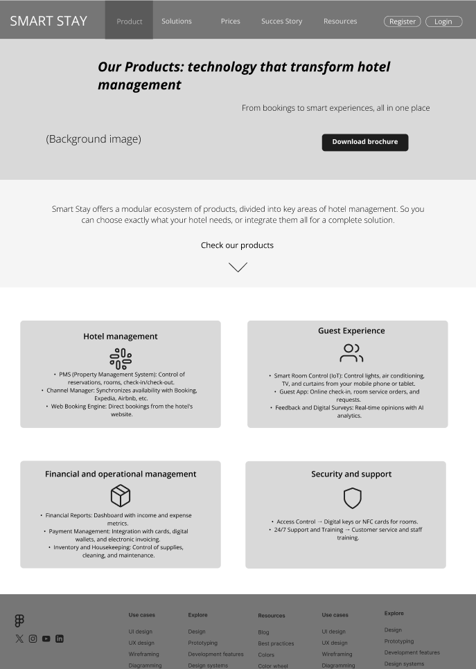

**3. Solutions**
- **Propósito:** Explicar cómo Smart Stay se adapta a diferentes tipos de hoteles.
- **Elementos clave:**
    - Sección para hoteles boutique.
    - Sección para alojamientos alternativos.
    - Sección para cadenas hoteleras.
    - Botón para descargar información detallada.
      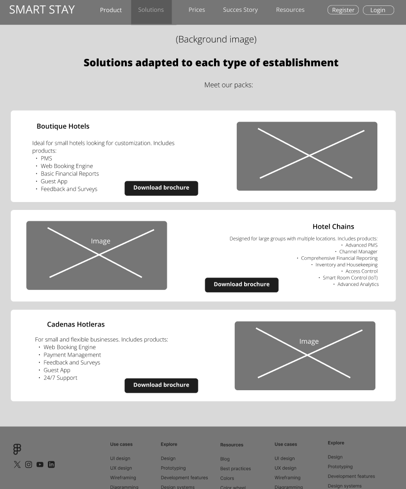


**4. Prices**
- **Propósito:** Detallar planes y costos de la plataforma.
- **Elementos clave:**
    - Tabla comparativa de funcionalidades entre Plan Normal y Plan Plus.
    - Categorías claras: gestión hotelera, experiencia huésped, seguridad, soporte.
      

**5. Success Stories**
- **Propósito:** Mostrar testimonios y ejemplos de hoteles que ya usan Smart Stay.
- **Elementos clave:**
    - Bloques con testimonios de clientes.
    - Descripción breve de resultados obtenidos (ahorro de tiempo, mejora de experiencia, reducción de costos).
      

**6. Resources**
- **Propósito:** Repositorio de materiales de apoyo y aprendizaje.
- **Elementos clave:**
    - Documentos descargables (guías, whitepapers, brochures).
    - Links de blogs.  
      

**7. Register**
- **Propósito:** Permitir que un nuevo usuario cree su cuenta.
- **Elementos clave:**
    - Formulario de registro con campos básicos (nombre, correo, contraseña, tipo de empresa).
    - Botón de registro.  
      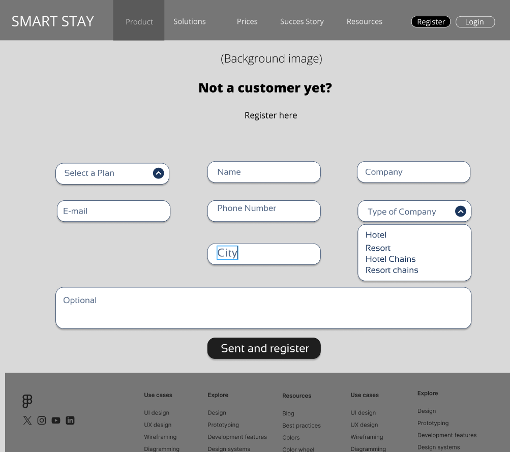

**8. Login**
- **Propósito:** Acceso de usuarios ya registrados.
- **Elementos clave:**
    - Formulario de inicio de sesión con correo y contraseña.
    - Botón de acceso.
    - Enlace a recuperación de contraseña y a registro.  
      

Los wireframes definen la base de navegación de Smart Stay, asegurando que cada sección tenga un propósito claro:
- **Home:** captar atención y presentar la plataforma.
- **Productos, Soluciones, Precios:** comunicar valor y opciones.
- **Casos de Éxito, Recursos:** generar confianza y soporte.
- **Registro y Login:** habilitar el acceso a la app.


### 4.3.2. Landing Page Mock-up

Tras la validación de los wireframes, se desarrollaron los mockups de alta fidelidad de Smart Stay.  
Estos mockups ya incorporan la identidad visual definida (colores, tipografía, logotipo e imágenes), con el objetivo de reflejar la experiencia final que tendrán los usuarios en la plataforma.

Su propósito es:
- Validar la usabilidad con un diseño más realista.
- Asegurar la coherencia con la guía de estilos definida.
- Proyectar cómo se verá cada sección en un entorno final.

**1. Landing Page**
- **Cambios respecto al wireframe:**
    - Se añadió el logotipo de Smart Stay en el header.
    - Paleta de colores aplicada (azul corporativo + tonos complementarios).
    - Imagen de fondo en el Hero con llamada a la acción resaltada (“Probar demo”).
    - Iconografía personalizada para los beneficios.  
      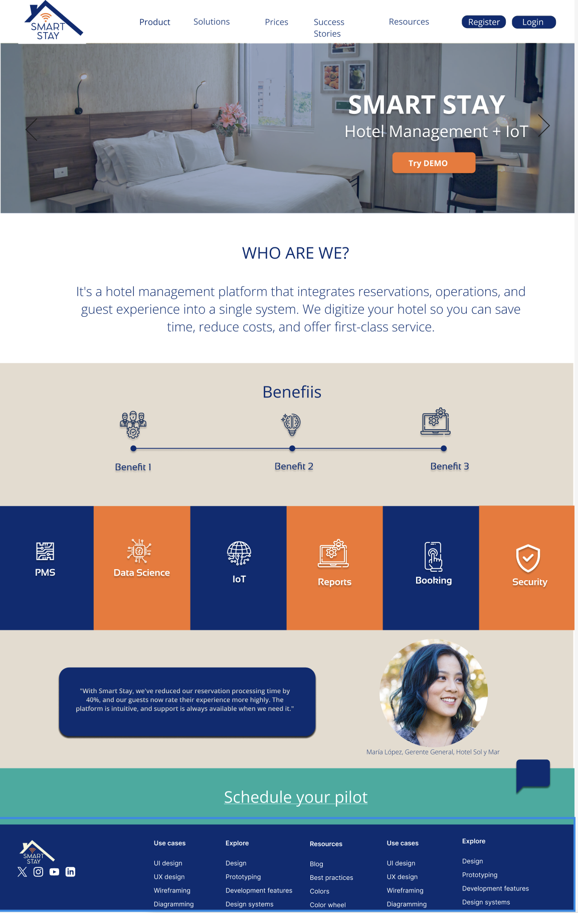

**2. Product**
-**Cambios respecto al wireframe:**
- Uso de íconos y colores diferenciados por módulo (gestión, experiencia huésped, seguridad, reportes).
- Inclusión de imágenes ilustrativas.
- Botón de descarga estilizado con colores de la marca.  
  

**3. Solutions**
- **Cambios respecto al wireframe:**
    - Bloques visuales para cada tipo de cliente (hoteles boutique, alojamientos alternativos, cadenas).
    - Uso de fotografías representativas de hoteles.
    - CTA destacado.
      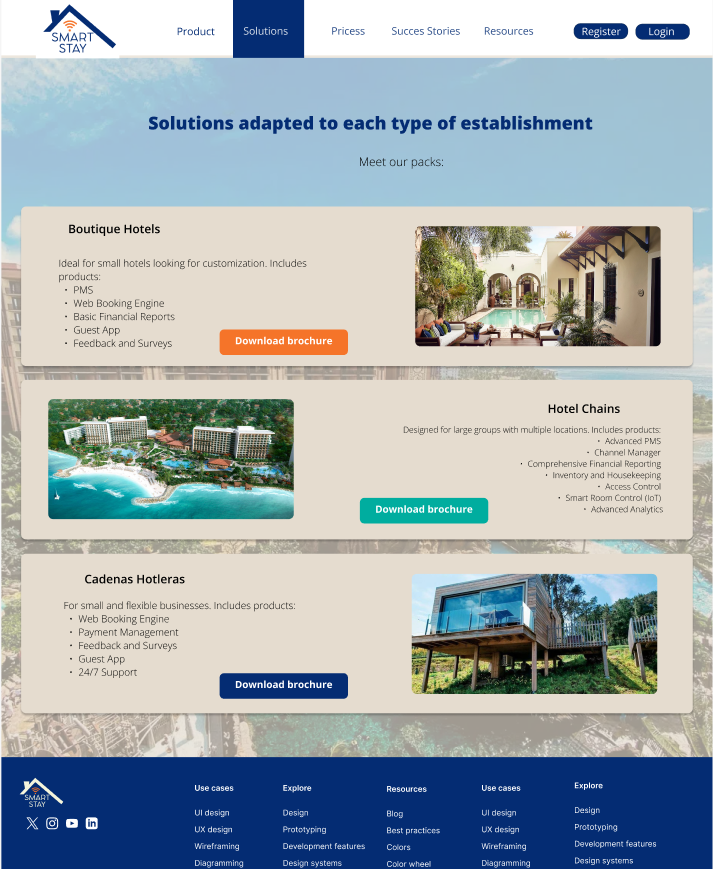

**4. Prices**
- **Cambios respecto al wireframe:**
    - Tabla de precios con colores diferenciadores por plan.
    - Plan recomendado resaltado con un fondo destacado.  
      

**5. Success Stories**
- **Cambios respecto al wireframe:**
    - Testimonios acompañados de logos reales de hoteles.  
      

**6. Resources**
- **Cambios respecto al wireframe:**
    - Secciones de miniaturas de documentos descargables.
    - Secciones de blog con botón de visitar página externa.
      

**7. Register**
- **Cambios respecto al wireframe:**
    - Formulario minimalista con campos estilizados.
    - Botón de “Enviar y registrar” resaltado en color primario.
    - Fondo con imagen ligera para dar contexto al servicio.
      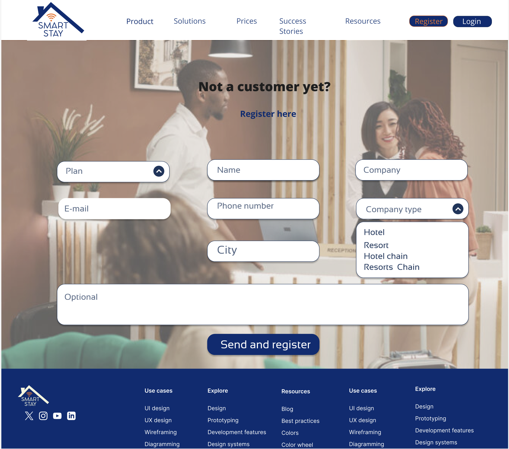

**8. Login**
- **Cambios respecto al wireframe:**
    - Formulario ubicado a lateral izquierdo en pantalla con diseño limpio.
    - Logo al lado derecho de la pantalla.
    - Enlaces secundarios estilizados para “¿Olvidaste tu contraseña?”.  
      

Los mockups consolidan el diseño visual final de Smart Stay, transformando la estructura básica de los wireframes en interfaces listas para evaluación estética y funcional.


## 4.4. Mobile Applications UX/UI Design

### 4.4.1. Mobile Applications Wireframes

La solución móvil se divide en dos tipos de aplicaciones:

- **Aplicación para Huéspedes:** enfocada en mejorar la experiencia del usuario durante su estadía, permitiendo el control de la habitación, solicitud de servicios y acceso a información relevante.
- **Aplicación para Staff:** orientada a la gestión operativa del hotel, incluyendo tareas, reservas, servicios y control de incidencias.

Ambas aplicaciones comparten principios de diseño consistentes, tales como:

- Uso de navegación inferior (bottom navigation) para acceso rápido a módulos principales.
- Interfaz limpia y minimalista para reducir la carga cognitiva.
- Uso de iconografía clara para facilitar la comprensión.
- Adaptabilidad a diferentes tamaños de pantalla (responsive design).
- Retroalimentación visual mediante notificaciones y estados.


---

### Aplicación Móvil – Huésped

Las pantallas principales de la aplicación para huéspedes incluyen:

- **IntroApp (Bienvenida):**
  - Pantalla inicial que da la bienvenida al usuario.
  - Refuerza la identidad de Smart Stay.

- **Home:**
  - Panel principal con opciones de búsqueda, promociones y acceso rápido a funcionalidades.
  - Incluye acceso a servicios y asistencia.

- **Habitación:**
  - Control de dispositivos IoT (temperatura, luces, cortinas, TV).
  - Información del estado de la habitación.

- **Servicios:**
  - Visualización y solicitud de servicios disponibles (restaurantes, limpieza, amenities).

- **Mapa:**
  - Ubicación de servicios dentro o cerca del hotel.
  - Interfaz de búsqueda y filtros.

- **Perfil:**
  - Información personal del usuario.
  - Gestión de métodos de pago.

- **Notificaciones:**
  - Alertas y mensajes importantes durante la estadía.


---

### Aplicación Móvil – Staff

Las pantallas principales de la aplicación para el personal incluyen:

- **IntroApp Staff:**
  - Pantalla de bienvenida para el personal del hotel.

- **Login:**
  - Acceso seguro mediante credenciales.

- **Home Staff:**
  - Panel con resumen de actividades del día.
  - Acceso a historial y registros.

- **Tareas:**
  - Gestión de tareas asignadas (limpieza, mantenimiento).
  - Visualización de estado de cada actividad.

- **Servicios:**
  - Registro y seguimiento de servicios solicitados por huéspedes.

- **Reservas:**
  - Gestión de check-in y check-out.
  - Visualización de reservas activas.

- **Perfil:**
  - Información del trabajador.
  - Opciones de configuración.

- **Notificaciones:**
  - Alertas sobre cambios, incidencias o nuevas tareas.

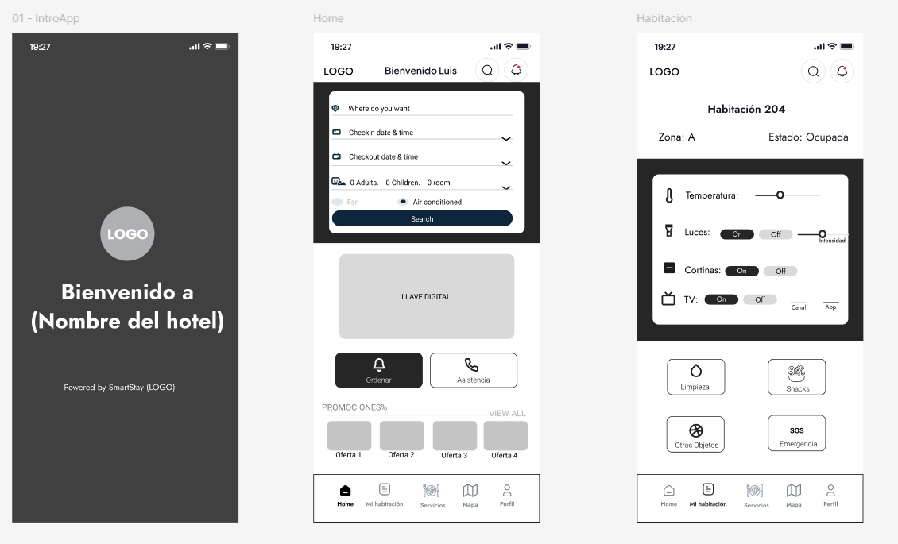


---

### Consideraciones de Diseño UX/UI

El diseño de ambas aplicaciones se basa en los siguientes principios:

- **Usabilidad:** interfaces fáciles de entender y utilizar.
- **Eficiencia:** reducción de pasos para completar tareas.
- **Consistencia:** uso de patrones de diseño similares en ambas apps.
- **Visibilidad del estado:** información clara sobre acciones y resultados.
- **Accesibilidad:** elementos interactivos visibles y fáciles de usar.

---


### 4.4.2. Mobile Applications Wireflow Diagrams

Los wireflow diagrams de las aplicaciones móviles de Smart Stay representan el flujo de navegación entre pantallas, combinando la estructura de los wireframes con las interacciones del usuario dentro del sistema.

Estos diagramas permiten visualizar cómo los usuarios se desplazan entre las distintas funcionalidades de la aplicación, facilitando la comprensión del comportamiento del sistema tanto para huéspedes como para el personal del hotel.

---

### Aplicación Móvil – Huésped

El flujo de navegación para el huésped inicia desde la pantalla de bienvenida (Intro), desde donde el usuario accede al Home, que actúa como punto central de la aplicación.

Desde el Home, el usuario puede navegar hacia:

- **Notificaciones:** para visualizar alertas relacionadas a su estadía.
- **My Room (Habitación):** para controlar dispositivos IoT como luces, temperatura y cortinas.
- **Services:** para explorar y solicitar servicios disponibles.
- **Map:** para ubicar servicios dentro o fuera del hotel.
- **Profile:** para gestionar su información personal y métodos de pago.

Este flujo permite una navegación clara y directa, utilizando una barra de navegación inferior que facilita el acceso rápido a cada módulo.

---


---

### Aplicación Móvil – Staff

El flujo del personal inicia en la pantalla de bienvenida (Intro Staff), seguida del Login, donde el usuario ingresa sus credenciales para acceder al sistema.

Una vez autenticado, el usuario accede al Home Staff, desde donde puede navegar hacia:

- **Notificaciones:** para revisar alertas operativas.
- **Tasks:** para gestionar tareas asignadas (limpieza, mantenimiento, etc.).
- **Services:** para administrar servicios solicitados.
- **Booking (Reservas):** para gestionar check-in y check-out.
- **Profile:** para visualizar y editar su información personal.

Este flujo está diseñado para optimizar la eficiencia operativa del personal, permitiendo acceder rápidamente a las funciones más importantes del sistema.

---

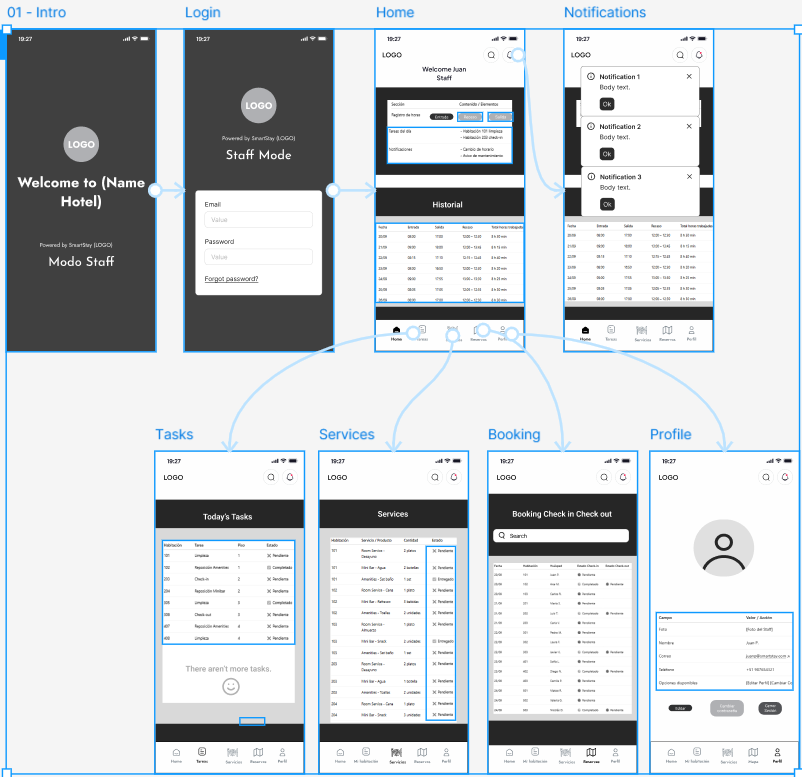

---


### 4.4.3. Mobile Applications Mock-ups

Los mock-ups de las aplicaciones móviles de Smart Stay representan el diseño visual final del sistema, incorporando la identidad gráfica definida, incluyendo colores, tipografía, iconografía e imágenes. A diferencia de los wireframes, estos diseños permiten visualizar cómo interactuará el usuario con una interfaz cercana al producto real.

Se desarrollaron mock-ups para dos tipos de usuarios: huéspedes y personal del hotel (staff), considerando sus necesidades específicas dentro del sistema.

---

### Aplicación Móvil – Huésped

Los mock-ups del módulo de huésped muestran una interfaz moderna, intuitiva y orientada a mejorar la experiencia durante la estadía.

**Pantallas principales:**

- **Intro (Bienvenida):**
  - Pantalla inicial con identidad visual de Smart Stay.
  - Uso de colores corporativos para reforzar branding.

- **Home:**
  - Panel principal con opciones de búsqueda y acceso a funcionalidades.
  - Integración de promociones y accesos rápidos.

- **Habitación:**
  - Interfaz para control de dispositivos IoT (temperatura, luces, cortinas, TV).
  - Diseño centrado en facilidad de uso.

- **Servicios:**
  - Presentación visual de servicios en tarjetas con iconos.
  - Organización clara por categorías.

- **Mapa:**
  - Integración de mapa interactivo.
  - Visualización de ubicaciones con información contextual.

- **Perfil:**
  - Información del usuario con diseño limpio.
  - Gestión de métodos de pago con interfaz visual.

- **Notificaciones:**
  - Alertas visuales organizadas en tarjetas.
  - Fácil lectura e interacción.

---


---

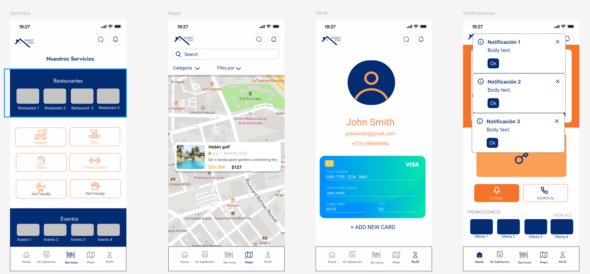

---

### Aplicación Móvil – Staff

Los mock-ups del módulo de staff están diseñados para optimizar la gestión operativa del hotel, priorizando claridad y eficiencia.

**Pantallas principales:**

- **Intro Staff:**
  - Identificación del modo de uso del sistema.
  - Diseño alineado con la identidad visual.

- **Login:**
  - Formulario de acceso claro y sencillo.
  - Campos bien definidos y accesibles.

- **Home Staff:**
  - Panel con resumen de actividades y registros.
  - Acceso a historial y notificaciones.

- **Tareas:**
  - Listado de tareas del día con estado (pendiente, completado).
  - Diseño enfocado en lectura rápida.

- **Servicios:**
  - Registro y seguimiento de servicios.
  - Información organizada en tablas.

- **Reservas:**
  - Gestión de check-in y check-out.
  - Visualización clara de datos.

- **Perfil:**
  - Información del trabajador.
  - Opciones de configuración.

- **Notificaciones:**
  - Alertas visuales para eventos importantes.

---


---


---


### 4.4.4. Mobile Applications User Flow Diagrams

Los User Flow Diagrams de Smart Stay representan de manera detallada el recorrido que realizan los usuarios dentro de la aplicación móvil, desde el ingreso hasta la finalización de sus tareas. Estos diagramas permiten visualizar tanto los flujos ideales (Happy Path) como los escenarios alternativos o de error (Unhappy Path), mejorando el análisis de la experiencia de usuario.

Se desarrollaron flujos para tres tipos de usuarios: huésped, personal (staff) y administrador, considerando sus interacciones específicas con el sistema.

---

### Usuario: Huésped (Guest)

**Happy Path:**
El flujo ideal del huésped inicia al abrir la aplicación, seguido del login o registro. Una vez autenticado, accede al Home, desde donde puede:

- Realizar check-in digital.
- Consultar información de su habitación.
- Solicitar servicios adicionales.
- Visualizar el mapa del hotel.
- Registrar métodos de pago.
- Realizar check-out digital.
- Dejar reseñas de su experiencia.

---

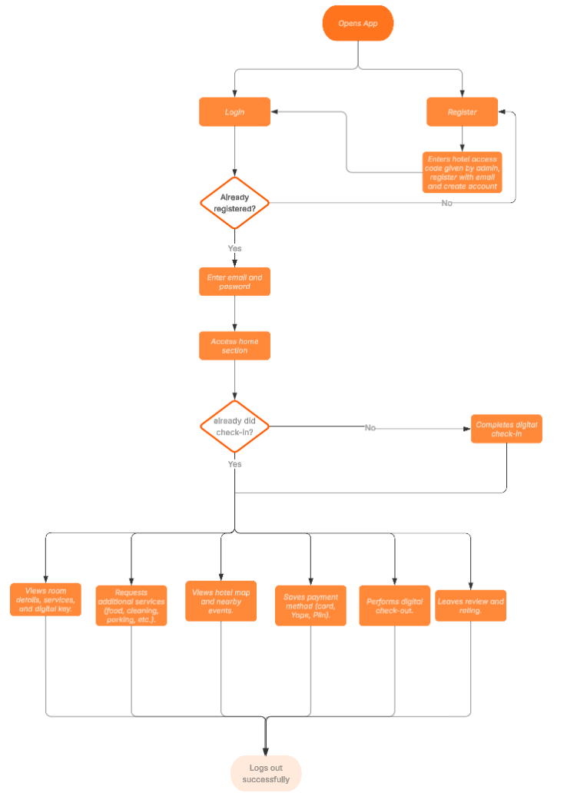

---

**Unhappy Path:**
Incluye escenarios donde:

- El código de acceso es inválido o expirado.
- El check-in aún no está habilitado.
- Un servicio solicitado no está disponible.
- El usuario debe esperar disponibilidad.

---


---

### Usuario: Staff

**Happy Path:**
El flujo del personal inicia con login, seguido del acceso al panel principal donde puede:

- Visualizar tareas asignadas.
- Marcar tareas como completadas.
- Gestionar check-in y check-out.
- Consultar historial de actividades.
- Administrar servicios solicitados.

---


---

**Unhappy Path:**
Se contemplan situaciones como:

- Credenciales incorrectas.
- Falta de conexión a internet.
- Fallo al actualizar estados de tareas.

---


---

### Usuario: Administrador

**Happy Path:**
El flujo del administrador incluye:

- Registro o login.
- Creación de perfil del hotel.
- Gestión de habitaciones, servicios y tarifas.
- Supervisión de reservas, pagos y reportes.
- Monitoreo de actividad y generación de códigos de acceso.

---

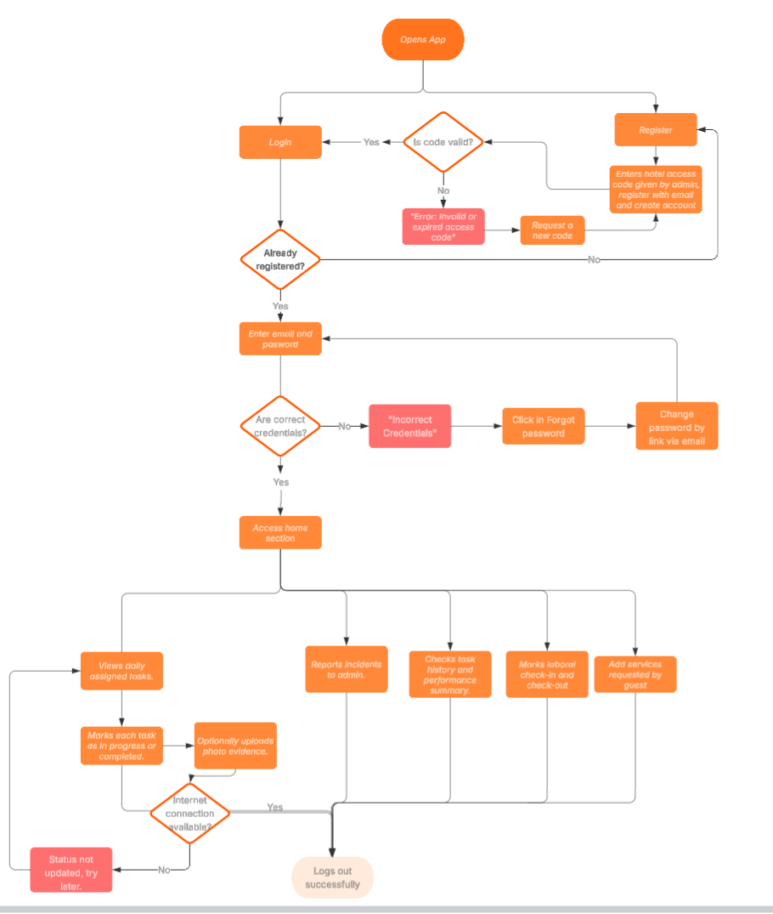

---

**Unhappy Path:**
Incluye casos como:

- Datos incompletos en el registro.
- Duplicación de información.
- Errores en la creación de servicios o habitaciones.

---


---


## 4.5. Mobile Applications Prototyping

### 4.5.1. Android Mobile Applications Prototyping

El prototipo de la aplicación móvil de Smart Stay fue desarrollado con el objetivo de simular la interacción real del usuario con el sistema, permitiendo validar la navegación, usabilidad y flujo de las funcionalidades principales antes de su implementación.

Para la construcción del prototipo se utilizaron herramientas de diseño como Figma, integrando los mock-ups previamente desarrollados y conectándolos mediante interacciones que representan el comportamiento real de la aplicación.

---

### Características del Prototipo

- Navegación interactiva entre pantallas principales.
- Simulación de acciones del usuario (clicks, transiciones).
- Flujo completo desde el ingreso hasta la finalización de tareas.
- Representación de diferentes tipos de usuario: huésped, staff y administrador.

---

### Flujo del Prototipo

El prototipo incluye los siguientes recorridos principales:

**Huésped:**
- Pantalla de bienvenida (Intro)
- Login / Registro
- Home
- Habitación (control IoT)
- Servicios
- Mapa
- Perfil
- Notificaciones

**Staff:**
- Login
- Home Staff
- Gestión de tareas
- Servicios
- Reservas
- Perfil

**Administrador:**
- Login / Registro
- Panel de administración
- Gestión de habitaciones y servicios
- Supervisión de reservas

---

### Objetivos del Prototipo

- Validar la experiencia de usuario antes del desarrollo.
- Detectar posibles errores en la navegación.
- Evaluar la claridad de las interfaces.
- Mejorar la interacción entre usuario y sistema.

---

### Herramienta Utilizada

El prototipo fue desarrollado en Figma, permitiendo la creación de un entorno interactivo donde se simulan las funcionalidades clave del sistema.

**Prototipo en Figma:**
https://www.figma.com/make/lML4HR5vLsAGMUq3CoqvcS/Minimalist-Photo-Portfolio?t=7b0vXYUcbQwt6eOT-1&preview-route=%2Fguest%2Flogin

---


### 4.5.2. iOS Mobile Applications Prototyping

**Pendiente:** prototipo navegable de iOS y video de navegación (Anexo C, `...-navigation-sprint-<n>`). No existe una fuente equivalente en los reportes de referencia.

## 4.6. Web Applications UX/UI Design

### 4.6.1. Web Applications Wireframes

**Wireframes – Modo Administrador**


Los wireframes del **modo Administrador** representan la primera aproximación al diseño de la interfaz de esta vista de la aplicación.  
Se han elaborado en formato blanco y negro, sin imágenes ni estilos gráficos, con el objetivo de centrarse en la estructura, navegación y jerarquía de la información que manejará el administrador.

A continuación, se presenta un resumen de cada una de las secciones principales del modo Administrador.

**1. Dashboard**

**Propósito:** Vista general del estado de la plataforma.  
**Elementos clave:**
- Panel con métricas principales (usuarios activos, reportes recientes, accesos).
- Gráficas de estadísticas generales.
- Acceso rápido a notificaciones.

**2. Guests**

**Propósito:** Control y administración de los perfiles que usan la plataforma.  
**Elementos clave:**
- Lista de usuarios con buscador y filtros.
- Botón para agregar, editar o eliminar usuarios.
- Tabla con información básica (nombre, correo, rol, estado).


**3. Staff**

**Propósito:** Definir los niveles de acceso de cada tipo de usuario.  
**Elementos clave:**
- Tabla de roles existentes.
- Información y datos del staff con el que trabaja.

**4. Hotels and rooms**  
**Propósito:** Gestión de la cadena hotelera administrada en la plataforma.  
**Elementos clave:**
- Lista de hoteles con buscador y filtros (ciudad, estado, categoría).
- Detalle del hotel seleccionado (información general, servicios, estadísticas).
- Campo para ingresar número de habitación y botón *Ver detalle*.
- Vista de detalle de habitación con estado, tipo, huésped actual, check-in/out y acciones rápidas.


**5. Booking**

**Propósito:** Control y gestión de todas las reservas realizadas en los hoteles.  
**Elementos clave:**
- Calendario interactivo para visualizar y administrar reservas por día, semana o mes.
- Lista de reservas con buscador y filtros (hotel, fecha, estado).
- Detalle de la reserva (huésped, habitación, fechas, monto).
- Botones para modificar, confirmar o cancelar reservas.
- Indicadores de ocupación y disponibilidad directamente desde el calendario.

**6. Payments**

**Propósito:** Administración de ingresos y egresos financieros en la plataforma.  
**Elementos clave:**
- Registro de pagos recibidos de huéspedes y clientes.
- Registro de egresos: pagos a staff, proveedores y compras de stock.
- Tablas y filtros por fecha, hotel, método de pago y categoría.
- Reportes de gastos, ingresos y ganancias.
- Gráficos comparativos y dashboard financiero.

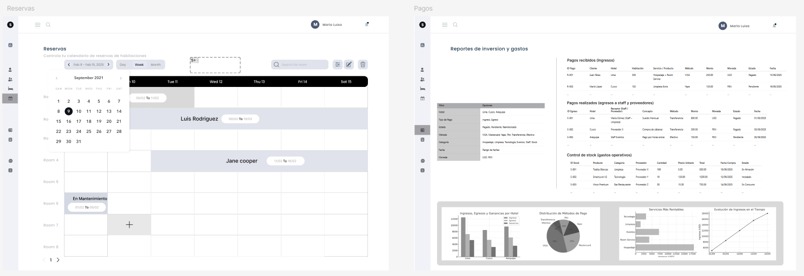

**7. Sevices and Products**

**Propósito:** Gestión integral de servicios y dispositivos tecnológicos de Smart Stay.  
**Elementos clave:**
- Tabla general con categorías: limpieza, alimentos, tecnología, amenities.
- Columnas: nombre, categoría, estado, stock, ubicación, proveedor.
- Filtros por hotel, piso, habitación y categoría.
- Vista de detalle de cada producto con historial, estado y mantenimiento.

**8. Reviews**

**Propósito:** Seguimiento de la experiencia de los huéspedes y tickets de soporte.  
**Elementos clave:**
- Lista de comentarios y calificaciones por hotel y servicio.
- Filtros por fecha, hotel, tipo de reseña o ticket.
- Vista de detalle con respuesta del staff.
- Estadísticas de satisfacción y gráficos de tendencias.
- Panel de tickets: abiertos, en proceso, cerrados.  
  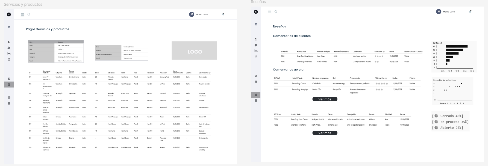

**9. Support**

**Propósito:** Gestión de los tickets creados por los hoteles y usuarios hacia Smart Stay.  
**Elementos clave:**
- Lista de tickets recibidos desde los hoteles o usuarios.
- Clasificación por prioridad (alta, media, baja) y estado (pendiente, en proceso, resuelto).
- Filtros por hotel, tipo de problema y fecha.
- Vista de detalle del ticket con historial de comunicación.
- Historial de ticket.
  

**Wireframes – Modo Huésped**

Los wireframes del modo Huésped representan la primera aproximación al diseño de la interfaz de esta vista de la aplicación huesped, el cual ellos ingresanpor un codigo qr que el hotel les brinda para de frente acceder al app huesped.  
Se han elaborado en formato blanco y negro, sin imágenes ni estilos gráficos, con el objetivo de centrarse en la estructura, navegación y jerarquía de la información que manejará el huésped.

**1. Welcome View**

- Solo es una introducción por lo que aparece el logo y un saludo.

**2. Home**
**Propósito:** Pantalla principal con acceso a las funciones más utilizadas.  
**Elementos clave:**
- Barra superior con logo y buscador.
- Banner de bienvenida.
- Acceso rápido a habitaciones, servicios y notificaciones.
- Sección de ofertas o promociones destacadas.

**3. Rooms**
**Propósito:** Explorar y seleccionar opciones de hospedaje.  
**Elementos clave:**
- Información básica (número y estado de habitación).
- Controles de ambiente: temperatura, luces, cortinas, TV, música.
- Servicios rápidos: limpieza inmediata o programada, amenities, minibar digital.
- Botón de asistencia y emergencia.  
  

**4. Services**
**Propósito:** Acceder a servicios adicionales ofrecidos por el hotel.  
**Elementos clave:**
- Categorías de servicios (gimnasio, parking, restaurante, eventos).

**5. Map**
**Propósito:** Orientar al huésped dentro del hotel y ofrecer rutas y descubrimientos locales.  
**Elementos clave:**
- Mapa interactivo del hotel con puntos de interés (piscina, gimnasio, restaurantes, lobby, salones).
- Indicación de la ubicación de la habitación del huésped y rutas internas (wayfinding) hacia cualquier punto.
- Opciones de búsqueda y filtros (por tipo de servicio, accesibilidad, horarios).

**6. Profile**
**Propósito:** Gestionar los datos del huésped.  
**Elementos clave:**
- Información personal (nombre, correo, teléfono).
- Preferencias de pago y métodos guardados.

**7. Notifications**
**Propósito:** Informar al huésped sobre novedades y recordatorios.  
**Elementos clave:**
- Lista de notificaciones recientes (confirmaciones de reserva, promociones, mensajes del hotel).
- Botón para marcar como leídas o eliminar notificaciones.  
  

**Wireframes – Modo Staff**

Los wireframes del modo Staff representan la primera aproximación al diseño de la interfaz de esta vista de la aplicación.  
Se han elaborado en formato blanco y negro, sin imágenes ni estilos gráficos, con el objetivo de centrarse en la estructura, navegación y jerarquía de la información que manejará el personal del hotel.

**1. Introduction**
**Propósito:** Pantalla inicial de bienvenida y presentación de la app Staff.  
**Elementos clave:**
- Logo.
- Breve mensaje de bienvenida.

**2. Login**
**Propósito:** Autenticar al personal del hotel para acceder a la app.  
**Elementos clave:**
- Campos de correo electrónico y contraseña.
- Botón de Iniciar Sesión.
- Opción de Recuperar contraseña.

**3. Home / Dashboard**
**Propósito:** Pantalla principal con resumen de tareas y registro de horas.  
**Elementos clave:**
- Registro de horas: botones para marcar Entrada, Receso y Salida.
- Tabla de historial diario de horas trabajadas.
- Lista resumida de tareas del día con estado (pendiente/completado).

**4. Tasks**
**Propósito:** Gestionar todas las tareas asignadas al staff.  
**Elementos clave:**
- Lista completa de tareas diarias con habitación, tipo de tarea, piso.
- Estado de tarea con emoticonos: ✅ Completado / ❌ Pendiente.     
  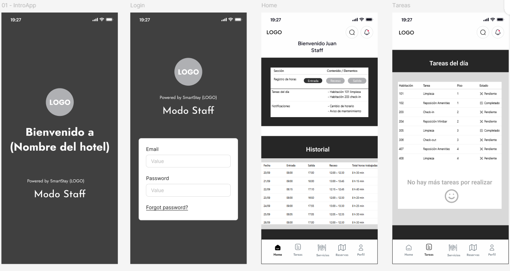

**5. Services / Products**
**Propósito:** Registrar entrega de servicios y productos a habitaciones.  
**Elementos clave:**
- Lista de servicios/productos por entregar (Room Service, Mini Bar, Amenities, etc.).
- Cantidad y habitación correspondiente.
- Estado de entrega con emoticonos: ✅ Entregado / ❌ Pendiente.

**6. Booking**
**Propósito:** Consultar y gestionar reservas asignadas al staff.  
**Elementos clave:**
- Sección de búsqueda de cliente.
- Lista de reservas con habitación, huésped, fecha, estado de check-in/check-out.
- Semáforo de estados: 🔴 Pendiente / 🟢 Completado.

**7. Profile**
**Propósito:** Gestionar la información personal del staff y las preferencias de la app.  
**Elementos clave:**
- Foto y datos personales (nombre, correo, teléfono).
- Cambiar contraseña, editar y cerrar sesión.

**8. Notifications**
**Propósito:** Informar al staff sobre novedades, cambios de tareas o alertas importantes.  
**Elementos clave:**
- Lista de notificaciones recientes (cambios de turno, emergencias, avisos de tareas).
- Botón para marcar como leído o eliminar notificaciones.  
  .

### 4.6.2. Web Applications Wireflow Diagrams

**Web Applications Wireflow Diagrams – Modo Administrador**

**Propósito:**  
Mostrar cómo cada sección del administrador se conecta a través del menú principal.


**Menú Principal (Administrador)**

Desde cualquier sección, el menú permite acceder a:

1.**Intro** - Pantalla de inicio a app Adminstrator luego de iniciar sesión.
2. **Dashboard** – Resumen general de actividad, métricas y gráficos.
3. **Guests** – Gestión de perfiles de usuarios; agregar, editar o eliminar.
4. **Staff** – Gestión del personal; roles, turnos y contacto.
5. **Hotels / Rooms** – Administración de hoteles, habitaciones y disponibilidad.
6. **Booking** – Calendario de reservas; agregar, modificar o cancelar reservas.
7. **Payments** – Visualización y gestión de transacciones y estados de pago.
8. **Services / Productos** – Gestión de servicios del hotel y productos adicionales.
9. **Reviews** – Panel de comentarios de huéspedes con gráficos de satisfacción.
10. **Support / Tickets** – Crear tickets de ayuda y consultar su estado.

**Flujo General (Wireflow)**

- **Dashboard**: centro de información y acceso rápido a secciones principales por botones. En los gráficos de ganancia y pérdidas el botón "See Reviews" te deriva **Reviews** y en los gráficos porcentual de habitaciones ocupadas el botón "check Booking" te deriva a **Booking**.
- **Menú Bar**: conecta directamente a las 9 secciones.
- Secciones interrelacionadas:
    - **Staff, Guests, Hotels** se conecta con **Reviews** ya que allí se derivan los comentarios sobre el staff huésped y el hotel.
    - **Booking** se relaciona con **Guests** para ver los clientes de cada reserva hecha.

**Web Applications Wireflow Diagrams – Modo Huésped**

**Propósito:**  
Mostrar cómo cada sección de la app para huéspedes se conecta a través del menú principal y elementos persistentes (como el icono de notificaciones).


**Secciones Principales**

1. **Intro** – Pantalla inicial, solo se conecta a **Home**.
2. **Home** – Vista principal; acceso a todas las secciones mediante el menú.
3. **Rooms** – Detalles de la habitación asignada o disponible; acceso desde el menú.
4. **Services** – Servicios del hotel disponibles para el huésped; acceso desde el menú.
5. **Map** – Ubicación del hotel, puntos de interés; acceso desde el menú.
6. **Profile** – Datos del huésped, preferencias y configuración; acceso desde el menú.
7. **Notifications** – Alertas y mensajes importantes; acceso mediante un icono persistente arriba, visible desde todas las secciones.

**Flujo General (Wireflow)**

- **Intro** → **Home**
- **Home** → conecta a **Rooms**, **Services**, **Map**, **Profile** mediante el menú principal.
- **Notifications** → accesibles desde cualquier sección a través del icono superior.

**Web Applications Wireflow Diagrams – Modo Staff**

**Propósito:**  
Mostrar cómo cada sección de la app para staff se conecta a través del menú principal y elementos persistentes (como el icono de notificaciones).


**Secciones Principales**

1. **Intro** – Pantalla inicial, conecta al **Login**.
2. **Login** – Pantalla de acceso; una vez autenticado, va a **Home**. Para ellos siempre es necesario que hagan login por el uso continuo del app a diferencia del huésped que solo tienen acceso durante su estadía.
3. **Home** – Vista principal; acceso a todas las secciones mediante el menú.
4. **Tasks** – Lista y gestión de tareas asignadas; acceso desde el menú.
5. **Services** – Gestión de servicios ofrecidos por el staff; acceso desde el menú.
6. **Booking** – Visualización de reservas relacionadas con el staff; acceso desde el menú.
7. **Profile** – Datos del staff y configuración personal; acceso desde el menú.
8. **Notifications** – Alertas y mensajes importantes; accesibles mediante un icono persistente que aparece en todas las secciones.

**Flujo General (Wireflow)**

- **Intro** → **Login** → **Home**
- Desde **Home** se puede acceder mediante el menú a: **Tasks**, **Services**, **Booking**, **Profile**
- **Notifications** → accesibles desde cualquier sección a través del icono superior.

### 4.6.3. Web Applications Mock-ups

**Mockups – Modo Administrador**

Los mockups muestran la interfaz final del administrador de SmartStay, incluyendo **colores, tipografía, iconos, imágenes y logos**, reflejando la identidad visual de la plataforma.

**1. Dashboard**
- Paleta de colores corporativa aplicada a gráficos y métricas.
- Gráficos circulares y de barras con animaciones.
- Iconos para alertas, reservas y notificaciones.
- Ilustraciones o imágenes para resaltar métricas clave.

**2. Huéspedes**
- Tarjetas visuales para cada huésped con foto, nombre y estado.
- Botones coloreados según función (agregar: verde, eliminar: rojo).
- Filtros y buscador estilizados con iconos.

**3. Staff**
- Tabla con fotos de perfil, roles y horarios.
- Indicadores de estado con colores o iconos.
- Botones consistentes con la paleta de SmartStay.

**4. Hoteles**
- Cards con imagen del hotel o miniaturas.
- Indicadores visuales de ocupación y disponibilidad.
- Botones de acción con efectos hover.

**5. Reservas**
- Calendario visual con colores según estado (confirmada, pendiente, cancelada).
- Tarjetas de reserva con foto del huésped y detalles.
- Botones destacados para aprobar, modificar o cancelar.

**6. Pagos**
- Tabla con iconos de métodos de pago (tarjeta, Yape, Plin).
- Resaltado de pagos pendientes con color.
- Botones para generar facturas con efectos visuales.

**7. Servicios y Productos**
- Cards o listas con imágenes de productos y servicios.
- Indicadores de disponibilidad con colores y símbolos.
- Botones con iconos para editar, eliminar o agregar.

**8. Reseñas**
- Panel con estrellas de puntuación y colores según valoración.
- Tarjetas de comentarios con avatar del huésped y fecha.
- Gráficos visuales de satisfacción general.

**9. Soporte**
- Tabla de tickets con colores según estado (pendiente, en proceso, finalizado).
- Formulario visual con iconos y campos destacados.
- Botones de acción consistentes con la paleta.

**Elementos generales**
- Logo de SmartStay visible en header o menú lateral.
- Paleta de colores corporativa aplicada a fondos, botones y textos.
- Tipografía uniforme que diferencia títulos, subtítulos y contenido.
- Iconografía consistente para acciones, estados y navegación.
- Feedback visual en botones e interacciones (hover, clic, activo).


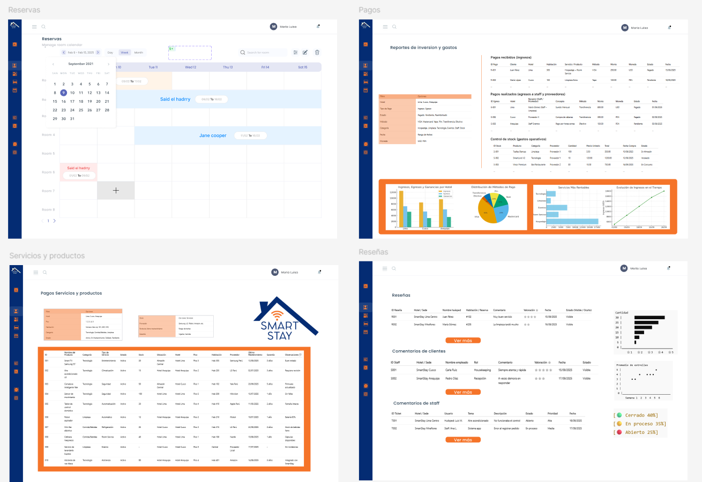


**Mockups – Modo Huésped**

Los mockups muestran la interfaz final del usuario huésped en SmartStay, incluyendo **colores, tipografía, iconos, imágenes y logos**, reflejando la identidad visual y la experiencia de usuario.

**1. Introducción**
- Pantalla de bienvenida con **logo y colores corporativos**.
- **Imágenes o ilustraciones atractivas** para la experiencia inicial.
- Botón destacado para comenzar y acceder a Home.

**2. Home**
- Panel con **resumen de reservas y notificaciones recientes**.
- Cards visuales para acceder a habitaciones, servicios y mapa.
- **Botones e iconos claros** para navegación rápida.

**3. Habitación**
- Tarjetas con fotos de la habitación y detalles (tipo, servicios incluidos, disponibilidad).
- Indicadores visuales de estado de limpieza o check-in/check-out.
- Botones para solicitar servicio o hacer reservas adicionales.

**4. Servicios**
- Lista o cards de servicios disponibles (spa, lavandería, comida, etc.) con imágenes.
- Indicadores de disponibilidad y precios.
- Botones para solicitar o reservar servicios fácilmente.

**5. Mapa**
- Mapa interactivo con **ubicación del hotel, habitaciones y servicios cercanos**.
- Iconos para puntos de interés y rutas dentro del hotel.
- Colores y estilo consistente con la identidad visual.


**6. Perfil**
- Información personal del huésped con **foto y datos básicos**.
- Botones para editar información o preferencias.
- Indicadores de estado de membresía o historial de reservas.

**7. Notificaciones**
- Lista de notificaciones recientes con **iconos y colores según tipo** (alerta, mensaje, promoción).
- Botones para marcar como leído o eliminar.
- Diseño consistente con la paleta y tipografía de la app.

**Elementos generales**
- Logo de SmartStay visible en header o menú.
- Paleta de colores corporativa aplicada a fondos, botones y textos.
- Tipografía uniforme que diferencia títulos, subtítulos y contenido.
- Iconografía consistente para acciones, estados y navegación.
- Feedback visual en botones e interacciones (hover, clic, activo).


**Mockups – Modo Staff**

Los mockups muestran la interfaz final del personal de SmartStay, incluyendo **colores, tipografía, iconos, imágenes y logos**, reflejando la identidad visual y la experiencia de usuario para el staff.

**1. Introducción**
- Pantalla de bienvenida con **logo y colores corporativos**.
- **Ilustraciones o imágenes** que reflejan la experiencia inicial.
- Botón destacado para avanzar al login.

**2. Login**
- Formulario con **campos destacados** para correo y contraseña.
- Botón principal con **color corporativo** para iniciar sesión.
- Iconos de seguridad y feedback visual al ingresar datos incorrectos.

**3. Home**
- Panel con **resumen de tareas, reservas y notificaciones recientes**.
- Cards visuales para acceder a tareas, servicios, reservas y perfil.
- Botones e iconos claros para navegación rápida.

**4. Tareas**
- Lista o cards de tareas asignadas con **estado visual** (pendiente, en proceso, finalizado).
- Botones para marcar tareas completadas o reasignar.
- Indicadores de prioridad con colores y símbolos.

**5. Servicios**
- Lista de servicios a realizar o supervisar, con **imágenes o iconos representativos**.
- Indicadores de estado y disponibilidad.
- Botones para actualizar estado o registrar finalización.

**6. Reservas**
- Calendario visual mostrando reservas asignadas al staff.
- Tarjetas de reserva con detalles resumidos y foto del huésped.
- Botones para confirmar asistencia o marcar tareas relacionadas a la reserva.

**7. Perfil**
- Información personal del staff con **foto, rol y datos de contacto**.
- Botones para editar información y configurar preferencias.
- Indicadores de estado activo/inactivo.

**8. Notificaciones**
- Lista de notificaciones recientes con **iconos y colores según tipo** (alerta, mensaje, aviso).
- Botones para marcar como leído o eliminar.
- Diseño consistente con la paleta y tipografía de la app.

**Elementos generales**
- Logo de SmartStay visible en header o menú.
- Paleta de colores corporativa aplicada a fondos, botones y textos.
- Tipografía uniforme que diferencia títulos, subtítulos y contenido.
- Iconografía consistente para acciones, estados y navegación.
- Feedback visual en botones e interacciones (hover, clic, activo).


### 4.6.4. Web Applications User Flow Diagrams

**Rol 1:** Administrador del hotel

**Objetivo:** Gestionar todas las áreas del hotel de manera eficiente desde un panel centralizado, incluyendo huéspedes, staff, reservas, pagos, servicios, reseñas y soporte.

**Cómo ayuda el diagrama:** Permite identificar los pasos necesarios para realizar tareas frecuentes y optimizar la navegación para máxima eficiencia.

**Happy Paths:**

**Link para visualizar mejor:** [https://shorturl.at/7UPcY](https://lucid.app/lucidchart/dc345c68-b9ba-4b68-ba59-d33a107cd547/edit?viewport_loc=-2020%2C-505%2C6554%2C2712%2C0_0&invitationId=inv_f306e465-ed6b-4d99-9d15-d416cfe5ca03)

**Unhappy Paths:**

**Link para visualizar mejor:** [https://shorturl.at/7UPcY](https://lucid.app/lucidchart/5b49d2f9-1e2c-495a-bb48-a86af3f68d15/edit?viewport_loc=-805%2C345%2C3936%2C1628%2C0_0&invitationId=inv_3de7ece2-dc86-4690-95d5-4ab9db028e9a)

**Rol 2:** Huésped del hotel

**Objetivo:** Permitir al huésped consultar y gestionar su estadía, incluyendo habitaciones, servicios, mapa, perfil y notificaciones.
**Cómo ayuda el diagrama:** Visualiza los pasos más rápidos e intuitivos para que el huésped acceda a la información que necesita y realice solicitudes con facilidad.

**Happy Paths:**

**Link para visualizar mejor:** [https://shorturl.at/7UPcY](https://lucid.app/lucidchart/7b89dd53-b257-4f78-97e3-1b599d6b85e5/edit?viewport_loc=-1918%2C-477%2C5700%2C2358%2C0_0&invitationId=inv_9502d876-be63-41c8-acb4-1d8e2ca1de0d)

**Unhappy Paths:**

**Link para visualizar mejor:** [https://shorturl.at/7UPcY](https://lucid.app/lucidchart/18fbfec8-9c89-4794-8f4b-a9242e4db649/edit?viewport_loc=-930%2C-4%2C3511%2C1453%2C0_0&invitationId=inv_bbc495e4-6bb4-418f-a0ac-65c431096cd6)


**Rol 3:** Personal del hotel (staff)

**Objetivo:** Permitir al staff gestionar tareas, servicios, reservas y comunicaciones con eficiencia.
**Cómo ayuda el diagrama:** Identifica pasos clave para que el personal cumpla sus responsabilidades sin confusión y con mínima navegación.

**Happy Paths:**

**Link para visualizar mejor:** [https://shorturl.at/7UPcY](https://lucid.app/lucidchart/9f2ebd7e-4046-4322-967e-5ebba51fb97c/edit?viewport_loc=-1647%2C-458%2C3981%2C1647%2C0_0&invitationId=inv_fdadb516-80a9-47ea-bb85-0561af5c0704)

**Unhappy Paths:**

**Link para visualizar mejor:** [https://shorturl.at/7UPcY](https://lucid.app/lucidchart/543c4cad-5bce-40bc-bc29-8a1f2a604a63/edit?viewport_loc=-2062%2C-511%2C5080%2C2102%2C0_0&invitationId=inv_8e3a4604-fe5c-4655-addc-5f16e8fb91d4)

## 4.7. Web Applications Prototyping

El prototipo permite simular la navegación entre todas las secciones principales mediante **carga dinámica de contenido**, mostrando cómo el administrador se moverá a través de los caminos definidos en los **User Flow Diagrams**, asegurando fluidez y coherencia en la experiencia de usuario.
En este caso presentaremos el prototipo del app principal que es del modo administrador:
[https://shorturl.at/7UPcY](https://www.figma.com/proto/RqI67mkRZ1AwuQNTcuGBvA/Sin-t%C3%ADtulo?node-id=48-3793&p=f&t=4u5X36WGvtb7jWe4-1&scaling=min-zoom&content-scaling=fixed&page-id=0%3A1)

**Pendiente:** video de navegación del prototipo web a Microsoft Stream según Anexo C.

## 4.8. Domain-Driven Software Architecture

**Design-Level EventStorming**


**Step 1: Unstructured Exploration:**


**Step 2: Timelines:**


**Step 3: Paint Points:**


**Step 4: Pivotal Points:**


**Step 5: Commands:**

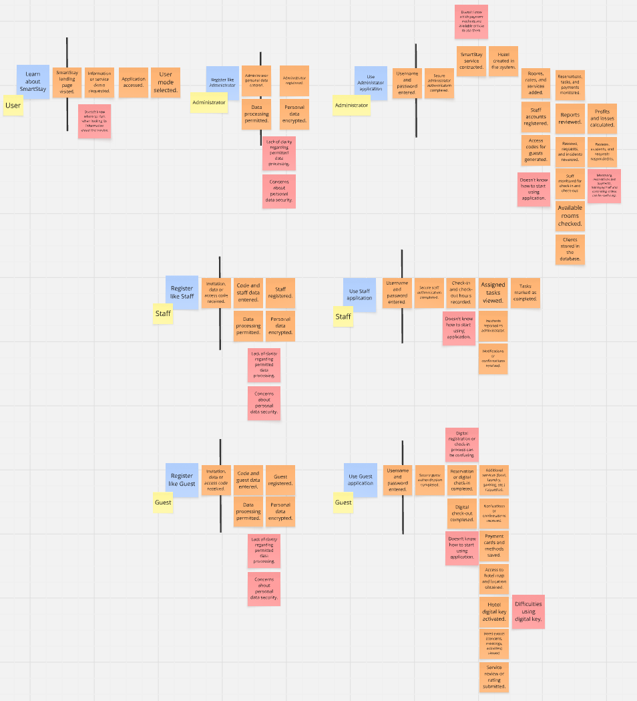

**Step 6: Policies:**


**Step 7: Read models:**


**Step 8: External Systems:**

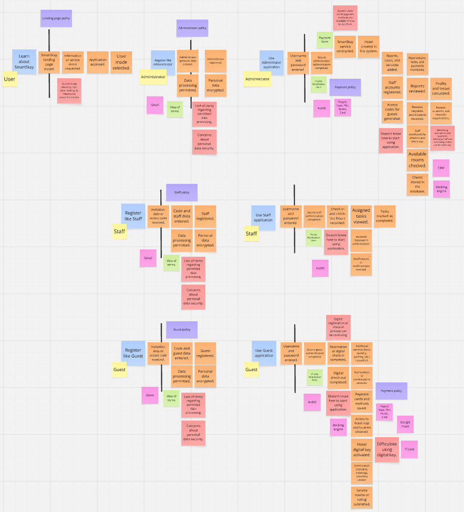

**Step 9: Aggregates:**

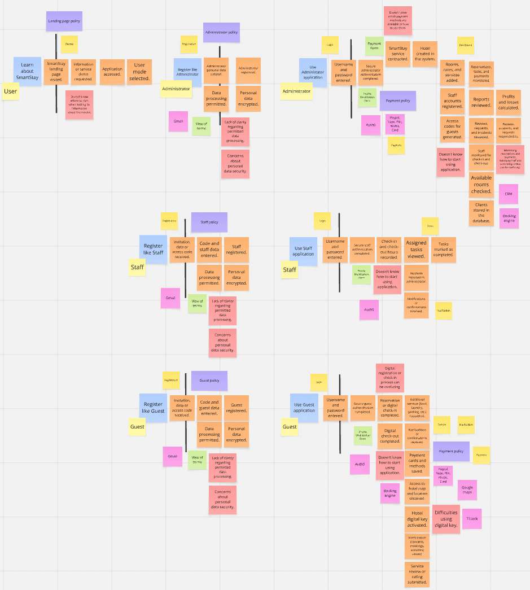

**Step 10: Bounded Contexts:**


**Link para visualizar mejor:** [https://shorturl.at/7UPcY](https://miro.com/app/board/uXjVJ9iB8iU=/?share_link_id=650007847940)

### 4.8.1. Software Architecture Context Diagram

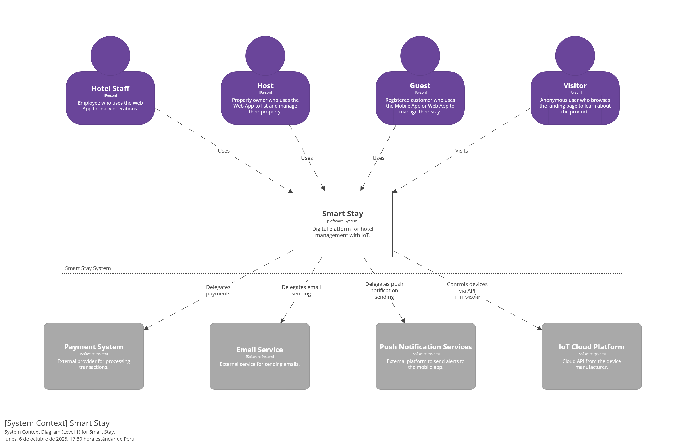

### 4.8.2. Software Architecture Container Diagrams

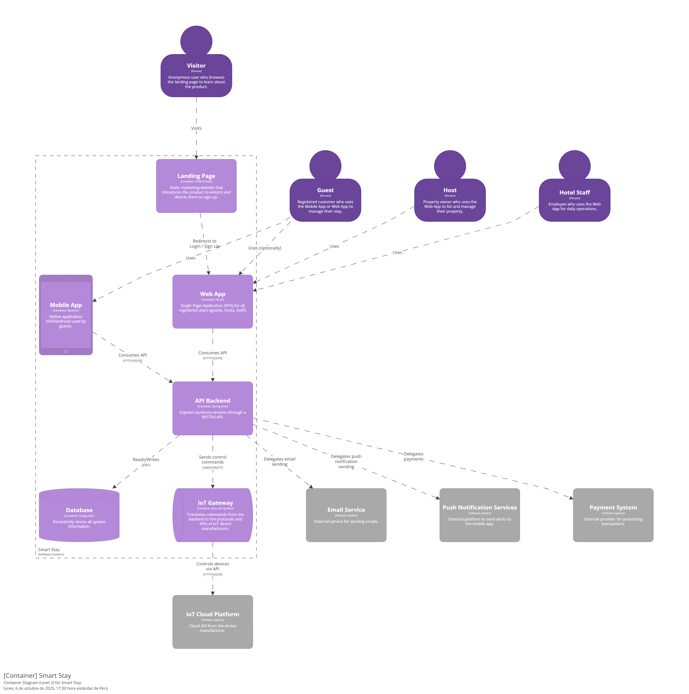

### 4.8.3. Software Architecture Components Diagrams

**Api Components**
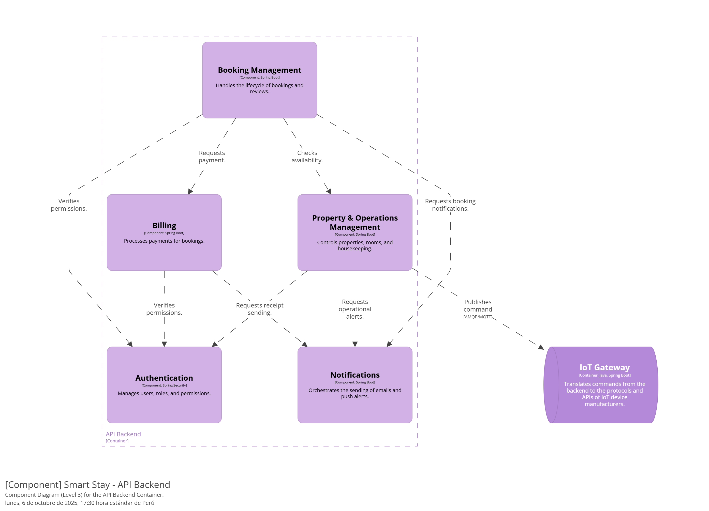


**IoT Gateway Components**
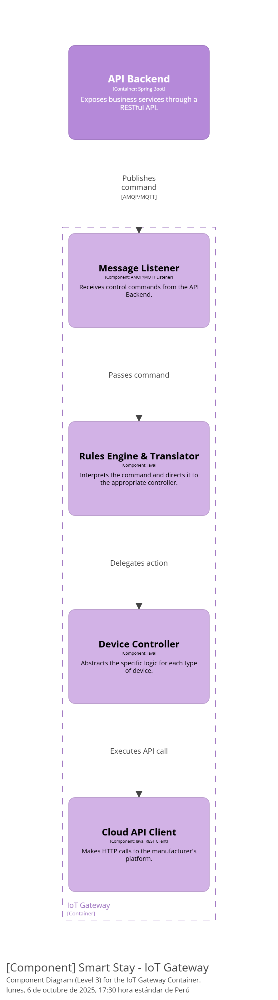

## 4.9. Software Object-Oriented Design

### 4.9.1. Class Diagrams


Este diagrama detalla las clases responsables de la gestión de la identidad y el acceso en el sistema. Incluye la jerarquía de User con sus roles especializados (Guest, Host, HotelStaff), el AuthService que contiene la lógica de negocio para el registro y la autenticación, y la interfaz IUserRepository para la persistencia de datos de usuario.

Diagrama de Clases: Componente de Gestión de Propiedades y Operaciones

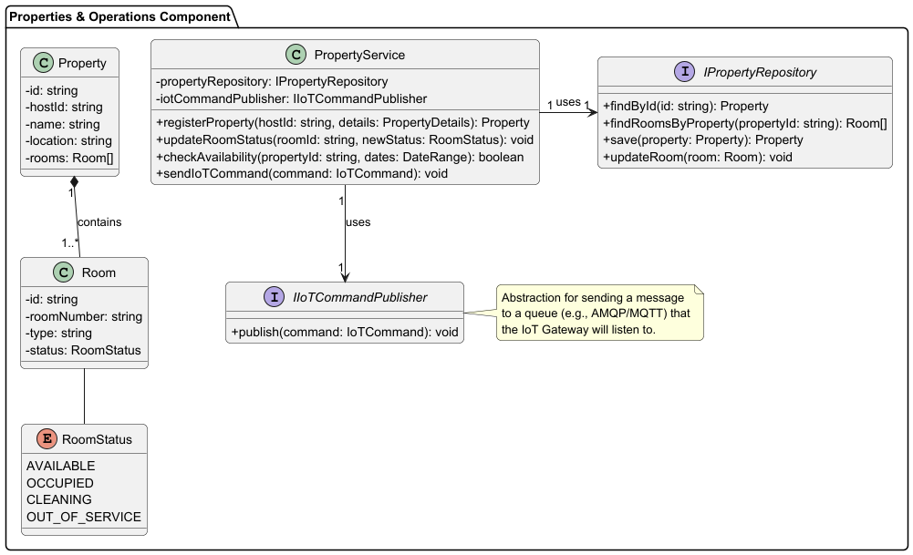

Este diagrama muestra el diseño de clases para la gestión del inventario y las operaciones del hotel. Incluye las entidades Property y Room, que representan los activos físicos, y el PropertyService que maneja su estado y disponibilidad. Es importante destacar que este componente también actúa como el origen de los comandos de IoT, utilizando la interfaz IIoTCommandPublisher para iniciar acciones en el mundo físico.

Diagrama de Clases: Componente de Gestión de Reservas


Este diagrama presenta el diseño de clases para el componente central de reservas. Muestra las entidades de dominio Booking y Review, y el BookingService que actúa como orquestador. Este servicio interactúa con otros componentes a través de adaptadores (IPropertyServiceAdapter, IBillingServiceAdapter) para verificar disponibilidad y procesar pagos, gestionando así el flujo completo de una reserva.

Diagrama de Clases: Componente de Facturación

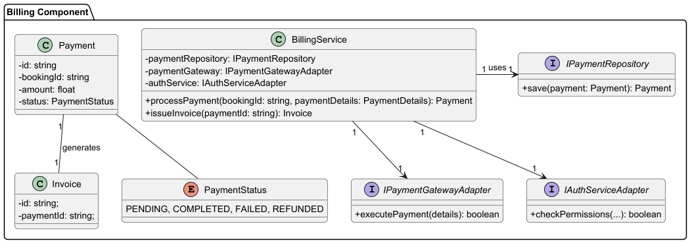

Este diagrama ilustra la estructura interna del componente de facturación. Se definen las entidades Payment e Invoice, el servicio BillingService que orquesta el proceso de pago, y los adaptadores (IPaymentGatewayAdapter, IAuthServiceAdapter) que se comunican con sistemas externos y otros componentes internos para garantizar transacciones seguras y autorizadas.

Diagrama de Clases: Componente Gateway IoT

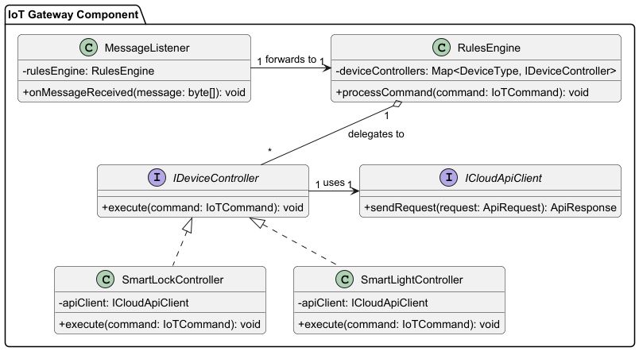

Este diagrama detalla la arquitectura interna del componente técnico Gateway IoT. Su diseño se basa en un flujo de procesamiento de mensajes para desacoplar la lógica de negocio del hardware: un MessageListener recibe órdenes, un RulesEngine las interpreta, IDeviceController las especializa, y un ICloudApiClient se comunica con la plataforma externa del fabricante. Este patrón abstrae la complejidad de la integración con dispositivos físicos.

**Diagrama de clases — export físico (aplicación móvil):**

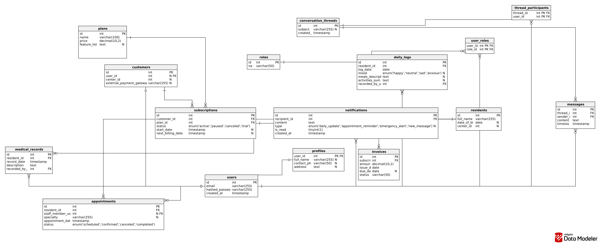

### 4.9.2. Class Dictionary

**Pendiente:** diccionario de clases del diseño OO.

## 4.10. Database Design

### 4.10.1. Relational/Non-Relational Database Diagram

Las decisiones clave tomadas, basadas directamente en nuestros diagramas de clases:

Traducción de Clases a Tablas: Cada clase de entidad (aquellas que guardan datos, como User, Property, Booking) se convierte en una tabla. Las clases de servicio e interfaces (AuthService, IUserRepository, etc.) no se convierten en tablas porque representan comportamiento, no datos.

Componentes sin Persistencia: Los componentes puramente técnicos como el Gateway IoT (MessageListener, RulesEngine, etc.) manejan datos en tránsito (mensajes, comandos) y no requieren persistencia en la base de datos relacional. Por lo tanto, no tienen tablas asociadas.

Nomenclatura: Se utiliza snake_case (ej: check_in_date) para nombres de tablas y columnas, una convención estándar en bases de datos.

Manejo de Herencia: La jerarquía de User se implementa con la estrategia "Tabla por Subclase" para máxima claridad y normalización.

Tipos de Datos ENUM: Los diferentes estados (BookingStatus, RoomStatus, etc.) se definen como tipos ENUM para garantizar la integridad de los datos.

Relaciones: Todas las asociaciones y composiciones en los diagramas de clases se implementan usando claves foráneas (FOREIGN KEY) con sus respectivas restricciones de multiplicidad (ej: UNIQUE para relaciones uno a uno).

#### Database Diagrams


