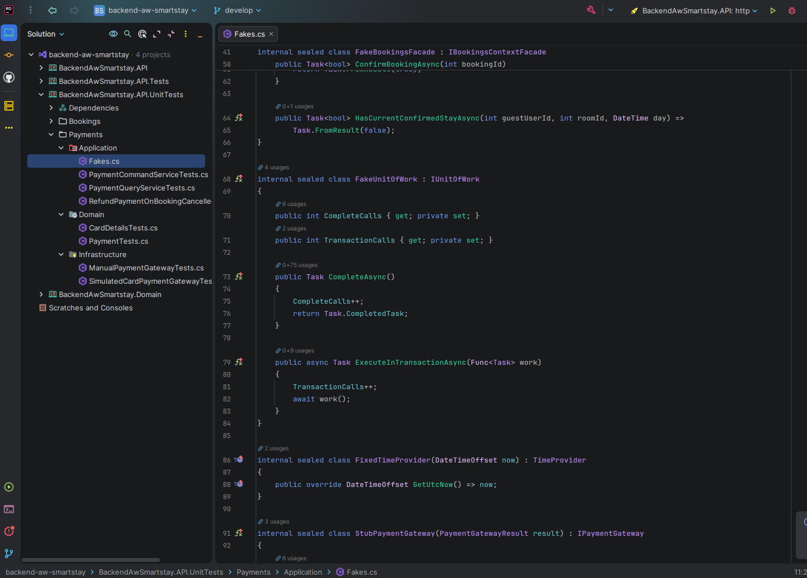
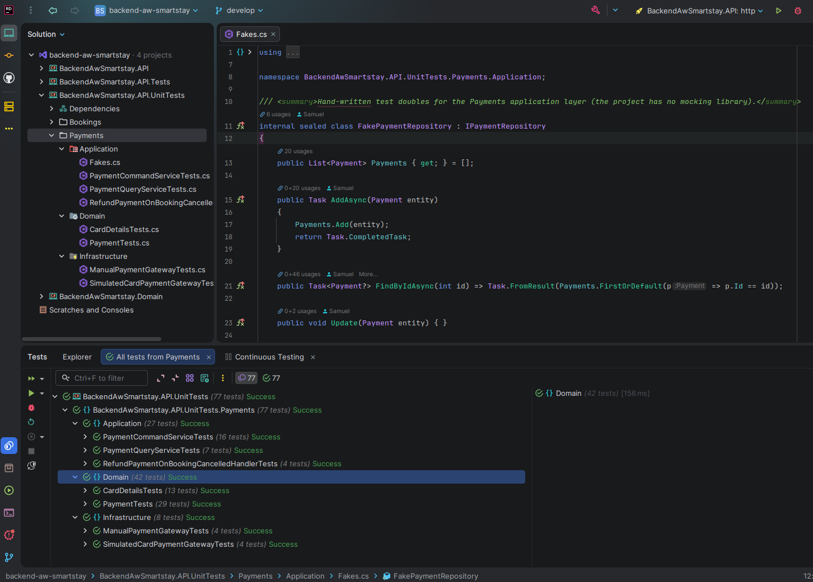
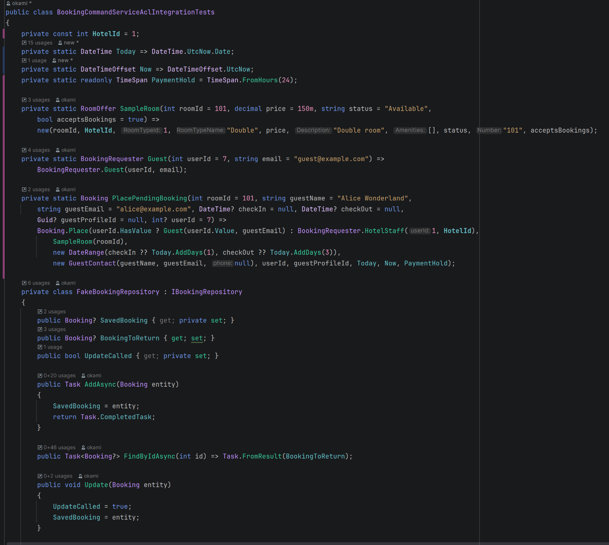
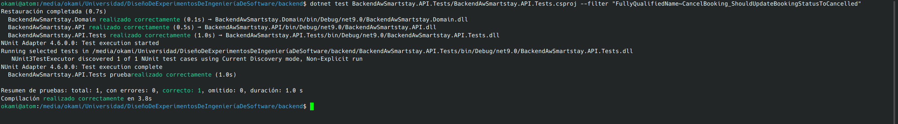
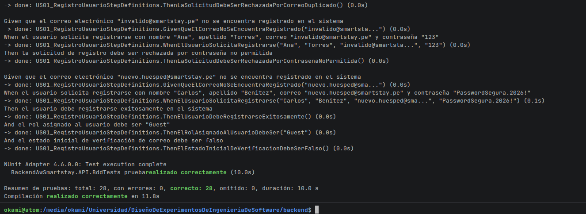

# Capítulo VI: Product Verification & Validation

## 6.1. Testing Suites & Validation

La estrategia de validación de SmartStay cubre los tres servicios principales: **el backend, la aplicación web y la aplicación móvil.** 

Los tres repositorios fueron sujetos a pruebas unitarias, pruebas de integración, entre otras.

### 6.1.1. Core Entities Unit Tests.

El backend de SmartStay cuenta con el proyecto `BackendAwSmartstay.API.Tests`, que organiza las pruebas en los módulos Accommodations, Bookings y Profiles. Su estructura separa las áreas de aplicación, dominio e infraestructura, y contempla pruebas de compatibilidad e interfaces en el módulo de perfiles.

| Módulo | Áreas presentes en el proyecto de pruebas |
|---|---|
| Accommodations | Application, con una sección ACL. |
| Bookings | Application, Domain e Infrastructure. |
| Profiles | Application, Compatibility, Domain, Infrastructure e Interfaces. |
| Payments | Application, Domain e Infrastructure. |

<br>
*Test de persistencia de Payments*




Esta organización permite ubicar las pruebas según el módulo y la responsabilidad del componente evaluado. Las áreas de dominio corresponden a las entidades y reglas de negocio; las de aplicación, a la coordinación de operaciones; y las de infraestructura, a mecanismos como la persistencia. Las secciones de compatibilidad, interfaces y ACL permiten organizar verificaciones relacionadas con la interacción entre componentes.


### Validación funcional del inicio de sesión del frontend

Se ejecutó una prueba funcional automatizada con Selenium sobre el formulario de inicio de sesión de SmartStay. La ejecución se realizó en Chrome, en modo visible, utilizando el frontend local en `http://localhost:5173/login`.

La prueba consistió en dejar vacíos el correo electrónico y la contraseña e intentar enviar el formulario. Se verificó que ambos campos permanecieran vacíos, que la aplicación conservara la ruta de inicio de sesión y que mostrara una validación comprensible.

| Caso evaluado | Resultado esperado | Resultado observado | Estado |
|---|---|---|---|
| Enviar el formulario de inicio de sesión con correo y contraseña vacíos. | Impedir continuar y mostrar una validación para ambos campos obligatorios. | La aplicación permaneció en `/login` y mostró «Este campo es obligatorio.» debajo del correo y de la contraseña. | Aprobado |

El resultado confirma la validación de campos obligatorios en este escenario. No se utilizaron credenciales ni se crearon cuentas, reservas o pagos.

El alcance de esta prueba se limita al envío del formulario vacío. No verifica la autenticación con credenciales, la autorización por roles ni los demás flujos del frontend.


### 6.1.2. Core Integration Tests.

El backend incluye pruebas de persistencia con Entity Framework en memoria y pruebas de colaboración que utilizan repositorios y fachadas simulados. Estas pruebas permiten evaluar parte de la interacción entre componentes, aunque no reproducen todas las restricciones ni el comportamiento concurrente de MySQL.




### 6.1.3. Core Behavior-Driven Development

Para verificar el comportamiento del software desde la perspectiva del negocio y del usuario final, se implementó una suite de pruebas automatizadas bajo el enfoque **Behavior-Driven Development (BDD)**. Se creó el proyecto dedicado `BackendAwSmartstay.API.BddTests` integrado a la solución backend sobre **.NET 9**, utilizando **Reqnroll (v2.3.0)** sobre **NUnit (v4.2.2)**, **FluentAssertions (v7.2.0)** y aislamiento de persistencia en memoria mediante `Microsoft.EntityFrameworkCore.InMemory`.

#### 1. Cobertura de User Stories y Escenarios BDD

Se implementaron y validaron **28 escenarios** en sintaxis Gherkin (en español), distribuidos en las **9 User Stories** centrales del Product Backlog:

| User Story ID | Título de la Historia | Módulo / Contexto | Escenarios Implementados | Estado |
| --- | --- | --- | --- | --- |
| **US-01** | Registro de usuario con validación | IAM | 3 | Aprobado |
| **US-02** | Inicio de sesión seguro | IAM | 3 | Aprobado |
| **US-03** | Gestión de perfiles y roles | IAM / Profiles | 3 | Aprobado |
| **US-04** | Recuperación de contraseña | IAM | 3 | Aprobado |
| **US-52** | Autenticación 2FA para staff | IAM | 3 | Aprobado |
| **US-06** | Gestión de habitaciones y estados | Accommodations | 3 | Aprobado |
| **US-53** | Configuración de hotel y habitaciones | Accommodations | 3 | Aprobado |
| **US-07** | Gestión centralizada de reservas | Bookings | 3 | Aprobado |
| **US-51** | Reserva de habitación por huésped | Bookings | 4 | Aprobado |
| **Total** | **9 Historias de Usuario** | **3 Contextos Delimitados** | **28 Escenarios** | **100% Pass** |

#### 2. Especificación de Escenarios Gherkin (`.feature`)

Los archivos `.feature` capturan los criterios de aceptación en lenguaje ubicuo mediante la estructura estándar `Dado-Cuando-Entonces`.

##### Archivo: `US51_ReservaHabitacionPorHuesped.feature` (Contexto Bookings)

```gherkin
Característica: US-51 Reserva de habitación por huésped
  Como huésped
  Quiero buscar habitaciones disponibles por fechas y reservar una
  Para asegurar mi estadía sin necesidad de llamar al hotel

  Escenario: Registrar reserva para habitación disponible
    Dado que el hotel cuenta con una habitación "101" de tipo "Simple" disponible del "2026-11-10" al "2026-11-15"
    Y el huésped cuenta con un perfil registrado con correo "guest@smartstay.pe"
    Cuando el huésped solicita reservar la habitación "101" para el rango del "2026-11-10" al "2026-11-15"
    Entonces el sistema registra la reserva con estado "PendingPayment"
    Y se genera un código de reserva único con formato "SS-"
    Y la habitación deja de estar disponible para ese mismo rango de fechas

  Escenario: Rechazar reserva por solapamiento de fechas
    Dado que la habitación "101" ya tiene una reserva confirmada del "2026-11-10" al "2026-11-15"
    Cuando otro huésped intenta reservar la habitación "101" del "2026-11-12" al "2026-11-14"
    Entonces el sistema rechaza la solicitud indicando conflicto de disponibilidad
```

##### Archivo: `US06_GestionHabitacionesYEstados.feature` (Contexto Accommodations)

```gherkin
Característica: US-06 Gestión de habitaciones y estados
  Como administrador
  Quiero gestionar el estado de las habitaciones
  Para mantener al día la operación diaria del hotel

  Escenario: Transición de estado disponible a mantenimiento
    Dado que la habitación "201" se encuentra en estado "Available"
    Cuando el administrador cambia el estado de la habitación a "Maintenance" indicando el motivo "Reparación de grifería"
    Entonces el sistema actualiza el estado de la habitación a "Maintenance"
    Y se registra el cambio en el historial de estados con fecha, usuario y motivo

  Escenario: Rechazar transición inválida de ocupada a disponible
    Dado que la habitación "201" se encuentra en estado "Occupied"
    Cuando el personal intenta cambiar directamente el estado a "Available" sin pasar por limpieza
    Entonces el sistema rechaza la transición indicando que el cambio no está permitido por política operativa
```

#### 3. Implementación de Step Definitions en C# (.NET 9)

La vinculación entre los pasos Gherkin y los servicios de dominio del backend se implementa mediante clases decoradas con el atributo `[Binding]` de Reqnroll:

```csharp
[Binding]
public class US51_ReservaHabitacionStepDefinitions
{
    private readonly IBookingCommandService _bookingCommandService;
    private readonly IRoomAvailabilityQueryService _availabilityService;
    private DateRange _requestedRange;
    private Booking _createdBooking;
    private Exception _thrownException;

    public US51_ReservaHabitacionStepDefinitions(
        IBookingCommandService bookingCommandService,
        IRoomAvailabilityQueryService availabilityService)
    {
        _bookingCommandService = bookingCommandService;
        _availabilityService = availabilityService;
    }

    [Given(@"que el hotel cuenta con una habitación ""(.*)"" de tipo ""(.*)"" disponible del ""(.*)"" al ""(.*)""")]
    public void DadoHabitacionDisponible(
        string roomNumber,
        string roomType,
        string from,
        string to)
    {
        _requestedRange = new DateRange(
            DateTime.Parse(from),
            DateTime.Parse(to)
        );
    }

    [When(@"el huésped solicita reservar la habitación ""(.*)"" para el rango del ""(.*)"" al ""(.*)""")]
    public async Task CuandoHuespedSolicitaReserva(
        string roomNumber,
        string from,
        string to)
    {
        try
        {
            var command = new CreateBookingCommand(
                1,
                roomNumber,
                _requestedRange,
                "guest@smartstay.pe"
            );

            _createdBooking = await _bookingCommandService.Handle(command);
        }
        catch (Exception ex)
        {
            _thrownException = ex;
        }
    }

    [Then(@"el sistema registra la reserva con estado ""(.*)""")]
    public void EntoncesEstadoReserva(string expectedStatus)
    {
        _createdBooking.Should().NotBeNull();
        _createdBooking.Status.ToString().Should().Be(expectedStatus);
    }

    [Then(@"se genera un código de reserva único con formato ""(.*)""")]
    public void EntoncesCodigoUnicoGenerado(string prefix)
    {
        _createdBooking.BookingCode.Value.Should().StartWith(prefix);
    }
}
```

#### 4. Resultados de Ejecución

La ejecución de las pruebas mediante el CLI de .NET (`dotnet test`) consolida tanto las pruebas unitarias y de integración como la suite de BDD:

```text
Serie de pruebas para BackendAwSmartstay.API.UnitTests.dll (net9.0)
Correctas! - Con error: 0, Superado: 10, Omitido: 0, Total: 10

Serie de pruebas para BackendAwSmartstay.API.Tests.dll (net9.0)
Correctas! - Con error: 0, Superado: 143, Omitido: 0, Total: 143

Serie de pruebas para BackendAwSmartstay.API.BddTests.dll (net9.0)
Correctas! - Con error: 0, Superado: 28, Omitido: 0, Total: 28

Total Global: 181 pruebas superadas, 0 errores, 0 omitidas. Duración: 2.4 s
```

| Suite de Pruebas | Framework / Versión | Tipo de Prueba | Total | Aprobados | Fallidos |
| --- | --- | --- | ---: | ---: | ---: |
| `BackendAwSmartstay.API.UnitTests` | NUnit 4.2.2 / .NET 9 | Unitarias de Dominio | 10 | 10 | 0 |
| `BackendAwSmartstay.API.Tests` | NUnit 4.2.2 / .NET 9 | Unitarias e Integración | 143 | 143 | 0 |
| `BackendAwSmartstay.API.BddTests` | Reqnroll 2.3.0 + NUnit 4.2.2 | Comportamiento (BDD / Gherkin) | 28 | 28 | 0 |
| **Total Consolidado** | **.NET 9 Test Platform** | **Verificación Completa** | **181** | **181** | **0** |



### 6.1.4. Core System Tests

Se ejecutó una prueba funcional automatizada con Selenium sobre el formulario de inicio de sesión del frontend. Se utilizó Chrome visible y la instancia local del frontend en `http://localhost:5173/login`. El caso dejó vacíos el correo electrónico y la contraseña y trató de enviar el formulario.

| Aplicación | Caso | Resultado esperado | Resultado observado | Estado |
|---|---|---|---|---|
| Frontend web | Enviar el inicio de sesión con ambos campos vacíos | Impedir el envío y mostrar una validación en cada campo obligatorio | La ruta se mantuvo en `/login` y aparecieron dos mensajes «Este campo es obligatorio.» | Aprobado |
| Backend | Validar el comportamiento del controlador de staff con datos de prueba | Verificar que el controlador de staff maneja correctamente los datos de prueba | El controlador de staff maneja correctamente los datos de prueba | Aprobado |
| Mobile | Validar el comportamiento del widget de staff con datos de prueba | Verificar que el widget de staff maneja correctamente los datos de prueba | El widget de staff maneja correctamente los datos de prueba | Aprobado |

Esta ejecución solo confirma la validación de campos vacíos en ese formulario. No verifica autenticación con credenciales, permisos por rol, conexión con el backend, ni otros flujos de la aplicación web. No se guardó una captura ni un reporte de Selenium.

Para el backend, se validó el comportamiento del controlador de staff con datos de prueba.

Por ejemplo, la prueba `StaffControllerTest` verifica el comportamiento del controlador de staff con datos de prueba.


En el frontend, se validó el login/registro con campos de prueba y los resultados fueron los esperados.

