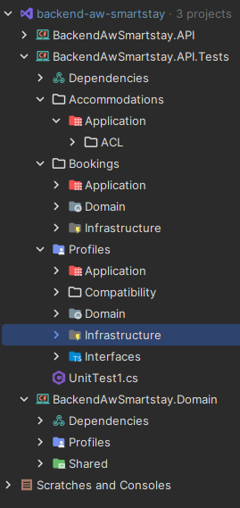
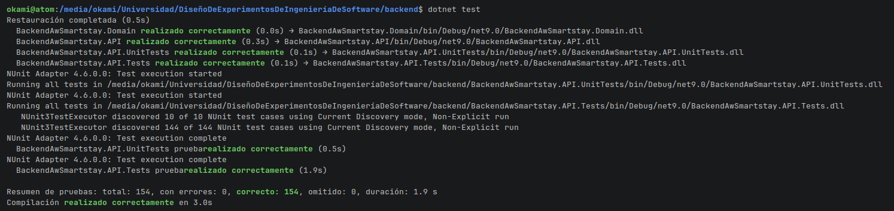
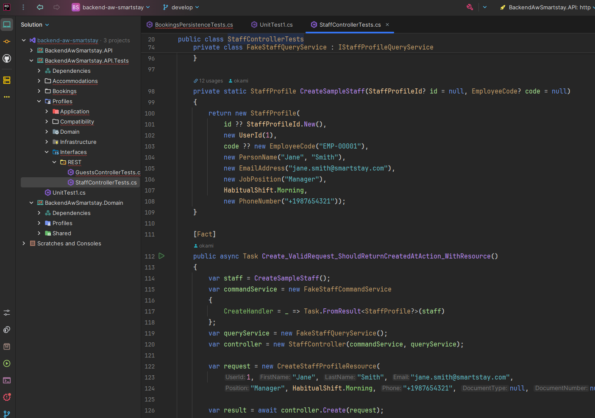

# Capítulo VI: Product Verification & Validation

## 6.1. Testing Suites & Validation

La estrategia de validación de SmartStay cubre los tres servicios principales: **el backend, la aplicación web y la aplicación móvil.** 

Los tres repositorios fueron sujetos a pruebas unitarias, pruebas de integración, entre otras.

### 6.1.1. Core Entities Unit Tests.

El backend de SmartStay cuenta con el proyecto `BackendAwSmartstay.API.Tests`, que organiza las pruebas en los módulos Accommodations, Bookings y Profiles. Su estructura separa las áreas de aplicación, dominio e infraestructura, y contempla pruebas de compatibilidad e interfaces en el módulo de perfiles.

| Módulo | Áreas presentes en el proyecto de pruebas |
|---|---|
| Accommodations | Application, con una sección ACL. |
| Bookings | Application, Domain e Infrastructure. |
| Profiles | Application, Compatibility, Domain, Infrastructure e Interfaces. |

Esta organización permite ubicar las pruebas según el módulo y la responsabilidad del componente evaluado. Las áreas de dominio corresponden a las entidades y reglas de negocio; las de aplicación, a la coordinación de operaciones; y las de infraestructura, a mecanismos como la persistencia. Las secciones de compatibilidad, interfaces y ACL permiten organizar verificaciones relacionadas con la interacción entre componentes.

### Validación funcional del inicio de sesión del frontend

Se ejecutó una prueba funcional automatizada con Selenium sobre el formulario de inicio de sesión de SmartStay. La ejecución se realizó en Chrome, en modo visible, utilizando el frontend local en `http://localhost:5173/login`.

La prueba consistió en dejar vacíos el correo electrónico y la contraseña e intentar enviar el formulario. Se verificó que ambos campos permanecieran vacíos, que la aplicación conservara la ruta de inicio de sesión y que mostrara una validación comprensible.

| Caso evaluado | Resultado esperado | Resultado observado | Estado |
|---|---|---|---|
| Enviar el formulario de inicio de sesión con correo y contraseña vacíos. | Impedir continuar y mostrar una validación para ambos campos obligatorios. | La aplicación permaneció en `/login` y mostró «Este campo es obligatorio.» debajo del correo y de la contraseña. | Aprobado |

El resultado confirma la validación de campos obligatorios en este escenario. No se utilizaron credenciales ni se crearon cuentas, reservas o pagos.

El alcance de esta prueba se limita al envío del formulario vacío. No verifica la autenticación con credenciales, la autorización por roles ni los demás flujos del frontend.

### 6.1.2. Core Integration Tests.

El backend incluye pruebas de persistencia con Entity Framework en memoria y pruebas de colaboración que utilizan repositorios y fachadas simulados. Estas pruebas permiten evaluar parte de la interacción entre componentes, aunque no reproducen todas las restricciones ni el comportamiento concurrente de MySQL.

### 6.1.3. Core Behavior-Driven Development

### 6.1.4. Core System Tests

Se ejecutó una prueba funcional automatizada con Selenium sobre el formulario de inicio de sesión del frontend. Se utilizó Chrome visible y la instancia local del frontend en `http://localhost:5173/login`. El caso dejó vacíos el correo electrónico y la contraseña y trató de enviar el formulario.

| Aplicación | Caso | Resultado esperado | Resultado observado | Estado |
|---|---|---|---|---|
| Frontend web | Enviar el inicio de sesión con ambos campos vacíos | Impedir el envío y mostrar una validación en cada campo obligatorio | La ruta se mantuvo en `/login` y aparecieron dos mensajes «Este campo es obligatorio.» | Aprobado |
| Backend | Validar el comportamiento del controlador de staff con datos de prueba | Verificar que el controlador de staff maneja correctamente los datos de prueba | El controlador de staff maneja correctamente los datos de prueba | Aprobado |
| Mobile | Validar el comportamiento del widget de staff con datos de prueba | Verificar que el widget de staff maneja correctamente los datos de prueba | El widget de staff maneja correctamente los datos de prueba | Aprobado |

Esta ejecución solo confirma la validación de campos vacíos en ese formulario. No verifica autenticación con credenciales, permisos por rol, conexión con el backend, ni otros flujos de la aplicación web. No se guardó una captura ni un reporte de Selenium.

Para el backend, se validó el comportamiento del controlador de staff con datos de prueba.

Por ejemplo, la prueba `StaffControllerTest` verifica el comportamiento del controlador de staff con datos de prueba.

En el frontend, se validó el login/registro con campos de prueba y los resultados fueron los esperados.

