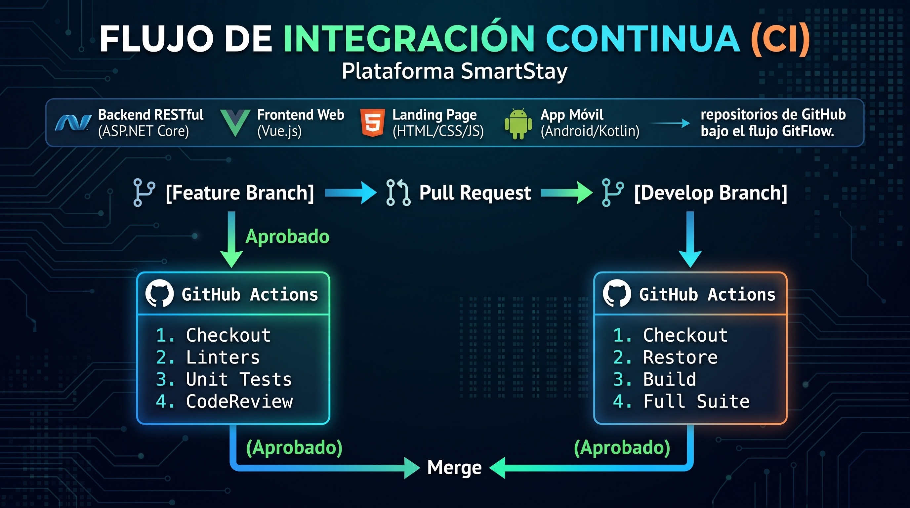
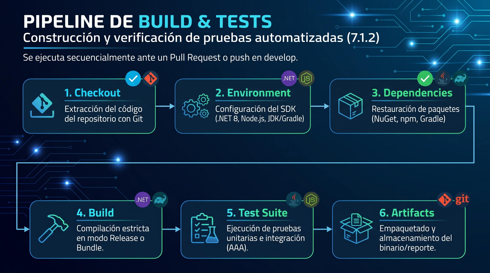
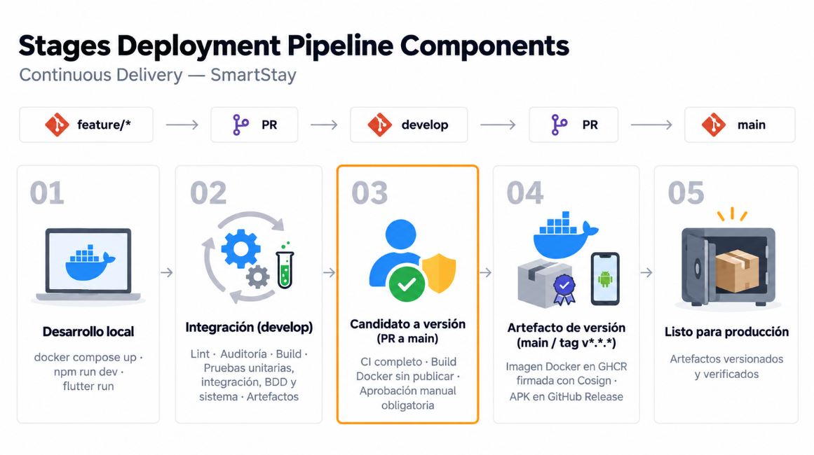
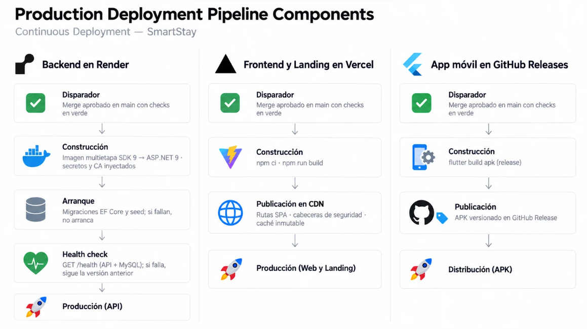

# Capítulo VII: DevOps Practices

## 7.1. Continuous Integration

La Integración Continua (CI) en la plataforma SmartStay constituye el conjunto de prácticas, mecanismos de automatización y herramientas orientadas a validar, compilar y verificar la calidad de cada incremento de código desarrollado por el equipo. Dado que la arquitectura de la solución involucra múltiples componentes heterogéneos —Backend RESTful en ASP.NET Core, Frontend Web en Vue.js, Landing Page en HTML/CSS/JS y la Aplicación Móvil nativa en Android (Kotlin)—, el flujo de CI se diseñó para ejecutarse de forma distribuida y desatendida sobre los repositorios de GitHub bajo el flujo de trabajo GitFlow.




---

### 7.1.1. Tools and Practices

Para garantizar que el código integrado sea funcional, seguro y conforme a los lineamientos arquitectónicos, se establecieron las siguientes herramientas y prácticas operativas:

#### 1. Herramientas de Integración Continua

* **GitHub Actions:** Orquestador principal de automatización. Gestiona los flujos de trabajo (*workflows*) declarados en archivos YAML dentro de `.github/workflows/` (tales como `docker-publish.yml` y flujos de integración continua específicos por componente).

* **Entornos de Ejecución (.NET SDK, Node.js y JDK):**
  * Para el Backend: **.NET SDK 8.0** con la herramienta de configuración global `.config/dotnet-tools.json` para estandarizar el conjunto de herramientas de compilación y pruebas.
  * Para el Frontend Web y Landing Page: **Node.js (LTS)** con gestor de paquetes `npm`.
  * Para la Aplicación Móvil: **OpenJDK 17** y **Gradle** en Android Studio para la compilación de módulos Kotlin.

* **Herramientas de Análisis Estático y Linters:**
  * **ESLint y Prettier:** Verificación de formato, sintaxis limpia y cumplimiento de buenas prácticas de JavaScript y Vue.js.
  * **Roslyn Analyzers / C# Coding Conventions:** Validación del código en el backend siguiendo las convenciones de Microsoft ASP.NET Core (nombres en PascalCase, contratos explícitos e inyección de dependencias).
  * **Android Lint / ktlint:** Comprobación de estándares de código limpio y optimización de recursos XML y Kotlin en la aplicación móvil.

#### 2. Prácticas de Ingeniería Aplicadas

* **Integración Diaria y Commits Semánticos:** Los desarrolladores integran ramas de funcionalidad (`feature/`) hacia la rama base de integración (`develop`) de forma frecuente mediante *Pull Requests*. Los mensajes de confirmación respetan las convenciones estándar (`feat:`, `fix:`, `docs:`, `chore:`, `refactor:`) para facilitar la trazabilidad y la generación de registros de cambios.

* **Protección de Ramas (Branch Protection Rules):** La rama principal de producción (`main`) y la rama de integración (`develop`) se encuentran protegidas. No se permiten *direct pushes*; toda fusión exige:
  1. Aprobación obligatoria por revisión de código entre pares (*Peer Review*).
  2. Ejecución satisfactoria y sin errores de los flujos de GitHub Actions correspondientes.

* **Compilación Limpia (Zero-Warning Build):** El proceso de compilación automática está configurado para fallar si se detectan errores de sintaxis, dependencias circulares o advertencias de compilación no resueltas.

* **Auditoría de Dependencias Vulnerables:** Se ejecutan comandos automatizados de escaneo de librerías (`dotnet list package --vulnerable` y `npm audit`) antes de autorizar la compilación de paquetes productivos.

---

### 7.1.2. Build & Test Suite Pipeline Components

El pipeline de construcción y verificación de pruebas automatizadas está estructurado en componentes y etapas secuenciales. Cada vez que se crea un *Pull Request* o se realiza un *push* sobre `develop`, el pipeline orquesta las siguientes fases:



#### 1. Componentes del Pipeline por Plataforma

* **Backend (`backend-aw-smartstay`):**
  * *Restauración y Compilación:* Se ejecutan `dotnet restore` sobre la solución `backend-aw-smartstay.sln` y posteriormente `dotnet build --configuration Release --no-restore`.
  * *Ejecución de Pruebas Unitarias y de Dominio:* Mediante el ejecutable `dotnet test` se corren todas las clases del proyecto `BackendAwSmartstay.API.Tests`, aplicando el patrón **Arrange-Act-Assert (AAA)**:
    * Pruebas de Dominio e Identidad: `GuestProfileTests.cs`, `StaffProfileTests.cs` y `StaffAssignmentTests.cs`.
    * Pruebas de Reservas y Transacciones: `BookingTests.cs`, verificando transiciones de estado de reserva y cálculo de tarifas.
    * Pruebas de Integración y Fachadas ACL: `BookingCommandServiceAclIntegrationTests.cs` y `AccommodationsContextFacadeTests.cs`.
    * Pruebas de Persistencia y Concurrencia en MySQL: `ProfilesMySqlConcurrencyIntegrationTests.cs` y `BookingsPersistenceTests.cs`.
    * Pruebas de Controladores REST: `GuestsControllerTests.cs` y `StaffControllerTests.cs`.

* **Landing Page y Frontend Web:**
  * *Compilación y Bundle:* Ejecución de `npm ci` seguido de `npm run build` para generar los bundles estáticos minificados de producción en el directorio `dist/`.
  * *Suite de Pruebas de UI:* Ejecución de `npm test` mediante Jest para validar el renderizado del home, el correcto direccionamiento de los botones CTA y la operatividad de los diccionarios de internacionalización (`languages.js`).

* **Móvil Android:**
  * *Compilación y Pruebas Locales:* Se ejecuta `./gradlew testDebugUnitTest` para comprobar los modelos de datos, la gestión de sesiones en `TokenManager` y la lógica de presentación de los ViewModels.

#### 2. Declaración del Workflow de Integración (Ejemplo de Configuración de CI)

A continuación, se documenta la estructura del pipeline de CI automatizado en GitHub Actions para el backend del sistema (`.github/workflows/ci-backend.yml`):

```yaml
name: SmartStay Backend CI Pipeline

on:
  push:
    branches: [ develop, main ]
  pull_request:
    branches: [ develop, main ]

jobs:
  build-and-test:
    name: Build, Static Analysis and Unit Testing
    runs-on: ubuntu-latest

    steps:
    - name: Checkout Source Code
      uses: actions/checkout@v4

    - name: Setup .NET SDK
      uses: actions/setup-dotnet@v4
      with:
        dotnet-version: '8.0.x'

    - name: Restore NuGet Dependencies
      run: dotnet restore backend-aw-smartstay.sln

    - name: Compile Backend Solution
      run: dotnet build backend-aw-smartstay.sln --configuration Release --no-restore

    - name: Execute Test Suite (Domain, ACL & Persistence)
      run: >
        dotnet test backend-aw-smartstay.sln
        --configuration Release
        --no-build
        --verbosity normal
        --logger "trx;LogFileName=test_results.trx"
        --collect:"XPlat Code Coverage"

    - name: Upload Test Results
      if: always()
      uses: actions/upload-artifact@v4
      with:
        name: test-results
        path: "**/test_results.trx"
```

El resultado de este pipeline garantiza que ningún incremento con pruebas fallidas o errores de compilación pueda ser fusionado al código base, garantizando la estabilidad operativa del sistema previo a las etapas de entrega y despliegue.

## 7.2. Continuous Delivery

La Entrega Continua (CD) en SmartStay extiende el flujo de Integración Continua para que cada incremento validado en `develop` quede empaquetado, versionado y listo para liberarse en cualquier momento. El objetivo es que el paso a producción sea una decisión de negocio y no un esfuerzo técnico. Para ello, cada componente se despliega automáticamente en un entorno de pruebas (*staging*) que replica las condiciones de producción.

### 7.2.1. Tools and Practices.

Para asegurar que cada versión generada sea reproducible, trazable y desplegable bajo demanda, se definieron las siguientes herramientas y prácticas:

#### 1. Herramientas de Entrega Continua

* **GitHub Actions (Environments):** Orquesta los flujos de entrega definidos en `.github/workflows/` (como `docker-publish.yml` y `cd-staging.yml`). Usa *GitHub Environments* (`staging` y `production`) para separar configuraciones, secretos y reglas de aprobación por entorno.

* **Docker y Docker Compose:**
  * El Backend en ASP.NET Core se empaqueta con un `Dockerfile` *multi-stage*. La etapa `build` usa la imagen `mcr.microsoft.com/dotnet/sdk:8.0` y la etapa `runtime` usa `mcr.microsoft.com/dotnet/aspnet:8.0`, lo que reduce el tamaño de la imagen final.
  * `docker-compose.yml` levanta localmente y en *staging* el backend junto a una instancia de **MySQL 8**, con lo que se asegura la paridad entre entornos.

* **Registro de Contenedores (GitHub Container Registry - GHCR):** Almacena las imágenes versionadas del backend (`ghcr.io/<org>/backend-aw-smartstay:<versión>`). Cada imagen se etiqueta con la versión semántica y con el *hash* corto del commit.

* **Gestión de Secretos (GitHub Secrets):** Centraliza las cadenas de conexión a MySQL, las claves de firma JWT, las credenciales del registro de contenedores y el *keystore* de firma de Android. Ningún dato sensible se versiona en el repositorio.

* **Entity Framework Core Migrations:** Genera scripts SQL idempotentes (`dotnet ef migrations script --idempotent`) que se aplican de forma controlada sobre la base de datos de cada entorno.

* **Hosting por componente:**
  * Backend: servicio de contenedores en la nube (Azure App Service for Containers), con un *slot* de `staging`.
  * Frontend Web (Vue.js): hosting estático con *preview deployments* por Pull Request (Netlify / Vercel).
  * Landing Page: GitHub Pages, publicada desde el directorio `dist/`.
  * Aplicación Android: **Firebase App Distribution** distribuye builds de prueba al equipo y a los *testers* internos.

* **Gradle (Android Release Build):** Genera APK/AAB firmados mediante `./gradlew assembleRelease` y `./gradlew bundleRelease`, con la configuración de firma inyectada desde los secretos del pipeline.

#### 2. Prácticas de Ingeniería Aplicadas

* **Build Once, Deploy Many:** El artefacto (imagen Docker, bundle `dist/` o AAB) se construye una sola vez y se promueve sin recompilar entre entornos. Solo cambian las variables de configuración inyectadas en tiempo de despliegue (`ASPNETCORE_ENVIRONMENT`, `VITE_API_BASE_URL`, etc.).

* **Versionamiento Semántico y Release Branches (GitFlow):** Cada entrega se prepara en una rama `release/x.y.z` creada desde `develop`. Al cerrarla se genera un *tag* `vX.Y.Z` en `main`, junto con un *changelog* construido automáticamente a partir de los commits semánticos.

* **Despliegue Automático a Staging:** Todo merge a `develop` despliega automáticamente en el entorno `staging`. Ahí el equipo y el Product Owner validan las historias de usuario completadas antes de su liberación.

* **Pruebas de Aceptación y Smoke Tests en Staging:** Tras cada despliegue se ejecutan verificaciones automáticas sobre los endpoints críticos (`/health`, autenticación, creación de reservas) y validaciones funcionales del Frontend Web, para confirmar que la versión es apta para producción.

* **Aprobación Manual para Producción:** El entorno `production` en GitHub Environments exige la aprobación explícita de un responsable (*required reviewers*). La liberación queda así controlada por el equipo aunque el artefacto ya esté listo.

* **Configuración Externalizada:** Siguiendo los principios de *The Twelve-Factor App*, la configuración por entorno se separa del código fuente mediante variables de entorno y `appsettings.{Environment}.json`.

### 7.2.2. Stages Deployment Pipeline Components.

El pipeline de entrega continua de SmartStay organiza el recorrido de cada cambio en cinco etapas, alineadas con el flujo de ramas GitFlow: `feature/*` → Pull Request → `develop` → Pull Request → `main`. Cada etapa añade un nivel de verificación, de modo que solo los incrementos validados llegan a convertirse en artefactos de versión listos para producción.



#### 1. Etapas del Pipeline

* **01 – Desarrollo local:** Cada desarrollador trabaja en una rama `feature/*` con un entorno local equivalente al de los demás entornos.
  * El backend y la base de datos MySQL se levantan con `docker compose up`.
  * El Frontend Web y la Landing Page se ejecutan con `npm run dev`.
  * La aplicación móvil se prueba con `flutter run`.
  * Esto reduce las diferencias entre entornos ("en mi máquina funciona") antes de abrir el Pull Request.

* **02 – Integración (`develop`):** Al abrir un Pull Request hacia `develop`, o al fusionarse en ella, se ejecuta el pipeline de integración completo:
  * Linters y análisis estático.
  * Auditoría de dependencias vulnerables.
  * Compilación de todos los componentes.
  * Pruebas unitarias, de integración, BDD y de sistema.
  * Los resultados se publican como artefactos del workflow (reportes de pruebas y cobertura), lo que da trazabilidad.

* **03 – Candidato a versión (PR a `main`):** Esta etapa es el punto de control crítico del pipeline.
  * Al crearse el Pull Request de `develop` hacia `main`, se ejecuta nuevamente el CI completo.
  * Se construye la imagen Docker del backend sin publicarla, para comprobar que es empaquetable.
  * La fusión exige una aprobación manual obligatoria por parte de un responsable del equipo.
  * Así, la decisión de liberar una versión permanece bajo control humano.

* **04 – Artefacto de versión (`main` / tag `v*.*.*`):** Una vez aprobado y fusionado el cambio en `main`, junto con el *tag* de versión semántica correspondiente, se generan los artefactos definitivos:
  * **Backend:** imagen Docker publicada en **GitHub Container Registry (GHCR)** y firmada digitalmente con **Cosign**, lo que garantiza su integridad y procedencia.
  * **Aplicación móvil:** APK adjuntado a un **GitHub Release** asociado al mismo *tag*.

* **05 – Listo para producción:** Al finalizar el pipeline se dispone de artefactos versionados, inmutables y verificados. Pueden desplegarse en producción en cualquier momento, sin volver a compilar, lo que cumple el principio *build once, deploy many* de la entrega continua.


## 7.3. Continuous deployment

El Despliegue Continuo en SmartStay automatiza el último paso del ciclo: llevar a producción, sin intervención manual, todo cambio que supere las etapas de integración y entrega. Este modelo se aplica por completo al Backend, al Frontend Web y a la Landing Page. La Aplicación Móvil sigue un esquema de despliegue progresivo, porque depende del proceso de revisión de Google Play.

### 7.3.1. Tools and Practices.

Para desplegar en producción de forma segura, frecuente y reversible, se emplean las siguientes herramientas y prácticas:

#### 1. Herramientas de Despliegue Continuo

* **GitHub Actions (Production Workflow):** El workflow `cd-production.yml` se dispara automáticamente con cada merge o *tag* sobre `main`. Toma la imagen ya validada en *staging* y la despliega en el entorno productivo.

* **Azure App Service – Deployment Slots:** El backend se publica primero en un *slot* intermedio y luego se intercambia (*swap*) con el *slot* de producción. Esto permite despliegues sin tiempo de inactividad (*zero-downtime*) y una reversión inmediata.

* **Hosting Estático con Despliegue Atómico:** El Frontend Web y la Landing Page se publican de forma atómica. La nueva versión reemplaza a la anterior solo cuando la carga termina por completo, y se conserva el historial de despliegues para revertir con un clic.

* **Google Play Console (Staged Rollout):** La Aplicación Android se publica primero en la pista de pruebas internas y luego en producción con un despliegue escalonado por porcentaje de usuarios (10% → 50% → 100%). La subida del AAB se automatiza desde GitHub Actions.

* **Monitoreo y Observabilidad:**
  * **Health Checks de ASP.NET Core** (`/health`) para verificar la disponibilidad del API y la conectividad con MySQL.
  * **Azure Application Insights** para registrar logs, trazas, tiempos de respuesta y excepciones en producción.
  * **Firebase Crashlytics** para reportar fallos de la aplicación móvil en tiempo real.

* **Notificaciones del Pipeline:** Integración de GitHub Actions con el canal de comunicación del equipo (Discord / Slack) para avisar sobre despliegues exitosos, fallidos o revertidos.

#### 2. Prácticas de Ingeniería Aplicadas

* **Despliegue Automático tras Pipeline Verde:** Ningún cambio llega a producción sin haber superado la compilación, las pruebas unitarias y de integración, el análisis estático y la validación en *staging*. Si alguna etapa falla, el despliegue se detiene.

* **Zero-Downtime Deployment:** El intercambio de *slots* (estrategia *blue-green*) garantiza que los huéspedes y el personal del hotel no sufran interrupciones durante la actualización.

* **Verificación Post-Despliegue (Smoke Tests en Producción):** Tras cada despliegue, el pipeline consulta los endpoints de salud y los flujos críticos. Si la verificación falla, se ejecuta automáticamente el *swap* inverso para restaurar la versión anterior.

* **Estrategia de Rollback:** Toda versión productiva corresponde a un *tag* `vX.Y.Z` y a una imagen inmutable en GHCR. Revertir consiste en volver a desplegar la imagen previa, sin recompilar código.

* **Migraciones de Base de Datos Compatibles hacia Atrás:** Los cambios de esquema en MySQL se aplican de forma aditiva (*expand and contract*), para que la versión anterior del backend siga operando durante el despliegue y ante un eventual rollback.

* **Feature Toggles:** Las funcionalidades incompletas o experimentales se integran desactivadas mediante banderas de configuración. Así el código se despliega continuamente sin exponer cambios no aprobados al usuario final.

* **Hotfixes bajo GitFlow:** Las correcciones urgentes se desarrollan en ramas `hotfix/` creadas desde `main`. Pasan por el mismo pipeline automatizado y se fusionan de vuelta a `develop` para mantener la consistencia del código.
  
  
### 7.3.2. Production Deployment Pipeline Components.

El pipeline de despliegue continuo lleva automáticamente a producción cada versión aprobada en `main`. Se divide en tres flujos independientes, uno por plataforma de hosting. Los tres comparten el mismo disparador: un merge aprobado en `main` con todos los *checks* en verde.



#### 1. Backend en Render

* **Disparador:** Merge aprobado en `main` con todos los *checks* de GitHub Actions en verde.
* **Construcción:** Se compila una imagen Docker multietapa.
  * La etapa de build usa el **.NET SDK 9**.
  * La etapa final usa el runtime de **ASP.NET 9**, que es más ligero y seguro.
  * Los secretos de configuración y el certificado de autoridad (CA) para la conexión segura a MySQL se inyectan desde el entorno de Render, sin versionarse en el repositorio.
* **Arranque:** Al iniciar el contenedor se aplican automáticamente las migraciones de **Entity Framework Core** y los datos semilla (*seed*). Si alguna migración falla, la aplicación no arranca. Esto evita que una versión opere sobre un esquema de base de datos inconsistente.
* **Health check:** Render consulta el endpoint `GET /health`, que verifica tanto la disponibilidad del API como la conectividad con MySQL. Si la verificación falla, el despliegue se descarta y sigue en servicio la versión anterior. Esto da un rollback implícito y sin tiempo de inactividad.
* **Producción (API):** Superado el health check, la nueva versión del API RESTful pasa a atender el tráfico productivo.

#### 2. Frontend Web y Landing Page en Vercel

* **Disparador:** Merge aprobado en `main` con *checks* en verde.
* **Construcción:** Se instalan las dependencias de forma reproducible con `npm ci` y se genera el bundle optimizado de producción con `npm run build` (Vite).
* **Publicación en CDN:** Los archivos estáticos se distribuyen en la red de borde de Vercel con tres configuraciones:
  * Reescritura de rutas para el correcto funcionamiento de la SPA en Vue.js.
  * Cabeceras de seguridad HTTP.
  * Caché inmutable para los recursos versionados por *hash*.
* **Producción (Web y Landing):** El despliegue es atómico. La nueva versión reemplaza a la anterior solo cuando la publicación termina por completo, y el historial de despliegues permite revertir de inmediato.

#### 3. Aplicación Móvil en GitHub Releases

* **Disparador:** Merge aprobado en `main` con *checks* en verde.
* **Construcción:** Se genera el APK de producción con `flutter build apk --release`.
* **Publicación:** El APK, versionado según el *tag* semántico de la entrega, se adjunta automáticamente al **GitHub Release** correspondiente.
* **Distribución (APK):** Los usuarios y *testers* descargan la última versión estable directamente desde la página de Releases del repositorio, con trazabilidad completa entre el binario y el código fuente que lo generó.
