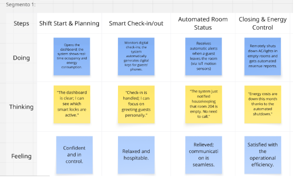
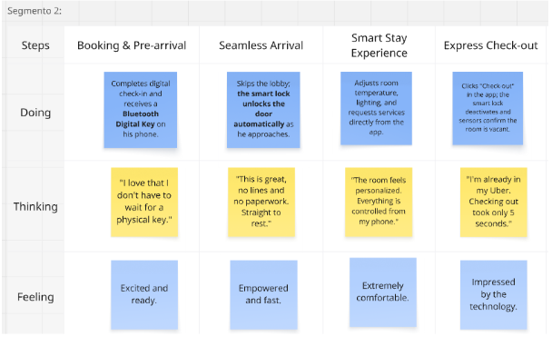

# Capítulo III: Requirements Specification

## 3.1. To-Be Scenario Mapping

Segmento 1: Staff Operativo de Hoteles

Segmento 2: Huéspedes de Hoteles Boutique

## 3.2. User Stories

<table>
  <tr>
    <th>Epic / User Story ID</th>
    <th>Título</th>
    <th>Descripción</th>
    <th>Criterios de Aceptación</th>
    <th>Relacionado con (Epic ID)</th>
  </tr>

  <tr class="epic-row">
    <td><strong>EP-01</strong></td>
    <td><strong>Landing Page y Marketing Digital</strong></td>
    <td>Épica para el sitio web estático con información por segmento, casos de éxito, simuladores y canales de contacto comercial.</td>
    <td></td>
    <td>-</td>
  </tr>
  <tr class="epic-row">
    <td><strong>EP-02</strong></td>
    <td><strong>Gestión Central del Hotel</strong></td>
    <td>Épica que incluye la administración de reservas, gestión de habitaciones, check-in/check-out digital, gestión operativa diaria y coordinación de servicios internos.</td>
    <td></td>
    <td>-</td>
  </tr>
  <tr class="epic-row">
    <td><strong>EP-03</strong></td>
    <td><strong>Integraciones y Canales Externos</strong></td>
    <td>Épica para las conexiones con OTAs, WhatsApp, sistemas de pago, reputación digital y webhooks de terceros.</td>
    <td></td>
    <td>-</td>
  </tr>
  <tr class="epic-row">
    <td><strong>EP-04</strong></td>
    <td><strong>Autenticación y Gestión de Usuarios</strong></td>
    <td>Épica que agrupa las funcionalidades de registro, inicio de sesión, gestión de perfil y control de acceso por roles para todos los tipos de usuario.</td>
    <td></td>
    <td>-</td>
  </tr>
  <tr class="epic-row">
    <td><strong>EP-05</strong></td>
    <td><strong>Experiencia Digital del Huésped</strong></td>
    <td>Épica enfocada en la experiencia del huésped: control ambiental IoT, servicios personalizados, comunicación digital y evaluación post-estancia.</td>
    <td></td>
    <td>-</td>
  </tr>
  <tr class="epic-row">
    <td><strong>EP-06</strong></td>
    <td><strong>Analítica e Informes</strong></td>
    <td>Épica que cubre el panel de gestión, informes de ocupación, KPIs operativos, análisis de satisfacción y métricas financieras.</td>
    <td></td>
    <td>-</td>
  </tr>
  <tr class="epic-row">
    <td><strong>EP-07</strong></td>
    <td><strong>Notificaciones y Comunicación</strong></td>
    <td>Épica para el sistema de notificaciones push, email, SMS, alertas automáticas y comunicación entre personal y huéspedes.</td>
    <td></td>
    <td>-</td>
  </tr>

  <tr class="us-row">
    <td>US-24</td>
    <td>Landing page segmentada</td>
    <td class="user-story-desc"><strong>Como</strong> visitante, <strong>quiero</strong> encontrar información específica según mi perfil (administrador de hotel o huésped) <strong>para</strong> entender el valor de Smart Stay.</td>
    <td class="acceptance-criteria">
      <strong>Escenario 1: Información para administrador</strong> 
      <strong>Dado que</strong> soy administrador de hotel visitando la página, <strong>cuando</strong> navego la sección de hoteles, <strong>entonces</strong> veo beneficios operativos, ROI, casos de éxito y demo específico. 
      <strong>Escenario 2: Información para huésped</strong> 
      <strong>Dado que</strong> soy viajero visitando la página, <strong>cuando</strong> navego la sección de huéspedes, <strong>entonces</strong> veo beneficios de experiencia, comodidad y tecnología. 
      <strong>Escenario 3: Navegación intuitiva</strong> 
      <strong>Dado que</strong> llego al landing, <strong>cuando</strong> carga, <strong>entonces</strong> puedo identificar fácilmente mi perfil y navegar a información relevante en menos de 3 clics. 
      <strong>Escenario 4: Llamadas a la acción claras</strong> 
      <strong>Dado que</strong> estoy interesado, <strong>cuando</strong> busco el siguiente paso, <strong>entonces</strong> encuentro CTAs claros (solicitar demo, contactar ventas, descargar app).
    </td>
    <td>EP-01</td>
  </tr>
  <tr class="us-row">
    <td>US-25</td>
    <td>Simulador de ROI para hoteles</td>
    <td class="user-story-desc"><strong>Como</strong> administrador de hotel visitante, <strong>quiero</strong> usar un simulador para estimar el retorno de inversión que obtendría con Smart Stay <strong>para</strong> tomar decisiones informadas.</td>
    <td class="acceptance-criteria">
      <strong>Escenario 1: Cálculo básico de ROI</strong> 
      <strong>Dado que</strong> ingreso datos básicos (número de habitaciones, ocupación promedio), <strong>cuando</strong> ejecuto la simulación, <strong>entonces</strong> veo el ahorro anual estimado y el tiempo de recuperación. 
      <strong>Escenario 2: Personalización por tipo de hotel</strong> 
      <strong>Dado que</strong> selecciono mi tipo de hotel (boutique, cadena, resort), <strong>cuando</strong> uso el simulador, <strong>entonces</strong> los cálculos se ajustan a los promedios de mi segmento. 
      <strong>Escenario 3: Comparación con situación actual</strong> 
      <strong>Dado que</strong> ingreso mis costos operativos actuales, <strong>cuando</strong> genero el informe, <strong>entonces</strong> veo comparación clara entre mi operación actual y con Smart Stay. 
      <strong>Escenario 4: Exportar resultados</strong> 
      <strong>Dado que</strong> completo la simulación, <strong>cuando</strong> quiero guardar resultados, <strong>entonces</strong> puedo exportar informe PDF para compartir con mi equipo.
    </td>
    <td>EP-01</td>
  </tr>
  <tr class="us-row">
    <td>US-27</td>
    <td>Solicitud de demo y contacto comercial</td>
    <td class="user-story-desc"><strong>Como</strong> visitante interesado, <strong>quiero</strong> solicitar una demostración y contactar al equipo de ventas de forma fácil y rápida <strong>para</strong> explorar las soluciones de Smart Stay.</td>
    <td class="acceptance-criteria">
      <strong>Escenario 1: Formulario de solicitud de demo</strong> 
      <strong>Dado que</strong> quiero ver una demo, <strong>cuando</strong> completo el formulario, <strong>entonces</strong> recibo confirmación inmediata y el equipo me contacta dentro de 24 horas. 
      <strong>Escenario 2: Agendamiento automático</strong> 
      <strong>Dado que</strong> solicito una demo, <strong>cuando</strong> envío el formulario, <strong>entonces</strong> puedo agendar cita directamente en el calendario disponible del equipo de ventas. 
      <strong>Escenario 3: Información de contacto accesible</strong> 
      <strong>Dado que</strong> prefiero contacto directo, <strong>cuando</strong> busco información, <strong>entonces</strong> encuentro fácilmente el teléfono, email y WhatsApp del equipo de ventas. 
      <strong>Escenario 4: Seguimiento automático</strong> 
      <strong>Dado que</strong> solicité información, <strong>cuando</strong> pasa el tiempo sin respuesta, <strong>entonces</strong> recibo seguimiento automático con alternativas de contacto.
    </td>
    <td>EP-01</td>
  </tr>
  <tr class="us-row">
    <td>US-26</td>
    <td>Casos de éxito y testimonios</td>
    <td class="user-story-desc"><strong>Como</strong> visitante interesado, <strong>quiero</strong> ver casos de éxito reales de hoteles que usan Smart Stay <strong>para</strong> validar la efectividad de la solución.</td>
    <td class="acceptance-criteria">
      <strong>Escenario 1: Testimonios en video</strong> 
      <strong>Dado que</strong> accedo a los casos de éxito, <strong>cuando</strong> navego la sección, <strong>entonces</strong> puedo ver videos de administradores reales compartiendo su experiencia con métricas específicas. 
      <strong>Escenario 2: Métricas de mejora</strong> 
      <strong>Dado que</strong> leo un caso de éxito, <strong>cuando</strong> reviso los detalles, <strong>entonces</strong> veo datos específicos de mejora (% reducción de costos, % incremento de satisfacción, tiempo ahorrado). 
      <strong>Escenario 3: Casos por tipo de hotel</strong> 
      <strong>Dado que</strong> busco referencias, <strong>cuando</strong> filtro por tipo de hotel similar al mío, <strong>entonces</strong> veo casos relevantes para mi situación específica. 
      <strong>Escenario 4: Contacto directo con casos</strong> 
      <strong>Dado que</strong> me interesa un caso específico, <strong>cuando</strong> solicito más información, <strong>entonces</strong> puedo conectarme directamente con el hotel para referencias.
    </td>
    <td>EP-01</td>
  </tr>
  <tr class="us-row">
    <td>US-28</td>
    <td>Información corporativa y valores</td>
    <td class="user-story-desc"><strong>Como</strong> visitante, <strong>quiero</strong> conocer la misión, visión y valores de Smart Stay <strong>para</strong> entender la filosofía de la empresa.</td>
    <td class="acceptance-criteria">
      <strong>Escenario 1: Sección "Sobre nosotros" completa</strong> 
      <strong>Dado que</strong> busco información corporativa, <strong>cuando</strong> accedo a "Sobre nosotros", <strong>entonces</strong> encuentro descripción clara de misión, visión, valores e historia de la empresa. 
      <strong>Escenario 2: Equipo y liderazgo</strong> 
      <strong>Dado que</strong> quiero conocer al equipo, <strong>cuando</strong> navego la sección, <strong>entonces</strong> veo información sobre fundadores, líderes clave y su experiencia. 
      <strong>Escenario 3: Compromiso con la sostenibilidad</strong> 
      <strong>Dado que</strong> me preocupa el impacto ambiental, <strong>cuando</strong> reviso los valores, <strong>entonces</strong> veo compromiso claro con la sostenibilidad y eficiencia energética. 
      <strong>Escenario 4: Certificaciones y reconocimientos</strong> 
      <strong>Dado que</strong> busco validación de calidad, <strong>cuando</strong> reviso las credenciales, <strong>entonces</strong> veo certificaciones, premios y reconocimientos del sector.
    </td>
    <td>EP-01</td>
  </tr>
  <tr class="us-row">
    <td>US-05</td>
    <td>Panel de administrador</td>
    <td class="user-story-desc"><strong>Como</strong> administrador, <strong>quiero</strong> un panel centralizado con información clave <strong>para</strong> gestionar mi hotel de forma eficiente.</td>
    <td class="acceptance-criteria">
      <strong>Escenario 1: Vista general</strong> 
      <strong>Dado que</strong> accedo al panel, <strong>cuando</strong> carga, <strong>entonces</strong> veo la ocupación actual, check-ins/outs del día, tareas pendientes y alertas importantes. 
      <strong>Escenario 2: Filtros de fecha</strong> 
      <strong>Dado que</strong> quiero revisar un período específico, <strong>cuando</strong> selecciono rango de fechas, <strong>entonces</strong> todos los indicadores se actualizan. 
      <strong>Escenario 3: Acceso rápido</strong> 
      <strong>Dado que</strong> estoy en el panel, <strong>cuando</strong> hago clic en cualquier métrica, <strong>entonces</strong> navego a la sección detallada correspondiente. 
      <strong>Escenario 4: Actualizaciones en tiempo real</strong> 
      <strong>Dado que</strong> hay cambios operativos, <strong>cuando</strong> ocurren, <strong>entonces</strong> el panel se actualiza automáticamente sin recargar la página.
    </td>
    <td>EP-02</td>
  </tr>
  <tr class="us-row">
    <td>US-07</td>
    <td>Gestión centralizada de reservas</td>
    <td class="user-story-desc"><strong>Como</strong> administrador, <strong>quiero</strong> gestionar todas las reservas en un solo lugar <strong>para</strong> evitar el overbooking y optimizar la ocupación.</td>
    <td class="acceptance-criteria">
      <strong>Escenario 1: Vista de calendario de reservas</strong> 
      <strong>Dado que</strong> accedo a las reservas, <strong>cuando</strong> selecciono vista de calendario, <strong>entonces</strong> veo todas las reservas organizadas por fecha con información clave (huésped, habitación, estado). 
      <strong>Escenario 2: Crear reserva manual</strong> 
      <strong>Dado que</strong> recibo una reserva telefónica, <strong>cuando</strong> la ingreso manualmente, <strong>entonces</strong> el sistema valida disponibilidad y confirma la reserva. 
      <strong>Escenario 3: Modificar reserva existente</strong> 
      <strong>Dado que</strong> necesito cambiar una reserva, <strong>cuando</strong> la edito, <strong>entonces</strong> el sistema valida la nueva disponibilidad y notifica al huésped. 
      <strong>Escenario 4: Cancelación con políticas</strong> 
      <strong>Dado que</strong> se cancela una reserva, <strong>cuando</strong> proceso la cancelación, <strong>entonces</strong> el sistema aplica las políticas de cancelación y libera la habitación.
    </td>
    <td>EP-02</td>
  </tr>
  <tr class="us-row">
    <td>US-08</td>
    <td>Check-in digital automatizado</td>
    <td class="user-story-desc"><strong>Como</strong> administrador y huésped, <strong>quiero</strong> que el check-in se realice digitalmente en menos de 3 minutos <strong>para</strong> mejorar la experiencia.</td>
    <td class="acceptance-criteria">
      <strong>Escenario 1: Check-in exitoso del huésped</strong> 
      <strong>Dado que</strong> el huésped inicia el check-in digital, <strong>cuando</strong> completa sus datos y confirmación, <strong>entonces</strong> recibe acceso digital a su habitación y código de acceso. 
      <strong>Escenario 2: Validación de documentos</strong> 
      <strong>Dado que</strong> el huésped sube documentos de identidad, <strong>cuando</strong> el sistema los procesa, <strong>entonces</strong> valida automáticamente y aprueba el check-in. 
      <strong>Escenario 3: Check-in asistido</strong> 
      <strong>Dado que</strong> el huésped tiene dificultades, <strong>cuando</strong> solicita ayuda, <strong>entonces</strong> el personal recibe notificación y puede asistirle de forma remota. 
      <strong>Escenario 4: Notificación automática</strong> 
      <strong>Dado que</strong> el check-in se completa, <strong>cuando</strong> se confirma, <strong>entonces</strong> housekeeping recibe notificación de habitación ocupada y el admin ve el estado actualizado.
    </td>
    <td>EP-02</td>
  </tr>
  <tr class="us-row">
    <td>US-09</td>
    <td>Check-out digital y facturación</td>
    <td class="user-story-desc"><strong>Como</strong> huésped, <strong>quiero</strong> realizar el check-out digital y recibir mi factura automáticamente <strong>para</strong> agilizar mi salida.</td>
    <td class="acceptance-criteria">
      <strong>Escenario 1: Check-out exitoso</strong> 
      <strong>Dado que</strong> inicio el check-out desde la app, <strong>cuando</strong> confirmo la salida y reviso los cargos, <strong>entonces</strong> mi habitación queda liberada y recibo la factura por email. 
      <strong>Escenario 2: Cargos adicionales</strong> 
      <strong>Dado que</strong> tengo consumos pendientes, <strong>cuando</strong> hago el check-out, <strong>entonces</strong> veo el detalle de cargos y puedo aprobar el pago. 
      <strong>Escenario 3: Check-out tardío</strong> 
      <strong>Dado que</strong> mi check-out es después del horario límite, <strong>cuando</strong> lo proceso, <strong>entonces</strong> se aplica y notifica el cargo correspondiente. 
      <strong>Escenario 4: Notificación a housekeeping</strong> 
      <strong>Dado que</strong> completo el check-out, <strong>cuando</strong> se confirma, <strong>entonces</strong> housekeeping recibe tarea automática de limpieza para esa habitación.
    </td>
    <td>EP-02</td>
  </tr>
  <tr class="us-row">
    <td>US-06</td>
    <td>Gestión de habitaciones y estados</td>
    <td class="user-story-desc"><strong>Como</strong> administrador, <strong>quiero</strong> gestionar todos los estados de las habitaciones <strong>para</strong> optimizar las operaciones diarias.</td>
    <td class="acceptance-criteria">
      <strong>Escenario 1: Cambiar estado de habitación</strong> 
      <strong>Dado que</strong> selecciono una habitación, <strong>cuando</strong> cambio su estado (disponible/ocupada/limpieza/mantenimiento), <strong>entonces</strong> se actualiza inmediatamente y notifica al personal correspondiente. 
      <strong>Escenario 2: Vista de mapa de habitaciones</strong> 
      <strong>Dado que</strong> accedo al mapa de habitaciones, <strong>cuando</strong> carga, <strong>entonces</strong> veo todos los estados con códigos de color y puedo hacer cambios rápidos. 
      <strong>Escenario 3: Historial de cambios</strong> 
      <strong>Dado que</strong> necesito revisar cambios, <strong>cuando</strong> consulto el historial de la habitación, <strong>entonces</strong> veo todos los cambios de estado con fecha, hora y usuario responsable. 
      <strong>Escenario 4: Alertas automáticas</strong> 
      <strong>Dado que</strong> una habitación lleva más de 24 horas en mantenimiento, <strong>cuando</strong> pasa el tiempo, <strong>entonces</strong> recibo alerta automática.
    </td>
    <td>EP-02</td>
  </tr>
  <tr class="us-row">
    <td>US-10</td>
    <td>Asignación y seguimiento de tareas al personal</td>
    <td class="user-story-desc"><strong>Como</strong> administrador, <strong>quiero</strong> asignar tareas al personal y hacer seguimiento de su progreso <strong>para</strong> optimizar las operaciones.</td>
    <td class="acceptance-criteria">
      <strong>Escenario 1: Asignar tarea de housekeeping</strong> 
      <strong>Dado que</strong> una habitación necesita limpieza, <strong>cuando</strong> asigno la tarea, <strong>entonces</strong> el personal recibe notificación inmediata con detalles y prioridad. 
      <strong>Escenario 2: Actualización de progreso</strong> 
      <strong>Dado que</strong> el personal inicia una tarea, <strong>cuando</strong> la marca como en progreso, <strong>entonces</strong> el admin ve la actualización en tiempo real. 
      <strong>Escenario 3: Completar tarea</strong> 
      <strong>Dado que</strong> el personal termina una tarea, <strong>cuando</strong> la marca como completada, <strong>entonces</strong> el admin recibe notificación y puede validar el trabajo. 
      <strong>Escenario 4: Tareas vencidas</strong> 
      <strong>Dado que</strong> una tarea no se completa en el tiempo esperado, <strong>cuando</strong> pasa el plazo, <strong>entonces</strong> se genera alerta automática.
    </td>
    <td>EP-02</td>
  </tr>
  <tr class="us-row">
    <td>US-20</td>
    <td>Integración con OTAs y canales de reserva</td>
    <td class="user-story-desc"><strong>Como</strong> administrador, <strong>quiero</strong> integrar mi inventario con Booking.com, Expedia y otras OTAs <strong>para</strong> maximizar la ocupación y evitar el overbooking.</td>
    <td class="acceptance-criteria">
      <strong>Escenario 1: Sincronización automática de disponibilidad</strong> 
      <strong>Dado que</strong> cambio la disponibilidad en Smart Stay, <strong>cuando</strong> actualizo, <strong>entonces</strong> todos los canales conectados sincronizan automáticamente en menos de 5 minutos. 
      <strong>Escenario 2: Importación automática de reservas</strong> 
      <strong>Dado que</strong> recibo una reserva de OTA, <strong>cuando</strong> se confirma, <strong>entonces</strong> se importa automáticamente a Smart Stay con toda la información del huésped. 
      <strong>Escenario 3: Gestión centralizada de precios</strong> 
      <strong>Dado que</strong> quiero cambiar tarifas, <strong>cuando</strong> las actualizo en Smart Stay, <strong>entonces</strong> se propagan automáticamente a todos los canales configurados. 
      <strong>Escenario 4: Resolución de conflictos</strong> 
      <strong>Dado que</strong> hay discrepancia entre canales, <strong>cuando</strong> el sistema la detecta, <strong>entonces</strong> me notifica de inmediato y sugiere acciones para resolver el conflicto.
    </td>
    <td>EP-03</td>
  </tr>
  <tr class="us-row">
    <td>US-21</td>
    <td>Integración con WhatsApp Business</td>
    <td class="user-story-desc"><strong>Como</strong> administrador, <strong>quiero</strong> usar WhatsApp Business para la comunicación directa con huéspedes y la gestión de consultas pre/post-estancia <strong>para</strong> mejorar el servicio al cliente.</td>
    <td class="acceptance-criteria">
      <strong>Escenario 1: Mensajes de bienvenida automáticos</strong> 
      <strong>Dado que</strong> un huésped confirma reserva, <strong>cuando</strong> se registra, <strong>entonces</strong> recibe mensaje automático de WhatsApp con información de llegada y contacto. 
      <strong>Escenario 2: Consultas previas a la llegada</strong> 
      <strong>Dado que</strong> el huésped envía consulta por WhatsApp, <strong>cuando</strong> llega el mensaje, <strong>entonces</strong> el personal recibe notificación en Smart Stay y puede responder desde la plataforma. 
      <strong>Escenario 3: Confirmaciones de servicio</strong> 
      <strong>Dado que</strong> el huésped solicita un servicio por WhatsApp, <strong>cuando</strong> se procesa, <strong>entonces</strong> recibe confirmación automática con detalles y tiempo estimado. 
      <strong>Escenario 4: Seguimiento post-estancia</strong> 
      <strong>Dado que</strong> el huésped hace check-out, <strong>cuando</strong> pasa 1 día, <strong>entonces</strong> recibe mensaje automático de agradecimiento e invitación a evaluar la experiencia.
    </td>
    <td>EP-03</td>
  </tr>
  <tr class="us-row">
    <td>US-23</td>
    <td>Procesamiento de pagos digitales</td>
    <td class="user-story-desc"><strong>Como</strong> administrador y huésped, <strong>quiero</strong> procesar pagos de forma segura y eficiente a través de múltiples métodos de pago <strong>para</strong> garantizar transacciones fluidas.</td>
    <td class="acceptance-criteria">
      <strong>Escenario 1: Pago con tarjeta en check-in</strong> 
      <strong>Dado que</strong> el huésped realiza check-in digital, <strong>cuando</strong> ingresa los datos de la tarjeta, <strong>entonces</strong> se procesa la pre-autorización segura y se confirma el registro. 
      <strong>Escenario 2: Pago de servicio adicional</strong> 
      <strong>Dado que</strong> el huésped solicita room service, <strong>cuando</strong> confirma el pedido, <strong>entonces</strong> puede pagar de inmediato a través de la app con método guardado. 
      <strong>Escenario 3: Facturación automática en check-out</strong> 
      <strong>Dado que</strong> el huésped hace check-out, <strong>cuando</strong> confirma los cargos finales, <strong>entonces</strong> se procesa el pago automático y recibe factura digital. 
      <strong>Escenario 4: Manejo de pago fallido</strong> 
      <strong>Dado que</strong> un pago falla, <strong>cuando</strong> ocurre el error, <strong>entonces</strong> el huésped recibe notificación inmediata con opciones de pago alternativas.
    </td>
    <td>EP-03</td>
  </tr>
  <tr class="us-row">
    <td>US-01</td>
    <td>Registro de usuario con validación</td>
    <td class="user-story-desc"><strong>Como</strong> nuevo usuario, <strong>quiero</strong> registrarme en Smart Stay validando mi correo electrónico <strong>para</strong> acceder a las funcionalidades según mi rol.</td>
    <td class="acceptance-criteria">
      <strong>Escenario 1: Registro exitoso</strong> 
      <strong>Dado que</strong> soy un nuevo usuario con datos válidos, <strong>cuando</strong> completo el formulario de registro, <strong>entonces</strong> mi cuenta se crea correctamente y recibo confirmación por email. 
      <strong>Escenario 2: Email ya registrado</strong> 
      <strong>Dado que</strong> intento registrarme con un email existente, <strong>cuando</strong> envío el formulario, <strong>entonces</strong> el sistema muestra el mensaje "Email ya registrado" y sugiere recuperación de contraseña. 
      <strong>Escenario 3: Datos incompletos</strong> 
      <strong>Dado que</strong> dejo campos obligatorios vacíos, <strong>cuando</strong> intento registrarme, <strong>entonces</strong> el sistema resalta los campos faltantes y no permite continuar. 
      <strong>Escenario 4: Validación de formato de email</strong> 
      <strong>Dado que</strong> ingreso un formato de email inválido, <strong>cuando</strong> envío el formulario, <strong>entonces</strong> el sistema muestra error de formato.
    </td>
    <td>EP-04</td>
  </tr>
  <tr class="us-row">
    <td>US-02</td>
    <td>Inicio de sesión seguro</td>
    <td class="user-story-desc"><strong>Como</strong> usuario registrado, <strong>quiero</strong> iniciar sesión de forma segura <strong>para</strong> acceder a mi panel personalizado según mi rol.</td>
    <td class="acceptance-criteria">
      <strong>Escenario 1: Inicio de sesión correcto</strong> 
      <strong>Dado que</strong> tengo credenciales válidas, <strong>cuando</strong> inicio sesión, <strong>entonces</strong> accedo a mi panel correspondiente (admin/huésped/personal). 
      <strong>Escenario 2: Credenciales incorrectas</strong> 
      <strong>Dado que</strong> ingreso datos incorrectos, <strong>cuando</strong> intento acceder, <strong>entonces</strong> recibo mensaje de error sin revelar si el problema es el email o la contraseña. 
      <strong>Escenario 3: Cuenta bloqueada</strong> 
      <strong>Dado que</strong> el inicio de sesión falló 5 veces consecutivas, <strong>cuando</strong> intento de nuevo, <strong>entonces</strong> la cuenta queda bloqueada temporalmente y recibo notificación. 
      <strong>Escenario 4: Sesión persistente</strong> 
      <strong>Dado que</strong> marco "recuérdame", <strong>cuando</strong> cierro y abro el navegador, <strong>entonces</strong> sigo con sesión iniciada hasta que cierro sesión manualmente.
    </td>
    <td>EP-04</td>
  </tr>
  <tr class="us-row">
    <td>US-11</td>
    <td>Control ambiental IoT desde app móvil</td>
    <td class="user-story-desc"><strong>Como</strong> huésped, <strong>quiero</strong> controlar la temperatura, iluminación y otros aspectos ambientales desde mi smartphone <strong>para</strong> personalizar mi experiencia.</td>
    <td class="acceptance-criteria">
      <strong>Escenario 1: Ajuste de temperatura</strong> 
      <strong>Dado que</strong> estoy en mi habitación, <strong>cuando</strong> cambio la temperatura desde la app, <strong>entonces</strong> el sistema IoT ajusta el clima en menos de 30 segundos. 
      <strong>Escenario 2: Control de iluminación</strong> 
      <strong>Dado que</strong> quiero ajustar las luces, <strong>cuando</strong> uso los controles de la app, <strong>entonces</strong> puedo cambiar intensidad, color y encender/apagar luces específicas. 
      <strong>Escenario 3: Configuración de persianas</strong> 
      <strong>Dado que</strong> quiero controlar la luz natural, <strong>cuando</strong> ajusto las persianas desde la app, <strong>entonces</strong> se abren/cierran automáticamente al porcentaje seleccionado. 
      <strong>Escenario 4: Presets personalizados</strong> 
      <strong>Dado que</strong> quiero configuraciones rápidas, <strong>cuando</strong> guardo un preset (ej. descanso, trabajo), <strong>entonces</strong> puedo activar múltiples ajustes con un solo toque.
    </td>
    <td>EP-05</td>
  </tr>
  <tr class="us-row">
    <td>US-12</td>
    <td>Solicitud de servicios desde la app</td>
    <td class="user-story-desc"><strong>Como</strong> huésped, <strong>quiero</strong> solicitar room service, limpieza adicional y otros servicios desde mi smartphone <strong>para</strong> acceder a los servicios de forma conveniente.</td>
    <td class="acceptance-criteria">
      <strong>Escenario 1: Solicitar room service</strong> 
      <strong>Dado que</strong> quiero pedir comida, <strong>cuando</strong> accedo al menú en la app, <strong>entonces</strong> puedo seleccionar productos, personalizar y confirmar el pedido con tiempo estimado. 
      <strong>Escenario 2: Servicio de limpieza adicional</strong> 
      <strong>Dado que</strong> necesito limpieza extra, <strong>cuando</strong> la solicito, <strong>entonces</strong> puedo elegir el horario preferido y el personal recibe la solicitud inmediatamente. 
      <strong>Escenario 3: Seguimiento de solicitud</strong> 
      <strong>Dado que</strong> hice un pedido, <strong>cuando</strong> reviso el estado, <strong>entonces</strong> veo el progreso en tiempo real (recibido, preparando, en camino, entregado). 
      <strong>Escenario 4: Servicios especiales</strong> 
      <strong>Dado que</strong> necesito servicios especiales (transporte, tour, reservas), <strong>cuando</strong> los solicito, <strong>entonces</strong> el personal recibe notificación para coordinación personalizada.
    </td>
    <td>EP-05</td>
  </tr>
  <tr class="us-row">
    <td>US-13</td>
    <td>Comunicación digital huésped-personal</td>
    <td class="user-story-desc"><strong>Como</strong> huésped, <strong>quiero</strong> comunicarme con el personal del hotel de forma digital <strong>para</strong> resolver dudas y solicitudes rápidamente.</td>
    <td class="acceptance-criteria">
      <strong>Escenario 1: Chat en tiempo real</strong> 
      <strong>Dado que</strong> tengo una consulta, <strong>cuando</strong> inicio chat desde la app, <strong>entonces</strong> me conecto con personal disponible y recibo respuesta en menos de 5 minutos. 
      <strong>Escenario 2: Solicitudes específicas</strong> 
      <strong>Dado que</strong> necesito algo específico, <strong>cuando</strong> envío mensaje detallado, <strong>entonces</strong> el personal correspondiente recibe la solicitud y puede coordinar la atención. 
      <strong>Escenario 3: Historial de conversaciones</strong> 
      <strong>Dado que</strong> he tenido varias conversaciones, <strong>cuando</strong> accedo al historial, <strong>entonces</strong> puedo revisar todas las interacciones de mi estancia. 
      <strong>Escenario 4: Escalado automático</strong> 
      <strong>Dado que</strong> mi solicitud no se resuelve en tiempo razonable, <strong>cuando</strong> pasa el límite de tiempo, <strong>entonces</strong> se escala automáticamente a un supervisor.
    </td>
    <td>EP-05</td>
  </tr>
  <tr class="us-row">
    <td>US-16</td>
    <td>Panel de analítica y KPIs operativos</td>
    <td class="user-story-desc"><strong>Como</strong> administrador, <strong>quiero</strong> visualizar métricas clave y KPIs <strong>para</strong> tomar decisiones informadas sobre las operaciones del hotel.</td>
    <td class="acceptance-criteria">
      <strong>Escenario 1: Métricas en tiempo real</strong> 
      <strong>Dado que</strong> accedo al panel de analítica, <strong>cuando</strong> carga, <strong>entonces</strong> veo ocupación actual, ingresos del día, tareas completadas y satisfacción promedio. 
      <strong>Escenario 2: Comparativas históricas</strong> 
      <strong>Dado que</strong> quiero analizar tendencias, <strong>cuando</strong> selecciono comparar períodos, <strong>entonces</strong> veo gráficos comparativos de ocupación, ingresos y operaciones. 
      <strong>Escenario 3: Desglose de métricas</strong> 
      <strong>Dado que</strong> veo una métrica interesante, <strong>cuando</strong> hago clic en ella, <strong>entonces</strong> puedo explorar datos detallados y filtrar por habitación, fecha o servicio. 
      <strong>Escenario 4: Alertas inteligentes</strong> 
      <strong>Dado que</strong> hay tendencias negativas, <strong>cuando</strong> el sistema las detecta, <strong>entonces</strong> recibo alertas automáticas con sugerencias de acción.
    </td>
    <td>EP-06</td>
  </tr>
  <tr class="us-row">
    <td>US-34</td>
    <td>Sistema de notificaciones push móviles</td>
    <td class="user-story-desc"><strong>Como</strong> huésped, <strong>quiero</strong> recibir notificaciones push en mi smartphone sobre el estado de mis solicitudes y servicios <strong>para</strong> mantenerme informado.</td>
    <td class="acceptance-criteria">
      <strong>Escenario 1: Notificación de confirmación de reserva</strong> 
      <strong>Dado que</strong> hago una reserva, <strong>cuando</strong> se confirma, <strong>entonces</strong> recibo notificación push inmediata con detalles y próximos pasos. 
      <strong>Escenario 2: Recordatorio de check-in</strong> 
      <strong>Dado que</strong> mi llegada es en 24 horas, <strong>cuando</strong> llega el momento, <strong>entonces</strong> recibo notificación con enlace directo para check-in digital. 
      <strong>Escenario 3: Actualizaciones de servicio</strong> 
      <strong>Dado que</strong> solicité room service, <strong>cuando</strong> cambia el estado, <strong>entonces</strong> recibo notificación con progreso actualizado (preparando, en camino, entregado). 
      <strong>Escenario 4: Configuración de preferencias</strong> 
      <strong>Dado que</strong> quiero controlar las notificaciones, <strong>cuando</strong> accedo a la configuración, <strong>entonces</strong> puedo elegir qué tipos recibir y en qué horarios.
    </td>
    <td>EP-07</td>
  </tr>
  <tr class="us-row">
    <td>US-35</td>
    <td>Notificaciones automáticas al personal</td>
    <td class="user-story-desc"><strong>Como</strong> personal del hotel, <strong>quiero</strong> recibir notificaciones automáticas sobre tareas asignadas y cambios operativos importantes <strong>para</strong> responder con prontitud.</td>
    <td class="acceptance-criteria">
      <strong>Escenario 1: Nueva tarea asignada</strong> 
      <strong>Dado que</strong> el administrador me asigna una tarea, <strong>cuando</strong> se crea, <strong>entonces</strong> recibo notificación inmediata con detalles, prioridad y plazo. 
      <strong>Escenario 2: Cambio de prioridad</strong> 
      <strong>Dado que</strong> una tarea cambia a alta prioridad, <strong>cuando</strong> se actualiza, <strong>entonces</strong> recibo notificación especial que requiere confirmación de lectura. 
      <strong>Escenario 3: Recordatorios de plazo</strong> 
      <strong>Dado que</strong> tengo tarea pendiente, <strong>cuando</strong> se acerca el plazo, <strong>entonces</strong> recibo recordatorio 2 horas antes del tiempo límite. 
      <strong>Escenario 4: Emergencias operativas</strong> 
      <strong>Dado que</strong> hay emergencia (problema técnico, queja urgente), <strong>cuando</strong> se reporta, <strong>entonces</strong> todo el personal relevante recibe alerta inmediata.
    </td>
    <td>EP-07</td>
  </tr>
</table>

## 3.3. Product Backlog

<table>
  <tr>
    <th>Prioridad</th>
    <th>ID</th>
    <th>Título</th>
    <th>Épica</th>
    <th>MoSCoW</th>
    <th>Story Points</th>
  </tr>
  <tr>
    <td>1</td>
    <td>US-01</td>
    <td>Registro de usuario con validación</td>
    <td>EP-04</td>
    <td>Must</td>
    <td>3</td>
  </tr>
  <tr>
    <td>2</td>
    <td>US-02</td>
    <td>Inicio de sesión seguro</td>
    <td>EP-04</td>
    <td>Must</td>
    <td>3</td>
  </tr>
  <tr>
    <td>3</td>
    <td>US-05</td>
    <td>Panel de administrador</td>
    <td>EP-02</td>
    <td>Must</td>
    <td>5</td>
  </tr>
  <tr>
    <td>4</td>
    <td>US-07</td>
    <td>Gestión centralizada de reservas</td>
    <td>EP-02</td>
    <td>Must</td>
    <td>8</td>
  </tr>
  <tr>
    <td>5</td>
    <td>US-06</td>
    <td>Gestión de habitaciones y estados</td>
    <td>EP-02</td>
    <td>Must</td>
    <td>5</td>
  </tr>
  <tr>
    <td>6</td>
    <td>US-08</td>
    <td>Check-in digital automatizado</td>
    <td>EP-02</td>
    <td>Must</td>
    <td>8</td>
  </tr>
  <tr>
    <td>7</td>
    <td>US-09</td>
    <td>Check-out digital y facturación</td>
    <td>EP-02</td>
    <td>Must</td>
    <td>5</td>
  </tr>
  <tr>
    <td>8</td>
    <td>US-10</td>
    <td>Asignación y seguimiento de tareas al personal</td>
    <td>EP-02</td>
    <td>Must</td>
    <td>5</td>
  </tr>
  <tr>
    <td>9</td>
    <td>US-23</td>
    <td>Procesamiento de pagos digitales</td>
    <td>EP-03</td>
    <td>Should</td>
    <td>8</td>
  </tr>
  <tr>
    <td>10</td>
    <td>US-20</td>
    <td>Integración con OTAs y canales de reserva</td>
    <td>EP-03</td>
    <td>Should</td>
    <td>8</td>
  </tr>
  <tr>
    <td>11</td>
    <td>US-34</td>
    <td>Sistema de notificaciones push móviles</td>
    <td>EP-07</td>
    <td>Should</td>
    <td>3</td>
  </tr>
  <tr>
    <td>12</td>
    <td>US-35</td>
    <td>Notificaciones automáticas al personal</td>
    <td>EP-07</td>
    <td>Should</td>
    <td>3</td>
  </tr>
  <tr>
    <td>13</td>
    <td>US-11</td>
    <td>Control ambiental IoT desde app móvil</td>
    <td>EP-05</td>
    <td>Should</td>
    <td>5</td>
  </tr>
  <tr>
    <td>14</td>
    <td>US-12</td>
    <td>Solicitud de servicios desde la app</td>
    <td>EP-05</td>
    <td>Should</td>
    <td>5</td>
  </tr>
  <tr>
    <td>15</td>
    <td>US-13</td>
    <td>Comunicación digital huésped-personal</td>
    <td>EP-05</td>
    <td>Should</td>
    <td>5</td>
  </tr>
  <tr>
    <td>16</td>
    <td>US-16</td>
    <td>Panel de analítica y KPIs operativos</td>
    <td>EP-06</td>
    <td>Should</td>
    <td>5</td>
  </tr>
  <tr>
    <td>17</td>
    <td>US-21</td>
    <td>Integración con WhatsApp Business</td>
    <td>EP-03</td>
    <td>Could</td>
    <td>5</td>
  </tr>
  <tr>
    <td>18</td>
    <td>US-24</td>
    <td>Landing page segmentada</td>
    <td>EP-01</td>
    <td>Could</td>
    <td>3</td>
  </tr>
  <tr>
    <td>19</td>
    <td>US-25</td>
    <td>Simulador de ROI para hoteles</td>
    <td>EP-01</td>
    <td>Could</td>
    <td>5</td>
  </tr>
  <tr>
    <td>20</td>
    <td>US-27</td>
    <td>Solicitud de demo y contacto comercial</td>
    <td>EP-01</td>
    <td>Could</td>
    <td>3</td>
  </tr>
  <tr>
    <td>21</td>
    <td>US-26</td>
    <td>Casos de éxito y testimonios</td>
    <td>EP-01</td>
    <td>Could</td>
    <td>3</td>
  </tr>
  <tr>
    <td>22</td>
    <td>US-28</td>
    <td>Información corporativa y valores</td>
    <td>EP-01</td>
    <td>Could</td>
    <td>2</td>
  </tr>
</table>

## 3.4. Impact Mapping

