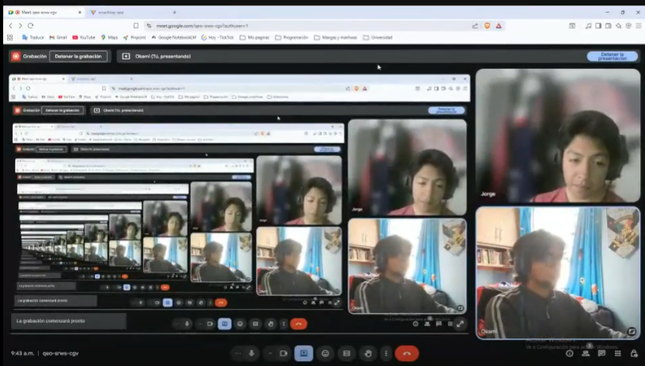

# Capítulo VI: Product Verification & Validation

## 6.1. Testing Suites & Validation

Este capítulo documenta la estrategia de pruebas automatizadas que sustenta la validación del producto SmartStay. La estrategia se organiza según los siguientes niveles, cada uno asociado a las secciones del enunciado:

### 6.1.1. Core Entities Unit Tests

Pruebas unitarias sobre las **entidades principales** del dominio: validan cada componente de forma aislada (lógica de dominio, repositorios simulados, validaciones de negocio). Ejemplos en SmartStay: casos de uso de reserva, validación de check-in, cálculo de estados de habitación, reglas de RBAC.

### 6.1.2. Core Integration Tests

Pruebas de integración entre capas y servicios: backend + base de datos, backend + IoT Gateway (simulado), autenticación + tokens; validan la comunicación frontend-backend y la interacción entre servicios/APIs. Ejemplos en SmartStay: flujo de login JWT, creación de reserva, asignación de habitación, endpoint de control de puerta.

### 6.1.3. Core Behavior-Driven Development

Pruebas E2E / de aceptación que validan flujos completos desde la perspectiva del usuario (check-in digital completo, control de habitación, solicitud de servicio, asignación de tarea por staff). El BDD se aplica definiendo el comportamiento esperado con archivos `.feature` en **Gherkin** y steps en lenguaje de programación (Cucumber, SpecFlow o similares), ligados a las User Stories del sprint correspondiente.

**Pendiente:** redactar los escenarios `.feature` y sus steps cuando existan los repositorios y builds de testing.

### 6.1.4. Core System Tests

**Pendiente:** pruebas de sistema de la aplicación completa en entorno **web y móvil**: navegación, interacción con APIs y respuesta del sistema en distintos escenarios.

### Criterios de aceptación por nivel

| Nivel | Criterio |
| :--- | :--- |
| Unit | Cobertura global ≥ umbral definido; pruebas críticas del dominio cubren casos felices y edge cases. |
| Integración | Cada flujo de negocio clave tiene al menos una prueba de integración que valida el contrato y el estado resultante. |
| E2E | Los flujos críticos identificados en el Capítulo VIII (check-in, control de habitación, room service) tienen pruebas automatizadas que validan el path feliz y los fallbacks más comunes. |

### Relación con los experimentos

El testing automatizado sirve dos propósitos en el contexto del curso de Experimentos:

1. **Garantía de calidad de la herramienta experimental:** la app usada en los experimentos es una versión que pasó pruebas automatizadas, reduciendo el riesgo de que los resultados del experimento se vean contaminados por fallas técnicas evitables.
2. **Métrica de proceso:** la tasa de pruebas pasadas, cobertura y tiempo de ejecución del pipeline son métricas de proceso que pueden incluirse en el análisis del experimento si es relevante (ej: estabilidad del build entre sesiones).

## 6.2. Static testing & Verification

### 6.2.1. Static Code Analysis

#### 6.2.1.1. Coding standard & Code conventions

**Pendiente:** verificar el cumplimiento de estándares del lenguaje/framework usados (p. ej. PEP8 para Python, ESLint para JavaScript): código legible, consistente y con buenas prácticas (nombres de variables, indentación, comentarios).

#### 6.2.1.2. Code Quality & Code Security

**Pendiente:** evaluar calidad por complejidad, duplicación y mantenibilidad con métricas/herramientas (p. ej. SonarQube, ESLint o Checkmarx) e identificar vulnerabilidades: inyecciones SQL, Cross-Site Scripting (XSS) y manejo inseguro de datos sensibles.

### 6.2.2. Reviews

**Pendiente:** documentar las revisiones de código/artefactos realizadas por el equipo.

## 6.3. Validation Interviews

**Pendiente:** registrar las entrevistas de validación en las que usuarios de los segmentos objetivo interactúan con la Landing Page y las aplicaciones, aplicando el formato de evaluación heurística del Anexo D del enunciado (usabilidad, arquitectura de información e inclusive design).

<!-- Evidencia: entrevista-1-admin.png, entrevista-1-cliente.png, entrevista-2-admin.png, android-studio-emulator.jpg; appexecution1-3. -->

### 6.3.1. Diseño de Entrevistas

**Objetivo:** Validar utilidad, control y claridad de los flujos clave de SmartStay (check-in/check-out digital, housekeeping, notifications y service requests).

**Preguntas clave - Staff Operativo**

1. ¿En qué pasos del flujo de check-in/check-out necesitas más control desde la app y por qué?
2. ¿Qué información mínima requiere una service request para que puedas actuar sin llamadas o WhatsApp?
3. ¿Qué tipos de notifications consideras críticas y cuáles deberían ser silenciosas?
4. ¿Qué latencia toleras para ver cambios de room status en tiempo real antes de tomar decisiones operativas?
5. ¿Qué indicadores en el dashboard te ayudan a priorizar tareas de housekeeping y mantenimiento?

**Preguntas clave - Huéspedes**

1. ¿Qué parte del check-in digital te genera más incertidumbre (identidad, pago, asignación de habitación) y por qué?
2. ¿Qué funciones de control de la habitación usarías desde la app y con qué frecuencia?
3. ¿Qué información necesitas ver para confiar en los cargos y la reserva (fees, timestamps, policy)?
4. ¿En qué situaciones preferirías contactar al staff en lugar de usar la app?
5. ¿Cómo evaluarías la claridad de la navegación en tu primera sesión sin ayuda del staff?

### 6.3.2. Registro de Entrevistas

### Entrevista – Segmento 1: Administradores de Hoteles Boutique y Pequeños

#### Entrevista 1

Datos del entrevistado:

**Nombre completo:** Alessandro Daniel Bravo Castillo

**Edad:** 27

**Ciudad:** Lima

**Duración:**  5:24 minutos

**Evidencia:** 

**URL del video:**
https://tinyurl.com/y85aj7s4

**Resumen de la entrevista**

Alessandro Bravo calificó la herramienta como bastante eficiente, destacando su interfaz sencilla e intuitiva, con diseño claro y acciones bien ubicadas; valoró especialmente la gestión de staff por ofrecer mayor control sobre los empleados, la gestión de habitaciones por su claridad en disponibilidad y servicios, y la mejora de procesos clave como reservas y reportes al reemplazar métodos engorrosos como Excel; sugirió añadir un dashboard específico para habitaciones en promoción; afirmó que la app encajaría muy bien en su hotel, ayudaría a prevenir errores como la sobre-reserva, y que el equipo podría adaptarse fácilmente con buena capacitación, mostrando confianza en su implementación por considerarla confiable y fácil de usar

---

#### Entrevista 2

Datos del entrevistado:

**Nombre completo:** Jorge Linares

**Edad:** 29

**Ciudad:** Lima

**Duración:**  8:39 minutos

**Evidencia:** 

**URL del video:**
https://tinyurl.com/4k3kr4mv

**Resumen de la entrevista**

Jorge Linares tuvo una impresión muy positiva de la aplicación de gestión hotelera, destacando su interfaz intuitiva y ordenada con nombres descriptivos que facilitan el uso; valoró especialmente la agilidad, automatización y el módulo de reservas por su vista detallada, además de la capacidad del sistema para prevenir errores como la sobre-reserva y centralizar información dispersa; sugirió mejoras como un módulo de pagos, exportación de reportes en PDF y funciones para coordinar al personal, además de asegurar la escalabilidad para hoteles grandes; consideró que su equipo podría adaptarse fácilmente con una breve capacitación y estaría dispuesto a pagar una suscripción mensual si el precio es razonable y la herramienta se mantiene estable.

---

### Entrevista – Segmento 2: Huéspedes de Hoteles Boutique

#### Entrevista 1

Datos del entrevistado:

**Nombre completo:** Nicole Yamile Avila Ayquipa

**Edad:** 25 años

**Distrito:** Lima, centro de Lima

**Duración:** 03:51 minutos

**Evidencia:** 

**URL del video:** https://tinyurl.com/bdd2t8cu

**Resumen de la entrevista**

Nicole Ávila tuvo una buena impresión de la aplicación, destacando su practicidad al centralizar información de varios hoteles y su interfaz intuitiva con ventanas rotativas que facilitan la exploración; valoró especialmente la agenda de reservas por su orden y claridad, así como la posibilidad de tomar decisiones más informadas gracias a las reseñas de otros huéspedes, sin encontrar funciones innecesarias; aunque considera el sistema confiable, sugirió incorporar una ventana de asistencia virtual para mantener interacción humana; afirmó que preferiría hoteles con esta experiencia digital y estaría dispuesta a pagar más por la seguridad que le brinda al elegir con mayor información.

### 6.3.3. Evaluaciones según heurísticas

**CARRERA:** Ingeniería de Software  
**CURSO:** 1ACC0238 Aplicaciones para Dispositivos Móviles  
**SECCIÓN:** 3821  
**PROFESORES:** Jorge Luis Mayta Guillermo  
**AUDITOR:** MovilDev Team  
**CLIENTE(S):** Staff operativo de Hoteles Boutique / Huéspedes
**SITE/APP EVALUADA:** Smart Stay

---

### Tareas a Evaluar

**Tareas incluidas:**
1. Registro de usuario y flujo de check-in/check-out  
2. Uso de llave digital / acceso a habitación  
3. Control IoT: ajuste de temperatura e iluminación  
4. Reporte y confirmación de limpieza (housekeeping)  
5. Solicitud de servicio (room service / mantenimiento)

**Tareas NO incluidas en esta evaluación:**
1. Pago de reserva y procesamiento de facturación  
2. Gestión de puntos / programa de fidelización  
3. Chat en vivo con atención (soporte en tiempo real)

---

### Tabla Resumen

| # | Problema | Escala de severidad | Heurística/Principio violada(o) |
|---|---|---:|---|
| 1 | Ausencia de botón "Atrás" o "Cancelar" en el flujo de check-in | 3 | Usability: Control y libertad del usuario |
| 2 | Iconos de estado de habitación poco intuitivos y sin etiquetas | 3 | Usability: Reconocimiento antes que recuerdo |
| 3 | Controles de IoT sin texto alternativo ni etiquetas accesibles | 3 | Inclusive Design: Proporciona experiencias comparables |
| 4 | Menú de "Solicitudes de Servicio" desordenado y sin jerarquía | 2 | Usability: Cumplimiento de estándares y convenciones |
| 5 | Falta de confirmación visual al enviar una solicitud de servicio | 3 | Usability: Visibilidad del estado del sistema |

---

### Fichas Detalladas (Problemas de severidad 3)

#### PROBLEMA #1: Ausencia de Control y Libertad en el Flujo de Check-in

**Severidad:** 3

**Heurística violada:** Usability - Control y libertad del usuario

**Problema:**
Durante el proceso de check-in digital, no hay opción para retroceder o cancelar sin perder todo el progreso. Si el huésped necesita corregir datos (fecha, número de documento, selección de habitación) debe cerrar la aplicación y reiniciar el flujo, aumentando la frustración y el riesgo de abandono. Para el Staff Operativo, la imposibilidad de cancelar o devolver un paso en procesos administrativos también provoca errores en la asignación de tareas.

**Captura de pantalla:** 

**Recomendación:**
- Agregar un botón "Atrás" en la esquina superior izquierda y un botón "Cancelar" en pasos críticos, siguiendo convenciones de Material Design.  
- Implementar guardado en sesión local (persistencia temporal) para que los datos no se pierdan si el usuario sale y vuelve al flujo.  
- Mostrar diálogo de confirmación al intentar salir mid-flow con opciones: "Continuar registro", "Guardar y salir" y "Cancelar registro".

---

#### PROBLEMA #2: Iconografía Inconsistente y Poco Intuitiva en Indicadores de Estado

**Severidad:** 3

**Heurística violada:** Usability - Reconocimiento antes que recuerdo

**Problema:**
Los estados de habitación se representan con símbolos no estándares y sin etiquetas textuales (ej: círculo con patrón, punto, triángulo). El Staff Operativo debe memorizar su significado, aumentando errores en la asignación de tareas y tiempos de respuesta. Durante las pruebas, varios usuarios confundieron iconos y asignaron housekeeping a habitaciones ocupadas.

**Captura de pantalla:** 

**Recomendación:**
- Rediseñar iconos usando convenciones universales: `check` verde para "Limpia", `candado` rojo para "Ocupada", `herramientas` amarillo para "Mantenimiento".  
- Añadir etiqueta de texto bajo el icono en la vista compacta (ej: "Limpia") y permitir vista compacta sin texto como preferencia de usuario.  
- Acompañar con colores accesibles y patrones para soportar daltonismo (ej: icon + color + patrón).  
- Actualizar la biblioteca de componentes accesibles con patrones y ejemplos.

---

#### PROBLEMA #3: Falta de Texto Alternativo y Etiquetas de Accesibilidad en Controles IoT

**Severidad:** 3

**Heurística violada:** Inclusive Design - Proporciona experiencias comparables

**Problema:**
Los controles de iluminación y temperatura no incluyen descripciones accesibles (aria-label / accessibilityLabel) ni equivalentes textuales. Usuarios que dependen de lectores de pantalla (TalkBack, VoiceOver) no pueden identificar ni operar estos controles, lo que excluye a personas con discapacidad visual y viola recomendaciones WCAG.

**Captura de pantalla:** 

**Recomendación:**
- Para web/Angular: agregar `aria-label` y `aria-describedby` en todos los controles interactivos; ejemplo: `<mat-slider aria-label="Ajuste de temperatura en °C" aria-describedby="temp-help"></mat-slider>`.  
- Para Flutter: envolver controles con `Semantics(label: 'Ajuste de temperatura en grados Celsius', value: '22')` y usar `excludeSemantics` donde aplique.  
- Incluir descripciones sonoras opcionales y probar con lectores de pantalla reales durante QA (probar con TalkBack/VoiceOver).  
- Actualizar la biblioteca de componentes accesibles con patrones y ejemplos.

---

### Observaciones adicionales (Problemas menores)

- PROBLEMA #4 (Sev.2): Reorganizar el menú de "Solicitudes de Servicio" por frecuencia o categoría y añadir un buscador rápido.  
- PROBLEMA #5 (Sev.3): Implementar pantalla/modal de confirmación tras envío de solicitud con número de ticket, hora y tiempo estimado; en caso de fallo, explicar la causa y ofrecer reintento automático.

---

### Validación y Seguimiento

- Registrar cada corrección como un requisito en el backlog (EPIC/US) e incluir criterios de aceptación claros para QA.  
- Priorizar las fichas de severidad 3 para el próximo sprint de refinamiento.  
- Incluir pruebas de accesibilidad y pruebas en dispositivos reales distribuidos vía Firebase App Distribution como parte del plan de validación.

---

## 6.4. Auditoría de Experiencias de Usuario

**Pendiente:** auditoría UX entre grupos según el enunciado (se realiza en Avance 2).

### 6.4.1. Auditoría realizada

#### 6.4.1.1. Información del grupo auditado

#### 6.4.1.2. Cronograma de auditoría realizada

#### 6.4.1.3. Contenido de auditoría realizada

### 6.4.2. Auditoría recibida

#### 6.4.2.1. Información del grupo auditor

#### 6.4.2.2. Cronograma de auditoría recibida

#### 6.4.2.3. Contenido de auditoría recibida

#### 6.4.2.4. Resumen de modificaciones para subsanar hallazgos
